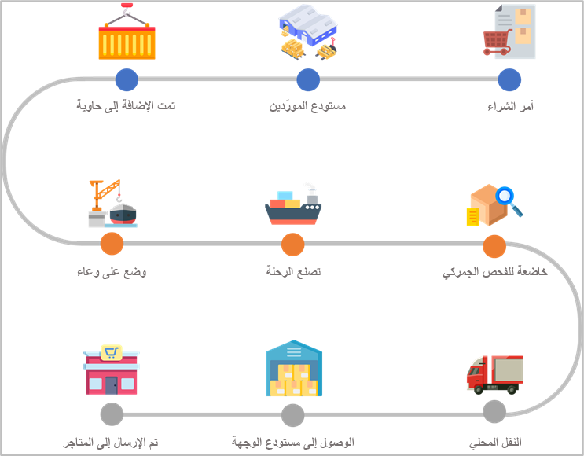
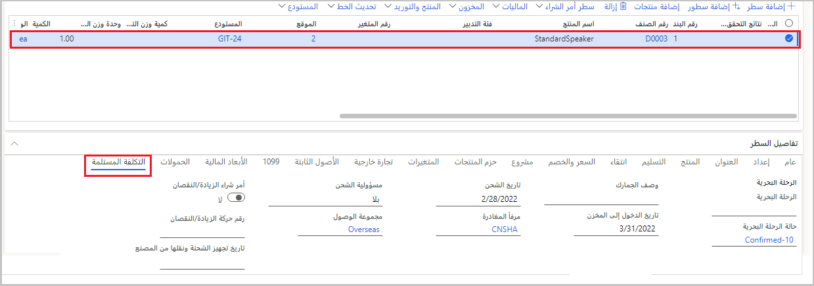
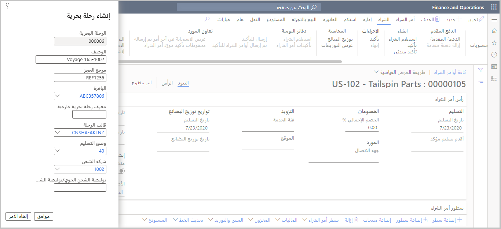

بشكل عام، تمثل الرحلة سفينةً. استناداً إلى المؤسسة، يمكن أن تمثل الرحلة أيضاً بائعاً أو أمر شراء أو نوعاً من العناصر التي تناسب عملك. رحلة مرتبطة بحاويات الشحن وحافظات الأوراق. حاوية شحن مرتبطة ببنود الشراء. يمكنك أيضاً ربط حاويات الشحن وحافظات الأوراق مباشرةً برحلة حتى لو كانت مغلقة. علاوة على ذلك، يتم تخصيص التكاليف التي أدخلتها في الرحلة لجميع بنود الشراء المرتبطة.

شاهد هذا الفيديو لمعرفة المزيد عن الرحلات.
> [!VIDEO https://www.microsoft.com/videoplayer/embed/RWWlRw]

يوضح الرسم التالي العملية عالية المستوى لرحلة، بدءاً من أمر الشراء.

> [!div class="mx-imgBorder"]
> 

تحتوي صفحة **جميع الرحلات** على معلومات حول الرحلات، مثل التسليم والتكلفة ومعلومات حول العناصر وأوامر الشراء و أوامر التحويل. للوصول إلى صفحة **جميع الرحلات**، انتقل إلى **تكلفة الوصول > الرحلات> جميع الرحلات**. تحتوي هذه الصفحة على قائمة بجميع الرحلات الحالية حيث يمكنك إنشاء وإدارة الرحلات. لعرض تفاصيل رحلة معينة، حدد سجلاً في القائمة.

في صفحة **جميع الرحلات**، يحتوي جزء الإجراءات على أزرار تتيح لك العمل في رحلة معينة. كل زر يكمل وظيفة واحدة. بالإضافة إلى ذلك، يحتوي جزء الإجراءات على علامات تبويب، لكل منها مجموعة من الأزرار المرتبطة. ما لم يُنص على خلاف ذلك، تتوفر جميع الأزرار وعلامات التبويب في عرض القائمة لصفحة **جميع الرحلات** وطريقة العرض التفصيلي لرحلة واحدة محددة.

- جديد
- الحذف
- تكاليف الرحلة البحرية
- حاويات الشحن
- حافظات الأوراق
- الرحلة
- الإدارة
- عام
- الخيارات

## إنشاء رحلة جديدة

عندما تقوم بإنشاء رحلة جديدة، فإن العديد من الحقول التي تحددها ستساعد في تحديد التكاليف التلقائية للرحلة. تمت مناقشة تكاليف السيارات في وحدة **تقدير وإدارة التكاليف شاملة التفريغ** من هذه الوحدة.

لإنشاء رحلة جديدة، ستبدأ في صفحة **جميع الرحلات**.

1.  انتقل إلى **التكلفة شاملة التفريغ > الرحلات > كل الرحلات**.

1.  حدد **جديد** في جزء الإجراءات.

    بشكل عام، سيتم تعيين تسلسل رقمي لمعرف **الرحلة**.

1.  أدخل **وصفاً** للرحلة.

1.  إذا كان الشاحن أو مركز الشحن الخاص بك يوفر رقماً مرجعياً لتحديد الرحلة، فيمكنك إدخال هذه المعلومات في حقل **مرجع الحجز**.

1.  في حقل **السفينة**، يمكنك الدخول إلى السفينة أو تحديدها للرحلة. هذا الحقل عبارة عن حقل نص حر، أو يمكنك الاختيار من قائمة السفن التي قمت بإعدادها أو استخدامها مسبقاً.

1.  في حقل **معرّف الرحلة الخارجية**، أدخل المعرّف المتاح علناً للرحلة. قد يكون هذا المعرف رقم رحلة.

1.  حدد **قالب الرحلة** للرحلة. يمكنك استخدام قالب الرحلة لإدخال **إلى** **منفذ** و **من** **منفذ** للرحلة. هذه المعلومات مهمة للمساعدة في تحديد تكاليف السيارات المرتبطة بالرحلة. لمزيد من المعلومات، راجع [إعداد الرحلات متعددة الوجهات. ](/learn/modules/set-up-landed-cost-supply-chain-management/6-multi-leg-journeys/?azure-portal=true)

1.  حدد **طريقة التسليم** للرحلة، مثل **الجو**، أو **الشاحنة**، أو **السكك الحديدية**، أو **المحيط**. يمكن أن يساعدك هذا الحقل أيضاً في تحديد تكاليف السيارات للرحلة.

1.  حدد **شركة الشحن** للرحلة. يساعدك هذا الحقل أيضاً في تحديد التكاليف التلقائية للرحلة.

1. اختيارياً، في حقل **بوليصة الشحن الجوي الرئيسية/بوليصة الشحن**، يمكنك إدخال بوليصة الشحن الجوي الرئيسية أو بوليصة الشحن رقم. يمكنك تحديد هذه القيمة عند الشحن عن طريق الجو.

1. حدد **موافق** لإنشاء الرحلة.

عند إنشاء رحلة، يمكنك إضافة المزيد من التفاصيل، مثل حاويات الشحن وحافظات الأوراق، باستخدام **محرر الرحلة**.

## إنشاء رحلة من أمر الشراء

يمكنك إنشاء رحلات من أمر الشراء. للقيام بذلك، اتبع الخطوات التالية:

1.  انتقل إلى **التدبير والتوريد > أوامر الشراء > كل أوامر الشراء** (أو انتقل إلى **الحسابات الدائنة > أوامر الشراء > كل أوامر الشراء**).

1.  حدد **جديد** في جزء الإجراءات.

1.  حدد مُورِّداً.

1.  حدد **الموقع** و **المستودع** للسلع أثناء النقل، ثم حدد **موافق**.

1.  عند الضرورة، أضف بنود أمر الشراء عن طريق تحديد **إضافة بند** في علامة التبويب السريعة **بنود أمر الشراء**.

1.  بالنسبة لكل بند في أمر الشراء، يمكنك تحديد تفاصيل تكلفة الشحن الأخرى في علامة التبويب السريعة **تفاصيل البند**.

    > [!div class="mx-imgBorder"]
    > 

1.  افتح طريقة عرض **الرأس** في أمر الشراء.

1.  تأكد من تحديد **طريقة التسليم**، و **شروط التسليم**، و **الطريقة**.

1.  قم بتوسيع علامة التبويب السريعة **التكلفة شاملة التفريغ** في طريقة عرض **الرأس**، حيث يمكنك تحديد تفاصيل التكلفة شاملة التفريغ على مستوى الرأس.

1. في علامة التبويب **شراء** في جزء الإجراءات، حدد **تأكيد**.

1. في علامة التبويب **الشراء** في جزء الإجراءات، انتقل إلى مجموعة **التكلفة شاملة التفريغ**، وحدد **إنشاء رحلة جديدة**.

1. في مربع حوار **إنشاء الرحلة**، أدخل تفاصيل الرحلة، ثم حدد **موافق**.

    > [!div class="mx-imgBorder"]
    > 