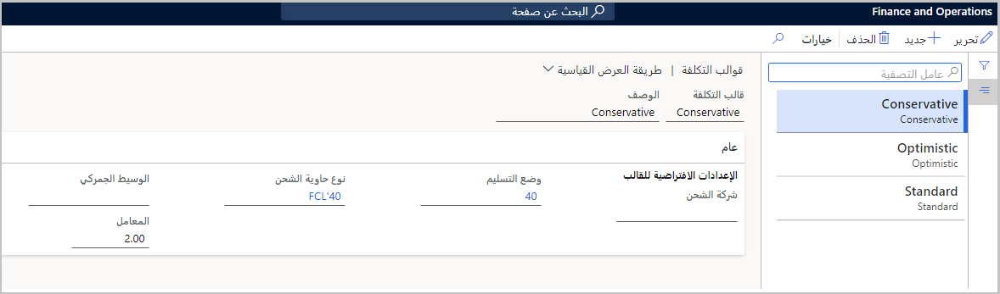
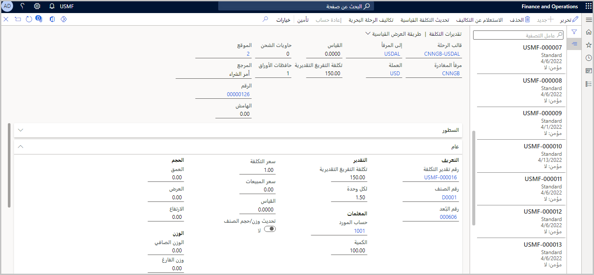
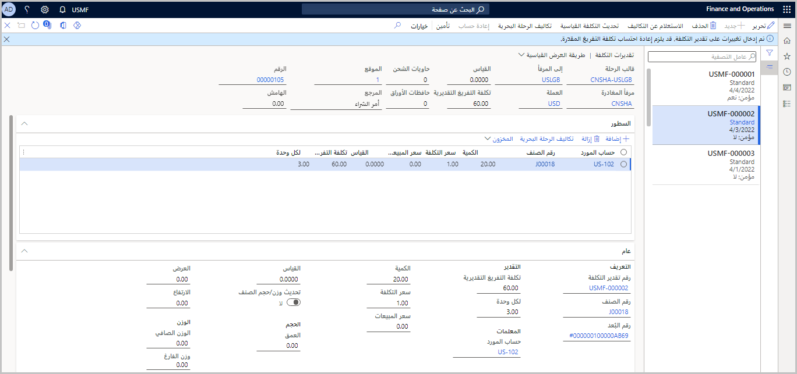
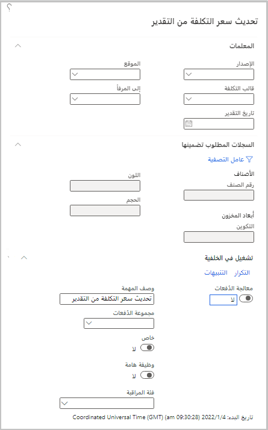

تقدر Supply Chain Management التكلفة شاملة التفريغ بناءً على قواعد التكلفة التلقائية. في Supply Chain Management، يمكنك تحديد سيناريوهات أخرى لتقديم تقدير أكثر دقة ثم تخزين هذه السيناريوهات في النظام. نتيجة لذلك، يمكنك العودة لدراسة السيناريوهات لاحقاً ومقارنتها بالقيم الفعلية في التقرير. يمكنك أيضاً تغيير سعر أحد الأصناف.

**التكاليف التلقائية** عبارة عن قواعد لمناطق التكلفة المتعددة، مثل الرحلة البحرية أو حاوية الشحن أو حافظة الأوراق أو بنود أوامر الشراء أو الأصناف أو أوامر التحويل. استناداً إلى القواعد التي تم إعدادها، ستحسب Supply Chain Management التكاليف ثم تضيفها تلقائياً إلى الحركة. تعمل هذه الوظيفة على إزالة مهمة الحاجة إلى إضافة هذه التكاليف يدوياً بنفسك. يمكنك إعداد التكاليف التلقائية بالانتقال إلى **التكلفة شاملة التفريغ > إعداد التكلفة > التكاليف التلقائية**.

لمزيد من المعلومات، انتقل إلى [إعداد التكاليف التلقائية.](/dynamics365/supply-chain/landed-cost/auto-cost-setup/?azure-portal=true)

## إعداد قوالب التكلفة

تحدد قوالب التكلفة الإعدادات الافتراضية التي قد لا يعرفها المستخدمون الذين يتلقون التقدير. يمكن أن تساعد القوالب في تبسيط عملية التقدير عن طريق تقليل عدد الاختيارات التي يجب على المستخدمين القيام بها للحصول على تقدير دقيق. إذا كنت تستخدم نموذج التكلفة القياسي، يمكنك استخدام قوالب التكلفة أثناء إنشاء تكلفة البضائع.

انتقل إلى **التكلفة شاملة التفريغ > إعداد التكلفة > قوالب التكلفة** لإعداد قوالب التكلفة الخاصة بك.

> [!div class="mx-imgBorder"]
> 

لمزيد من المعلومات، انتقل إلى [إعداد قيم معلمات تقدير التكاليف.](/training/modules/set-up-landed-cost-supply-chain-management/8-costing-parameters/?azure-portal=true)

## إنشاء تقدير التكلفة

يسمح لك مربع الحوار **تقدير التكلفة** بإنشاء تقدير تكلفة جديد بناءً على قالب تكلفة محدد ومجموعة محددة من البضائع والتفاصيل الأخرى للرحلة. يستخدم النظام هذه الإعدادات لتقدير التكاليف شاملة التفريغ للبضائع. تكون تقديرات التكلفة مفيدة عند التعامل مع أصناف التكلفة القياسية. على سبيل المثال، تتيح إضافة تكاليف شاملة التفريغ المتوقعة إلى التكلفة القياسية لبضائع المخزون إجراء حركات الفرق الأصغر عند إضافة البضائع إلى رحلة بحرية نظراً لأن التكلفة القياسية تعكس الآن التكاليف شاملة التفريغ المقدرة.

انتقل إلى **التكلفة شاملة التفريغ > المهام الدورية > تقدير التكلفة** لفتح مربع حوار **تقدير التكلفة**. قم بتعيين الحقول كما هو موضح في لقطة الشاشة التالية ثم حدد **موافق** لإنشاء التقدير. عند الانتهاء، ستظهر صفحة **تقدير التكلفة** مع التقدير الجديد.

يمكنك تقدير التكاليف شاملة التفريغ من أمر الشراء. للقيام بذلك، اتبع الخطوات التالية:

1.  افتح أمر الشراء الذي تريد تقدير التكاليف الخاصة به.

1.  في جزء الإجراءات في مجموعة **التكلفة شاملة التفريغ**، حدد **إنشاء تقدير التكلفة شاملة التفريغ**.

1.  في مربع الحوار **إنشاء تقدير التكلفة شاملة التفريغ**، حدد **قالب التكلفة**، **تاريخ التقدير**، و **قالب الرحلة**. يمكنك أيضاً إضافة مزيد من التفاصيل حول أسعار صرف البند وعدد حاويات الشحن وحافظات الأوراق.

1.  حدد **موافق**. سيتم عرض صفحة **تقديرات التكلفة**.

    > [!div class="mx-imgBorder"]
    > 

1.  حدد **تحديث التكلفة القياسية** في جزء الإجراءات.

1.  حدد إصدار التكاليف ثم حدد خانة الاختيار **تحديث**.

1.  حدد **موافق**.

## إدارة التكاليف المقدرة

توضح صفحة **تقديرات التكلفة** كيفية حساب كل تكلفة تقديرية. بالإضافة إلى ذلك، فإنها تعرض التكلفة شاملة التفريغ لكل صنف. يمكنك تعديل تقدير التكلفة عن طريق تغيير سعر التكلفة و/أو العملة المرتبطة بالبضائع المختلفة. يمكنك تغيير نفقات الرحلة البحرية المقابلة على مستوى الرحلة والحاوية. عند تعديل التكاليف في هذه الصفحة، سيتم تذكيرك بإعادة حساب التكاليف المتوقعة للأصناف المضمنة في تقدير التكلفة. عندما تكون مستعداً، يمكنك تغيير أسعار التكلفة للأصناف الموجودة في قالب التكلفة من خلال استخدام التقديرات.

> [!div class="mx-imgBorder"]
> 

## تحديث سعر تكلفة الصنف

يمكنك تشغيل المهمة الدورية **تحديث سعر تكلفة الصنف** لتحديث كافة تقديرات التكلفة التي تطابق عوامل التصفية التي تحددها. وتتم مقارنة النتيجة بتحديد **تحديث التكلفة القياسية** من جزء الإجراءات الخاص بتقدير واحد. ومع ذلك، في هذه الحالة، ينطبق التحديث على كافة التقديرات المتطابقة.

> [!div class="mx-imgBorder"]
> 

اتبع هذه الخطوات لتشغيل المهمة الدورية:

1.  انتقل إلى **التكلفة شاملة التفريغ > المهام الدورية > تحديث سعر تكلفة الصنف**.

1.  في مربح الحوار **تحديث سعر التكلفة من التقدير** ، يمكنك تعيين الحقول التالية حسب الحاجة لتحديد نطاق التحديث:

    -   **الإصدار** - يستخدم لتحديث التقديرات التي تستخدم إصدار التكاليف المحدد فقط.

    -   **الموقع** - يستخدم لتحديث التقديرات التي تستخدم الموقع المحدد فقط.

    -   **قالب التكلفة** - يستخدم لتحديث التقديرات التي تستخدم القالب المحدد فقط.

    -   **إلى المنفذ** - تحديث التقديرات التي تستخدم **إلى المنفذ** المحدد فقط.

    -   **تاريخ التقدير** - تحديث التقديرات بالتاريخ المحدد فقط.

1.  في علامات التبويب السريعة **السجلات التي سيتم تضمينها** وكذلك **تشغيلها في الخلفية** ، قم بتعيين الخيارات المستخدمة للمهام الدورية.

1.  حدد **موافق** لتشغيل المهمة.

> [!NOTE]
> سيتم تشغيل هذه المهمة الدورية بشكل صحيح فقط في حالة توفر المعلومات التالية: 
> 
> -   يجب تحديد **إجمالي العمق وإجمالي العرض** و **إجمالي الارتفاع** لكل منتج من المنتجات القابلة للتطبيق. 
> 
> -   يجب تحديد **من المنفذ** لكل مورد من الموردين القابلين للتطبيق.
