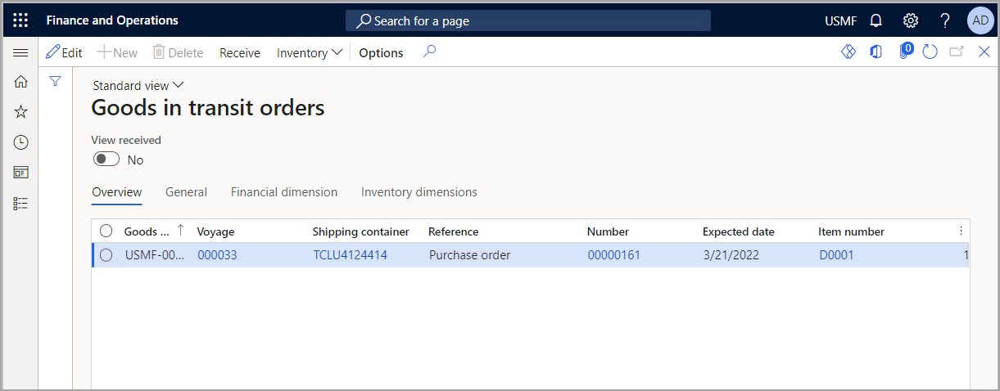
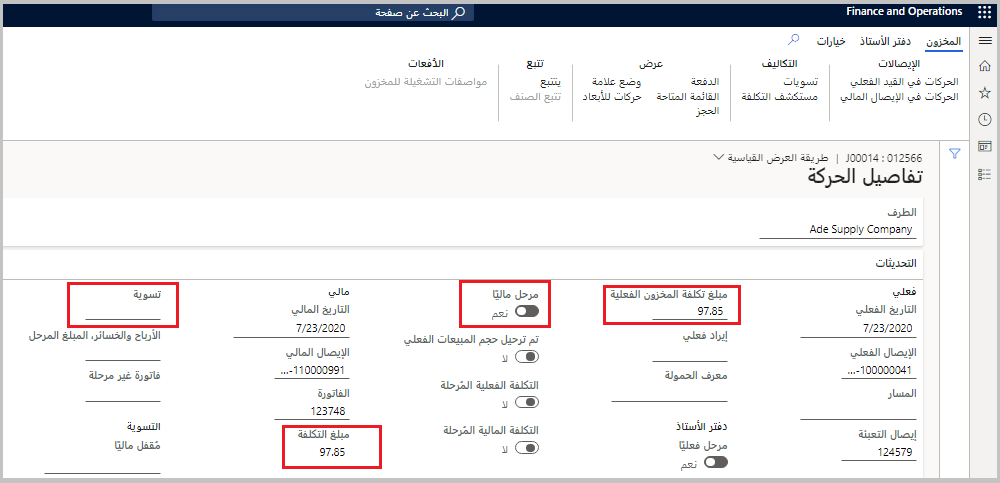

توضح هذه الوحدة كيفية التعامل مع الأوامر الخاصة بالبضائع العابرة، وهي ميزة تستخدمها وحدة **التكلفة شاملة التفريغ** حصرياً. عندما تقوم بإعداد أمر أو رحلة بحرية لاستخدام معالجة البضائع العابرة، فلن تحتاج إلى الانتظار حتى تصل المنتجات إلى المستودع قبل القيام بفوترتها. والآن، يمكنك فوترة الأصناف بمجرد مغادرتهم مستودع المورد أو منفذ الأصل، وسيتم التعرف على الرسوم المالية عند بدء الرحلة. بالإضافة إلى ذلك، نظراً لأن الأصناف يمكن أن تصبح الآن هي الخاصية الخاصة بشركتك عندما تغادر منفذ الشحن، تتيح لك هذه الوظيفة الحصول على ملكية المخزون المناسبة لها.

عندما تستخدم الأوامر الخاصة بالبضائع العابرة، فإن أي عناصر يتم تحديثها مالياً على هذا النحو يتم إرسالها إلى مستودع مؤقت يعرف باسم مستودع البضائع العابرة. ستبقى هذه الأصناف في هذا المستودع حتى يمكن استلامها في مستودع الوجهة النهائي (كما هو محدد في بند الشراء)، ولا يمكنك إزالتها يدوياً.

نظراً لأن البضائع قيد النقل، لا يتم اعتبار الأصناف كمخزون منتظم ولا يمكن انتقاؤها للتسليم. ومع ذلك، لا يزال بإمكانك عرض مخزون البضائع العابرة واستخدام الأصناف للتخطيط الرئيسي. في هذه الحالة، تأكد من استخدام تاريخ التسليم المؤكد في بند أمر الشراء باعتباره التاريخ المتوقع عندما يكون المخزون متاحاً للاستهلاك.

تصف الأقسام التالية الإعداد الخاص بمعالجة المخزون والرحلات البحرية باستخدام المفهوم والوظيفة الخاصة بالبضائع العابرة.

## أوامر البضائع العابرة

في الوحدة النمطية **التكلفة شاملة التفريغ**، يمكنك تحليل أوامر البضائع العابرة ومعالجتها. يمكنك معالجة أوامر البضائع العابرة مباشرةً من صفحة أوامر **البضائع العابرة**. يمكنك أيضاً الذهاب إلى الرحلة البحرية المتعلقة بأوامر البضائع العابرة ومعالجة الرحلة البحرية بأكملها أو الحاوية أو السجل. عند إعداد فاتورة لرحلة بحرية ما وإنشاء أوامر البضائع العابرة، فإن كل مجموعة من أبعاد المخزون والمخزون المقترنة ببند أمر الشراء ستقوم بإنشاء أمر جديد للبضائع العابرة.

تستخدم التكلفة شاملة التفريغ عملية من خطوتين لمعالجة مع البضائع أثناء النقل:

1.  تتم معالجة فاتورة المخزون وتعيين الحالة قيد النقل. ويتم بعد ذلك استلام الصنف.

1.  تتم معالجة أمر البضائع العابرة على صفحة **البضائع العابرة** ويتم استلامها في المستودع الذي يتم تحديده في أمر الشراء. بعد ذلك، يتم تحديث الحالة إلى **تم الاستلام**.

انتقل إلى **التكلفة شاملة التفريغ > المهام الدورية > أوامر البضائع العابرة** للعمل مع أوامر البضائع العابرة.

> [!div class="mx-imgBorder"]
> 

## استلام أثناء النقل

لإجراء الاستلام أثناء النقل، انتقل إلى إحدى الصفحات التالية:

-   **أمر البضائع العابرة** - حدد البند ، ثم في جزء الإجراءات، حدد **استلام**.

-   **جميع الرحلات البحرية** - حدد رحلة بحرية، ثم في جزء الإجراءات، انتقل إلى علامة التبويب **إدارة**. في مجموعة **البضائع العابرة**، حدد **استلام البضائع العابرة**.

-   **جميع حاويات الشحن** - حدد حاوية شحن، ثم في جزء الإجراءات، انتقل إلى علامة التبويب **إدارة**. في مجموعة **البضائع العابرة**، حدد **استلام البضائع العابرة**.

-   **جميع السجلات** - حدد السجل، ثم في جزء الإجراءات، انتقل إلى علامة التبويب **إدارة**. في مجموعة **البضائع العابرة**، حدد **استلام البضائع العابرة**.

لاستلام البضائع العابرة من رحلة بحرية معينة، اتبع الخطوات التالية:

1.  انتقل إلى **التكلفة شاملة التفريغ > الرحلات > كل الرحلات**.

1.  حدد رحلة بحرية عابرة.

1.  في علامة التبويب **إدارة** في جزء الإجراءات، حدد **استلام البضائع العابرة**. سيتم عرض الأصناف التي يمكن استلامها.

1.  في قسم التفاصيل لكل بند، أدخل الكمية التي تريد استلامها في حقل **الكمية**.

1.  ثم حدد **موافق**.

1.  يمكنك عرض جميع الرحلات البحرية التي تم استلامها من خلال الانتقال إلى **التكلفة شاملة التفريغ > الرحلات البحرية > الرحلات البحرية التي تم استلامها**.

> [!NOTE]
> عادةً ما يتم استخدام الاستلام أثناء النقل عندما تكون المواقع والتتبع التسلسلي/الدفعات غير مطلوبين.

## دفتر يومية الوصول

يمكنك استخدام دفاتر يومية الوصول لاستلام البضائع، استناداً إلى ما إذا كانت شركتك تريد استخدام دفاتر يومية الوصول لاستلام البضائع أم لا. يمكنك إنشاء دفتر يومية الوصول من صفحة **كافة الرحلات البحرية**، صفحة **جميع السجلات**، أو صفحة **حاويات الشحن** ثم اتبع الخطوات التالية:

1.  افتح الرحلة البحرية أو السجلات أو الحاوية.

1.  في جزء الإجراءات، انتقل إلى علامة التبويب **إدارة** ثم في مجموعة **الدالات**، حدد **إنشاء دفتر يومية الوصول**.

1.  سيتم فتح مربع الحوار **إنشاء دفتر يومية الوصول** حيث يمكنك تعيين القيم التالية:

    -   **تهيئة الكمية** - قم بتعيين هذه القيمة على **نعم** لسحب المبلغ من الكمية المضمنة. إذا تم تعيين هذه القيمة على **لا**، فلن يتم تعيين كمية أولية لبنود البضائع العابرة.

    -   **إنشاء من البضائع العابرة** - قم بتعيين هذه القيمة على **نعم** لسحب الكميات من خطوط النقل المحددة للرحلة أو السجل أو الحاوية.

    -   **إنشاء من بنود أمر**، قم بتعيين هذه القيمة على **نعم** لسحب الكمية الافتراضية من بنود أمر الشراء. يمكنك استخدام هذه الطريقة لتعيين الكمية الافتراضية في دفتر يومية الوصول فقط إذا تطابق المبلغ الموجود في بنود أمر الشراء مع المبلغ الموجود في أمر البضائع العابرة.

1.  ثم حدد **موافق**.
    
    سيتم فتح صفحة **دفتر يومية وصول المستودع** مع بنود الأوامر، وذلك وفقاً لاختيارك من الخطوة رقم 3.

1.  في صفحة **دفتر يومية وصول المستودع**، أدخل الكمية المطلوب استلامها في حقل **الكمية** بالبند.

يمكنك أيضاً الوصول إلى دفتر اليومية من **إدارة المخزون > الأوامر الواردة > نظرة عامة على الوصول**.

لمزيد من المعلومات، انتقل إلى [نظرة عامة على الوصول.](/dynamics365/supply-chain/inventory/arrival-overview?azure-portal=true#update-arrival-information-and-process-a-product-receipt)

> [!NOTE]
> عادةً، يمكنك استخدام دفتر يومية الوصول عند استخدام المواقع وتتبع الدُفعات/التتبع التسلسلي ولكن إدارة المستودعات ليست كذلك. إذا تم تحديد موقع تخزين في دفتر يومية الوصول، فلن يمكنك تحديد مواقع استلام افتراضية في بنود الأمر.

## فاتورة البضائع العابرة

إذا كنت تستخدم التكاليف شاملة التفريغ، فإن Dynamics 365 يسمح لك بالدفع مقابل البضائع أثناء نقلها ولم يتم استلامها. في بعض الحالات، سيقوم تغيير الملكية للبضائع المستندة إلى الشروط التجارية الدولية أو *شروط غرف التجارة الدولية*، بتحديد موعد استحقاق الفاتورة. لذلك، قد تحتاج إلى فوترة البضائع العابرة.

لإعداد فاتورة لرحلة بحرية يوجد بها بضائع عابرة، اتبع الخطوات التالية:

1.  انتقل إلى **التكلفة شاملة التفريغ > الرحلات\> كل الرحلات**.

1.  حدد الرحلة البحرية التي ستعمل بها.

1.  حدد حاوية الشحن في **بنود الرحلة**.

1.  في علامة التبويب **إدارة**، في جزء الإجراءات، في مجموعة **أمر الشراء**، حدد **ترحيل الفاتورة**.

1.  في جزء الإجراءات، حدد الزر **افتراضي من**.

1.  حدد **الكمية الافتراضية للبنود** إلى **الكمية المطلوبة**.

1.  ثم حدد **موافق**.

1.  أدخل رقم الفاتورة في حقل **الرقم**.

1.  حدد **تحديث حالة المطابقة** في "جزء الإجراءات".

    > [!NOTE]
    > لا يمكن إجراء المطابقة في هذه المرحلة لأنه لم يتم استلام البضائع.

1. حدد **نشر** في جزء الإجراءات.

    عندما تقوم بترحيل فاتورة للبضائع العابرة، سيتم عرض العواقب المالية في تفاصيل حركة أمر الشراء. لعرض تفاصيل الحركة، اتبع الخطوات التالية:

    1.  فتح أمر الشراء المرتبط.
    
    1.  حدد قائمة **المخزون** في علامة التبويب السريعة **بنود أمر الشراء** ثم حدد **الحركات**.
    
    1.  في جزء الإجراءات، حدد **تفاصيل الحركة**.
    
    1.  في علامة التبويب السريعة **التحديثات**، لاحظ أنه تم ترحيل الحركة مالياً وتفاصيل التكاليف. قد تلاحظ **التعديل** الذي تم إجراؤه بناءً على التكلفة شاملة التفريغ.

> [!div class="mx-imgBorder"]
> 

شاهد الفيديو التالي للحصول على عرض توضيحي لكيفية إرسال فاتورة لرحلة بحرية في التطبيق.

> [!VIDEO https://www.microsoft.com/videoplayer/embed/RWWdnQ]