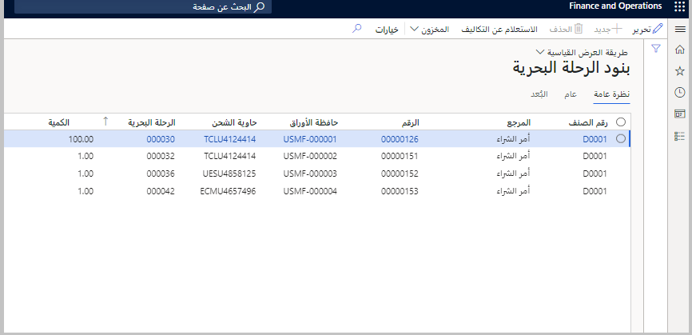
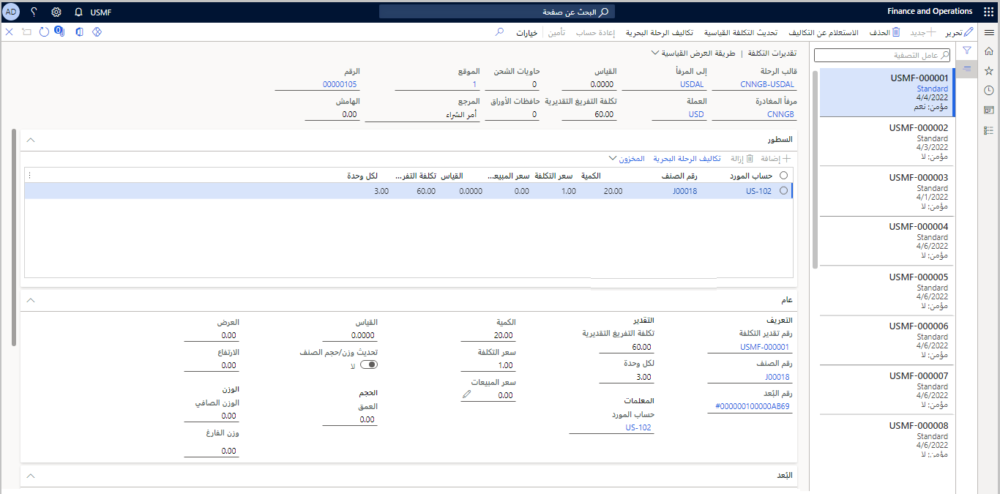
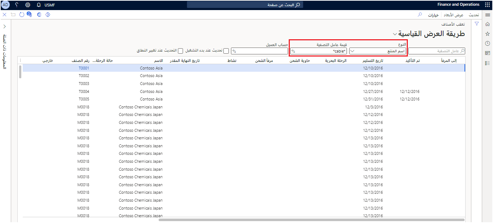

يعرض استعلام **بنود الرحلة البحرية** كافة بنود الرحلات بمجرد ربطها بالمخزون. يمكنك استخدام هذا الاستعلام كعامل تصفية للمساعدة في العثور على صنف معين أو أمر شراء أو معلومات أخرى قيّمة. بالإضافة إلى ذلك، يمكنك استخدامه لتحديد تاريخ التسليم المتوقع لأحد الأصناف في رحلة واحدة أو أكثر. ونتيجة لذلك، يمكن أن يساعدك الاستعلام في إدارة استلام المخزون المتوقع.

لاستخدام استعلام **بنود الرحلة البحرية**، اتبع الخطوات التالية:

1.  انتقل إلى **التكلفة شاملة التفريغ > الاستعلامات > بنود الرحلة البحرية**.

1.  في صفحة **بنود الرحلة** يمكنك تحديد بند حركة وعرض تفاصيل حول الرحلة وبنودها.

1.  حدد بنداً في الصفحة، ثم يمكنك التبديل بين علامات التبويب **نظرة عامة** و **عام** و **بُعد** لعرض المعلومات المرتبطة بالسجل المحدد.

1.  إذا قمت بتحديد **استعلام التكاليف** في جزء الإجراءات، يمكنك مراجعة تفاصيل التكلفة للسجل المحدد.

> [!div class="mx-imgBorder"]
> 

## استعلامات تقدير التكلفة

عند إنشاء تقدير التكلفة، تتم إضافته إلى صفحة استعلام **تقدير التكلفة**.

لاستخدام استعلام **تقدير التكلفة**، اتبع الخطوات التالية:

1.  انتقل إلى **التكلفة شاملة التفريغ > الاستعلامات > تقديرات التكلفة**.

1.  في صفحة **تقديرات التكلفة**، سيتم عرض تقديرات التكلفة لكافة الرحلات البحرية.

1.  استخدم الجزء الأيمن لتحديد وعرض معلومات التكلفة لكل رحلة مدرجة.

> [!div class="mx-imgBorder"]
> 

## استعلام تعقب الأصناف

يمكنك عرض بنود أوامر الشراء المفتوحة وحالاتها الحالية باستخدام صفحة **تعقب الأصناف**. ليس من الضروري ربط البنود برحلة لتظهر في هذه الصفحة. ومع ذلك، إذا كان أحد الأصناف مرتبطاً برحلة ما، سيعرض بند سجل تعقب الأصناف معرف الرحلة.

انتقل إلى **التكلفة شاملة التفريغ > الاستعلامات > التعقب > تعقب الصنف** لفتح الصفحة.

> [!div class="mx-imgBorder"]
> 

نظراً لأن النظام الخاص بك يحتوي على الأرجح على عدد كبير من سطور أوامر الشراء، فلن تعرض صفحة **تعقب الأصناف** السجلات في البداية. ابدأ بتحديد مجموعة بنود أوامر الشراء التي تبحث عنها باستخدام حقول التصفية في أعلى الصفحة. ثم في جزء الاجراء، حدد **تحديث** لإنشاء القائمة. يمكنك استخدام علامة النجمة (\*) كحرف بدل في أي حقل من حقول عامل التصفية. على سبيل المثال، لاكتشاف كافة بنود أوامر الشراء للأصناف التي تحتوي على كلمة "كابل" في اسمها، قم بتعيين الحقل **نوع** إلى **اسم المنتج** ثم أدخل **\*الكابل\*** في حقل **قيمة عامل التصفية**.

> [!NOTE]
> في الوقت الحالي، لا تشتمل المتأخرات من الأوامر إلا على أوامر المبيعات. لا يتم عرض عروض أسعار المبيعات لأنها لا تعتبر متأخرات من الأوامر.

بالإضافة إلى الاستعلامات المتاحة لمعلومات التكلفة شاملة التفريغ، تتوفر لك عدة تقارير جاهزة للاستخدام عند تحليل حركات التكلفة شاملة التفريغ وبياناتها:

-   الفواتير المعلّقة

-   تحليل النشاط/الموفر حسب النشاط

-   تحليل النشاط/الموفر حسب الموفر

-   احتساب تكلفة الرحلة البحرية حسب التكلفة الفردية

-   احتساب تكلفة الرحلة البحرية حسب فئة إعداد التقارير

-   قائمة إيصالات حاوية الشحن

-   التسليم المتوقع

لمزيد من المعلومات، راجع [تقارير التكلفة شاملة التفريغ.](/dynamics365/supply-chain/landed-cost/landed-cost-reports/?azure-portal=true)
