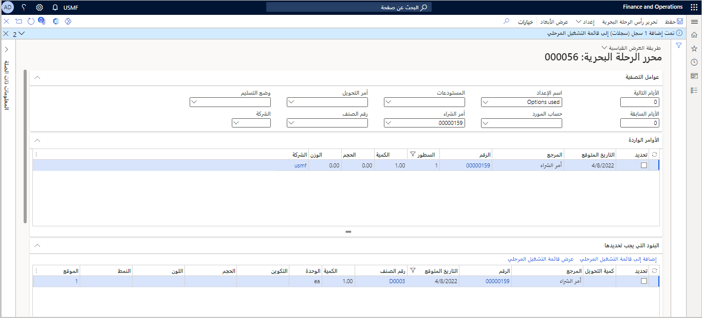
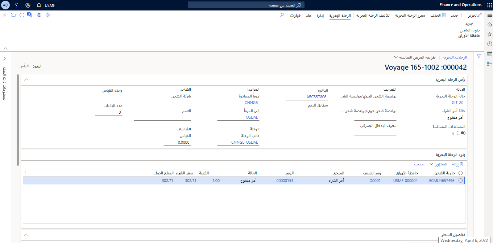
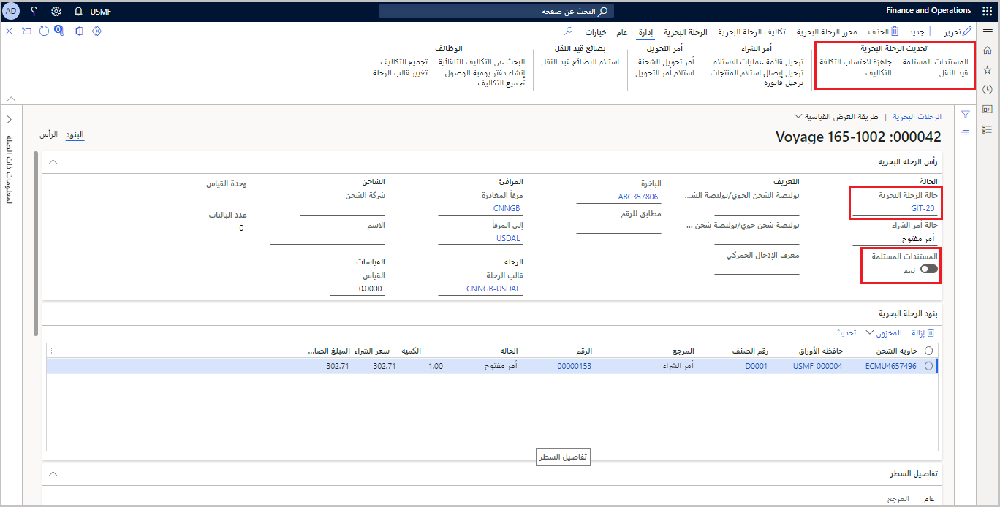
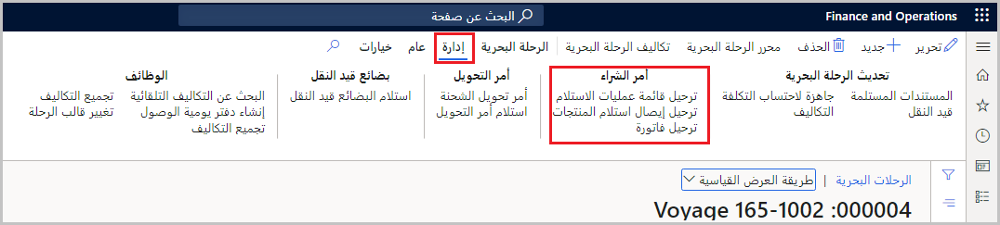

عندما تقوم بإنشاء رحلة بحرية، سواء من أمر شراء أو من صفحة **جميع الرحلات البحرية**، يمكنك إضافة حاويات وحافظات الأوراق إلى الرحلة البحرية باستخدام **محرر الرحلة البحرية**.

## محرر الرحلة البحرية 

يتيح لك **محرر الرحلة البحرية** إضافة بنود الشراء أو إزالتها لرحلة بحرية معينة. بالإضافة إلى ذلك، يمكنك إنشاء حاويات جديدة وتعديل تفاصيل الرحلة البحرية. يمكنك فتح **محرر الرحلة البحرية** من جزء الإجراءات الموجود على رحلة بحرية معينة، أو سيتم عرض صفحة **محرر الرحلة البحرية** عند إنشاء رحلة بحرية جديدة من أمر شراء.

اتبع الخطوات التالية لإضافة أمر شراء وبنود أمر شراء لرحلة بحرية باستخدام **محرر الرحلة البحرية**:

1.  مع وجود رحلة بحرية مفتوحة، حدد **محرر الرحلة البحرية** في جزء الإجراءات.

1.  في هذه الصفحة، يمكنك إضافة عوامل تصفية لعرض أوامر الشراء لربطها برحلة بحرية، مثل المُورّد أو وضع التسليم أو المستودع.

1.  في القائمة المنسدلة **اسم الإعداد**، حدد **اليوم**.

    سيتم عرض الأوامر وبنود الأوامر التي يكون **التاريخ المتوقع** لها في تاريخ اليوم.

    > [!div class="mx-imgBorder"]
    > 

    > [!NOTE]
    > يمكنك تحديث كمية صنف في البنود التي تحددها. على سبيل المثال، إذا لم يتم إنتاج كافة الأصناف لبند أمر شراء بواسطة المُورّد في الوقت الخاص بالشحنة، فقد تحتاج إلى تحديث بند أمر الشراء لتضمين عدد الأصناف المكتملة التي ستكون جزءاً من الرحلة فقط. إذا قمت بتغيير كمية أحد الأصناف في هذه الصفحة، سيقوم Dynamics 365 بتقسيم البند تلقائياً في أمر الشراء.

1.  حدد سجلاً واحداً أو سجلات متعددة لإرفاقها بالرحلة البحرية، ثم حدد **إضافة إلى قائمة التقسيم المرحلي** في ‏‫علامة التبويب السريعة **البنود المطلوب تحديدها**.

1.  حدد **عرض قائمة التقسيم المرحلي** لعرض السجلات التي تمت إضافتها.

1.  في صفحة **إضافة قائمة التقسيم المرحلي إلى حاوية الشحن**، حدد **إضافة إلى حاوية شحن جديدة**.

1.  في مربع الحوار **إنشاء حاوية شحن**، حدد **حاوية الشحن** (يمكنك إدخال هذه المعلومات باستخدام النص الحر، أو يمكنك تحديد الحاوية من القائمة المنسدلة وقالب **الرحلة** وتاريخ الشحن).

    > [!IMPORTANT]
    > سيحدد حقل نوع حاوية الشحن والتحديد الذي قمت به السعة والحجم والوزن الخاص بالحاوية.

1.  حدد **موافق** ثم أغلق صفحة **إضافة قائمة التقسيم المرحلي إلى حاوية الشحن**.

ستحتوي الرحلة البحرية الآن على بنود الرحلة البحرية التي تمت إضافتها إلى الحاوية.

> [!div class="mx-imgBorder"]
> 

## تحديثات الرحلة البحرية

في مجموعة **تحديث الرحلة البحرية** في علامة تبويب **إدارة**، يمكنك تحديث الرحلة البحرية.

> [!div class="mx-imgBorder"]
> 

باستخدام مهمة **المستندات المستلمة**، يمكنك تعيين تبديل **المستندات المستلمة** إلى **نعم** لعدة رحلات بحرية في نفس الوقت. استخدم إعدادات **التصفية** لتحديد مجموعة الرحلات البحرية التي ترغب في تحديثها. عند تحديد هذا الخيار، سيتغير تبديل **المستندات المستلمة** في **الرحلة البحرية الرئيسية** إلى **نعم**.

عند تحديد الزر **قيد النقل** في جزء الإجراءات، يتم تحديث حقل **حالة الرحلة البحرية** إلى حالة قيد النقل التي تم إنشاؤها في صفحة **‏‫معلمات التكلفة شاملة التفريغ** للعديد من الرحلات البحرية.

## حركات أمر الشراء لرحلة بحرية

من جزء الإجراءات الموجود في علامة التبويب **إدارة**، يمكنك إدارة الحركات المرتبطة بأمر شراء لرحلتك البحرية في صفحة **الرحلات البحرية**. بالإضافة إلى ذلك، يمكنك ترحيل قائمة إيصالات الاستلام وإيصال استلام المنتج‬ والفاتورة.

> [!div class="mx-imgBorder"]
> 

شاهد الفيديو التالي لمعرفة كيفية إنشاء رحلة بحرية وإدارتها في التطبيق.

> [!VIDEO https://www.microsoft.com/videoplayer/embed/RWWlRr]