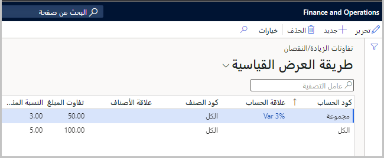
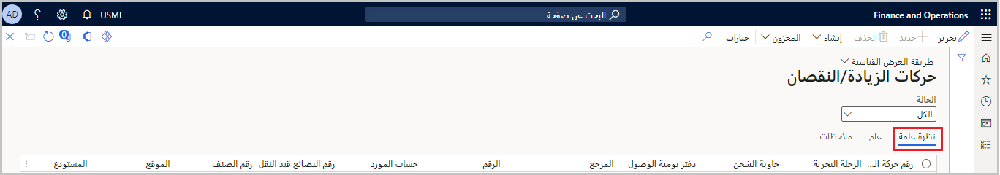

يتوقع النظام أن يتطابق عدد العناصر التي يتم استلامها فِي مستودع الوجهة النهائي للاستهلاك مع الكمية المحددة فِي بنود أوامر الشراء الخاصة بالرحلَة، عند معالجة أوامر رحلَة ما. ومع ذلك، نظرًا لأن المبلغ المحدد فِي بنود أمر الشراء لا يتم استلامه دائمًا فِي المستودع، فإن **وحدة التكلفة** المستلمة لها قواعد للتعامل مع الاستلام الزائد للمنتجات وتلقيها بشكل ناقص. هذه القواعد بالغة الأهمية لأنه تمت فوترة أمر الشراء الأولي بالفعل ولا يمكن تعديله. ستمكّن النظام من تحديد كيفية التعامل مع البضائع الزائدة والمعالجة الناقصة عند الاستلام، من خلال تحديد سياسات المعاملات الزائدة/السفلية. بالإضافة إلى ذلك، يمكنك إدارة المخزون يدويًا وتحته باستخدام الصفحة **حركات الزيادة/النقصان**.

## تفاوتات الزيادة/النقصان

يمكنك تعيين التفاوتات فِي التسليم الزائد ونقص التسليم، لتحديد الكميات الزائدة أو الأقل أو الكميات التي يمكن معالجتها فِي رحلَة دون حدوث خطأ. ستحتاج إلى تعديل خط الرحلَة البحرية وحله قبل إغلاق خط الرحلَة للمعالجة الإضافية، إذا كان إيصاله خارج هذه التفاوتات المسموح بها.

انتقل إلى **التكلفة شاملة التفريغ> تفاوتات الزيادة / النقصان** لإعداد التفاوتات. يمكنك عرض سجلات التفاوت وتحريرها وإضافتها وإزالتها فِي الصفحة **تفاوتات الزيادة / النقصان**.

> [!div class="mx-imgBorder"]
> 

## عرض حركات بالزيادة / النقصان ومعالجتها

سيتم إنشاء حركات بالزيادة / النقصان عندما لا تتطابق كمية البضائع التي تم تخزينها مع الكمية التي تمت تهيئتها. يجب عليك تحديث الكمية فِي دفتر يومية الوصول فقط بالكمية التي تم إبعادها.

عند معالجة خطوط الرحلَة البحرية، يمكنك تعيين تفاوتات الزيادة / النقصان المسموح بها للبائع. بعد ذلك، سيتم فحص الأصناف والتحقق من صحتها. يمكنك تحديد التفاوت كنسبة مئوية أو قيمة محلية أو مزيج من الاثنين.

سيقوم النظام بإنشاء دفتر يومية للحركة، إذا كانت سلعة مستلمة تقع ضمن التفاوت المسموح به. في صفحة معلمات الرحلَة البحرية، يمكنك تحديد دفتر اليومية هذا. سيتم أيضًا إنشاء حركة زيادة / نقصان. على سبيل المثال، إذا كانت قيمة الأمر 100.00 دولارًا أمريكيًا، وكانت قيمة الإيصال 99.00 دولارًا أمريكيًا (وكلاهما يفي بمعايير التفاوت)، فسيتم إنشاء دفتر يومية للحركة السالبة للكمية غير المستلمة.

إذا تم استلام صنف خارج التفاوت، فسيقوم النظام بإنشاء حركة زيادة / نقصان لحساب الفرق فِي المبلغ.

انتقل إلى **التكلفة شاملة التفريغ > الاستعلامات > حركات بالزيادة / النقصان** لعرض حركات بالزيادة / النقصان ومعالجتها. في الصفحة **حركات بالزيادة / النقصان**، سيتم ربط المعاملة بجميع الأصناف التي تم استلامها بشكل زائد عن الحد أو عدم استلامها أثناء الرحلَة. لذا، نوصيك بحل جميع المعاملات العامة / التي تتعلق بالرحلات باستخدام الصفحة **حركات بالزيادة / النقصان**. بالإضافة إلى ذلك، نوصي بتجنب حل حركات المستودع تحت التسليم يدويًا باستخدام الحركة أو دفاتر يومية الجرد. بدلاً من ذلك، سيكون من الأفضل إدارة كميات المستودع تحت التسليم من خلال الصفحة **حركات بالزيادة / النقصان**.

لعرض حركات بالزيادة / النقصان، انتقل إلى الصفحة **حركات بالزيادة / النقصان** وحدد علامة التبويب **نظرة عامة** فِي الزاوية العلوية اليمنى.

> [!div class="mx-imgBorder"]
> 

## معالجة حركات بالزيادة / النقصان

يحتوي جزء "الإجراء" فِي صفحة **حركات بالزيادة / النقصان** على الأوامر التالية لإكمال المعاملات التي تم تحديدها فِي الصفحة. يسمح لك كل أمر بتحديد كيفية معالجة كل حركة.

-   **إنشاء > حركة** - إنشاء دفتر يومية حركة ونشرها للحركة المحددة. يتم إنشاء دفتر يومية للحركة التلقائية وترحيله ضمن الحركات لتعكس الفرق بين الكمية المتوقعة والفعلية المستلمة. حدد هذا الأمر إذا كنت تريد أن يدرك البائع فرق التكلفة لأكثر من الحركات.

-   **إنشاء > أمر الشراء** - إنشاء أمر شراء للفرق بين الكمية المتوقعة للحركة والكمية الفعلية المستلمة. إذا كانت شركتك ستدرك فرق التكلفة، فاستخدم هذا الأمر لأكثر من الحركات.

-   **إنشاء > نقل إلى الوجهة** - لا ينطبق هذا الأمر إلا على أوامر التحويل. حدد هذا الخيار إذا كنت تريد نقل الكمية الزائدة أو الأقل إلى المستودع الوجهة.

-   **إنشاء > نقل إلى الأصل** - لا ينطبق هذا الأمر إلا على أوامر التحويل. حدد هذا الخيار إذا كنت تريد نقل الكمية الزائدة أو الأقل إلى المستودع الأصلي.
