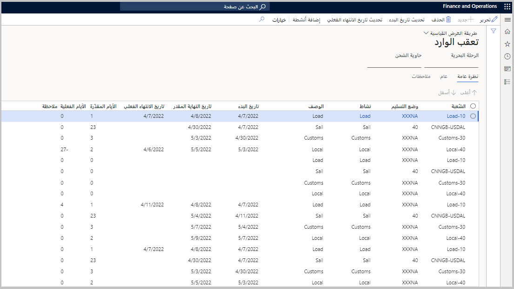
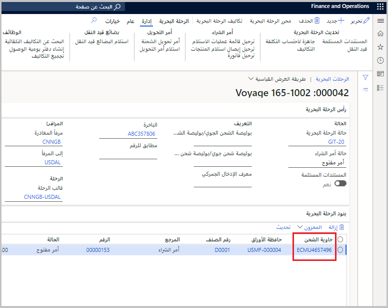
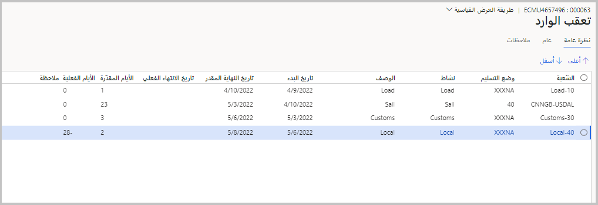

تتيح لك صفحة **التتبع الداخلي** تتبع التقدم المحرز فِي رحلاتك ورحلات حاوية الشحن. تنقسم كل رحلَة بحرية وبرية إلى *أنشطة*، يتم تمثيل كل منها على الصفحة بصفتها الخاصة. بالإضافة إلى ذلك، تتيح لك الصفحة عرض التواريخ المقدرة والفعلية وإدخالها لكل نشاط.

ستعرض هذه الأنشطة عادةً تاريخ الهبوط المقدر فِي الوجهة النهائية اعتمادًا على كيفية إعداد مركز التحكم فِي "التتبع". اعتمادًا على تكوين النظام، عادةً ما يقوم التاريخ النهائي بتحديث تاريخ التسليم أو التاريخ المؤكد فِي سطور أمر الشراء. يمكنك إعداد النظام لتحديث تاريخ الاستلام لأسطر أمر التحويل.

انتقل إلى **التكلفة شاملة التفريغ > التتبع > التتبع الداخلي** لفتح **صفحة التتبع الداخلي** .

يمكنك تصفية المعلومات من خلال الحقلين **الرحلَة البحرية** و **حاوية الشحن** فِي أعلى صفحة **التتبع الداخلي**. تعرض فقط الأنشطة المرتبطة بالرحلَة المحددة و / أو حاوية الشحن.

> [!div class="mx-imgBorder"]
> 

## تحديث معلومات التعقب

يمكنك تحديث جدول الرحلَة البحرية أو العادية بإدخال تاريخ بدء النشاط الأول. سيؤدي هذا الإجراء إلى تحديث تاريخ الانتهاء المقدر للنشاط النهائي. يتم تحديد المهل المتوقعة من خلال تكوين كل قالب ورحلَة فِي مركز التحكم فِي التتبع. يتم احتساب تواريخ الانتهاء المتوقعة باستخدام المهلة الزمنية من تاريخ بدء النشاط. يتم تغيير تاريخ بدء النشاط التالي إلى نفس تاريخ الانتهاء الفعلي للنشاط السابق، وذلك عندما يتم تسجيل تاريخ الانتهاء الفعلي للإجراء السابق. للسماح بالمقارنة والتحليل، يتم تحديث المهلة الفعلية. في الحقل **ملاحظة**، يمكنك إضافة ملاحظات إضافية بحسب الحاجة.

يحدد ترتيب مرحلَة قالب الرحلَة ترتيب نشاط الشبكة؛ لذا، إذا تغير تسلسل المراحل فِي الرحلَة المرتبطة، يتم تغيير عنصر التحكم فِي التتبع أيضًا.

يمكنك تحديث التواريخ لجميع الحاويات فِي الجزء "الإجراء" عن طريق تحديد **تحديث تاريخ البدء** أو **تحديث تاريخ الانتهاء الفعلي**. بدلاً من ذلك، يمكنك تحديد تواريخ حاويات الشحنة بشكل فردي. تتيح هذه التقنية قدرًا أكبر من المرونة فِي البيئات متعددة الرحلات لأنه يمكن فصل الحاويات.

## تتبع رحلَة حاوية الشحن

يمكنك تتبع حركة البضائع الفعلية من خلال تتبع الحاويات فِي الرحلَة.

لتتبع حركة البضائع الفعلية، اتبع الخطوات التالية:

1.  افتح الرحلَة البحرية التي تريد العمل بها من خلال الانتقال إلى **التكلفة شاملة التفريغ > الرحلات > جميع الرحلات البحرية**.

1.  افتح رحلَة بحرية من صفحة القائمة.

1.  حدد حاوية شحن من القائمة، فِي علامة التبويب السريعة **خطوط الرحلَة البحرية**.

    > [!div class="mx-imgBorder"]
    > 

1.  في علامة التبويب **عام** فِي الجزء "الإجراء"، وحدد **تعقب**.

    في هذه الصفحة، سيتم عرض المراحل والأنشطة التي تشكّل جزءًا من نموذج الرحلَة للرحلَة البحرية.

1.  يمكنك تحديث تاريخي البدء والانتهاء لكل مرحلَة أو نشاط من رحلَة الحاوية.

1.  حدد **تحرير** فِي "جزء الإجراء" ثم حدد السطر المراد تحديثه.

1.  أدخل التاريخ فِي حقل **تاريخ البدء**.

1.  أدخل تاريخًا فِي الحقل **تاريخ الانتهاء المقدر**.

1.  يمكنك تقدير تواريخ الأسطر الإضافية على الصفحة بناءً على تاريخ البدء الذي تقوم بإدخاله. سيتم ملء التواريخ المقدرة بناءً على قالب الرحلَة.

    > [!div class="mx-imgBorder"]
    > 

1. سيتم تحديث تاريخ التسليم المؤكد فِي أمر الشراء ذي الصلة تلقائيًا، استنادًا إلى التواريخ التي أدخلتها فِي هذه الصفحة. في هذه الحالة، سيتم تحديث تاريخ تسليم أمر الشراء إلى 22 مارس 2022.

1. يمكنك تحديث الحقل **تاريخ الانتهاء الفعلي**، عند اكتمال كل مرحلَة. سيتم تحديث التواريخ المقدّرة تلقائيًا بناءً على هذه الإدخالات أيضًا.

    عند اكتمال **تاريخ الانتهاء الفعلي** للمرحلَة الأولى من الرحلَة، سيتم تحديث **حالة الرحلَة البحرية** تلقائيًا إلى البضائع قيد النقل.

شاهد الفيديو التالي للحصول على عرض توضيحي لكيفية عرض معلومات تتبع الرحلَة فِي Dynamics 365 Supply Chain Management.

> [!VIDEO https://www.microsoft.com/videoplayer/embed/RWWlRs]
