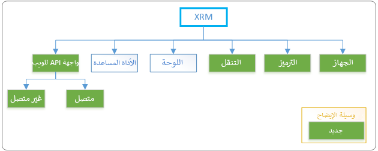

توفر API الخاصة بالعميل كائن **Xrm** والذي يكون متوفراً بشكل عام في التعليمات البرمجية الخاصة بك للقيام بأنشطة مختلفة دون الحاجة إلى استخدام سياق التنفيذ. على مستوى عالٍ، يوضح الرسم التالي كل من الخصائص والطرق المتاحة. للحصول على نظرة عامة متعمقة لهذا الكائن، راجع [كائن Xrm API الخاص بالعميل](/powerapps/developer/model-driven-apps/clientapi/clientapi-xrm/?azure-portal=true).

> [!div class="mx-imgBorder"]
> 

## كائن التطبيق

باستخدام addGlobalNotification من كائن التطبيق، يمكنك عرض إخطار بالخطأ أو المعلومات أو التحذير أو النجاح لأحد التطبيقات وتحديد الإجراءات التي سيتم تنفيذها استناداً إلى الاخطار. يتشابه هذا النموذج مع الإخطارات ولكن يمكن استخدامه خارج سياق النموذج. على سبيل المثال، يمكن أن يستخدم البرنامج النصي لشريط الأوامر هذا العنصر لإخطار المستخدم باكتمال تنفيذ الإجراء. استخدم أسلوب clearGlobalNotification لمسح إخطار في التطبيق.

## كائن الجهاز

يكشف كائن Xrm.Device عن إمكانيات الجهاز الأصلية المرتبطة بتفاعلات الجهاز المحمول، باستثناء طريقة pickFile، والتي يمكن الوصول إليها أيضاً من خلال عملاء الويب. توفر تطبيقات اللوحة أيضاً إطار عمل موسع لتطوير الأجهزة المحمولة ويجب أيضاً أخذها في الاعتبار في هذه السيناريوهات. الجدول التالي هو ملخص للطرق المتوفرة داخل كائن Xrm.Device.

|     الطريقة                |     الوصف                                                                                                |
|---------------------------|----------------------------------------------------------------------------------------------------------------|
|     [captureAudio](/powerapps/developer/model-driven-apps/clientapi/reference/xrm-device/captureaudio/?azure-portal=true)          |     يستدعي ميكروفون الجهاز لتسجيل الصوت.                                                             |
|     [captureImage](/powerapps/developer/model-driven-apps/clientapi/reference/xrm-device/captureimage/?azure-portal=true)          |     يستدعي كاميرا الجهاز لالتقاط صورة.                                                             |
|     [captureVideo](/powerapps/developer/model-driven-apps/clientapi/reference/xrm-device/capturevideo/?azure-portal=true)          |     يستدعي كاميرا الجهاز لتسجيل مقطع فيديو.                                                               |
|     [getBarcodeValue](/powerapps/developer/model-driven-apps/clientapi/reference/xrm-device/getbarcodevalue/?azure-portal=true)       |     يستدعي كاميرا الجهاز لمسح معلومات الرمز الشريطي، مثل رقم المنتج.                     |
|     [getCurrentPosition](/powerapps/developer/model-driven-apps/clientapi/reference/xrm-device/getcurrentposition/?azure-portal=true)    |     إرجاع الموقع الحالي باستخدام إمكانية تحديد الموقع الجغرافي للجهاز.                                 |
|     [pickFile](/powerapps/developer/model-driven-apps/clientapi/reference/xrm-device/pickfile/?azure-portal=true)              |     يفتح مربع حوار لتحديد الملفات من جهاز الكمبيوتر (عميل الويب) أو الجهاز المحمول (عملاء الأجهزة المحمولة).    |

ووفقاً لتكوين الجهاز، لن تتوفر بعض الوظائف. قد تكون موافقة المستخدم مطلوبة أيضاً حتى يتمكن التطبيق من الوصول إلى إمكانيات معينة للجهاز. على سبيل المثال، قد يكون المستخدم قد قام بتعطيل إمكانيات موقع الجهاز بشكل عام أو أنه رفض الوصول إلى كاميرا التطبيق. عند تطوير تطبيق احذر من فشل إحدى هذه الطرق بسبب إمكانيات الجهاز أو التكوين أو نقص الأذونات أو الموافقة.

## كائن ترميز

يتم استخدام كائن Xrm.Encoding لترميز سلاسل XML وHTML وفك ترميزها. يمكن أن يكون هذا الترميز وفك التشفير ذا قيمة عندما تتفاعل مع موارد ويب HTML، وتشفير معلمات سلسلة الاستعلام وفك تشفيرها، وأيضاً عندما تتفاعل مع FetchXML الذي يحتوي على أحرف خاصة مثل "&" أو '\<' في سلسلة البحث.

## كائن التنقل

يوفر كائن التنقل طرقاً مرتبطة بالتنقل يمكن استخدامها داخل تطبيق يستند إلى نموذج. نظراً لطبيعة الحظر، لا تُعتبر الأنشطة مثل عرض مربعات حوار التنبيه والتأكيد والخطأ تجربة مستخدم مثالية، ولكنها لا تزال متاحة للاستخدام. في هذه السيناريوهات، عليك أن تضع في اعتبارك إخطارات النموذج أو آليات أخرى غير محظورة لتحذير المستخدمين من مشكلة ما. فيما يلي ملخص للطرق المتاحة داخل كائن Xrm.Navigation.

 |     الطريقة               |     الوصف                                                                      |
|--------------------------|--------------------------------------------------------------------------------------|
|     [openAlertDialog](/powerapps/developer/model-driven-apps/clientapi/reference/xrm-navigation/openalertdialog/?azure-portal=true)      |     يعرض مربع حوار التنبيه الذي يحتوي على رسالة وزر.                 |
|     [openConfirmDialog](/powerapps/developer/model-driven-apps/clientapi/reference/xrm-navigation/openconfirmdialog/?azure-portal=true)    |     يعرض مربع حوار للتأكيد الذي يحتوي على رسالة وزرين.    |
|     [openErrorDialog](/powerapps/developer/model-driven-apps/clientapi/reference/xrm-navigation/openerrordialog/?azure-portal=true)      |     يعرض مربع حوار الخطأ.                                                        |
|     [openFile](/powerapps/developer/model-driven-apps/clientapi/reference/xrm-navigation/openfile/?azure-portal=true)             |     فتح ملف.                                                                    |
|     [openForm](/powerapps/developer/model-driven-apps/clientapi/reference/xrm-navigation/openform/?azure-portal=true)             |     فتح نموذج جدول أو نموذج إنشاء سريع.                                       |
|     [openUrl](/powerapps/developer/model-driven-apps/clientapi/reference/xrm-navigation/openurl/?azure-portal=true)              |     فتح عنوان URL، بما في ذلك عناوين URL للملف.                                                |
|     [openWebResource](/powerapps/developer/model-driven-apps/clientapi/reference/xrm-navigation/openwebresource/?azure-portal=true)      |     فتح مورد ويب بتنسيق HTML.                                                      |

## كائن لوحة

يوفر كائن Xrm.Panel طريقة لعرض صفحة ويب في الجزء الجانبي لنموذج تطبيق يستند إلى النموذج. هذه الميزة موجودة حالياً في الإصدار الأولي ولن يتم تناولها بالتفصيل هنا. لمزيد من المعلومات، راجع [لوحة Xrm.](/powerapps/developer/model-driven-apps/clientapi/reference/xrm-panel/?azure-portal=true).

## كائن الأداة المساعدة

يعد كائن Xrm.Utility حاوية للعديد من الأساليب المفيدة. الجدول التالي هو ملخص للطرق المتوفرة داخل كائن Xrm.Utility. لمزيد من المعلومات، راجع [Xrm.Utility (مرجع API الخاص بالعميل)](/powerapps/developer/model-driven-apps/clientapi/reference/xrm-utility/?azure-portal=true)

  |     الطريقة                          |     الوصف                                                                                                                                                                   |
|-------------------------------------|-----------------------------------------------------------------------------------------------------------------------------------------------------------------------------------|
|     [closeProgressIndicator](/powerapps/developer/model-driven-apps/clientapi/reference/xrm-utility/closeprogressindicator/?azure-portal=true)          |     يقوم المؤشر بإغلاق مربع حوار التقدم الذي تم فتحه باستخدام showProgressIndicator.                                                                                         |
|     [getAllowedStatusTransitions](/powerapps/developer/model-driven-apps/clientapi/reference/xrm-utility/getallowedstatustransitions/?azure-portal=true)     |     إرجاع انتقالات الحالة الصالحة للجدول ورمز الحالة المحددين.                                                                                                 |
|     [getEntityMetadata](/powerapps/developer/model-driven-apps/clientapi/reference/xrm-utility/getentitymetadata/?azure-portal=true)               |     يعيد بيانات تعريف الكيان للكيان المحدد.                                                                                                                         |
|     [getGlobalContext](/powerapps/developer/model-driven-apps/clientapi/reference/xrm-utility/getglobalcontext/?azure-portal=true)                |     الحصول على السياق العمومي الذي يمكنه توفير معلومات وقت التشغيل بما في ذلك إعدادات المؤسسة وإعدادات المستخدم والتطبيق ومعلومات العميل.                              |
|     [getLearningPathAttributeName](/powerapps/developer/model-driven-apps/clientapi/reference/xrm-utility/getlearningpathattributename/?azure-portal=true)    |     إرجاع اسم سمة DOM المتوقعة من مصمم محتوى مسار التعليم (التعليمات الإرشادية) لتحديد عناصر تحكم واجهة المستخدم في نماذج التطبيقات المستندة إلى النموذج.    |
|     [getResourceString](/powerapps/developer/model-driven-apps/clientapi/reference/xrm-utility/getresourcestring/?azure-portal=true)               |     إرجاع السلسلة المترجمة لمفتاح محدد مقترن مع مورد الويب المحدد.                                                                            |
|     [invokeProcessAction](/powerapps/developer/model-driven-apps/clientapi/reference/xrm-utility/invokeprocessaction/?azure-portal=true)             |     استدعاء اجراء استناداً إلى المعلمات المحددة. يمكن أيضاً استخدام هذا لاستدعاء واجهات برمجة التطبيقات المخصصة (APIs) التي تم إنشاؤها من قبل المطورين.                                            |
|     [lookupObjects](/powerapps/developer/model-driven-apps/clientapi/reference/xrm-utility/lookupobjects/?azure-portal=true)                   |     يستخدم هذا الزر في فتح عنصر تحكم بحث لتحديد صنف واحد أو أكثر.                                                                                                                           |
|     [refreshParentGrid](/powerapps/developer/model-driven-apps/clientapi/reference/xrm-utility/refreshparentgrid/?azure-portal=true)               |     تحديث الشبكة الأصل التي تحتوي على السجل المحدد.                                                                                                               |
|     [showProgressIndicator](/powerapps/developer/model-driven-apps/clientapi/reference/xrm-utility/showprogressindicator/?azure-portal=true)           |     يعرض مربع حوار التقدم مع الرسالة المحددة.                                                                                                                        |

هناك أيضاً العديد من الأساليب غير المدرجة أعلاه التي قد تكون موجودة في التعليمات البرمجية القديمة [والتي تم إهمالها الآن](/powerapps/developer/model-driven-apps/clientapi/reference/xrm-utility?azure-portal=true#deprecated-methods) بسبب أنها انتقلت إلى مساحة اسم Xrm.Navigation. في حالة العثور على هذه الأساليب يجب تحديث الكود لاستخدام أساليب Xrm.Navigation الجديدة.

## كائن Xrm.WebApi

يوفر كائن Xrm.WebApi خصائص وأساليب لاستخدام عنوان API للويب لعمليات CRUD التقليدية داخل البرنامج النصي الخاص بالعميل. عند استخدام Xrm.WebAPI، تتم معالجة المصادقة تلقائياً في سياق المستخدم الحالي باستخدام التطبيق. يمكن استخدام عنوان API للويب سواءً كان التطبيق متصلاً أو غير متصل (إذا تم تكوين البيئة). تتضمن مساحة الاسم مجموعة معينة من الأساليب المتصلة بالإنترنت وغير المتصلة ومع ذلك فإن استخدام هذه الطرق يتطلب منك تعقب حالة العميل. إذا كنت تستخدم Xrm.WebAPI ،Xrm.WebAPI.createRecord، تحدد واجهة برمجة التطبيقات (API) ما إذا كان يجب أن تستخدم أساليب مساحة الاسم المتصلة أو غير المتصلة.

الجدول التالي هو ملخص للطرق المتوفرة داخل كائن Xrm.WebApi. لمزيد من المعلومات، راجع [Xrm.WebApi (مرجع API الخاص بالعميل)](/powerapps/developer/model-driven-apps/clientapi/reference/xrm-webapi/?azure-portal=true).

|     الطريقة                     |     الوصف                                                                                                               |
|--------------------------------|-------------------------------------------------------------------------------------------------------------------------------|
|     [createRecord](/powerapps/developer/model-driven-apps/clientapi/reference/xrm-webapi/createrecord/?azure-portal=true)               |     إنشاء صف جدول.                                                                                                      |
|     [deleteRecord](/powerapps/developer/model-driven-apps/clientapi/reference/xrm-webapi/deleterecord/?azure-portal=true)               |     يتيح حذف صف جدول باستخدام معرف الصف.                                                                              |
|     [retrieveRecord](/powerapps/developer/model-driven-apps/clientapi/reference/xrm-webapi/retrieverecord/?azure-portal=true)             |     يتيح استرجاع صف باستخدام معرف الصف.                                                                                  |
|     [retrieveMultipleRecords](/powerapps/developer/model-driven-apps/clientapi/reference/xrm-webapi/retrievemultiplerecords/?azure-portal=true)    |     استرداد مجموعة من صفوف الجدول المطابقة لخيارات الاستعلام أو إحضار XML المتوفر.                                  |
|     [updateRecord](/powerapps/developer/model-driven-apps/clientapi/reference/xrm-webapi/updaterecord/?azure-portal=true)               |     تحديث صف جدول.                                                                                                      |
|     [isAvailableOffline](/powerapps/developer/model-driven-apps/clientapi/reference/xrm-webapi/isavailableoffline/?azure-portal=true)         |     إرجاع القيمة المنطقية التي تشير إلى ما إذا كان الجدول موجوداً في ملف تعريف المستخدم ومتاحاً في وضع عدم الاتصال.    |
|     [تنفيذ](/powerapps/developer/model-driven-apps/clientapi/reference/xrm-webapi/online/execute/?azure-portal=true)                    |     تشغيل اجراء أو وظيفة واحدة أو عملية CRUD.                                                                         |
|     [executeMultiple](/powerapps/developer/model-driven-apps/clientapi/reference/xrm-webapi/online/executemultiple/?azure-portal=true)            |     تشغيل مجموعة من الإجراءات أو الوظائف أو عمليات CRUD.                                                             |

باستخدام خصائص وأساليب كائن **Xrm**، يمكنك تنفيذ عمليات الأعمال تلقائياً وتحسين تجربة المستخدم الكلية.
