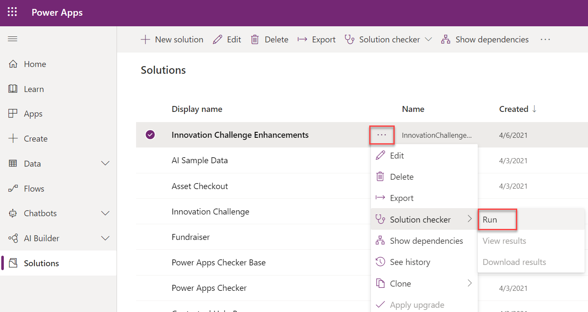

بينما قد يبدو تطوير البرامج النصية للعميل مهمة سهلة على ما يبدو لمطور JavaScript متمرس، فمن المهم مراعاة أفضل الممارسات عند التفكير في استخدامها. غالباً ما يتجاهل المطورون أيضاً أنه يمكن للمستخدمين استخدام وسائل أخرى للوصول إلى البيانات، على سبيل المثال، استيراد/تصدير البيانات، واستوديو المصنِّع، وتطبيقات اللوحة، وتطبيقات سطح المكتب التابعة لجهات خارجية، والبرمجة النصية من shell، وما إلى ذلك. وتم تصميم البرمجة النصية للعميل لحل مشكلات واجهة مستخدم معينة من جانب العميل وتحسين تجربة المستخدم في تطبيق محدد يستند إلى نموذج. وهو ليس إجراء أمان، ولا يعتبر حلاً لكافة المشاكل. في كثير من الحالات، تحتاج إلى دمج نهج من جانب العميل مع نهج من جانب الخادم للتأكد من أن جميع نقاط الوصول تنفذ متطلبات العمل.

## <a name="use-solution-checker"></a>استخدام مدقق الحلول

يمكن لمدقق الحلول إجراء فحص تحليلي ثابت لحلولك مقابل مجموعة من قواعد أفضل الممارسات وتحديد هذه الأنماط الإشكالية بسرعة. يتضمن هذا التدقيق JavaScript المستخدم في البرمجة النصية للعميل. يمكن للمدقق تحديد مشكلات الأداء والاستقرار والموثوقية عند تقديمها، مما قد يؤثر سلباً في تجربة المستخدم. يمكن للمدقق أيضاً تحديد استخدام الطرق المهملة. عند التشغيل بانتظام، يمكنك تحديد المشكلات بشكل استباقي ومعالجتها قبل إصدارها للمستخدمين. يمكن تشغيل مدقق الحلول عند الطلب من مدخل الشركة المصنعة.

> [!div class="mx-imgBorder"]
> [](../media/solution-checker.png#lightbox)

يمكنك أيضاً تشغيل مدقق الحلول كمهمة بناء في عملية إنشاء DevOps الآلية. يتيح ذلك تشغيله بانتظام ويصبح جزءاً من عملية إدارة دورة حياة البرنامج المستمرة.

لمزيد من المعلومات حول استخدام مدقق الحلول، راجع [استخدام مدقق الحلول للتحقق من صحة تطبيقاتك في Power Apps](/powerapps/maker/data-platform/use-powerapps-checker/?azure-portal=true) في وثائق المنتج.

## <a name="business-rules-vs-client-script"></a>قواعد العمل مقارنة بالبرنامج النصي للعميل

قواعد العمل هي ميزة متوفرة في التطبيقات المستندة إلى النموذج والتي تمكّن المستخدمين من تنفيذ الإجراءات المطلوبة بشكل متكرر على نموذج بناءً على متطلبات وشروط معينة. على وجه التحديد، يمكن لقواعد العمل القيام بالمهام التالية:

-   تعيين قيم الحقل

-   مسح قيم الحقل

-   تعيين مستويات متطلبات الحقل

-   إظهار عناصر تحكم عمود النموذج أو إخفاؤها

-   تمكين عناصر تحكم عمود النموذج أو تعطيلها

-   التحقق من صحة البيانات وإظهار رسائل الخطأ

-   إنشاء توصيات الأعمال بناءً على المعلومات المهنية.

تتمثل إحدى الميزات المميزة لقواعد العمل في أنه يمكن للقواعد المحددة في الجدول تطبيق المنطق تلقائياً على الواجهة الخلفية حيثما أمكن ذلك. يضمن ذلك تناسق التطبيق بغض النظر عما إذا تم تنفيذ إجراء عبر واجهة المستخدم أو استيراد البيانات أو استدعاء طريقة API. لن يكون البرنامج النصي للعميل وحده مكافئاً كاملاً في هذه السيناريوهات.

في حين أن إطار عمل قواعد العمل المتوفر فعالاً، فقد توجد بعض السيناريوهات حيث لا يمكن لقواعد العمل تنفيذ مطلب معين بشكل كامل. في هذه الحالات، يمكن أن تضيق البرمجة النصية للعميل الاختلافات بين قواعد العمل والمتطلبات الأكثر إلحاحاً. فيما يلي بعض القيود الشائعة التي يواجهها المستخدمون مع قواعد العمل حيث قد يكون البرنامج النصي للعميل حلاً أفضل.

### <a name="referencing-related-data"></a>الرجوع إلى البيانات ذات الصلة

إذا كنت بحاجة إلى الإشارة إلى البيانات الموجودة في جدول ذي صلة، مثل عنوان جهة الاتصال الأساسية للحساب، فستحتاج إلى استخدام البرنامج النصي للعميل وAPI للويب.

### <a name="logic-needs-to-run-on-the-form-save-event"></a>يلزم تشغيل المنطق على النموذج حفظ الحدث

يتم تشغيل قواعد العمل فقط عند تحميل النموذج وعند تغيير الحقل، ما لم يتم تعيين النطاق على الجدول. إذا كنت بحاجة إلى منطق الأعمال لتشغيل حدث عند حفظ النموذج، فستحتاج إلى استخدام البرنامج النصي للعميل.

### <a name="complex-conditions"></a>شروط معقدة

إذا كان الشرط يحتوي على العديد من عبارات "`and`" أو يتطلب عبارات "`or`"، فقد يكون من الأفضل كتابة هذه الأنواع من الشروط في البرنامج النصي للعميل وليس من خلال قواعد العمل.

### <a name="clearing-values-of-form-data"></a>مسح قيم بيانات النموذج

لا يمكن مسح البيانات من عمود النموذج بسهولة في قاعدة العمل. بينما توجد حلول يمكن تحقيقها من خلال تعيين عمود "وهمي" يحتوي دائماً على قيم فارغة‬، يتم إنجاز هذا بشكل أفضل من خلال البرنامج النصي للعميل.

### <a name="calculated-columns-vs-client-script"></a>الأعمدة المحتسبة مقابل البرنامج النصي للعميل

يتم حساب الأعمدة المحتسبة عند الاسترداد، لذلك لن تنعكس أي تغييرات من جانب العميل في الأعمدة المحتسبة حتى يتم تحديث النموذج. إذا كنت تريد تحديث البيانات على الفور في النموذج، فسيكون البرنامج النصي للعميل هو الطريقة المفضلة. غالباً ما يكمل البرنامج النصي للعميل تنفيذ الواجهة الخلفية الذي يستخدم أعمدة محتسبة أو تجميعية، ومكونات إضافية، وما إلى ذلك. يمكن أن يوفر هذا النهج المشترك تجربة مستخدم متسقة في التطبيق مع ضمان اتساق البيانات وسلامتها في الخلفية.

## <a name="coding-standards-and-best-practices"></a>معايير الترميز وأفضل الممارسات

تغطي الأقسام التالية أفضل الممارسات والمعايير الخاصة بالترميز.

### <a name="define-unique-script-function-names"></a>تحديد أسماء وظائف فريدة للبرنامج النصي

من المرجح أن يتم تحميل الوظائف التي تكتبها في نموذج مع العديد من المكتبات الأخرى. إذا كانت مكتبة أخرى تحتوي على وظيفة لها نفس اسم تلك التي توفرها، فإن الوظيفة التي تم تحميلها أخيراً هي تلك التي سيتم تحديدها لتلك الصفحة. لتجنب حدوث تعارض محتمل، تأكد من استخدام أسماء وظائف فريدة. يمكنك استخدام الاستراتيجيات التالية إذا لم يكن لديك أنت أو مؤسستك واحدة بالفعل:

-   **بادئة وظيفة فريدة** - تحدد كل وظيفة من وظائفك باستخدام الصيغة القياسية مع اسم ثابت يتضمن اصطلاح تسمية فريداً، كما هو موضح في المثال التالي.

    ```csharp
      function MyUniqueName_performMyAction()
      {
      // Code to perform your action.
      }
    ```

-   **مكتبات بها مساحات أسماء** - إقران كل وظيفة من وظائفك بكائن نص برمجي لإنشاء مساحة اسم لاستخدامها عند استدعاء وظائفك، كما هو موضح في المثال التالي.

    ```csharp
      //If the MyUniqueName namespace object isn’t defined, create it.
      if (typeof (MyUniqueName) == "undefined")
         { MyUniqueName = {}; }
         // Create Namespace container for functions in this library;
         MyUniqueName.MyFunctions = {
       performMyAction: function(){
       // Code to perform your action.
       //Call another function in your library
       this.anotherAction();
         },
         anotherAction: function(){
       // Code in another function
        }
      };
    ```

عند استخدام وظيفتك، حدد الاسم الكامل، كما هو موضح في المثال التالي.

```csharp
    MyUniqueName.MyFunctions.performMyAction();
```

> [!TIP]
> إذا استدعيت وظيفة داخل وظيفة أخرى في نفس مساحة الاسم، يمكنك استخدام **هذه** الكلمة الأساسية كاختصار للكائن الذي يحتوي على كلتا الوظيفتين. ومع ذلك، إذا تم استخدام وظيفتك كمعالج للأحداث، فإن الكلمة الرئيسية **هذه** ستشير إلى الكائن الذي يقع الحدث عليه.

### <a name="avoid-unsupported-methods"></a>تجنب الطرق غير المدعومة

في حين أن بعض موارد الجهات الخارجية على الإنترنت قد تقترح أو تحتوي على أمثلة لكيفية استخدام طرق غير مدعومة لأداء إجراءات معينة، فإن هذا غير مستحسن للغاية. لا يمكن ضمان عمل هذه الأساليب في الإصدارات المستقبلية من تطبيقك وقد تساهم في عدم استقرار التنفيذ. ويتضمن ذلك تجنب الأساليب التي تكتشفها عن طريق اختبار كائنات API في المصحح إذا لم يتم توثيق الأساليب التي تم اكتشافها كما هو معتمد في وثائق مرجع API للعميل.

### <a name="review-your-code-for-deprecated-methods"></a>مراجعة التعليمات البرمجية الخاصة بك بحثاً عن طرق مهملة

يتم تطوير API الخاص بالعميل وتحسينه باستمرار. من المهم مراجعة قاعدة التعليمات البرمجية لاستخدام الأساليب المهملة واتباع توصيات التوثيق لاستبدالها. إذا كنت تستخدم مدقق الحلول، فسيتم وضع علامة على هذه المشكلات على أنها مشاكل.

### <a name="avoid-using-jquery-in-forms-and-ribbon-commands"></a>تجنب استخدام jQuery في النماذج وأوامر الشريط

لا يتم دعم jQuery ومكتبات معالجة HTML DOM المباشرة الأخرى ضمن البرامج النصية للنماذج أو أوامر الشريط. يُنصح بشدة بتقييد البرامج النصية لاستخدام الطرق الموجودة في نموذج كائن API الخاص بالعميل. لمزيد من المعلومات، راجع [فهم نموذج كائن API الخاص بالعميل](/powerapps/developer/model-driven-apps/clientapi/understand-clientapi-object-model/?azure-portal=true).

### <a name="write-non-blocking-code"></a>كتابة تعليمات برمجية غير محظورة

عند إجراء استعلامات أو أنشطة ذات عمليات كثيفة، تأكد من استخدام أنماط غير متزامنة لضمان تجربة مستخدم غير محظورة.

حاول تجنب الطرق التي تحظر واجهة المستخدم مثل مربعات حوار التأكيد، وحظر مؤشرات التقدم، وما إلى ذلك. وتتمثل طريقة التفاعل المفضلة مع المستخدم من خلال آليات الإخطارات غير المتطفلة مثل منطقة التنبيه المرئية للغاية في التطبيق أو النموذج.

### <a name="write-code-for-multiple-browsers"></a>كتابة التعليمات البرمجية لعدة مستعرضات

تأكد من اختبار أي نصوص تكتبها لتعمل مع جميع المستعرضات وعوامل تصميم الجهاز التي يدعمها مستخدمو تطبيقاتك المستندة إلى النموذج. لمزيد من المعلومات، راجع [مستعرضات الويب والأجهزة المحمولة المدعومة](/power-platform/admin/supported-web-browsers-and-mobile-devices/?azure-portal=true).
