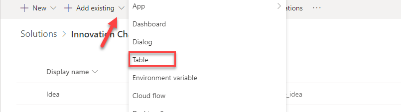
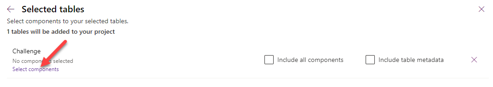
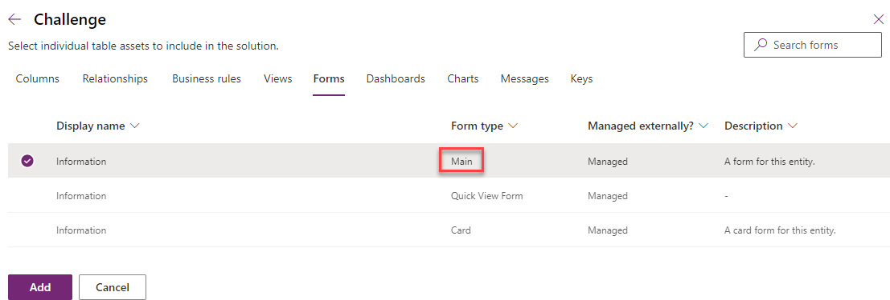
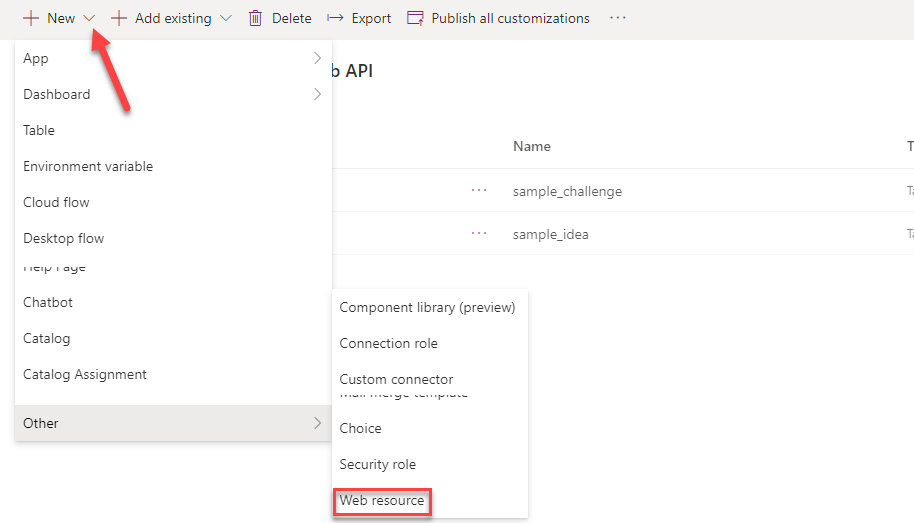
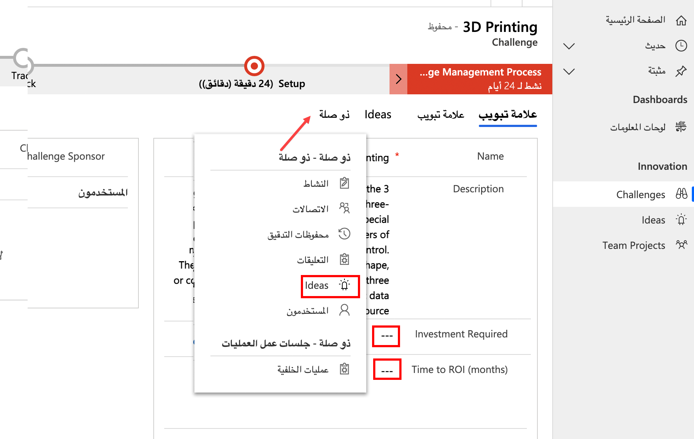

في هذا التمرين، سوف تستخدم البرنامج النصي الخاص بالعميل لتنفيذ متطلبات العمل الخاصة بإنشاء أعمدة في النموذج المطلوب استناداً إلى القيم الموجودة في جدول ذي صلة. وستقوم بتعيين مستوى متطلبات الأعمدة في نموذج الفكرة في عينة تطبيق "تحدي الابتكار" استناداً إلى قيمة الأعمدة في جدول التحدي. لتنفيذ ذلك، سوف تستخدم الطرق Xrm.WebAPI لاسترداد البيانات المرتبطة.

> [!IMPORTANT]
> استخدم بيئة اختبار مع توفير Microsoft Dataverse وعينات التطبيقات الممكنة. إذا لم يكن لديك واحد، فيمكنك الاشتراك في [خطة المجتمع](https://powerapps.microsoft.com/communityplan/?azure-portal=true).

## <a name="task-1---prepare-solution"></a>المهمة 1 - إعداد الحل

في هذه المهمة، ستقوم بإنشاء حل وإضافة الجداول الموجودة إلى الحل وإضافة أعمدة جديدة وإعداد النموذج الرئيسي لأحد الجداول التي أضفتها إلى الحل.

1.  انتقل إلى [مدخل منشئ Power Apps](https://make.powerapps.com/?azure-portal=true) وتأكد من أنك في البيئة الصحيحة التي تم فيها تمكين عينة التطبيقات.

    > [!div class="mx-imgBorder"]
    > [](../media/environment-name.png#lightbox)

1.  حدد **الحلول** وانقر فوق **+ حل جديد**.

1.  أدخل **واجهة API‎ للويب "تحدي الابتكار"** لـ **اسم العرض**، وحدد **ناشر CDS الافتراضي** لـ **الناشر**، ثم انقر فوق **إنشاء**.

    > [!div class="mx-imgBorder"]
    > [](../media/new-solution.png#lightbox)

1.  انقر لفتح حل **واجهة API‎ للويب "تحدي الابتكار"** الذي قمت بإنشائه.

1.  انقر فوق **+ إضافة حالي** وحدد **الجدول‏‎**.

1.  أدخل الفكرة في مربع نص البحث، وحدد **الفكرة**، ثم انقر فوق **التالي**.

    > [!NOTE]
    > إذا لم تتمكن من تحديد موقع جدول **الفكرة**، فقد لا يكون لديك عينات تطبيقات في البيئة الخاصة بك. حدد بيئة أخرى أو قم بإنشاء بيئة جديدة باستخدام عينات التطبيقات المثبتة.

1.  ‏‏انقر **لتحديد المكونات**.

    > [!div class="mx-imgBorder"]
    > [](../media/select-components.png#lightbox)

1.  حدد علامة تبويب **النماذج**، ثم حدد نموذج **معلومات** من أجل **نوع النموذج** الرئيسي، ثم انقر فوق **إضافة**.

    > [!div class="mx-imgBorder"]
    > [](../media/add-component.png#lightbox)

1.  انقر فوق **إضافة** مرة أخرى.

1. انقر فوق **+ إضافة حالي** وحدد **جدول‏‎** مرة أخرى.

    > [!div class="mx-imgBorder"]
    > [](../media/add-existing-table.png#lightbox)

1. أدخل البحث عن التحدي، وحدد **التحدي**، ثم انقر فوق **التالي**.

1. ‏‏انقر **لتحديد المكونات**.

    > [!div class="mx-imgBorder"]
    > [](../media/select-components-button.png#lightbox)

1. حدد علامة تبويب **النماذج**، وحدد نموذج **معلومات** من أجل نوع **النموذج** **رئيسي** وانقر فوق **إضافة**.

    > [!div class="mx-imgBorder"]
    > [](../media/main.png#lightbox)

1. انقر لفتح جدول **التحدي** الذي أضفته إلى الحل للتو.

1. حدد علامة تبويب **الأعمدة** وانقر فوق **+ إضافة عمود**. ستتم إضافة عمودين للإشارة إلى البيانات المطلوبة لصفوف الفكرة التي تم إنشاؤها لهذا التحدي.

    > [!div class="mx-imgBorder"]
    > [](../media/add-column.png#lightbox)

1. أدخل **الاستثمار المطلوب** من أجل **اسم العرض**، وحدد **نعم/لا** من أجل **نوع البيانات** وانقر فوق **تم**. دوِّن **البادئة** الخاصة بـ **الاسم** وستكون البادئة مختلفة؛ ستحتاج إلى ذلك عند إنشاء البرنامج النصي وما سيشير إلى الحقول التي تقوم بإضافتها.

    > [!div class="mx-imgBorder"]
    > [](../media/name.png#lightbox)

1. انقر فوق **+ إضافة عمود** مرة أخرى.

1. أدخل **‏‫عائد الاستثمار‬ المطلوب** من أجل **اسم العرض**، وحدد **نعم/لا** من أجل **نوع البيانات** وانقر فوق **تم**.

1. انقر فوق **حفظ الجدول**

1. حدد علامة تبويب **النماذج** وحدد لفتح نموذج **رئيسي**.

1. حدد علامة تبويب **أعمدة الجدول**.

    > [!div class="mx-imgBorder"]
    > [](../media/table-columns-tab.png#lightbox)

1. أضف عمود **الاستثمار المطلوب** إلى النموذج.

1. أضف **عائد الاستثمار المطلوب** إلى النموذج.

1. يجب أن يبدو النموذج الخاص بك الآن مثل الصورة أدناه. انقر فوق **حفظ**.

    > [!div class="mx-imgBorder"]
    > [](../media/save.png#lightbox)

1. انقر فوق **نشر** وانتظر حتى يكتمل النشر.

1. ارجع إلى الحل بالنقر فوق زر "الرجوع".

    > [!div class="mx-imgBorder"]
    > [](../media/back.png#lightbox)

## <a name="task-2---create-client-script"></a>المهمة 2: إنشاء البرنامج النصي للعميل

في هذه المهمة، ستقوم بإنشاء برنامج نصي سيحدد المستوى المطلوب للأعمدة في جدول الأفكار استناداً إلى قيم عمود جداول التحدي.

1.  بدء مثيل جديد من كود Visual Studio أو استخدام محرر الكود المفضل لديك. يمكنك تنزيل كود [Visual Studio وتثبيته](https://code.visualstudio.com/?azure-portal=true).

1.  انقر فوق **فتح مجلد**.

    > [!div class="mx-imgBorder"]
    > [](../media/open-folder.png#lightbox)

1.  قم بإنشاء مجلد في مجلد المستندات وقم بتسميته **ClientScriptLab‎**.

1.  حدد مجلد **ClientScriptLab‎** الذي قمت بإنشائه ثم انقر فوق **تحديد مجلد**.

    > [!div class="mx-imgBorder"]
    > [](../media/select-folder.png#lightbox)

1.  مرِّر مؤشر الماوس فوق مجلد **CLIENTSCRIPTLAB‎** وانقر فوق **ملف جديد**.

    > [!div class="mx-imgBorder"]
    > [](../media/new-file.png#lightbox)

1.  قم بتسمية الملف **IdeaForm.js**.

1.  أضف الدالات الموجودة أدناه إلى **IdeaForm.js**. يجب أن يكون للدالات أسماء فريدة أو تستخدم مساحة اسم لضمان التفرد.

    ```javascript
    function LearnLab_handleIdeaOnLoad(executionContext) {
    }
    function LearnLab_handleChallengeOnChange(executionContext) {
    }
    ```

1.  أضف البرنامج النصي الوارد أدناه إلى الدالة **OnLoad‎**. يقوم هذا البرنامج النصي بتسجيل معالج الأحداث **OnChange‎**، ويجب عليك التعامل مع التغيير في حالة تغييرات التحدي المرتبط.

    ```javascript
    var formContext = executionContext.getFormContext();
    formContext.getAttribute('sample_originatingchallengeid').addOnChange(LearnLab_handleChallengeOnChange);
    ```

    > [!div class="mx-imgBorder"]
    > [](../media/onload-function.png#lightbox)

1.  أضف البرنامج النصي الوارد أدناه إلى الدالة **OnChange‎**. هذا الكود يحصل ببساطة على formContext.

    ```javascript
    var formContext = executionContext.getFormContext();
    ```

1. أضف الدالة الواردة أدناه إلى ملف **IdeaForm‎**. سيتم استدعاء هذه الدالة من كل من الدالتين OnLoad وOnChange وسيتم تمرير formContext كوسيطة. سيكون هذا هو المكان الذي تقوم فيه بتطبيق منطق الأعمال لتعيين مستويات المتطلبات.

    ```javascript
    function LearnLab_setRequiredFields(formContext) {
    
    }
    ```

1. ستحصل أولاً على قيم البحث عن التحدي. أضف البرنامج النصي الوارد أدناه إلى الدالة **setRequiredFields‎‎**. لقد حصلنا على \'sample\_originatingchallengeid' من خصائص العمود في مستكشف الحلول.

    ```javascript
    var challenge = formContext.getAttribute('sample_originatingchallengeid').getValue();
    ```

1. وبعد ذلك، سيمكنك التحقق مما إذا كانت قيمة **التحدي** فارغة. أضف البرنامج النصي الوارد أدناه إلى الدالة **setRequiredFields‎‎**.

    ```javascript
    if (challenge != null) {
        }
        else{
        }
    ```

1. ستجعل الأعمدة غير مطلوبة إذا كان التحدي فارغاً. أضف البرنامج النصي أدناه داخل **الآخر**. وهذا يضمن أنه إذا لم يتم تحديد التحدي، فلن تكون الأعمدة مطلوبة.

    ```javascript
    formContext.getAttribute("sample_investmentrequired").setRequiredLevel('none');
    formContext.getAttribute("sample_timetoroimonths").setRequiredLevel('none');
    ```

1. يجب أن يبدو **IdeaForm‎** الآن مثل الصورة أدناه.

    > [!div class="mx-imgBorder"]
    > [](../media/idea-form.png#lightbox)

1. ستحصل على معرف **التحدي** المرتبط إذا لم يكن التحدي فارغاً. أضف البرنامج النصي الوارد أدناه جملة **إذا**.

    ```javascript
    var challengeId = challenge[0].id;
    ```

1. ستقوم الآن باسترداد صف التحدي باستخدام **WebAPI‎** وتحديد العمودين اللذين تهتم بهما **InvestmentRequired‎** و **ROIRequired‎**. أضف البرنامج النصي الوارد أدناه داخل جملة "إذا".

    > [!NOTE]
    > استبدل **‎crc8c** بالبادئة الواردة في المهمة 1.

    ```javascript
    Xrm.WebApi.retrieveRecord("sample_challenge", challengeId, "?$select=crc8c_investmentrequired,crc8c_roirequired").then(
                function success(result) {
                     
                },
                function (error) {
                }
            );
    ```


1. في حالة نجاح **retrieveRecord‎**، ستقوم أولاً بإنشاء متغيرين سيحتفظان بقيمة المتطلبات لكلا العمودين وتعيين قيمتهما الأولية إلى "غير مطلوبة"، وبعد ذلك سوف تتحقق مما إذا كانت الأعمدة مطلوبة وتعيين متغير المتطلبات وفقاً لذلك، وفي النهاية ستقوم بتعيين متطلبات العمود إلى قيمة المتغير الذي قمت بإنشائه. أضف البرنامج النصي الوارد أدناه إلى الدالة success.

    > [!NOTE]
    > استبدل **‎crc8c** بالبادئة الواردة في المهمة 1.

    ```javascript
    var investmentRequired = 'none';
    var roiRequired = 'none';
    if (result.crc8c_investmentrequired) {
        investmentRequired = 'required';
    }
    if (result.crc8c_roirequired) {
        roiRequired = 'required';
    
    }
    formContext.getAttribute("sample_investmentrequired").setRequiredLevel(investmentRequired);
    formContext.getAttribute("sample_timetoroimonths").setRequiredLevel(roiRequired);
    ```

1. ستقوم بتسجيل رسالة الخطأ إذا تسببت **retrieveRecord‎** في حدوث خطأ. أضف البرنامج النصي الوارد أدناه إلى الدالة error. يمكنك أيضاً استخدام طرق من Xrm.Navigation لإظهار مربع حوار للمستخدم مع الخيارات المناسبة إذا لزم الأمر.

    ```javascript
    console.log(error.message);
    ```

1. يجب أن تبدو الدالة **LearnLab**\_**setRequiredFileds** الآن مثل الصورة الموضحة أدناه.

    > [!div class="mx-imgBorder"]
    > [](../media/completed-function.png#lightbox)

1. ستقوم باستدعاء **LearnLab**\_**setRequiredFileds** من كلتا الدالتين **OnLoad** و **OnChange**. أضف البرنامج النصي الوارد أدناه إلى الدالتين **OnLoad** و **OnChange**.

    ```javascript
    LearnLab_setRequiredFields(formContext)
    ```

1. يجب أن يبدو **IdeaForm‎** الآن مثل الصورة أدناه.

    > [!div class="mx-imgBorder"]
    > [](../media/completed-idea.png#lightbox)

1. انقر فوق **الملف** و **حفظ الكل**.

## <a name="task-3---upload-the-script"></a>المهمة 3: تحميل النص

في هذه المهمة، ستقوم بتحميل البرنامج النصي الذي قمت بإنشائه إلى البيئة الخاصة بك.

1.  انتقل إلى [Power Apps Maker Portal](https://make.powerapps.com/?azure-portal=true) وتأكد من وجودك في البيئة الصحيحة.

1.  حدد **الحلول** وانقر لفتح حل **واجهة API‎ للويب "تحدي الابتكار"‬‏‫**.

1.  انقر فوق **+ جديد** وحدد **أخرى \|مَورد ويب**.

    > [!div class="mx-imgBorder"]
    > [](../media/web-resource.png#lightbox)

1.  أدخل **IdeaForm.js** على أنه **اسم** وأدخل **IdeaForm.js** على أنه **اسم العرض** وحدد **البرنامج النصي (JScript)** من أجل **النوع**، وانقر فوق **اختيار ملف**.

    > [!div class="mx-imgBorder"]
    > [](../media/choose-file.png#lightbox)

1.  حدد الملف **‎IdeaForm.js** الذي أنشأته سابقاً وانقر فوق **فتح**.

1.  انقر فوق **حفظ**.

1.  أغلق علامة تبويب مستعرض محرر مورد الويب.

1.  انقر فوق **تم**.

1.  يجب أن يحتوي الحل الآن على جدول **التحدي** وجدول الفكرة ومَورد الويب **IdeaForm.js**.

1. لا تخرج من هذه الصفحة.

## <a name="task-4---edit-form"></a>المهمة 4 - تحرير نموذج

في هذه المهمة، ستضيف مكتبة JavaScript إلى نموذج الفكرة الرئيسي وتضيف معالج الأحداث إلى حدث OnLoad.

1.  تأكد من أنك لا تزال في حل **‬‏‫واجهة API‎ للويب "تحدي الابتكار**.

1.  انقر لفتح جدول **الفكرة**.

1.  حدد علامة تبويب **النماذج** وانقر لفتح نموذج **المعلومات** **الرئيسي**.

1.  انتقل إلى جزء **الخصائص** وحدد علامة تبويب **الأحداث** ثم انقر فوق **+ إضافة مكتبة**.

    > [!div class="mx-imgBorder"]
    > [](../media/add-library.png#lightbox)

1.  أدخل الفكرة في مربع نص البحث واضغط على مفتاح الإدخال "Enter". حدد **IdeaForm.js** وانقر فوق **إضافة**.

    > [!div class="mx-imgBorder"]
    > [](../media/add-javascript-library.png#lightbox)

1.  قم بتوسيع القسم **OnLoad** ثم انقر فوق **+ معالج الأحداث**.

    > [!div class="mx-imgBorder"]
    > [](../media/event-handler.png#lightbox)

1.  أدخل **LearnLab\_handleIdeaOnLoad** من أجل **الدالة** وتحقق من خانة الاختيار **‏‫تمرير سياق التنفيذ كمعلمة أولى‬** وانقر فوق **تم**.

    > [!div class="mx-imgBorder"]
    > [](../media/configure-event.png#lightbox)

1.  انقر فوق **حفظ** وانتظر حتى يتم حفظ التغييرات.

1.  انقر فوق زر **رجوع**.

1. حدد **الحلول**.

1. انقر فوق **نشر جميع التخصيصات** وانتظر حتى يكتمل النشر.

## <a name="task-5---test"></a>المهمة 5 - الاختبار

في هذه المهمة، ستختبر البرنامج النصي الخاص بك.

1.  انتقل إلى [Power Apps Maker Portal](https://make.powerapps.com/?azure-portal=true) وتأكد من وجودك في البيئة الصحيحة.

1.  حدد **التطبيقات** وانقر لفتح تطبيق **تحدي الابتكار**.

1.  حدد **التحديات** وانقر لفتح أحد صفوف **التحدي**.

1.  يجب أن يكون **الاستثمار مطلوب** و **عائد الاستثمار مطلوب** فارغين. انقر فوق **ذات صلة** وحدد **الأفكار**.

    > [!div class="mx-imgBorder"]
    > [](../media/related-ideas.png#lightbox)

1.  انقر لفتح إحدى **الأفكار**.

    > [!div class="mx-imgBorder"]
    > [](../media/tiny-homes.png#lightbox)

1.  امسح قيم العمودين **الاستثمار المطلوب** و **الوقت إلى عائد الاستثمار (بالأشهر)**.

1.  الأعمدة غير مطلوبة لأن أعمدة المتطلبات في جدول التحدي فارغة. انقر فوق زر "رجوع".

    > [!div class="mx-imgBorder"]
    > [](../media/back-button.png#lightbox)

1.  حدد علامة تبويب "التفاصيل" وحدد "نعم" لكل من **الاستثمار المطلوب** و **عائد الاستثمار المطلوب**.

    > [!div class="mx-imgBorder"]
    > [](../media/requirements.png#lightbox)

1.  حدد علامة تبويب **الأفكار** وانقر لفتح نفس الفكرة التي قمت بتحديدها في المرة الأخيرة.

1. الآن يجب أن يكون العمودان مطلوبين.

    > [!div class="mx-imgBorder"]
    > [](../media/investment-time.png#lightbox)
