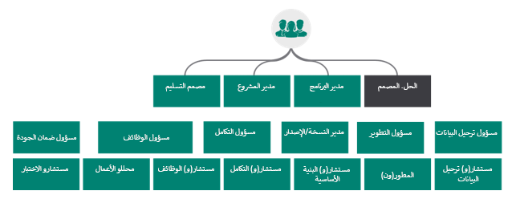

يدير مهندس الحلول عمليات تنفيذ ناجحة ويركّز على الطريقة التي تقوم من خلالها الحلول بمعالجة مجموعة احتياجات الأعمال والاحتياجات التقنية للمؤسسات. يُعد مهندس الحلول عضواً أساسياً في الفريق العام للمشروع.

في المؤسسات الكبيرة، من المحتمل أن يعمل مهندس الحلول مع مهندسي المؤسسة الذين يركزون على الصورة الأكبر. يعتمد مهندس الحلول، في كثير من الأحيان، على مهندس المؤسسة للتأكد من أن الحل الجاري تصميمه يتناسب مع خطط المؤسسة الأوسع.  

> [!VIDEO https://www.microsoft.com/videoplayer/embed/RE4nBsE]

يجب أن تتوفر لدى مهندس الحلول معرفة وظيفية وتقنية بكل من Microsoft Power Platform وتطبيقات Dynamics 365 والحلول السحابية ذات الصلة بـ Microsoft إلى جانب تقنيات أخرى تابعة لجهات خارجية. إحدى المهام الأساسية لمهندس الحلول هي تصور الحلول. تتضمن هذه المهمة بشكل أساسي النظر في المشكلة وتحديد الأجزاء التي يمكنها أن تستفيد من أحد تطبيقات Dynamics 365 والأجزاء التي يجب بناؤها باستخدام Microsoft Power Platform أو Microsoft Azure. تقليدياً، يبدأ المهندس الذي يركز على التطوير بعملية تطوير مخصص وخدمات Microsoft Azure منخفضة المستوى. سيبدأ مهندس الحلول الذي يركز على تطبيق الأعمال بدلاً من ذلك بتطبيقات Dynamics 365 وPower Platform ثم يستخدم Microsoft Azure لمعالجة أي فجوات.

يطبق مهندس الحلول المعرفة والخبرة خلال المشاركة، كما سيقوم بعمل استباقي ووقائي لزيادة قيمة استثمار العميل وتعزيز سلامة المؤسسة. يتطلب هذا الدور القدرة على تحديد الفرص لحل مشاكل الأعمال. غالباً ما يُنظر إلى مهندس الحلول على أنه مستشار موثوق يتشاور مع المؤسسات وأعضاء فريق التنفيذ لتحسين احتياجات العمل في حل محدد جيداً ومعقول التكلفة.    

يجب أن يتمكن مهندسو الحلول من تسهيل قرارات التصميم عبر التطوير والتكوين والتكامل والبنية التحتية والأمان والتوافر والتخزين وإدارة التغيير. يوازن هذا الدور بين احتياجات أعمال المشروع مع تلبية المتطلبات الوظيفية وغير الوظيفية. بالإضافة إلى معرفتهم التقنية، يحتاج مهندسو الحلول إلى القدرة على التعامل مع مستخدمي الأعمال ومتخذي القرار على جميع المستويات. 

يوفر مهندس الحلول التوجيه والدعم الأساسيين اعتباراً من مرحلة ما قبل البيع خلال الفترة المتبقية من دورة حياة المشروع. تختلف الأنشطة الدقيقة من مشروع إلى مشروع ومن مؤسسة إلى مؤسسة. تتم مناقشة الأنشطة الشائعة الأخرى التي ينفذها مهندسو الحلول بمزيد من التفصيل لاحقاً في هذه الوحدة النمطية.

في حين أن مهندسي الحلول هم خبراء متعمقون في جميع المكونات، فمن الشائع أنهم يركزون أكثر على مكون أو مكونين ويعتمدون على أعضاء الفريق الآخرين للمساعدة في تلبية احتياجات الحالات التي تحتاج إلى معارف عميقة. يتميز مهندس الحلول الجيد بمهارات التعاون ضمن الفريق والمؤسسة وعبر المؤسسات كما تقتضي الحاجة.

ستركز هذه الوحدة النمطية على المواضيع التالية:

-   نظرة عامة على تطبيقات Dynamics 365 وMicrosoft Power Platform وMicrosoft Azure، والتي يجب أن تكون ملماً بها كلها

-   المهارات الشخصية لمهندس الحلول

-   الأنشطة الشائعة التي يشارك فيها مهندس الحلول مع تقدم المشروع

-   ركائز هندسة تطبيقات الأعمال جيدة التنظيم
