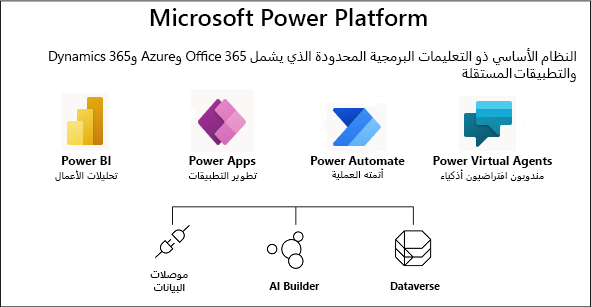

يجب أن يكون مهندس الحلول على علم بتقنيات الأجهزة الطرفية، بالإضافة إلى التطبيقات المستهدفة مباشرة. توضح القائمة التالية التقنيات والتطبيقات التي يجب أن يكون مهندس الحلول على علم بها عند تنفيذ تطبيقات Microsoft Power Platform وتطبيقات Dynamics 365. هذه القائمة غير مكتملة وستتغير بمرور الوقت، لكنها أساس لمهندسي الحلول. وبشكل عام، سيستفيد للمهندس المعماري من واحدة أو اثنين من هذه التقنيات والتطبيقات لكنها ستحتاج إلى معرفة كل منها للنجاح.

## Microsoft Power Platform

Microsoft Power Platform عبارة عن نظام أساسي لتطبيقات الأعمال يساعد في دعم Microsoft 365 وDynamics 365 وAzure وتوسيعها، بالإضافة إلى خدمات وتطبيقات تابعة لطرف خارجي. توفر Microsoft Power Platform التنفيذ التلقائي للتعليمات البرمجية المنخفضة والتطبيقات القابلة للتنفيذ والمستندة إلى البيانات ومنطق الأعمال القابل للتخصيص والذي يمكنه تحسين العمليات التجارية وأنظمتها ومهام سير العمل. بالإضافة إلى التنفيذ التلقائي للتعليمات البرمجية المنخفضة، يمكن للمطورين المحترفين استخدام الكود لزيادة قدرات النظام الأساسي.

### Power BI

البيانات في كل مكان. يساعد Power BI الأشخاص في استغلال هذه البيانات في الرؤى القابلة للتنفيذ. يتصل Power BI بمئات من مصادر البيانات باستخدام موصلات قياسية ومصادر بيانات غير محدودة تقريباً باستخدام موصلات مخصصة.
يحتوي Power BI على لوحات المعلومات والإطارات المتجانبة لإنشاء الرسوم المرئية باستخدام كل من الأدوات المستندة إلى المستعرض وأدوات سطح المكتب. يمكن تضمين الإطارات المتجانبة Power BI في Power Apps ويمكن تضمين Power Apps في لوحة معلومات Power BI.

### Power Apps

هناك ثلاثة أنواع من Power Apps هي: التطبيقات المستندة إلى النموذج وتطبيقات اللوحة والمداخل. تبدأ التطبيقات التي تستند إلى النموذج بالبيانات، وتحديداً نموذج البيانات. ستستخدم تطبيقات اللوحة بيانات المستخدم بالتأكيد ولكنها تبدأ بإنشاء تجربة المستخدم على اللوحة. توفر مداخل Power Apps تجربة استخدام موقع الويب للمستخدمين الخارجيين للتعامل مع بيانات Dataverse.

باستخدام تطبيقات اللوحة، يمكنك تصميم تطبيق الأعمال وإنشائه من لوحة في Microsoft Power Apps دون كتابة تعليمات برمجية بلغة برمجة تقليدية مثل C#. صمم التطبيق عن طريق سحب العناصر وإفلاتها على اللوحة.

تصميم التطبيق المستند إلى النموذج هو نهج يركز على المكونات لتطوير التطبيق. لا يتطلب تصميم التطبيق المستند إلى النموذج كوداً، ويمكن أن تكون التطبيقات التي تقوم بإجرائها بسيطة أو معقدة. على عكس تطوير تطبيق اللوحة حيث يتمتع المصمم بالتحكم الكامل في تخطيط التطبيق، فإنه في التطبيقات المستندة إلى النموذج يتم تحديد جزء كبير من التخطيط لك والذي تم تصميمه من خلال المكونات التي تضيفها إلى التطبيق.

تسمح مداخل Power Apps للمنشئين بتأسيس موقع ويب وصفحات ويب مقابلة باستخدام تقنيات الويب القياسية مثل HTML وكذلك CSS. يمكن أن تحتوي صفحات ويب الخاصة بالمدخل على مكونات لعرض بيانات Dataverse من خلال القوائم والنماذج استناداً إلى طرق العرض والنماذج المستندة إلى النموذج. تقوم مداخل Power Apps أيضاً بتوظيف نموذج المصادقة وإذن الكيان لحماية البيانات الخاصة والحساسة.

### Power Automate

يضفي Power Automate الطابع الديموقراطي على الأتمتة الذكية من خلال تمكين الجميع، من المستخدمين النهائيين إلى الخبراء في صدارة التكنولوجيا لبناء التدفقات الآلية بسلاسة. يقوم بإحضار التنفيذ التلقائي المستند إلى واجهة المستخدم مع التنفيذ التلقائي المستند إلى API. وباستخدام Power Automate، يمكن للمستخدمين ومطوري الأكواد العالية إنشاء التنفيذ التلقائي في تطبيقات الأعمال الخاصة بهم.

### موصلات البيانات

وتكون البيانات هي أساس معظم التطبيقات، بما في ذلك تلك التي تقوم بإنشائها في Power Apps. يتم تخزين البيانات في مصدر بيانات، وتقوم بإحضار هذه البيانات إلى تطبيقك عن طريق إنشاء اتصال. يستخدم الاتصال موصلاً محدداً للتحدث إلى مصدر البيانات. تحتوي Microsoft Power Platform على موصلات للعديد من الخدمات الشائعة ومصادر البيانات المحلية، بما في ذلك SharePoint وSQL Server وMicrosoft 365 وSalesforce وTwitter. قد يوفر الموصل جداول بيانات أو إجراءات. توفر بعض الموصلات الجداول فقط، والبعض الآخر يوفر الإجراءات فقط بينما يقوم الآخرون بتقديم كليهما. قد يكون الموصل الخاص بك قياسياً أو مخصصاً.

### AI Builder

لا تقوم كل مؤسسة بتوظيف عالم بيانات. باستخدام AI Builder، يمكنك جلب الذكاء الاصطناعي إلى كل مؤسسة للسماح لها بالحصول على مزيد من المعرفة بالبيانات الموجودة لديها بالفعل. يقدم AI Builder كلاً من نماذج مدربة مسبقاً ونماذج يمكن تدريبها. يتطلب AI Builder Dataverse للعمل ويكون متاحاً فقط مع Power Apps وكذلك Power Automate.

### Microsoft Dataverse

يُتيح لك Dataverse تخزين البيانات التي تستخدمها تطبيقات أعمالك وإدارتها. يتم تخزين البيانات داخل Dataverse داخل مجموعة من الكيانات. يتضمن Dataverse مجموعة أساسية من الكيانات القياسية التي تغطي سيناريوهات نموذجية، ولكن يمكنك أيضاً إنشاء كيانات مخصصة خاصة بمؤسستك.

### Power Virtual Agents

تعمل شركة Microsoft على Power Virtual Agents تحسين رضا العملاء والموظفين، وتقليل تكاليف الدعم وتعزيز إنتاجية الموظفين بقوة الذكاء الاصطناعي. تمكين مستخدمي الأعمال من خلال توفير حل سهل الاستخدام لإنشاء وكلاء/روبوتات وإدارتها دون الحاجة إلى كتابة الكود. تستخدم Power Virtual Agents المستندة إلى SaaS مرونة وقابلية توسع Microsoft Power Platform مع قوة الذكاء الاصطناعي لتوفير حل قابل للتوسع وقابل للتخصيص ومناسب لأي سيناريو لخدمة العملاء.

## تطبيقات Dynamics 365 المستندة إلى النماذج

تطبيقات Dynamics 365 المستندة إلى النماذج مشتقة من إدارة علاقة العميل (CRM). تطبيقات Dynamics 365 عبارة عن تطبيقات تستند إلى نموذج تم إنشاؤها على نظام Dataverse الأساسي.

- **Dynamics 365 Sales** - تمكّنك من بناء علاقات قوية مع عملائك واتخاذ الإجراءات بناءً على الرؤى وإغلاق المبيعات بشكل أسرع.
استخدم Dynamics 365 Sales لتعقب حساباتك وجهات الاتصال الخاصة بك وتعزيز مبيعاتك من العميل المتوقع إلى الأمر وإنشاء ضمانات المبيعات وإنشاء قوائم التسويق والحملات وحتى متابعة حالات الخدمة المرتبطة بحسابات أو فرص معينة.

- **Dynamics 365 Customer Service** - تتيح لك كسب العملاء مدى الحياة. قم ببناء علاقات عملاء رائعة من خلال التركيز على رضا العملاء الأمثل من خلال تطبيقات خدمة العملاء. توفر خدمة العملاء العديد من المزايا والأدوات التي يمكنك استخدامها لإدارة الخدمات التي تقدمها للعملاء.

- **Dynamics 365 Field Service** - تساعدك على تقديم الخدمة في الموقع لمواقع العملاء. يجمع التطبيق بين أتمتة سير العمل وخوارزميات الجدولة والتنقل لإعداد العمال المتنقلين للنجاح عندم وجودهم في الموقع مع العملاء لإصلاح المشكلات.

- **Dynamics 365 Marketing** - هو تطبيق للتسويق الآلي يساعد على تحويل العملاء المحتملين إلى علاقات عمل. يمتاز التطبيق بسهولة استخدامه ويعمل بطريقة سلسلة مع Dynamics 365 for Sales، ويتضمن المعلومات المهنية المدمجة فيه. استخدم Dynamics 365 Marketing لإنشاء رسالة البريد الإلكتروني الرسومية ومشاركة المعلومات عبر فرق المبيعات والتسويق والمزيد.

## تطبيقات Finance and Operations

تطبيقات Dynamics 365 التالية مشتقة من تخطيط موارد المؤسسات (ERP):

- **Dynamics 365 Commerce** - يقدم حل القناة متعددة الاتجاهات الذي يوحد المكتب الخلفي والمتجر ومركز الاتصال والتجارب الرقمية. يُمكّنك Dynamics 365 Commerce من بناء ولاء للعلامة التجارية من خلال مشاركات العملاء المخصصة وزيادة الإيرادات من خلال تحسين إنتاجية الموظفين وتحسين العمليات لتقليل التكاليف وتعزيز كفاءة سلسلة التوريد مما يؤدي في النهاية إلى تحقيق نتائج أعمال أفضل.

- **Dynamics 365 Finance** - يساعدك على أتمتة وتحديث عملياتك المالية العالمية. راقب الأداء في الوقت الفعلي وتوقع النتائج المستقبلية واتخذ قرارات تعتمد على البيانات لدفع نمو الأعمال. استخدم Dynamics 365 Finance لتوجيه القرارات المالية الإستراتيجية بالذكاء الاصطناعي وتوحيد العمليات المالية وأتمتتها وتقليل النفقات التشغيلية وتقليل التعقيد المالي العالمي والمخاطر.

- **Dynamics 365 Human Resources** (المعروفة سابقاً باسم Dynamics 365 Talent) - يعمل على تبسيط العديد من المهام الروتينية المتعلقة بحفظ السجلات ويعمل على أتمتة العديد من العمليات المتعلقة بتعيين الموظفين في مؤسستك. تشمل هذه العمليات الاحتفاظ بالموظفين وإدارة المزايا والتدريب ومراجعات الأداء وإدارة التغيير. كما يوفر أيضاً إطار عمل لموظفي الموارد البشرية لإدارة مجالات الرقابة.

- **Dynamics 365 Supply Chain Management** - يساعدك على تحويل عمليات التصنيع وسلسلة التوريد الخاصة بك. استخدم الذكاء التنبؤي والذكاء من AI وإنترنت الأشياء (IoT) عبر التخطيط والإنتاج والمخزون والمخازن وإدارة النقل لزيادة الكفاءة التشغيلية وجودة المنتج والربحية. استخدم Dynamics 365 Supply Chain Management للابتكار من خلال عمليات التصنيع الذكية وتحديث إدارة المستودعات وتحسين أداء الإنتاج وزيادة رفع أصولك إلى الحد الأقصى وأتمتة سلسلة التوريد الخاصة بك وتبسيطها.

## الخدمات والمنتجات الإضافية

توضح القائمة التالية المنتجات والخدمات الإضافية التي يجب أن يكون مهندسو الحلول على دراية بها:

- **AppSource** يقوم موردي البرامج المستقلين (ISVs) ببناء المنتجات وتقديم الخدمات عبر AppSource. قد تجد حلاً يقلل من العمل المطلوب للحل الذي تطلبه وباستخدام AppSource تم التحقق من المنتجات والخدمات من خلال Microsoft.

- **Azure DevOps** - مجمع التطوير (Dev) والعمليات (Ops) ،DevOps هو اتحاد الأشخاص والعمليات والتكنولوجيا لتقديم القيمة للعملاء باستمرار. يتيح Azure DevOps الأدوار المنعزلة سابقاً والتطوير وعمليات تكنولوجيا المعلومات وهندسة الجودة والأمان للتنسيق والتعاون لإنتاج منتجات أفضل وأكثر موثوقية.

- **Dynamics 365 Customer Insights** - استخدم نظاماً أساسياً لبيانات العملاء سهل الاستخدام ومرناً لإطلاق العنان للرؤى وتعزيز تجارب العملاء المخصصة. قم بتوحيد جميع بيانات العملاء عبر مجموعة كاملة من المصادر للحصول على عرض واحد للعملاء.

- **Dynamics 365 Fraud Protection** - يساعد على حماية أعمال التجارة الإلكترونية وعملائك من الاحتيال للمساعدة في تقليل التكاليف وتحقيق إيرادات أعلى وتحسين تجربة تسوق العملاء.

- **Dynamics 365 Layout**-تصميم المساحات بكفاءة أكبر. خذ التصميمات الفعلية من المفهوم لإكمالها بثقة. يساعدك Dynamics 365 Layout على اتخاذ قرارات مدروسة قبل البناء.

- **Dynamics 365 Remote Assist** - العمل معاً من أي مكان. قم بتمكين الفنيين للتعاون بشكل أكثر كفاءة من خلال العمل معاً من مواقع مختلفة باستخدام Dynamics 365 Remote Assist على HoloLens, Android، أو أجهزة iOS.

- **Dynamics 365 Customer Voice** - يتيح لك الحصول على ملاحظات العملاء والموظفين وتحليلها والتصرف بناءً عليها من خلال حل مسح مؤسسي بسيط ولكن فعال.

- **الواقع المختلط** - هو نتيجة لمزج العالم المادي مع العالم الرقمي. وهو يمثل التطور التالي في التفاعل البشري والحاسوبي والبيئي يطلق العنان لإمكانيات كانت في السابق مقتصرة على خيالنا. أصبح ذلك ممكناً من خلال التقدم في رؤية الكمبيوتر وقوة المعالجة الرسومية وتكنولوجيا العرض وأنظمة الإدخال.

