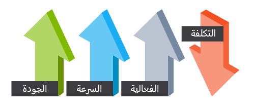

غيّرت السحابة طريقة تصميم تطبيقات الأعمال الخاصة بالمؤسسات وتنفيذها. نتيجة لذلك، يمكن الآن تجميع هياكل الحلول معًا من واحدة أو أكثر من خدمات SaaS التي تعمل معًا لتشكيل حل كامل. يجب أن يتمتع مهندسو الحلول بالراحة في استخدام الخدمات التالية لبناء حلهم الشامل، في إطار حل مشكلات عمل العميل:

-   Dynamics 365

-   Microsoft 365

-   AppSource

-   التوسيع باستخدام Microsoft Power Platform

-   Microsoft Azure (تستخدم لتعبئة الفجوات المتبقية)

### تصميم حل تطبيق أعمال رائع

سيتم تطبيق مفاهيم معينة، بغض النظر عن تحديات العميل الفريدة التي تحلها، برغم عدم وجود مخطط واحد لتوضيح شكل هندسة حلول تطبيقات الأعمال الرائعة. سيساعدك التركيز على هذه المفاهيم على بناء حلول شاملة أفضل، بينما لا تقدم الأقسام التالية قائمة كاملة.

### الأمان

من الضروري ضمان الاستخدام السليم والوصول إلى البيانات، حيث تمثل تلك البيانات واحدة من أكثر الأصول قيمة لأي مؤسسة. في الركيزة *الأمان*، ستركز على تأمين الوصول إلى بنيتك الخاصة من خلال المصادقة وحماية تطبيقك وبياناتك من نقاط ضعف الشبكة. لتمكين ميزات مثل سياسات منع فقدان البيانات والوصول المشروط إلى Azure، تتضمن هذه العملية التأكد أنك تعمل مع الفرق المناسبة. بالإضافة إلى ذلك، ولضمان عدم وقوع الوصول إلى البيانات والخدمات في الأيدي الخطأ، ستؤكد الاستخدام المناسب لحل الأسرار والشهادات والتقنيات الأخرى.

بدءًا بالتصميم والتنفيذ وانتهاءً بالنشر والعمليات، يجب أن تفكر في الأمان طوال دورة حياة التطبيق بالكامل.

يجب عليك التأكد من وصول المستخدمين المناسبين فقط، إذ يعهد العملاء ببياناتهم إلى مؤسستك. يجب عليك تنفيذ نموذج أمان يفرض الوصول إلى البيانات التي يُسمح للمستخدمين باستخدامها، وذلك بجانب التحكم في المحيط من خلال المصادقة. يجب عليك التأكد أن الهياكل الأمنية التي تم إنشاؤها لا تضع عبئًا لا داعي له على المهندسين لديك وتمنع الموظفين من القيام بعملهم، مما يجعل النظام غير قابل للاستمرار.

### تمكين المستخدمين النهائيين

يجب أن تكون مراعاة طريقة تمكين المؤسسة الكاملة للابتكار وإنشاء الملحقات اللازمة لهم لتكون مرتكزة إلى أي بنية حل تتمحور حول Microsoft Power Platform. فكّر في كيفية تشجيع الممارسة وإنشاء حواجز حماية كجزء من بنيتك لمنع الأدوات من التسبب في المشكلات، بدلاً من التفكير في طريقة تأمين بنية الحل لمنع المستخدمين المبدعين من إنشاء أدواتهم الخاصة. يمكن أن يتضمن هذا النهج غالبًا توفير موصلات تركز على المستخدم أو مكونات Power Apps القابلة لإعادة الاستخدام حيث يمكن للأشخاص استخدامها لإنشاء أدواتهم الخاصة بسرعة لمساعدتهم في إنتاجيتهم اليومية. يمكن للقوالب وتطبيقات المبتدئين وحتى المساعدة في إنشاء مركز امتياز باستخدام مجموعة أدوات البدء التي توفرها Microsoft أن تقطع شوطًا طويلاً في المساعدة على تعزيز تمكين المستخدم.

### الثقة والخصوصية

يمكن أن تختلف متطلبات الامتثال اختلافًا كبيرًا من صناعة إلى أخرى وعبر المواقع الجغرافية. تضمن بنيات الحلول الاستثنائية أن تفي حلولها بمتطلباتها. يجب على مهندسي الحلول اتخاذ خطوات للتأكد من أن البنيات التي ينشئونها تنفذ الجوانب الضرورية، ورغم ذلك توفر Microsoft الأدوات والإمكانيات لمساعدة العملاء على تنفيذ الحلول المتوافقة. يتضمن هذا التحقق التأكد من إمكانية معالجة طلبات تنظيم الخصوصية من قِبل المؤسسات. تنشر Microsoft[مركز ثقة](https://www.microsoft.com/trust-center/?azure-portal=true) يجب أن يكون مهندسو الحلول على دراية به. لكلٍّ من منتجات Microsoft التي يستخدمها مهندسو الحلول، سيساعدهم مركز التوثيق في تحديد الشهادات والإمكانيات.

### استدامة الحل الشامل

بدلاً من التعليمات البرمجية المخصصة التي يصعب صيانتها وتكلفتها أكثر، يجب أن يركز مهندسو الحلول على حل التحديات باستخدام إمكانيات التخصيص للنظام الأساسي والتطبيقات. لضمان أن التحديثات لا تفسد حلول المهندسين، يتم تحديث Microsoft Power Platform بانتظام، ويجب على هؤلاء المهندسين التأكيد على استخدام التخصيصات المدعومة فقط.
حتى يكون إنجاز الصيانة المستقبلية أسهل، يجب على مهندس الحلول بالإضافة إلى ذلك التأكد أن الهندسة المعمارية والتطبيقات الفنية موثقة والتعليق عليها. يجب أن يسعى مهندسو الحلول إلى تقليل الديون التقنية التي قد تتطلب تنظيفًا في المستقبل.

### التوافر والاسترداد

أسوأ مخاوف المهندس المعماري هو فشل الحل مع عدم وجود طريقة لتلافي الأمر. تم تصميم بيئة السحابة الناجحة بطريقة تتوقع الفشل على جميع المستويات. جزء من توقع هذه الإخفاقات هو تصميم نظام يمكنه التعافي من الكوارث في غضون الوقت الذي يطلبه أصحاب المصلحة والعملاء. يجب أن يكون مهندسو الحلول على دراية بكلٍّ من التطبيقات المضمنة في حلولهم وإمكانيات الاسترداد الخاصة بهم. للتأكد أن أحد المكونات لن يتسبب في فشل الحل بالكامل دون داع، يجب أن تحظى عمليات التكامل عبر حدود النظام باهتمام إضافي. يجب على مهندسي الحلول التوصية بحلول المراقبة وتوفير أدوات استباقية للسماح بقياس المشكلات والتفاعل معها.

### الأداء وقابلية التوسع

يجب أن تتوافق البنية بشكل صحيح مع قدرة الموارد مع الطلب، وذلك لتعمل بشكل جيد وتكون قابلة للتطوير. تقليديًا، واستنادًا إلى النشاط في التطبيق، تقوم البنى السحابية بذلك عن طريق توسيع نطاق التطبيقات ديناميكيًا. يجب أن يساعد مهندس الحلول فريق التشغيل في تحديد السعة المطلوبة للمكونات التي تشكل بنية الحل. يتحمل المهندس المعماري المسؤولية عن تضمين المكونات التي يمكن أن تلبي متطلبات المستخدم لوقت الاستجابة للأجزاء الهامة من النظام.

### الكفاءة والعمليات

سترغب في تصميم بيئة السحابة الخاصة بك بحيث تكون بسيطة التكلفة للعمل والتطوير. للتأكد أنك تنفق الأموال في مكانها بتحقيق أقصى استفادة منها، يجب تحديد عدم الكفاءة والهدر في الإنفاق على السحابة. حتى تتمكن من اكتشاف حالات الفشل والمشكلات قبل حدوثها أو، على الأقل، قبل أن يلاحظ عملاؤك، يجب أن يكون لديك بنية مراقبة جيدة ومناسبة. عندما تكون البيانات الأولية موجودة في خدمة فردية واحدة أو أكثر، يمكن أن تمثل هذه العملية تحديًا لأي مهندس حلول. يجب أن يكون لديك إطار عمل قوي للمراقبة، للحصول على بعض الرؤية حول كيفية استخدام التطبيق الخاص بك لموارده المتاحة.

### المسؤولية المشتركة

يقدم الانتقال إلى السحابة نموذجًا للمسؤولية المشتركة. في هذا النموذج، سيقوم موفر السحابة الخاص بك بإدارة جوانب معينة من تطبيقك، الأمر الذي يترك لك المسؤولية المتبقية. تتحمل المسؤولية عن كل شيء في أية بيئة محلية. ستلعب هذه المسؤولية المشتركة دورًا في قراراتك الهندسية لأنها يمكن أن يكون لها آثار على التكلفة والقدرات التشغيلية والأمان والإمكانيات التقنية لتطبيقك. يمكنك التركيز على تحقيق قيمة لعملك والابتعاد عن الأنشطة التي ليست دالة عمل أساسية، وذلك من خلال تحويل هذه المسؤوليات إلى مقدم الخدمة لديك.

### اختيارات التصميم

في بنية مثالية، يمكنك بناء بيئة ممكنة أكثر أمانًا وعالية الأداء ومتاحة للغاية وفعّالة.
ومع ذلك، فهناك مفاضلات كما هو الحال مع كل شيء. ينطوي إنشاء بيئة على أعلى مستوى من كل هذه الركائز على تكلفة عالية. قد تكون هذه التكلفة بالمال الفعلي، أو وقت التسليم، أو مرونة الحركة التشغيلية. سيكون لكل مؤسسة أولويات مختلفة ستؤثر على خيارات التصميم التي يتم إجراؤها في كل ركيزة. ستحتاج إلى تحديد المفاضلات المقبولة وغير المقبولة أثناء تصميمك للحل الهندسي لديك.

يجب أن تضع في اعتبارك العديد من الاعتبارات عند إنشاء بنية حلول تطبيقات الأعمال. تريد أن تكون البنية الخاصة بك آمنة وقابلة للتطوير ومتاحة وقابلة للاسترداد. تحتاج إلى اتخاذ قرارات بناءً على التكلفة والأولويات التنظيمية والمخاطر لتحقيق هذا الهدف.
