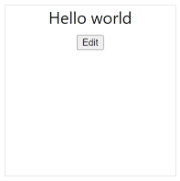

يوفر Power Apps وظائف متعددة جاهزة للاستخدام من قبل منشئي التطبيقات لمساعدتهم في إنشاء تطبيقاتهم، ولكن قد تبرز في بعض الأحيان الحاجة إلى إنشاء واجهة مستخدم لم يتم توفيرها. قد تكون الأمثلة استبدال قيمة نسبة مئوية بمقياس، أو عرض كود شريطي بدلاً من معرف، أو استبدال عناصر تحكم موجودة بعناصر تتميز بوظائف أكثر - مثل طريقة عرض شبكة السحب والإفلات. يمكنك أيضاً أن تجعل Power Apps component framework يلتف حول مكونات موجودة قمت بكتابتها في إطارات عمل ويب أخرى، مثل React أو Angular.

يتيح لك إنشاء هذه المكونات استخدام النطاق الكامل للنظام البيئي الحديث لتطوير الويب: المكتبات وأطر العمل وأدوات أخرى قد تكون ملماً بها، وحزم هذه القدرة في نموذج يسمح لمنشئي التطبيقات بإنشاء تطبيقات باستخدام تعليماتك البرمجية، كما لو كان الأمر يتعلق بجزء جاهز للاستخدام من النظام الأساسي.

> [!NOTE]
> يمكنك العثور على عينات مكونات أخرى — بما في ذلك المكونات التي تستخدم Angular أو React—[في وثائقنا](/power-apps/developer/component-framework/use-sample-components).

يُشار تكراراً إلى مكونات Power Apps المخصصة باعتبارها *مكونات تعليمات البرمجية* لأنها تتطلب تعليمات برمجية مخصصة لتنفيذها. إنها تتكوّن من ثلاثة عناصر: البيان والتطبيق والموارد. في التمرين التالي، ستقوم بكتابة مكون تعليمات برمجية مخصصة: رسالة Hello world ستشبه الصورة التالية.



سيصغي هذا المكون إلى التغييرات الواردة من التطبيق المضيف، ويسمح للمستخدم بإجراء التغييرات التي يتم عندئذٍ دفعها إلى التطبيق المضيف. ستساعدك الخطوات التالية في بناء هذا المكون.

### <a name="install-power-apps-cli"></a>تثبيت Power Apps CLI

لإعداد الكمبيوتر لإنشاء مكونات التعليمات البرمجية، اتبع الخطوات التالية:

1.  ثبّت [Npm](https://www.npmjs.com/get-npm/?azure-portal=true) (يأتي مع Node.js) أو [Node.js](https://nodejs.org/en/?azure-portal=true) (يأتي مع npm). نوصي باستخدام الإصدار 10.15.3 من LTS (دعم طويل الأمد) أو إصدار أعلى.

2.  ثبّت [Visual Studio Code](https://code.visualstudio.com/Download/?azure-portal=true).

4.  ثبّت [ملحق Power Platform Tools](https://marketplace.visualstudio.com/items?itemName=microsoft-IsvExpTools.powerplatform-vscode).

### <a name="create-a-new-component-project"></a>إنشاء مشروع مكون جديد
لإنشاء مشروع مكون جديد، اتبع هذه الخطوات:

أنشئ دليلاً\'ستنشئ فيه مكوناً خاصاً بك. في هذه العينة،\'ستضع المكون في **C:\\source\\hello-pcf**؛ ومع ذلك، يمكنك إنشاء دليلك الخاص. لإنشاء دليلك الخاص،\'ستستخدم Visual Studio Code.

1.  ابدأ تشغيل Visual Studio Code.

2.  حدد **وحدة طرفية** ثم حدد **وحدة طرفية جديدة**.

    > [!div class="mx-imgBorder"]
    > 

3.  قم بتغيير الدليل إلى المجلد المصدر.

    ```console
    cd source
    ```

4.  من الدليل المصدر، أنشئ دليلاً باسم **hello-pcf**.

    ```console
    md hello-pcf
    ```

5.  غيّر الدليل إلى hello-pcf.

    ```console
    cd hello-pcf
    ```

    > [!div class="mx-imgBorder"]
    > 

2.  قم بتهيئة مشروع المكون باستخدام Power Platform CLI بواسطة الأمر التالي:

    ```
    pac pcf init --namespace SampleNamespace --name HelloPCF --template field
    ```

    تظهر الصورة التالية مثالاً عن الإخراج الذي يجب أن تراه.

    [](../media/terminal-pcf.png#lightbox)

3.  ثبّت أدوات بناء المشروع باستخدام الأمر `npm install`. قد تظهر بعض التحذيرات المعروضة؛ ولكن، يمكنك تجاهلها.

    ```
    npm install
    ```
    [](../media/npm-install.png#lightbox)

4.  شغّل الأمر أدناه لفتح المشروع في Visual Studio Code.

    ```
    code -a .
    ```

5.  يجب أن تبدو محتويات المشروع مثل الصورة أدناه.

    

### <a name="update-your-code-components-manifest"></a>تحديث بيان مكون التعليمات البرمجية

حدّث البيان لتمثيل عنصر التحكم بدقة.

1.  وسّع المجلد **HelloPCF** وافتح الملف **ControlManifest.Input.xml**.

    

2.  غيّر الإصدار إلى **1.0.0** وdescription-key إلى **Says hello**.

    [](../media/change-version.png#lightbox)

1.  حدد موقع العقدة <property.

1.  غيّر قيمة الاسم إلى **الاسم** وdisplay-name-key إلى **الاسم‏‎** وdescription-key إلى **اسم**.

    [](../media/change-name.png#lightbox)

1.  حدد موقع عقدة <resources\.

1.  ضمّن مرجعاً إلى ملف CSS يسمى *hello-pcf.css* ستقوم بإنشائه.

    ```css
    <css path="css/hello-pcf.css" order="1" />
    ```

    

1. احفظ تغييراتك عن طريق تحديد **ملف** ثم **حفظ**.

### <a name="add-styling-to-your-code-component"></a>إضافة تصميم إلى مكون التعليمات البرمجية‬

لإضافة تصميم إلى مكون التعليمات البرمجية‬، اتبع الخطوات الآتية:

1.  تأكد من تحديد الملف **ControlManifest.Input.xml** ثم حدد **مجلد جديد**.

    

2.  قم بتسمية المجلد الجديد **css**.

3.  حدد المجلد **css** الذي أنشأته وحدد **ملف جديد**.

4.  قم بتسمية الملف الجديد **hello-pcf.css**.

11. افتح الملف الجديد hello-pcf.css الذي أنشأته، والصق القصاصة البرمجية CSS التالية.

    ```css
    .SampleNamespace\.HelloPCF {
          font-size: 1.5em;
        }
    ```

12. يجب أن يبدو محتوى ملف CSS الآن مثل الصورة أدناه.

    

13. حدد **ملف**، ثم حدد **حفظ**.

### <a name="build-your-code-component"></a>إنشاء مكون التعليمات البرمجية

قبل أن تتمكن من تطبيق منطق المكون، تحتاج إلى تشغيل بنية على المكون. يؤدي ذلك إلى التأكد من إنشاء أنواع TypeScript الصحيحة لمطابقة الخصائص في مستند ControlManifest.xml.

عد إلى الوحدة الطرفية وأنشئ مشروعك باستخدام الأمر التالي.

```
npm run build
```

يتم تحويل المكون برمجياً في الدليل out/controls/HelloPCF. تتضمن البيانات الاصطناعية للبنية:

-   مجلد **css**

-   **bundle.js** - التعليمات البرمجية المصدر المجمعة للمكون

-   **ControlManifest.xml** - ملف البيان الفعلي الخاص بالمكون الذي يتم تحميله إلى مؤسسة Microsoft Dataverse

    

### <a name="implement-your-code-components-logic"></a>تنفيذ منطق مكون التعليمات البرمجية

لتنفيذ منطق مكون التعليمات البرمجية، اتبع الخطوات التالية:

1.  افتح الملف **index.ts**.

1. فوق الأسلوب **constructor**، أدخل المتغيرات الخاصة التالية:

    ```csharp
    // The PCF context object\
    private context: ComponentFramework.Context<IInputs>;
    // The wrapper div element for the component\
    private container: HTMLDivElement;
    // The callback function to call whenever your code has made a change to a bound or output property\
    private notifyOutputChanged: () => void;
    // Flag to track if the component is in edit mode or not\
    private isEditMode: boolean;
    // Tracks the event handler so we can destroy it when done\
    private buttonClickHandler: EventListener;
    // Tracking variable for the name property\
    private name: string | null;
    ```

    

1. حدد موقع الأسلوب **init** واستبدله بالأسلوب أدناه.

    ```csharp
    public init(context: ComponentFramework.Context<IInputs>, notifyOutputChanged: () => void, state: ComponentFramework.Dictionary, container: HTMLDivElement) {

    // Track all the things

    this.context = context;
    
    this.notifyOutputChanged = notifyOutputChanged;
    
    this.container = container;
    
    this.isEditMode = false;
    
    this.buttonClickHandler = this.buttonClickHandler.bind(this);
    
    }
    ```

1. أضف القصاصة البرمجية أدناه إلى الأسلوب **init‎**. سوف تنشئ القصاصة البرمجية هذه النطاق الذي سيحتوي علي رسالة الترحيب.

    ```csharp
    // Create the span element to hold the hello message
    
    const message = document.createElement("span");
    
    message.innerText = `Hello ${this.isEditMode ? "" :context.parameters.Name.raw}`;
    ```

1. أضف القصاصة البرمجية أدناه إلى الأسلوب **init‎**. ستقوم هذه التعليمات البرمجية بإنشاء مربع نص لتحرير الاسم.

    ```csharp
    // Create the textbox to edit the name
    
    const textbox = document.createElement("input");
    
    textbox.type = "text";
    
    textbox.style.display = this.isEditMode ? "block" : "none";
    ```

1. أضف عبارة if التالية إلى الأسلوب **init‎**.

    ```csharp
    if (context.parameters.Name.raw) {
    }
    ```

1. أضف القصاصة البرمجية أدناه داخل عبارة **if‎**. ستقوم هذه القصاصة البرمجية بتعيين قيمة مربع النص وبتضمين مربع النص والرسالة في div.

    ```csharp
    textbox.value = context.parameters.Name.raw;
    
    // Wrap the two above elements in a div to box out the content
    
    const messageContainer = document.createElement("div");
    
    messageContainer.appendChild(message);
    
    messageContainer.appendChild(textbox);
    ```

1. أضف القصاصة البرمجية أدناه داخل عبارة **if‎**. ستقوم هذه القصاصة البرمجية بإنشاء زر سيبدّل بين وضعي التحرير والقراءة.

    ```csharp
   // Create the button element to switch between edit and read modes
    
    const button = document.createElement("button");
    
    button.textContent = this.isEditMode ? "Save" : "Edit";
    
    button.addEventListener("click", this.buttonClickHandler);
    ```

1. أضف القصاصة البرمجية أدناه داخل عبارة **if‎**. ستضيف هذه القصاصة البرمجية حاوية الرسالة بالإضافة إلى زر إلى الحاوية الرئيسية.

    ```csharp    
    // Add the message container and button to the overall control container
    
    this.container.appendChild(messageContainer);
    
    this.container.appendChild(button);
    ```

1. يجب أن يبدو الأسلوب **init** الآن مثل الصورة أدناه.

    >[](../media/init-finished.png#lightbox)

1. أضف أسلوب معالج تحديد الزر. أضف الأسلوب التالي أسفل الأسلوب **init‎**.

    ```csharp
    public buttonClick() {
    }
    ```

1. أضف القصاصة البرمجية أدناه داخل الأسلوب **buttonClick**. ستحصل هذه القصاصة البرمجية على عناصر التحكم عن طريق استعلامات DOM.

    ```c#
    // Get our controls via DOM queries
    
    const textbox = this.container.querySelector("input");
    
    const message = this.container.querySelector("span");
    
    const button = this.container.querySelector("button");
    ```

1. أضف القصاصة البرمجية أدناه داخل الأسلوب **buttonClick**. ستنسخ هذه القصاصة البرمجية القيمة النصية إلى الاسم والاستدعاء إلى الأسلوب notify إذا كان في وضع التحرير.

    ```c#
    // If not in edit mode, copy the current name value to the textbox

    if (!this.isEditMode) {

    textbox.value = this.name ?? "";

    } else if (textbox.value != this.name) {

    // if in edit mode, copy the textbox value to name and call the     notify callback

    this.name = textbox.value;

    this.notifyOutputChanged();
    }
    ```

1. أضف القصاصة البرمجية أدناه داخل الأسلوب **buttonClick**. ستقوم هذه القصاصة البرمجية بعكس علامة الوضع.

    ```c#
    // flip the mode flag
    this.isEditMode = !this.isEditMode;
  
    ```

1. أضف القصاصة البرمجية أدناه داخل الأسلوب **buttonClick**. ستقوم هذه القصاصة البرمجية بإعداد إخراج جديد بالاستناد إلى التغييرات.

    ```csharp
    // Set up the new output based on changes

    message.innerText = `Hello ${this.isEditMode ? "" : this.name}`;

    textbox.style.display = this.isEditMode ? "inline" : "none";

    textbox.value = this.name ?? "";

    button.textContent = this.isEditMode ? "Save" : "Edit";

    ```

1. يجب أن يبدو الأسلوب **buttonClick** الآن مثل الصورة أدناه.

    

1. حدد موقع الأسلوب **updateView‎** واستبدله بالأسلوب أدناه.

    ```csharp
        public updateView(context: ComponentFramework.Context<IInputs>): void {

     // Checks for updates coming in from outside
 
      this.name = context.parameters.Name.raw;
      const message = this.container.querySelector("span")!;
      message.innerText = `Hello ${this.name}`;
    }
    ```

1. حدد موقع الأسلوب **getOuptuts‎** واستبدله بالأسلوب أدناه.

    ```c#
    public getOutputs(): IOutputs {
    return {
    // If our name variable is null, return undefined instead
    Name: this.name ?? undefined
    };
    }
    ```

1. حدد موقع الأسلوب destroy واستبدله بالأسلوب أدناه.

    ```c#
    public destroy() {
    // Remove the event listener we created in init
   this.container.querySelector("button")!.removeEventListener("click", this.buttonClickHandler);
   }
   ```
1. يجب أن تبدو الأساليب updateView وgetOutputs وdestroy مثل الصورة أدناه.

    

### <a name="rebuild-and-run-your-code-component"></a>إعادة إنشاء مكون التعليمات البرمجية وتشغيله

لإعادة إنشاء مكون التعليمات البرمجية وتشغيله، اتبع الخطوات التالية:

1.  الآن وبعد أن تم تطبيق منطق المكون، عد إلى الوحدة الطرفية لإعادة إنشائها باستخدام الأمر أدناه.

    ```console
    npm run build
    ```

1. من المفترض أن تنجح عملية البناء.

    

1. شغّل المكون في مفعّل اختبار العقدة عن طريق تشغيل الأمر أدناه.

    ```console
    npm start
    ```

    > [!Note]
    > يمكنك أيضاً تمكين وضع المراقبة لضمان إجراء أي تغييرات في الأصول التالية بشكل تلقائي من دون الحاجة إلى إعادة تشغيل مفعّل الاختبار باستخدام الأمر `npm start watch`.

    -   ملف index.ts.
    
    -   ملف ControlManifest.Input.xml.
    
    -   المكتبات المستوردة في index.ts.
    
    -   جميع الموارد المذكورة في ملف البيان

1. نافذة متصفح جديدة يجب أن تقوم بتحميل مفعّل الاختبار. (يجب أن تفتح النافذة تلقائياً، ولكن يمكنك أيضاً الإشارة إلى العنوان كما هو موجود في نافذة الأوامر).

1. حدد **تحرير**.

    

1. أدخل **العالم**، وحدد **حفظ**.

1. يمكنك تغيير حجم الحاوية.

1. يجب أن يبدو مفعّل الاختبار الآن مثل الصورة أدناه.

    

1. أغلق نافذة متصفح مفعّل الاختبار.

1. عد إلى الوحدة الطرفية وأوقف المراقب عن طريق الضغط باستمرار على **[CONTROL] + C**.

1. اكتب **Y** ثم **[ENTER].**
