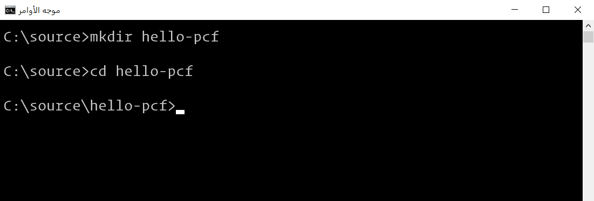
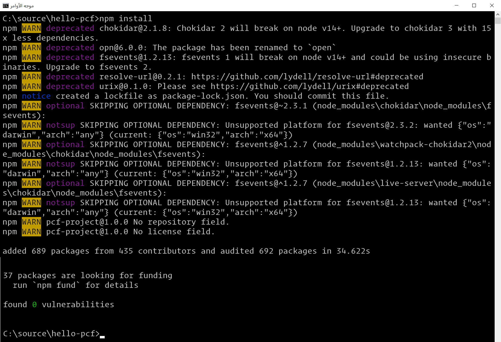
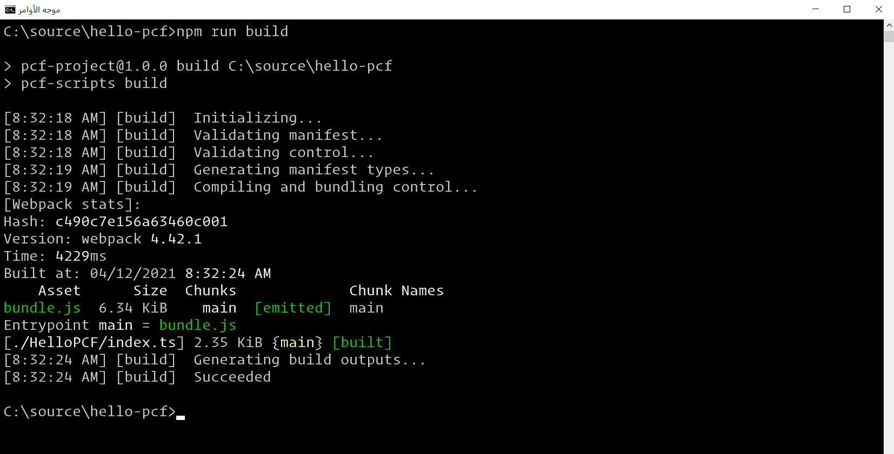
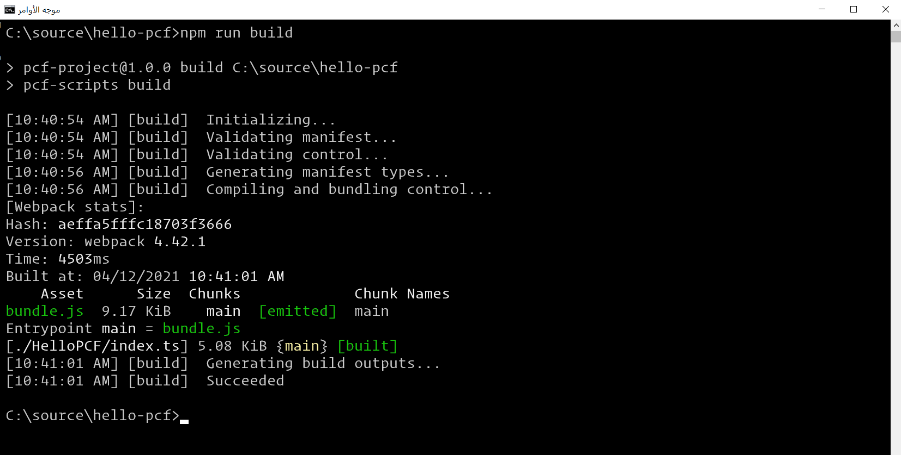
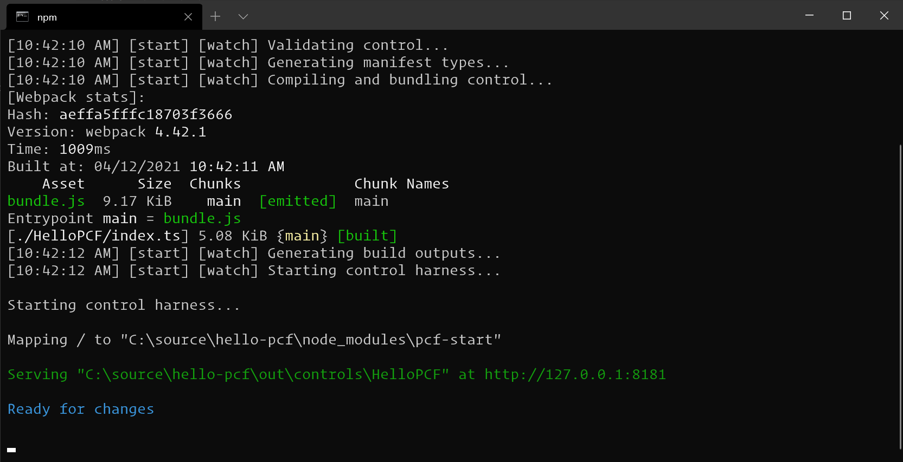
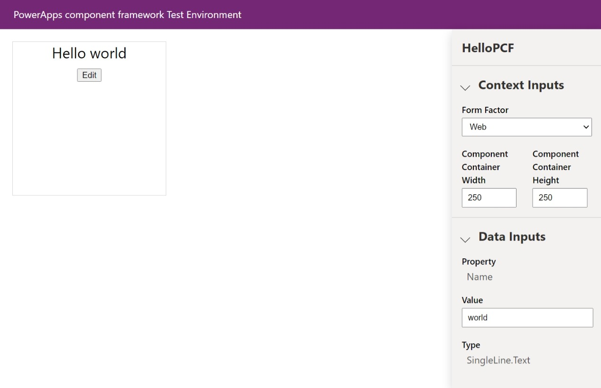

يوفر Power Apps وظائف متعددة جاهزة للاستخدام من قبل منشئي التطبيقات لمساعدتهم في إنشاء تطبيقاتهم، ولكن قد تبرز في بعض الأحيان الحاجة إلى إنشاء واجهة مستخدم لم يتم توفيرها. استبدال قيمة نسبة مئوية بمقياس، أو عرض كود شريطي بدلاً من معرف، أو استبدال عناصر تحكم موجودة بعناصر تتميز بوظائف أكثر - مثل طريقة عرض شبكة السحب والإفلات. يمكنك أيضاً أن تجعل Power Apps component framework يلتف حول مكونات موجودة قمت بكتابتها في إطارات عمل ويب أخرى، مثل React أو Angular.

يتيح لك إنشاء هذه المكونات استخدام النطاق الكامل للنظام البيئي الحديث لتطوير الويب: المكتبات وأطر العمل وأدوات أخرى قد تكون ملماً بها، وحزم هذه القدرة في نموذج يسمح لمنشئي التطبيقات بإنشاء تطبيقات باستخدام تعليماتك البرمجية، كما لو كان الأمر يتعلق بجزء جاهز للاستخدام من النظام الأساسي.

> [!NOTE]
> يمكنك العثور على عينات مكونات أخرى — بما في ذلك المكونات التي تستخدم Angular أو React—[في وثائقنا](/power-apps/developer/component-framework/use-sample-components).

يُشار تكراراً إلى مكونات Power Apps المخصصة باعتبارها *مكونات تعليمات البرمجية* لأنها تتطلب تعليمات برمجية مخصصة لتنفيذها. إنها تتكوّن من ثلاثة عناصر: البيان والتطبيق والموارد. في التمرين التالي، ستقوم بكتابة مكون تعليمات برمجية مخصصة: رسالة Hello world تشبه الصورة التالية.


سيصغي هذا المكون إلى التغييرات الواردة من التطبيق المضيف، ويسمح للمستخدم بإجراء التغييرات التي يتم عندئذٍ دفعها إلى التطبيق المضيف. ستساعدك الخطوات التالية في بناء هذا المكون.

### <a name="install-power-apps-cli"></a>تثبيت Power Apps CLI

للحصول على Microsoft Power Apps CLI، اتبع الخطوات التالية:

1.  ثبّت [Npm](https://www.npmjs.com/get-npm/?azure-portal=true) (يأتي مع Node.js) أو [Node.js](https://nodejs.org/en/?azure-portal=true) (يأتي مع npm). نوصي باستخدام الإصدار 10.15.3 من LTS (دعم طويل الأمد) أو إصدار أعلى.

2.  ثبّت [.NET Framework 4.6.2 Developer Pack](https://dotnet.microsoft.com/download/dotnet-framework/net462/?azure-portal=true).

3.  إذا لم يكن لديك بالفعل ‪2017‬ Visual Studio أو إصدار لاحق، فاتّبع أحد الخيارَين التاليَين:

    -   الخيار 1: تثبيت [Visual Studio 2019](/visualstudio/install/install-visual-studio) أو إصدار أحدث.

    -   الخيار 2: تثبيت [Build Tools for Visual Studio 2019](https://visualstudio.microsoft.com/downloads/#build-tools-for-visual-studio-2019) ثم تثبيت [Visual Studio Code](https://code.visualstudio.com/Download/?azure-portal=true).

4.  ثبّت [Microsoft Power Apps CLI](https://aka.ms/PowerAppsCLI/?azure-portal=true).

5.  للاستفادة من أحدث القدرات كلها، عليك تحديث أدوات Power Apps CLI إلى أحدث إصدار باستخدام الأمر التالي: ```pac install latest```

### <a name="create-a-new-component-project"></a>إنشاء مشروع مكون جديد
لإنشاء مشروع مكون جديد، اتبع هذه الخطوات:

1.  أنشئ دليلاً ستنشئ فيه مكوناً خاصاً بك. في هذه العينة، ستضع المكون في **C:\\source\\hello-pcf**؛ ومع ذلك، يمكنك إنشاء دليلك الخاص. لإنشاء دليلك الخاص، ستستخدم موجه الأوامر. من دليلك المصدر، أنشئ دليلاً باسم **hello-pcf**، ثم انتقل إلى ذلك الدليل عبر *cd hello-PCF*:

       

2.  قم بتهيئة مشروع المكون باستخدام Power Apps CLI عبر الأمر التالي:

    ```azurepowershell
    pac pcf init --namespace SampleNamespace --name HelloPCF --template field
    ```
    تظهر الصورة التالية مثالاً عن الإخراج الذي يجب أن تراه.
   
    

3.  ثبّت أدوات إنشاء المشروع باستخدام الأمر ```npm install```. قد تظهر بعض التحذيرات المعروضة؛ ولكن، يمكنك تجاهلها.

    

4.  افتح مشروعك الجديد في بيئة المطور. يمكنك استخدام Visual Studio أو Visual Studio Code أو أي بيئة أخرى تفضلها. في هذا المثال، ستستخدم Visual Studio Code، الذي يوفر طريقة لفتح نافذة جديدة من دليل في موجه أوامر عبر التعليمات البرمجية للأمر. 

    

### <a name="update-your-code-components-manifest"></a>تحديث بيان مكون التعليمات البرمجية
حدّث البيان لتمثيل عنصر التحكم بدقة.

1. غيّر خصائص *version* و *display-name-key* و *description-key* التي يمكن العثور عليها في العقدة HelloPCF في الملف ControlManifest.Input.xml إلى قيم ذات مغزىً. في هذا المثال، ستغيّر الخصائص إلى **1.0.0** و **Hello PCF** و **Says hello**، على التوالي:

    ```xml
      <control namespace="SampleNamespace" constructor="HelloPCF" version="1.0.0" display-name-key="Hello PCF" description-key="Says hello" control-type="standard">
    ```

2. استبدل عينة الخاصة بخاصية **Name** المخصصة الخاصة بك. 

    ```xml
    <property name="Name" display-name-key="Name" description-key="A name" of-type="SingleLine.Text" usage="bound" required="true" />
    ```

3.  حدّث العقدة \<resources\> لتضمين مرجع إلى ملف CSS يسمى *hello-pcf.css* ستقوم بإنشائه. ضع هذا الملف في مجلد CSS. ستبدو العقدة كما في المثال التالي:

    ```xml
    <css path="css/hello-pcf.css" order="1" />
    ```
    
    

4.  بعد اجراء التحديثات، احفظ التغييرات. يجب أن يبدو ملف البيان كما في المثال التالي:

    ```xml
    <?xml version="1.0" encoding="utf-8" ?>
    <manifest>
      <control namespace="SampleNamespace" constructor="HelloPCF" version="1.0.0" display-name-key="Hello PCF" description-key="Says hello" control-type="standard">
        <property name="Name" display-name-key="Name" description-key="A name" of-type="SingleLine.Text" usage="bound" required="true" />
        <resources>
          <code path="index.ts" order="1"/>
          <css path="css/hello-pcf.css" order="1" />
        </resources>
      </control>
    </manifest>
    ```

### <a name="add-styling-to-your-code-component"></a>إضافة تصميم إلى مكون الأكواد
لإضافة تصميم إلى مكون الأكواد، اتبع الخطوات الآتية:

1.  أنشئ مجلداً فرعياً CSS جديداً تحت المجلد HelloPCF.

2.  أنشئ مجلد hello-pcf.css جديداً داخل المجلد الفرعي CSS.

3.  أضف محتوى النمط التالي إلى ملف hello-pcf.css:

    ```css
    .SampleNamespace\.HelloPCF {
      font-size: 1.5em;
    }
    ```

4.  احفظ الملف hello-pcf.css.

### <a name="build-your-code-component"></a>إنشاء مكون التعليمات البرمجية
قبل أن تتمكن من تطبيق منطق المكون، تحتاج إلى تشغيل بنية على المكون. يؤدي ذلك إلى التأكد من إنشاء أنواع TypeScript الصحيحة لمطابقة الخصائص في مستند ControlManifest. 

عد إلى موجه الأوامر وأنشئ مشروعك باستخدام الأمر التالي.

 ```azurepowershell
 npm run build
 ```

   

يتم تحويل المكون برمجياً في الدليل out/controls/HelloPCF. تتضمن عناصر البنية:

 -   **bundle.js** - التعليمات البرمجية المصدر المجمعة للمكون.

 -   **ControlManifest.xml** - ملف البيان الفعلي الخاص بالمكون الذي يتم تحميله إلى مؤسسة Microsoft Dataverse.

### <a name="implement-your-code-components-logic"></a>قم بتنفيذ منطق مكون الأكواد الخاص بك
لتنفيذ منطق مكون الأكواد، اتبع الخطوات التالية:

1.  افتح index.ts في Visual Studio Code أو محرر التعليمات البرمجية المفضل لديك.

1.  فوق الأسلوب *constructor*، أدخل المتغيرات الخاصة التالية:

    ```ts
    // The PCF context object
    private context: ComponentFramework.Context<IInputs>;

    // The wrapper div element for the component
    private container: HTMLDivElement;

    // The callback function to call whenever your code has made a change to a bound or output property
    private notifyOutputChanged: () => void;

    // Flag to track if the component is in edit mode or not
    private isEditMode: boolean;

    // Tracks the event handler so we can destroy it when done
    private buttonClickHandler: EventListener;

    // Tracking variable for the name property
    private name: string | null;
    ```

1.  استبدل الأسلوب *init* بالمنطق التالي:

    ```ts 
    public init(
      context: ComponentFramework.Context<IInputs>,
      notifyOutputChanged: () => void,
      state: ComponentFramework.Dictionary,
      container: HTMLDivElement
    ) {
      // Track all the things
      this.context = context;
      this.notifyOutputChanged = notifyOutputChanged;
      this.container = container;
      this.isEditMode = false;
      this.buttonClickHandler = this.buttonClick.bind(this);

      // Create the span element to hold the hello message
      const message = document.createElement("span");
      message.innerText = `Hello ${this.isEditMode ? "" : context.parameters.Name.raw}`;

      // Create the textbox to edit the name
      const textbox = document.createElement("input");
      textbox.type = "text";
      textbox.style.display = this.isEditMode ? "block" : "none";
      if (context.parameters.Name.raw) {
        textbox.value = context.parameters.Name.raw;
      }

      // Wrap the two above elements in a div to box out the content
      const messageContainer = document.createElement("div");
      messageContainer.appendChild(message);
      messageContainer.appendChild(textbox);

      // Create the button element to switch between edit and read modes
      const button = document.createElement("button");
      button.textContent = this.isEditMode ? "Save" : "Edit";
      button.addEventListener("click", this.buttonClickHandler);

      // Add the message container and button to the overall control container
      this.container.appendChild(messageContainer);
      this.container.appendChild(button);
    }
    ```
   
1.  أضف الأسلوب *buttonClick* أسفل *init* مع المنطق التالي:

    ```ts
    // The event handler for the button's click event
    public buttonClick() {
      // Get our controls via DOM queries
      const textbox = this.container.querySelector("input")!;
      const message = this.container.querySelector("span")!;
      const button = this.container.querySelector("button")!;

      // If not in edit mode, copy the current name value to the textbox
      if (!this.isEditMode) {
        textbox.value = this.name ?? "";
      } else if (textbox.value != this.name) {
        // if in edit mode, copy the textbox value to name and call the motify callback
        this.name = textbox.value;
        this.notifyOutputChanged();
      }

      // flip the mode flag
      this.isEditMode = !this.isEditMode; 

      // Set up the new output based on changes
      message.innerText = `Hello ${this.isEditMode ? "" : this.name}`;

      textbox.style.display = this.isEditMode ? "inline" : "none";
      textbox.value = this.name ?? "";

      button.textContent = this.isEditMode ? "Save" : "Edit";
    }
    ```

1.  استبدل الأسلوب *updateView* بالمنطق التالي:

    ```ts
    public updateView(context: ComponentFramework.Context<IInputs>): void {
      // Checks for updates coming in from outside
      this.name = context.parameters.Name.raw;
      const message = this.container.querySelector("span")!;
      message.innerText = `Hello ${this.name}`;
    }
    ```

1.  استبدل *getOuptuts* بالأسلوب التالي:

    ```ts 
    public getOutputs(): IOutputs {
      return {
        // If our name variable is null, return undefined instead
        Name: this.name ?? undefined
      };
    }
    ```

1.  استبدل الأسلوب *destroy* بالمنطق التالي:

    ```ts
    public destroy() {
      // Remove the event listener we created in init
      this.container.querySelector("button")!.removeEventListener("click", this.buttonClickHandler);
    }
    ```

1.  بعد إجراء التحديثات، يجب أن يبدو الملف *index.ts* كما في المثال التالي:

    ```ts
    import {IInputs, IOutputs} from "./generated/ManifestTypes";

    export class HelloPCF implements ComponentFramework.StandardControl<IInputs, IOutputs> {
      // The PCF context object
      private context: ComponentFramework.Context<IInputs>;

      // The wrapper div element for the component
      private container: HTMLDivElement;

      // The callback function to call whenever your code has made a change to a bound or output property
      private notifyOutputChanged: () => void;

      // Flag to track if the component is in edit mode or not
      private isEditMode: boolean;

      // Tracks the event handler so we can destroy it when done
      private buttonClickHandler: EventListener;

      // Tracking variable for the name property
      private name: string | null;

      /**
      * Empty constructor.
      */
      constructor()
      {

      }

      /**
      * Used to initialize the control instance. Controls can kick off remote server calls and other initialization actions here.
      * Data-set values are not initialized here, use updateView.
      * @param context The entire property bag available to control via Context Object; It contains values as set up by the customizer mapped to property names defined in the manifest, as well as utility functions.
      * @param notifyOutputChanged A callback method to alert the framework that the control has new outputs ready to be retrieved asynchronously.
      * @param state A piece of data that persists in one session for a single user. Can be set at any point in a controls life cycle by calling 'setControlState' in the Mode interface.
      * @param container If a control is marked control-type='standard', it will receive an empty div element within which it can render its content.
      */
      public init(context: ComponentFramework.Context<IInputs>, notifyOutputChanged: () => void, state: ComponentFramework.Dictionary, container:HTMLDivElement)
      {
        // Track all the things
        this.context = context;
        this.notifyOutputChanged = notifyOutputChanged;
        this.container = container;
        this.isEditMode = false;
        this.buttonClickHandler = this.buttonClick.bind(this);

        // Create the span element to hold the hello message
        const message = document.createElement("span");
        message.innerText = `Hello ${this.isEditMode ? "" : context.parameters.Name.raw}`;

        // Create the textbox to edit the name
        const textbox = document.createElement("input");
        textbox.type = "text";
        textbox.style.display = this.isEditMode ? "block" : "none";
        if (context.parameters.Name.raw) {
          textbox.value = context.parameters.Name.raw;
        }

        // Wrap the two above elements in a div to box out the content
        const messageContainer = document.createElement("div");
        messageContainer.appendChild(message);
        messageContainer.appendChild(textbox);

        // Create the button element to switch between edit and read modes
        const button = document.createElement("button");
        button.textContent = this.isEditMode ? "Save" : "Edit";
        button.addEventListener("click", this.buttonClickHandler);

        // Add the message container and button to the overall control container
        this.container.appendChild(messageContainer);
        this.container.appendChild(button);
      }

      // The event handler for the button's click event
      public buttonClick() {
        // Get our controls via DOM queries
        const textbox = this.container.querySelector("input")!;
        const message = this.container.querySelector("span")!;
        const button = this.container.querySelector("button")!;

        // If not in edit mode, copy the current name value to the textbox
        if (!this.isEditMode) {
          textbox.value = this.name ?? "";
        } else if (textbox.value != this.name) {
          // if in edit mode, copy the textbox value to name and call the motify callback
          this.name = textbox.value;
          this.notifyOutputChanged();
        }

        // flip the mode flag
        this.isEditMode = !this.isEditMode; 

        // Set up the new output based on changes
        message.innerText = `Hello ${this.isEditMode ? "" : this.name}`;

        textbox.style.display = this.isEditMode ? "inline" : "none";
        textbox.value = this.name ?? "";

        button.textContent = this.isEditMode ? "Save" : "Edit";
      }

      /**
      * Called when any value in the property bag has changed. This includes field values, data-sets, global values such as container height and width, offline status, control metadata values such as label, visible, etc.
      * @param context The entire property bag available to control via Context Object; It contains values as set up by the customizer mapped to names defined in the manifest, as well as utility functions
      */
      public updateView(context: ComponentFramework.Context<IInputs>): void
      {
        // Checks for updates coming in from outside
        this.name = context.parameters.Name.raw;
        const message = this.container.querySelector("span")!;
        message.innerText = `Hello ${this.name}`;
      }

      /** 
      * It is called by the framework prior to a control receiving new data. 
      * @returns an object based on nomenclature defined in manifest, expecting object[s] for property marked as “bound” or “output”
      */
      public getOutputs(): IOutputs
      {
        return {
          // If our name variable is null, return undefined instead
          Name: this.name ?? undefined
        };
      }

      /** 
      * Called when the control is to be removed from the DOM tree. Controls should use this call for cleanup.
      * i.e. cancelling any pending remote calls, removing listeners, etc.
      */
      public destroy(): void
      {
        // Remove the event listener we created in init
        this.container.querySelector("button")!.removeEventListener("click", this.buttonClickHandler);
      }
    }
    ```


### <a name="rebuild-and-run-your-code-component"></a>إعادة إنشاء مكون التعليمات البرمجية وتشغيله
لإعادة إنشاء مكون التعليمات البرمجية وتشغيله، اتبع الخطوات التالية:

1.  الآن وبعد أن تم تطبيق منطق المكون، عد إلى موجه الأوامر لإعادة إنشائه باستخدام هذا الأمر: 
       ```azurepowershell
       npm run build
       ```
       

2.  شغّل المكون في مفعّل اختبار العقدة عن طريق تشغيل ```npm start```. يمكنك أيضاً تمكين وضع المراقبة لضمان إجراء أي تغييرات في الأصول التالية بشكل تلقائي من دون الحاجة إلى إعادة تشغيل مفعّل الاختبار باستخدام الأمر ```npm start watch```.

    -  ملف index.ts.
    
    -  ملف ControlManifest.Input.xml.
    
    -  المكتبات المستوردة في index.ts.
    
    -  جميع الموارد المذكورة في ملف البيان

    

3.  راقب عنصر التحكم في مفعّل الاختبار بالانتقال إلى العنوان المضيف في نافذة المستعرض (من المحتمل أن تكون النافذة قد انبثقت بشكل تلقائي، ولكن يمكنك أيضاً الإشارة إلى العنوان كما تم العثور عليه في نافذة الأمر أيضاً).

    
