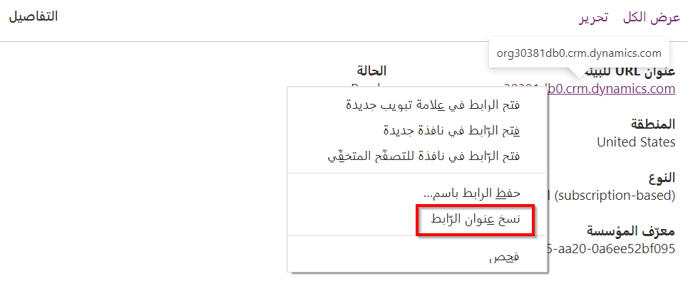

لاستخدام مكون التعليمات البرمجية في Power Apps، يجب نشره لبيئة Microsoft Dataverse الأساسية. لنشر المكون، تتمثل مهمتك الأولى في حزم مكون التعليمات البرمجية الخاصة بك في ملف حل يمكن أن يتم توزيعه بعد ذلك للاستيراد. يمكنك إنجاز هذه المهمة من خلال طريقتين. يمكنك استخدام الأمر CLI Push لاستخدام حل مؤقت لدفع المكون الخاص بك بسرعة للسماح بالاختبار. يُعد هذا الخيار مفيداً للاستخدام أثناء تطوير المكون. يتيح الخيار الآخر إنشاء حل للمكون واستيراده بشكل منفصل إلى Dataverse. يعد هذا الخيار جيداً للاستخدام في إنشاء المسارات‬ أو تنفيذ عمليات النشر اليدوية في بيئة أخرى غير بيئة التطوير. في القسم المتبقي من هذا الموضوع، سنستكشف الخيارين بشكل أكثر تفصيلاً.

### <a name="prerequisites"></a>المتطلبات الأساسية

يجب أن يكون لديك مشروع مكون تعليمات برمجية موجود تم إنشاؤه بالفعل. يمكنك اتباع هذه الخطوات لأي مشروع آخر لمكونات التعليمات البرمجية، مثل [عينة المكونات](/power-apps/developer/component-framework/use-sample-components).

### <a name="push-a-component-to-a-dataverse-environment-during-development"></a>دفع مكون إلى بيئة Dataverse أثناء التطوير

لدفع مكون تعليمات برمجية باستخدام Power Platform CLI، اتبع هذه الخطوات:

1.  انتقل إلى [مركز مسؤولي Power Platform](https://admin.powerplatform.microsoft.com/) وحدد **البيئات**.

2.  حدد لفتح البيئة التي تستخدمها لهذا التمرين العملي.

3.  حدد بزر الماوس الأيمن على **عنوان URL‏‎ للبيئة** وحدد **نسخ**.

    

4.  احفظ **عنوان URL‏‎ للبيئة** في المفكرة.

5.  ابدأ تشغيل Visual Studio Code وحدد **المستكشف**.

6.  حدد **فتح المجلد**.

    

7.  حدد مجلد المشروع **hello-pcf** الذي حددته في التمرين العملي السابق، ثم حدد **تحديد**.

8.  حدد علامة التبويب **Power Platform**، ثم حدد إضافة **ملف تعريف مصادقة Dataverse**.

    

9.  ألصق **عنوان URL‏‎ للبيئة** الذي نسخته، ثم اضغط على **[ENTER].**

    

10. أدخل بيانات اعتمادك وسجل دخولك.

11. حدد بزر الماوس الأيمن على ملف تعريف المصادقة الذي أنشأته وحدد إعادة التسمية.

    

12. غير اسم ملف التعريف إلى **LearnProfile**، ثم اضغط على **[ENTER].**

13. إذا كان لديك أكثر من ملف تعريف واحد، فتأكد من تحديد **LearnProfile**.

14. حدد **وحدة طرفية** ثم حدد **وحدة طرفية جديدة**.

15. قم ببناء المشروع عن طريق تشغيل الأمر أدناه وتأكد من بنائه بنجاح.

    ```
    npm run build
    ```

16. ادفع عنصر التحكم المخصص إلى بيئتك عن طريق تشغيل الأمر أدناه.

    ```
    pac pcf push --publisher-prefix msl
    ```

17. يجب أن يتم استيراد الحل إلى بيئتك ونشره.

    

18. انتقل إلى [مدخل المنشئ في Power Apps](https://make.powerapps.com/) وتأكد من وجودك في البيئة الصحيحة.

19. حدد **الحلول**.

20. من المفترض أن ترى الحل **PowerAppsTools_msl**. حدد لفتح الحل.

    

21. من المفترض أن ترى عنصر التحكم المخصص الذي أنشأته.

    

### <a name="create-a-solution-file-with-power-platform-cli"></a>إنشاء ملف حل باستخدام Power Platform CLI

لإنشاء ملف حل باستخدام Power Platform CLI، اتبع الخطوات التالية:

1.  عد إلى Visual Studio Code وتأكد من فتح المشروع **HELLO-PCF**.

2.  انتقل إلى الوحدة الطرفية وأنشئ مجلداً جديداً عن طريق تشغيل الأمر أدناه.

    ```
    md Solution
    ```

3.  قم بتغيير الدليل إلى المجلد الحل الذي أنشأته. شغّل الأمر أدناه.

    ```
    cd Solution
    ```

1.  تهيئة مشروع حل في Dataverse باستخدام الأمر التالي:

    ```
    pac solution init --publisher-name mslearn --publisher-prefix msl
    ```

2.  قم بإبلاغ مشروع الحل بأن مكوناته ستُضاف أثناء البناء. لإنجاز هذه المهمة، استخدم الأمر التالي

    ```dotnetcli
    pac solution add-reference --path ..
    ```

3.  لإنشاء ملف مضغوط للحل، استخدم محرك Microsoft Build أو msbuild كمختصر. ستحتاج فقط إلى استخدام علامة /الاستعادة في المرة الأولى التي يتم فيها بناء مشروع الحل. في كل بنية لاحقة، ستحتاج إلى تشغيل msbuild فقط. بإمكان المسار إلى MSBuild.exe أن يكون مختلفاً بحسب إصدار Visual Studio المثبت على جهازك.

    ```
    C:\Program Files (x86)\Microsoft Visual Studio\2019\Professional\MSBuild\Current\Bin\MSBuild.exe\" /t:build /restore
    ```

4.  من المفترض أن تنجح عملية البناء.

5.  حدد موقع مجلد **الحل** الذي أنشأته، وقم بتوسيعه.

6.  قم بتوسيع المجلد **bin\debug**.

7.  من المفترض أن ترى ملف solution.zip هنا.

    

> [!NOTE] 
> لتشغيل MSBuild، تحتاج إلى تثبيت Visual Studio أو أن تكون أدوات بناء Visual Studio مثبتة. يمكنك تثبيت أدوات البناء من [تنزيلات Visual Studio](https://visualstudio.microsoft.com/downloads/#build-tools-for-visual-studio-2022). للوصول إلى MSBuild، قد تحتاج إلى إضافته إلى دليل مسار متغيرات بيئة Windows. على سبيل المثال، يقوم Visual Studio 2022 بتخزين MSBuild في *C:\Program Files (x86)\Microsoft Visual Studio\2022\Enterprise\MSBuild\Current\Bin*. يمكنك أيضاً استخدام موجه أوامر المطور في Visual Studio للوصول إلى MSBuild أو تشغيله باستخدام المسار الكامل المؤهل (*"C:\Program Files (x86)\Microsoft Visual Studio\2022\Enterprise\MSBuild\Current\Bin\MSBuild.exe\"/t:build /restore*).

نوع الحزمة الافتراضي هو حل مُدار. إذا أردت تصديره باعتباره غير مُدار (أو كلاهما)، فيمكنك مسح (أو إلغاء تحديد) التعليق الموجود في القسم التالي من Solutions.cdsproj وتحرير عقدة SolutionPackageType وفقاً لذلك:

```
   <!-- Solution Packager overrides un-comment to use: SolutionPackagerType Managed, Unmanaged, Both)-->
        <PropertyGroup>
        <SolutionPackageType>Unmanaged</SolutionPackageType>
        </PropertyGroup>
```
يمكنك تعيين تكوين msbuild إلى **Release** لإصدار بنية الإنتاج، على سبيل المثال، msbuild /p:configuration=Release.

يمكنك استيراد الملف المضغوط الذي يحتوي على ملف موجود يدوياً في bin\Debug أو bin\Release، وذلك وفقاً لتكوين الإصدار. يمكنك أيضاً نشر مكونات التعليمات البرمجية الخاصة بك برمجياً باستخدام Power Platform CLI. لمزيد من المعلومات، راجع [الاتصال بالبيئة الخاصة بك](/power-apps/developer/component-framework/import-custom-controls#connecting-to-your-environment) وأيضاً [نشر مكونات التعليمات البرمجية](/power-apps/developer/component-framework/import-custom-controls#deploying-code-components) وهي عبارة عن أقسام [حزم وثائق مكون](/power-apps/developer/component-framework/import-custom-controls) التعليمات البرمجية.
