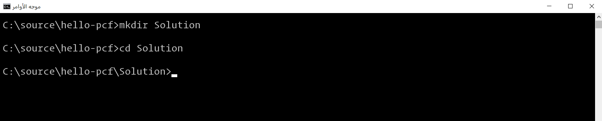
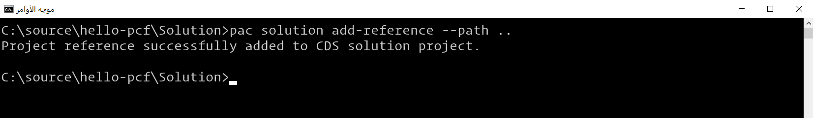

> [!NOTE]
> لتشغيل MSBuild، تحتاج إلى تثبيت Visual Studio أو أن تكون أدوات بناء Visual Studio مثبتة. للوصول إلى MSBuild، قد تحتاج إلى إضافتها إلى دليل مسار متغيرات بيئة Windows الخاصة بك. على سبيل المثال، MSBuild لمتاجر Visual Studio 2019في *C:\\ملفات البرامج (x86)\\Microsoft Visual Studio\\2019\\المؤسسات\\MSBuild\\الحالي\\الحاوية*. يمكنك أيضاً استخدام موجه أوامر المطور في Visual Studio للوصول إلى MSBuild، أو تشغيله باستخدام المسار الكامل المؤهل (*"C:\\ملفات البرامج (x86)\\Microsoft Visual Studio\\2019\\المؤسسات\\MSBuild\\الحالي\\الحاوية\\MSBuild.exe"/t:إنشاء /استعادة*).

لاستخدام مكون التعليمات البرمجية في Power Apps، يجب نشره لبيئة Microsoft Dataverse الأساسية. لنشر المكون، تتمثل مهمتك الأولى في حزم مكون التعليمات البرمجية الخاصة بك في ملف حل يمكن أن يتم توزيعه بعد ذلك للاستيراد.

### <a name="prerequisites"></a>المتطلبات الأساسية

يجب أن يكون لديك مشروع مكون رمز موجود تم إنشاؤه بالفعل. يمكنك اتباع هذه الخطوات لأي مشروع آخر لمكونات التعليمات البرمجية، مثل [نموذج المكونات](/power-apps/developer/component-framework/use-sample-components).

### <a name="create-a-solution-file-with-power-apps-cli"></a>إنشاء ملف حل باستخدام Power Apps CLI
لإنشاء ملف حل باستخدام Power Apps CLI، اتبع الخطوات التالية:

1.  في موجه الأوامر، انتقل إلى دليل مشروع مكون Power Apps الخاص بك وهو مشروع LinearComponent الذي قمت بإنشائه في التدريب السابق. قم بإنشاء مجلد جديد وقم بتسميته **الحلول** (أو أي اسم من اختيارك) باستخدام الأمر **mkdir Solutions**. انتقل إلى الدليل باستخدام الأمر **cd Solutions**.

    

2.  بدء مشروع حل في Dataverse باستخدام الأمر التالي:

    ```azurepowershell
       pac solution init --publisher-name mslearn --publisher-prefix msl
    ```

     تظهر الصورة التالية مثالاً على النتائج التي يجب أن تراها.

     

3.  إبلاغ مشروع الحل الخاص بك. ستتم إضافة مكوناته أثناء البناء. لإنجاز هذه المهمة، استخدم الأمر التالي:

    ```azurepowershell
       pac solution add-reference --path ..
    ```

    

4.  لإنشاء ملف مضغوط للحل الخاص بك، استخدم محرك Microsoft Build أو *MSBuild* لفترة قصيرة. ستحتاج فقط إلى استخدام علامة */الاستعادة* في المرة الأولى التي يتم فيها إنشاء مشروع الحل. في كل إصدار لاحق، ستحتاج إلى تشغيل *msbuild* فقط.

    ```azurepowershell
    msbuild /t:build /restore
    ```
    
     نوع الحزمة الافتراضي هو حل مُدار. إذا كنت تريد التصدير على أنه غير مُدار (أو كلاهما)، فيمكنك مسح (أو إلغاء تحديد) التعليق الموجود في القسم التالي من Solutions.cdsproj الخاصة بك وتحرير عقدة SolutionPackageType وفقاً لذلك:

    ```xml
    <!-- Solution Packager overrides un-comment to use: SolutionPackagerType Managed, Unmanaged, Both)-->
    <PropertyGroup>
    <SolutionPackageType>Unmanaged</SolutionPackageType>
    </PropertyGroup>
    ```

    يمكنك تعيين تكوين msbuild على **الإصدار** لإصدار إنشاء الإنتاج، على سبيل المثال، msbuild /p:configuration=Release.

5.  يتم العثور علي ملفات الحلول التي تم إنشاؤها داخل مجلد \\الحاوية\\التصحيح\\ بعد نجاح عملية الإنشاء. يمكنك استيراد الملف المضغوط الذي يحتوي على ملف موجود يدوياً في الحاوية\التصحيح أو الحاوية\الإصدار، وذلك وفقاً لتكوين الإصدار الخاص بك. يمكنك أيضاً نشر مكونات التعليمات البرمجية الخاصة بك برمجياً باستخدام Power Apps CLI. لمزيد من المعلومات، راجع [الاتصال بالبيئة الخاصة بك](/power-apps/developer/component-framework/import-custom-controls#connecting-to-your-environment) وأيضاً [نشر مكونات التعليمات البرمجية](/power-apps/developer/component-framework/import-custom-controls#deploying-code-components) وهي عبارة عن أقسام [حزم وثائق مكون](/power-apps/developer/component-framework/import-custom-controls) التعليمات البرمجية.
