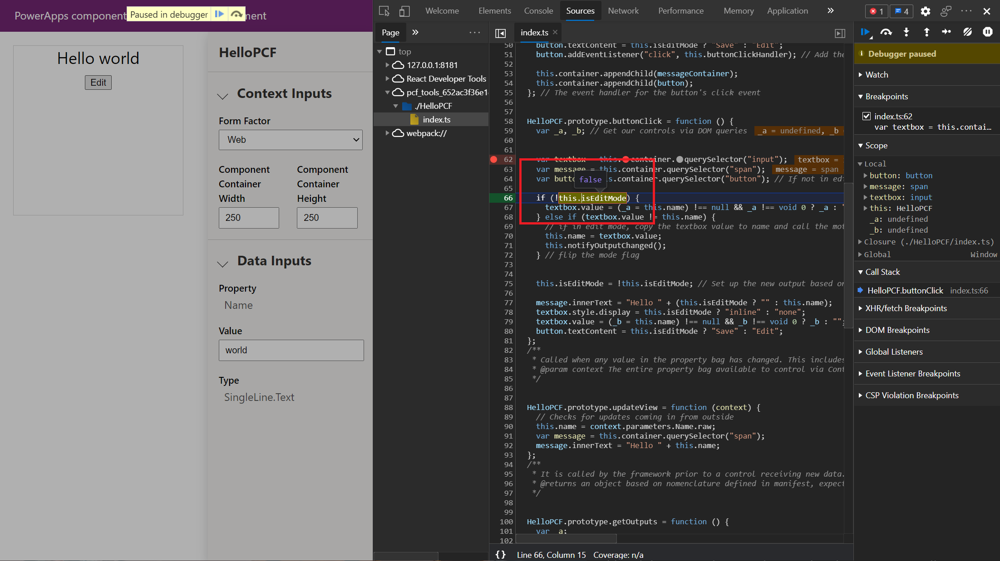

عندما تبدأ تطوير المزيد من المكونات المعقدة، قد تحتاج إلى اختبار منطقها وتصحيح أخطائها بطرق تفاعلية. وتتمثل إحدى الأدوات المساعدة المفيدة التي لديك في مفعّل اختبار مكون Power Apps، والذي يسمح لك باختبار إدخالات مختلفة للبيانات والسياق لضمان عمل المكون الخاص بك بشكل صحيح. بالإضافة إلى ذلك، بسبب إنشاء المكونات الخاصة بك باستخدام تقنيات الويب القياسية مثل TypeScript وCSS وHTML، تتوفر لديك عدة أدوات مساعدة يتم توفيرها من خلال هذا النظام البيئي، مثل إمكانيات تصحيح الأخطاء الخاصة بالعميل المتوفرة في معظم المستعرضات الحديثة.

### اختبار مكون الكود وتصحيح أخطائه في مفعّل اختبار مكون Power Apps

يُعد مفعّل اختبار مكون Power Apps أداة مساعدة تم إنشاؤها من قِبل Microsoft، والتي تساعدك على عرض مكون Power Apps بسرعة في بيئة محلية. إذا كنت قد أكملت التمرين في هذه النمطية حول كتابة مكون التعليمات البرمجية، فقد رأيت هذه الأداة المساعدة قيد التنفيذ بالفعل. ويمكنك بدء مفعّل اختبار محلي من داخل مشروع مكون Power Apps باستخدام أمر البدء *npm*.

وبعد بدء "مفعّل الاختبار"، سيتم عرض المكون الخاص بك في نافذة مستعرض، كالذي قمت بإنشائه في التمرين السابق.

:::image type="content" source="../media/picture-9.jpg" alt-text="لقطة شاشة لعرض المكون في نافذة مستعرض.":::

#### إدخالات السياق

داخل مفعّل الاختبار، يمكنك تزويد المكون بإدخالات متنوعة لتحديد كيفية عرضه (وهذا أمر مفيد للتأكد من عرض المكون بشكل صحيح ضمن سياقات عرض مختلفة).

في القائمة المنسدلة **إدخالات السياق**، يمكنك تحديد **عامل التصميم** مثل **الويب** و **الكمبيوتر اللوحي** و **الهاتف**. كما يمكنك توفير حقول العرض والارتفاع الواضحة لمعرفة كيفية عرض المكون في أبعاد متنوعة.

#### إدخالات البيانات

تساعدك القائمة المنسدلة **إدخالات البيانات** على التأكد من عمل المكون على النحو المتوقع عند توفير معلمات بيانات مختلفة، كما تسمح لك بتحديد كيفية عرض المكون بالاستناد إلى النوع المحدد في حقل معين.

وإذا كان المكون الخاص بك عبارة عن مكون مجموعة بيانات، فيمكنك تحميل ملفات CSV باستخدام بيانات وهمية. يمكنك تصدير ملف CSV من عينة البيئة المستهدفة التي تنشئ المكون على أساسها، أو يمكنك إنشاء مكون جديد.

:::image type="content" source="../media/picture-14.png" alt-text="لقطة شاشة لإدخالات البيانات + تحديد ملف.":::

في المثال السابق، إذا أردت إنشاء ملف CSV جديد، فيجب أن يشبه النموذج الآتي:

> الاسم، الهاتف 1، العنوان 1\_المدينة
>
> جو، 123-555-0100، سياتل
>
> ماري، 123-555-0101، أتلانتا
>
> ستيف، 123-555-0102، ريدموند

بعد تحميل ملف CSV بنجاح، سيعرض المكون سجلاته، وكما هو الحال مع عناصر التحكم في الخصائص لديك، يمكنك تعيين أنواع مختلفة كما هو محدد بواسطة مجموعة النوع المقابل للمكون (المحددة في ملف ControlManifest.Input.xml الخاص بالمكون).

:::image type="content" source="../media/picture-15.png" alt-text="تم تحميل لقطة شاشة لملف CSV بنجاح وقام المكون بعرض سجلات المكون.":::

### تصحيح أخطاء مكون تعليمات برمدية باستخدام تصحيح أخطاء المستعرض

تتميز معظم المستعرضات الحديثة بمجموعة متنوعة من إمكانيات تصحيح الأخطاء المضمنة. تتميز المستعرضات Microsoft Edge وGoogle Chrome وMozilla Firefox وApple Safari بأدوات مطور مضمنة تتيح تجارب تصحيح الأخطاء التفاعلية. لمزيد من المعلومات حول كل مستعرض، راجع الارتباطات التالية.

| المستعرض         | وثائق أدوات المطور                                           |
|-----------------|-------------------------------------------------------------------------|
| Microsoft Edge ‏(Chromium) | [/microsoft-edge/devtools-guide-chromium](/microsoft-edge/devtools-guide-chromium) |
|                 |                                                                         |
| Microsoft Edge ‏(EdgeHTML) | [/microsoft-edge/devtools-guide](/microsoft-edge/devtools-guide)          |
|                 |                                                                         |
| Google Chrome          | https://developers.google.com/web/tools/chrome-devtools                 |
|                 |                                                                         |
| Mozilla Firefox         | https://developer.mozilla.org/docs/Tools/Debugger                 |
|                 |                                                                         |
| Apple Safari          | https://support.apple.com/guide/safari-developer/welcome/mac            |

في هذا التمرين، ستستخدم Microsoft Edge ‏(Chromium). ابدأ تشغيل DevTools في Microsoft Edge بالضغط على F12 في لوحة المفاتيح.

### افحص HTML لديك باستخدام لوحة "العناصر"

في DevTools، تعرض أول علامة تبويب متوفرة (**العناصر**) لوحة "العناصر"، والتي توفر لك طريقة لعرض HTML الذي يتم عرضه داخل الصفحة. يمكنك الانتقال إلى المكان الذي يتم فيه عرض عنصر التحكم باستخدام وظيفة "فحص"، والتي يمكن الوصول إليها بإحدى الطريقتين الآتيتين:

1.  التمييز والنقر بزر الماوس الأيمن فوق عنصر داخل المكون، ثم تحديد **فحص**.

    :::image type="content" source="../media/picture-16.png" alt-text="لقطة شاشة لتحديد عنصر في المكون وتحديد فحص.":::

2.  حدد عنصرًا في لوحة "العناصر".
    
    :::image type="content" source="../media/picture-17.png" alt-text="لقطة شاشة لتحديد عنصر في لوحة العناصر]":::

### فحص سجلات وحدة التحكم وتشغيل البرنامج النصي في لوحة "وحدة التحكم"

تتمثل إحدى الآليات المتكررة لتوفير سياق تصحيح الأخطاء داخل البرنامج النصي الخاص بالعميل في استخدام طريقة *console.log()*. وإذا كنت تريد توفير تسجيل داخل منطق المكون، فيمكنك استخدام هذه الطريقة. يتم عرض هذه السجلات في لوحة وحدة التحكم DevTools كلما تم تشغيلها، ما يوفر طريقة قيمة لتتبع المنطق عند تشغيلها داخل المكون. تُظهر الصورة الآتية مثالاً لسجلين تمت كتابتهما باستخدام مفعّل الاختبار.

كما يمكنك تشغيل البرنامج النصي الخاص بك من داخل وحدة التحكم. وقد تكون هذه الطريقة ذات قيمة لاختبار العديد من استدعاءات الطرق والمنطق من داخل سياق البيئة المباشرة.

### تعيين نقاط توقف مصحح الأخطاء في لوحة "المصادر"

من الأدوات المساعدة الأكثر قيمة في DevTools القدرة على تعيين نقاط التوقف لمصحح الأخطاء في الكود الخاص بك حتى يمكنك فحص المتغيرات وتدفق تنفيذ الطريقة. ويعين هذا المثال نقطة توقف في ملف *index.ts* الذي أنشأته كجزء من مكون Power Apps. وفي المثال الآتي، تم تعيين نقطة توقف بحيث يتم تشغيلها في أي وقت يتم فيه استدعاء الطريقة *refreshData*.

:::image type="content" source="../media/picture-20.png" alt-text="مثال عن تعيين نقطة توقف بحيث يتم تشغيلها في أي وقت يتم فيه استدعاء الدالة buttonClick.":::

إذا حددت زر عنصر التحكم في "Hello world"، يتم الدخول إلى نقطة التوقف هذه، ما يوفر لك القدرة على التنقل اليدوي عبر منطق معالج الأحداث. بالإضافة إلى ذلك، يمكنك فحص القيم، مثل التي تم تغييرها، كما هو موضح في الصورة الآتية.

