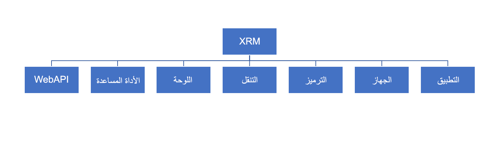

تتيح لك البرمجة النصية للعميل استخدام JavaScript في تطبيقات Power Apps المستندة إلى نموذج لتنفيذ منطق أعمال مخصص. يجب استخدام البرمجة النصية للعميل كبديل عندما لا تفي قواعد العمل التعريفية بالمتطلبات. تعمل البرمجة النصية للعميل على نموذج يستند إلى نموذج استجابة لأحداث النموذج. فيما يلي الأحداث الأكثر شيوعاً التي يمكنك تسجيل معالجات الأحداث لها:

-   تحميل النموذج

-   تغيير البيانات في عمود

-   يتم حفظ النموذج

بالإضافة إلى ذلك، يمكن تكوين زر شريط أوامر لاستدعاء وظيفة برنامج نصي للعميل عند الضغط عليه.

تتضمن بعض المهام الشائعة التي يمكن إنجازها باستخدام البرمجة النصية للعميل ما يلي:

-   الحصول على قيم العمود أو تعيينها في النموذج.

-   إظهار وإخفاء عناصر واجهة المستخدم.

-   مرجع عناصر تحكم متعددة لكل عمود.

-   التبديل بين النماذج حيث تتوفر نماذج متعددة لأحد الجداول.

-   افتح النماذج وطرق العرض ومربعات الحوار والتقارير.

-   التعامل مع التحكم في سير إجراءات العمل.

يمكن تطبيق التفاعل مع البيانات أو تغييرات محتوي النموذج أو تعديلات سلوك التطبيق فقط باستخدام واجهة برمجة تطبيقات البرمجة النصية للعميل المتوفرة. أثناء كتابة المنطق في JavaScript، من المهم ملاحظة أنه على الرغم من إنشاء النموذج باستخدام HTML القياسي، إلا أن المعالجة المباشرة لمحتوى النموذج غير مدعومة. توفر البرمجة النصية للعميل نموذج كائن مع أساليب للتفاعل مع مكونات النموذج المختلفة. يضمن ذلك عزل منطق عملك عن أي تغييرات في التخطيط أو HTML المحدد الذي يُستخدم في عرض النموذج. من المهم بنفس القدر أن تستخدم فقط الكائنات والوظائف الموثقة وليس أي شيء قد تكتشفه، حيث يمكن تغييرها أو حتى إزالتها في أي وقت. لمزيد من المعلومات حول التخصيصات المدعومة وغير المدعومة، راجع ممارسات إنشاء تطبيق [Microsoft Dataverse - Power Apps](/power-apps/developer/data-platform/customization-support?azure-portal=true#common-unsupported-customization-practices) في دليل مطور Dataverse.

فيما يلي البنية عالية المستوى لنموذج كائن API للعميل ومساحات الأسماء:

> [!div class="mx-imgBorder"]
> 

-   **تطبيق** - تمكين إضافة معالجات الأحداث لأي إخطارات على مستوى التطبيق.

-   **الجهاز** - يسمح، بموافقة، الوصول إلى محتوى الجهاز مثل الصور والفيديو والصوت والموقع والمزيد.

-   **الترميز** - الوصول السريع إلى وظائف ترميز/فك ترميز HTML.

-   **التنقل** - يوفر وظائف تنقل مستقلة عن النظام الأساسي بما في ذلك الحوارات والنماذج والملفات وعناوين URL المفتوحة.

-   **اللوحة** - تعرض صفحة الويب التي يمثلها عنوان URL في المنطقة الثابتة في الجزء الجانبي، والتي تظهر في جميع الصفحات في عميل الويب للتطبيقات المستندة إلى نموذج.

-   **الأداة المساعدة** - مجموعة وظائف الأداة بما في ذلك الوصول إلى بيانات التعريف والعديد من كائنات السياق.

-   **WebAPI** - يوفر خصائص ووظائف لاستخدام Web API لإنشاء السجلات وإدارتها وتنفيذ إجراءات ووظائف Web API.

مفهوم رئيسي آخر رفيع المستوى هو كائنات السياق المتوفرة إما كمعلمات معالج الأحداث أو يمكن استرجاعها باستخدام طرق خاصة. تساعد كائنات السياق هذه في تجنب كتابة التعليمات البرمجية التي تكون مرتبطة بتخطيط عنصر تحكم نموذج معين أو عنصر تحكم محدد. فيما يلي السياقات التي ستعمل معها:

-   **التنفيذ** - يحدد سياق الحدث الذي يتم تنفيذ التعليمات البرمجية فيه. يتم تمرير سياق التنفيذ عند وقوع حدث في نموذج أو شبكة، والتي يمكنك استخدامها في معالج الأحداث لأداء مهام مختلفة مثل تحديد formContext أو gridContext أو إدارة حدث الحفظ.

-   **النموذج** - يوفر مرجعاً للنموذج أو إلى صنف في النموذج، مثل عنصر تحكم عرض سريع أو صف في شبكة قابلة للتحرير، مقابل تنفيذ التعليمات البرمجية الحالية. يتم استرداد سياق النموذج باستخدام طريقة getFormContext() لسياق التنفيذ أو يتم تضمينه كوسيطة عند تنفيذ التعليمات البرمجية من إجراء الشريط. يحتوي سياق النموذج على مساحات الأسماء الرئيسية التالية بداخله:

    -   **البيانات** - يتيح ذلك الوصول إلى البيانات لصف الجدول الذي يتم تقديمه في نموذج. وتتضمن وظائف مثل الحفظ والتحديث. على سبيل المثال، formContext.data.entity.save("saveandnew‎")‎;‎

    -   **واجهة المستخدم** - يسمح لك هذا بمعالجة عناصر التحكم في النموذج مثل علامات التبويب والمقاطع وعناصر التحكم. تشمل المهام الشائعة إخفاء وإظهار والعمل المطلوب أو غير المطلوب. على سبيل المثال، formContext.ui.refreshRibbon(true)؛

-   **الشبكة** - توفر معلومات السياق لمعالجات الأحداث المسجلة في الشبكات الفرعية في نموذج.

كما يمكنك أن تقول على الأرجح من الأوصاف عالية المستوى أن API للبرمجة النصية للعميل يمنحك مرونة كبيرة في تنفيذ منطق العميل. من المهم أن تتذكر على الرغم من أن المنطق المطبق مع البرمجة النصية من جانب العميل يتم فرضه فقط عندما يستخدم المستخدم التطبيق. في كثير من الحالات، يجب إقران البرمجة النصية للعميل بالتنفيذ من جانب الخادم لضمان فرض المنطق دائماً بغض النظر عن الطريقة المستخدمة للوصول إلى البيانات والوظائف. في بقية هذه الوحدة النمطية، سوف نتعمق أكثر في كيفية استخدام البرمجة النصية للعميل.
