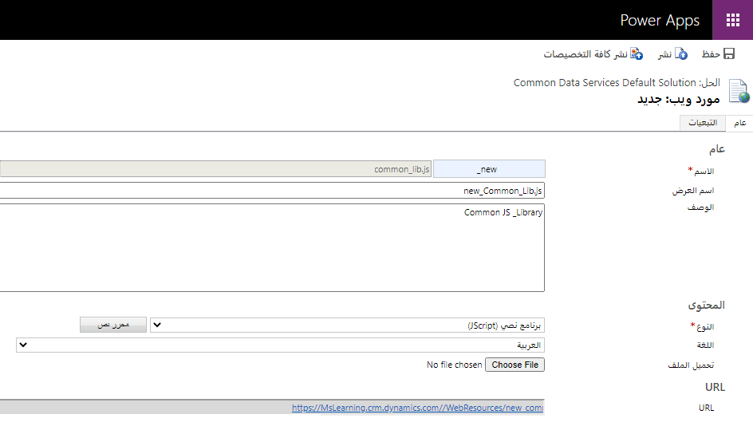
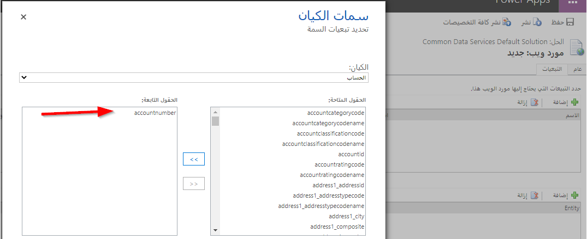
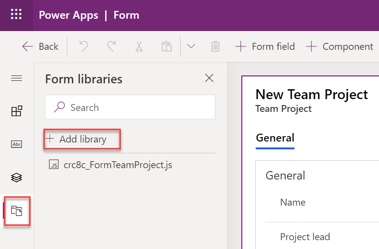
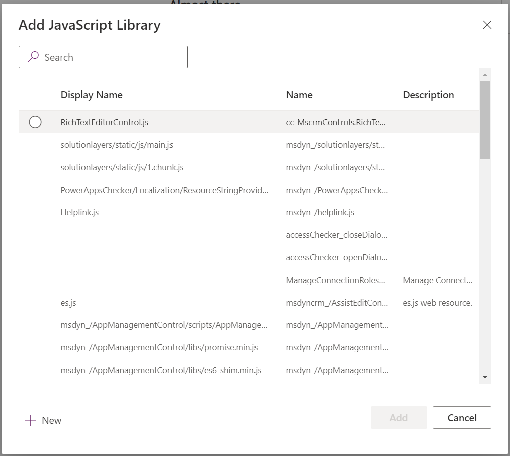

لاستخدام البرمجة النصية للعميل في أحد البرامج النصية، يجب أولاً تحميل مورد ويب لبرنامج نصي. يمكن استخدام موارد الويب لبرنامج نصي للمحافظة على مكتبات وظائف البرنامج النصي الخاصة بالعميل التي يتم كتابتها إما في JavaScript أو TypeScript والتي يمكن الوصول اليها من خلال نموذج تطبيق يستند إلى النموذج أو من تعريف شريط الأوامر. عند استخدام لغة TypeScript، يجب تحويلها إلى JavaScript قبل تحميلها كمورد ويب.

لتحميل مورد ويب لبرنامج نصي، قم بإنشاء مكتبة نماذج جديدة من محرر النماذج.

> [!div class="mx-imgBorder"]
> 

تأكد من تحديد برنامج نصي (JScript) كنوع.

> [!div class="mx-imgBorder"]
> 

 لكي تكون بيانات عمود الجدول متاحة لاستخدام برنامج نصي، يجب تمثيل العمود بواسطة عنصر تحكم في النموذج. بالإضافة إلى الحاجة إلى إضافة العمود كعنصر تحكم في النموذج، فأنت معرض لخطر قيام شخص ما بإزالته والتسبب في تعطل البرنامج النصي لأن العمود المشار إليه لم يعد متاحاً. للتأكد من توفر بيانات الأعمدة دائماً لبرنامج نصي، يمكنك إضافة العمود كتبعية. تعرض الصورة التالية إضافة العمود "رقم العميل" من جدول الحساب كتبعية.

> [!div class="mx-imgBorder"]
> 

## تبعيات موارد الويب

بالإضافة إلى تبعيات البيانات، يمكنك كذلك تكوين التبعيات على موارد الويب الأخرى. سيؤدي ذلك إلى توفير الوقت وتسهيل تحميل المنطق لأنك لن تحتاج إلى تحميل موارد الويب المستقلة بشكل صريح عند تسجيل برنامج نصي لحدث نموذج، أو أمر الشريط، أو شريط تمكين القواعد. باستخدام تكوين التبعية، يمكنك فقط تسجيل البرنامج النصي الأساسي والسماح لتكوين التبعية بتحميل الموارد الأخرى التي تعتمد عليها التعليمات البرمجية.

من المهم ملاحظة أن تبعيات موارد الويب لا توفر أي تحكم في الترتيب الذي يتم به تحميل موارد الويب. يتم تحميل كافة موارد الويب بشكل غير متزامن وبالتوازي. إذا كان لديك مورد ويب JavaScript، والذي يعتمد على مورد ويب JavaScript آخر ليتم تحميله وتهيئته قبل أن تتم تهيئته، فستحتاج إلى إدارة هذه التبعية بطريقة أخرى.

## استخدام مكتبات البرامج النصية للعميل

بمجرد تكوين مكتبات البرامج النصية للعميل كمورد ويب للبرنامج النصي، يمكن ربطها بأوامر الشريط وأحداث النموذج. لإقران برنامج نصي بنموذج، انقر على **مكتبات النموذج** في شريط الأدوات ثم **إضافة مكتبة**.

> [!div class="mx-imgBorder"]
> 

من مربع الحوار "إضافة مكتبة"، يمكنك إما إقران مورد ويب لبرنامج نصي تم تحميله حالياً أو إنشاء مورد جديد.

> [!div class="mx-imgBorder"]
> 

لا يلزم إقران مكتبة البرنامج النصي بالنموذج إلا مرة واحدة لكل برنامج نصي لكل نموذج بغض النظر عن عدد معالجات الأحداث التي تسجلها في هذا النموذج.

بينما تقوم بإنشاء منطق البرنامج النصي للعميل وتحتاج إلى إجراء تغييرات بعد التحميل الأولي، ستعود إلى مورد ويب لبرنامج نصي في الحل وتقوم بتحميل الإصدار الجديد من الملف. وبعد التحميل، ستحتاج إلى التأكد من نشر مورد ويب لبرنامج نصي، بحيث يتم استخدام أحدث التغييرات بواسطة التطبيق.
