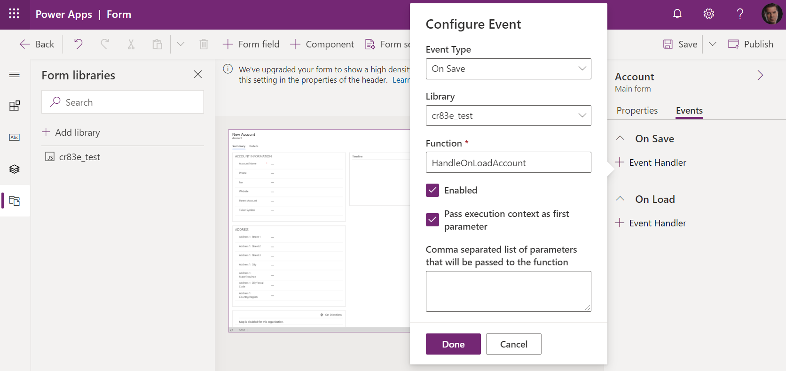
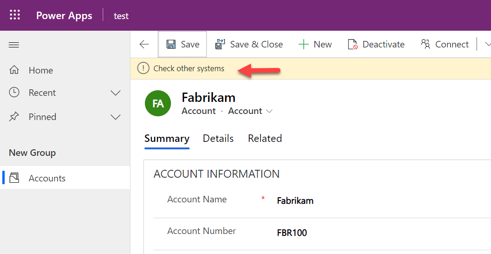

يتم تشغيل منطق البرمجة النصية للعميل كمعالجات أحداث لأحداث النموذج. يجب عليك تسجيل معالجات الأحداث الخاصة بك حتى يتم تنفيذ المنطق الخاص بك. يمكن القيام بالتسجيل للأحداث الشائعة من خلال مربع حوار خصائص النموذج أو من التعليمات البرمجية. يمكن تسجيل بعض الأحداث من التعليمات البرمجية فقط. يمكن تشغيل معالجات الأحداث على عدة نماذج ولكن يجب تسجيلها بشكل منفصل لكل واحدة.

## <a name="registering-via-form-properties"></a>التسجيل من خلال خصائص النموذج

يؤدي تسجيل معالجات الأحداث باستخدام خصائص النموذج إلى إنشاء تكوين ثابت لمعالجات الأحداث في وقت التصميم. في كل مرة يتم فيها استخدام النموذج، سيتم تكوين معالجات الأحداث نفسها للتشغيل في كل مرة على عكس ما يحدث عند تسجيل معالج الحدث باستخدام التعليمات البرمجية، حيث يمكن أن يكون لديك منطق يحدد ما يجب تسجيله.

في مصمم النموذج، يمكنك تسجيل معالجات الأحداث للأحداث التالية:

-   **نموذج** - يسمح لك هذا بتسجيل معالجات الأحداث OnLoad وOnSave.

-   **علامات التبويب** - تسمح لك بتسجيل الأحداث لكل علامة تبويب في النموذج لتغيير حالة علامة التبويب. يُستخدم هذا عادةً لمعرفة ما إذا كان قد تم توسيع علامة التبويب بحيث يمكنك القيام بشيء مثل تحميل البيانات ديناميكياً.

-   **الأعمدة** - تسمح لك بتسجيل معالج حدث إذا تم تغيير بيانات العمود.

فيما يلي مثال على تسجيل معالج حدث OnLoad لجدول العميل.

> [!div class="mx-imgBorder"]
> [](../media/configure-event.png#lightbox)

أحد الأنماط الشائعة هو تسجيل معالج OnLoad ثم تسجيل معالجات الأحداث المتبقية عبر التعليمات البرمجية في منطق معالج الأحداث OnLoad. تكمن فائدة هذا النهج في أنه عندما يتم استخدام المنطق الخاص بك في نماذج متعددة، فلن تضطر إلى تسجيل جميع معالجات الأحداث في كل نموذج. والميزة الأخرى هي أنه إذا كنت بحاجة إلى تحديد بعض معالجات الأحداث ديناميكياً، فيمكنك استخدام المنطق لتحديد ما إذا كنت تريد تسجيل معالج أم لا. على سبيل المثال، قد ترغب في تخطي تسجيل معالج الأحداث لعمود إذا كان بإمكانك تحديد ما إذا كان هذا العمود للقراءة فقط أم مخفياً عند تحميل النموذج.

## <a name="registering-using-code"></a>التسجيل باستخدام التعليمات البرمجية

يمكن تسجيل معالجات الأحداث باستخدام التعليمات البرمجية لجميع المعالجات باستثناء OnLoad، والذي يجب تسجيله باستخدام التكوين. يمكن بعد ذلك استخدام معالج OnLoad لتسجيل معالجات أخرى في التعليمات البرمجية. فيما يلي مثال على تسجيل معالج OnChange على عمود رقم العميل في جدول العميل مع تنفيذ الخطوات التالية:

-   قم بإنشاء وظيفة يتم تشغيلها في OnLoad من نموذج العميل.

-   في هذه الوظيفة، قم باستدعاء addOnChange لتسجيل الوظيفة للاتصال عندما يتغير عمود رقم العميل.

-   قم بالتسجيل في خصائص نموذج العميل معالج الأحداث OnLoad.

```javascript
function LearnLab_handleAccountOnLoad(executionContext)
{  
    var formContext = executionContext.getFormContext();
    formContext.getAttribute('accountnumber').addOnChange(LearnLab_handleOnChangeAccountNumber)
}
function LearnLab_handleOnChangeAccountNumber(executionContext)
{  
    var formContext = executionContext.getFormContext();
    formContext.ui.setFormNotification('Check other systems', 'INFO', 'AcctNumber');
}
```

ستعرض هذه التعليمات البرمجية إعلاماً على مستوى النموذج كلما تم تغيير بيانات عمود رقم العميل.

> [!div class="mx-imgBorder"]
> [](../media/notification.png#lightbox)

هناك العديد من [الأحداث الجانبية الأخرى الخاصة بالعميل](/power-apps/developer/model-driven-apps/clientapi/reference/events/?azure-portal=true) والتي يمكنك تسجيل معالجيها.
