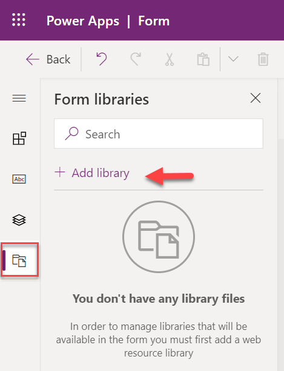

## <a name="exercise-1-business-rules"></a>التمرين 1: قواعد العمل 

ستقوم، في هذا التمرين، بإنشاء قواعد عمل من شأنها تغيير متطلبات حقل موقع المراقبة استنادًا إلى قيمة حقل نوع الملاحظة.

> [!NOTE]
> تحتاج إلى تثبيت الحلول كما هو موضح في التمرين المعملي [تثبيت حزمة Package Deployer]( /learn/modules/use-developer-tools-extend/4-exercise/?azure-portal=true) من وحدة سابقة، لإكمال هذا التمرين. 

### <a name="task-1-create-a-location-required-business-rule"></a>المهمة 1: إنشاء قاعدة عمل مطلوبة لموقع ما

في هذه المهمة، ستقوم بإنشاء قاعدة عمل تجعل حقل موقع المراقبة مطلوبًا إذا كان نوع المراقبة عبارة عن لعبة أو ممارسة.

1.  انتقل إلى [https://make.powerapps.com/](https://make.powerapps.com/?azure-portal=true) وتأكد أنك لست في البيئة الافتراضية.

2.  حدد **الحلول** ثم افتح **حل الفئة**.

> 

3.  حدد **إضافة الحالي** وحدد **الجدول**.

> 

4.  حدد الجدول **تقرير دليل الأماكن** وحدد **التالي**.

> 

5.  حدد الزر **تحديد المكونات**.

> 

6.  حدد علامة التبويب **نماذج**، ثم حدد النموذج **معلومات**، ثم حدد **إضافة**.

> 

7.  حدد **إضافة** مرة أخرى.

8.  حدد لفتح الجدول **تقرير دليل الأماكن**.

> 

9.  حدد علامة التبويب **قواعد العمل** وحدد **إضافة قاعدة عمل**.

> 

10. حدد **إظهار التفاصيل**.

> 

11. أدخل **متطلب الموقع** لـ **اسم قاعدة العمل** ثم حدد **إخفاء التفاصيل**.

> 

12. حدد **الحالة**، ثم انتقل إلى علامة التبويب **خصائص** وأدخل **التحقق من الممارسة / اللعبة** في حقل **اسم العرض**.

> 

13. قم بتعيين **القواعد** كما هو موضح في الشكل التالي، ثم حدد **تطبيق**.

> 

14. حدد **إضافة** ثم حدد **إضافة مجموعة الأعمال المطلوبة**.

> 

15. أضف الإجراء إلى الجانب الحقيقي من الحالة.

> 

16. حدد الإجراء الجديد وأدخل **الموقع المطلوب** في الحقل **اسم العرض**.

> 

17. حدد **موقع المراقبة** لـ **الحقل**، حدد **العمل المطلوب** لـ **الحالة** ثم حدد **تطبيق**.

> 

18. حدد علامة التبويب **المكونات**، واسحب الإجراء **أعمال المجموعة المطلوبة** وقم بإفلاته على الجانب الخاطئ من الحالة.

> 

19. حدد الإجراء الجديد وأدخل **إزالة المتطلب** في الحقل **اسم العرض**.

> 

20. حدد **موقع المراقبة** لـ **الحقل**، حدد **العمل غير المطلوب** لـ **الحالة** ثم حدد **تطبيق**.

> 

يجب أن تشبه قاعدة عملك الصورة التالية.

> 

21. حدد **حفظ**.

> 

22. سيتم التحقق من صحة قاعدة عملك وحفظها. تأكد أن عملية التحقق من الصحة ناجحة.

> 

23. حدد **تنشيط**.

24. قم بتأكيد التنشيط بتحديد **تنشيط** مرة أخرى.

26. أغلق علامة تبويب مستعرض محرر قاعدة العمل.

27. حدد **تم**. لا تغادر هذه الصفحة.

> 

### <a name="task-2-test-business-rules"></a>المهمة 2: اختبار قواعد العمل

ستختبر قواعد العمل التي قمت بإنشائها في هذه المهمة.

1.  حدد **التطبيقات** وحدد لفتح تطبيق **Scout Zone**.

> 

2.  حدد **تقارير دليل الأماكن** وافتح واحدًا من السجلات.

> 

3.  تأكد من عدم تحديد أي شيء لـ **نوع المراقبة** ولاحظ أن حقل **موقع المراقبة** لا يجب أن يكون مطلوبًا.

> 

4.  حدد **لعبة** لـ **نوع المراقبة**. يجب أن يصبح **موقع المراقبة** حقلاً مطلوبًا.

> 

5.  حدد **أخرى** لـ **نوع المراقبة**. يجب إلغاء متطلب **موقع المراقبة**.

> 

6.  حدد **ممارسة** لـ **نوع المراقبة**. يجب أن يصبح **موقع المراقبة** مطلوبًا مرة أخرى.

> 

7.  حدد **حفظ**. يفترض أنك لم تتمكن من حفظه حتى تقدّم قيمة لـ **موقع المراقبة**. يجب أن تتلقى أحد إخطارات الحقول في الحقل المطلوب وأحد إخطارات النموذج.

> 

## <a name="exercise-2-form-and-field-notifications"></a>التمرين 2: إعلامات النموذج والحقل 

ستقوم في هذا التمرين بإنشاء برنامج نصي يعرض نموذجًا وإعلامًا بالحقل إذا تم تحديد **أخرى** لنوع المراقبة.

### <a name="task-1-find-field-names-and-option-set-values"></a>المهمة 1: البحث عن أسماء الحقول وقيَم مجموعة الخيارات

في هذه المهمة، ستحدد أسماء نوع المراقبة وحقول موقع المراقبة، ثم تدوّن قيم مجموعة خيارات نوع المراقبة.

1.  انتقل إلى [https://make.powerapps.com/](https://make.powerapps.com/?azure-portal=true) وتأكد أنك لست في البيئة الافتراضية.

2.  حدد **الحلول** وحدد لفتح **الحل الافتراضي**.

> 

3.  حدد **الجدول** ثم ابحث عن وحدد لفتح جدول **تقرير دليل الأماكن**.

> 

4.  حدد علامة التبويب **العمود**، ثم حدد العمود **نوع المراقبة**.

> 

5.  انتقل إلى لوحة الخصائص، وقم بتدوين الحقل **الاسم** وحدد **تحرير مجموعة الخيارات**. هذا هو الحقل الذي ستتحقق منه في البرنامج النصي الخاص بك.

> 

6.  حدد الزر **أخرى ...**.

> 

7.  حدد **عرض المزيد**.

> 

8.  لاحظ أن **القيمة** وحدد **إلغاء الأمر**. هذه هي القيمة التي ستتحقق منها في البرنامج النصي الخاص بك.

> 

9.  حدد **إلغاء** مرة أخرى.

10. أدخل **الملخص** في الحقل **اسم العرض**، لاحظ أن الحقل **الاسم** ثم حدد **إلغاء الأمر**. هذا هو الحقل الذي سيظهر فيه الإعلام.

> 

### <a name="task-2-create-form-and-field-notifications"></a>المهمة 2: إنشاء إعلامات النموذج والحقل

في هذه المهمة، ستستخدم Visual Studio Code لإنشاء برنامج نصي سيعرض إعلامات النموذج والحقول إذا تم تحديد **أخرى** لـ **نوع المراقبة**.

1. ابدأ تشغيل Visual Studio Code وحدد **المستكشف**.

> 

2. حدد **فتح المجلد**.

> 

3. قم بإنشاء مجلد جديد وقم بتسميته **موارد تسمانيا**.

> 

4. حدد المجلد وحدد الزر **تحديد المجلد**.

> 

5. حدد الأيقونة **مجلد جديد**.

> 

6. قم بتسمية المجلد الجديد **البرامج النصية**.

> 

7. انقر بزر الماوس الأيمن فوق مجلد **البرامج النصية** وحدد **ملف جديد**.

> 

8. قم بتسمية الملف الجديد باسم **FormFieldNotification.js**.

> 

9. أضف جزء التعليمة البرمجية المتكررة التالي إلى الملف. هذه هي الدالة التي ستستدعيها عندما يتغير نوع المراقبة.
    ```JavaScript
    function OnObservationTypeChange(executionContext) {
    
    }
    ```

10. ستحصل أولاً على سياق النموذج من سياق التنفيذ ثم تحصل على القيمة المحددة لنوع المراقبة. أضف جزء التعليمة البرمجية المتكررة التالي داخل الدالة. اسم حقل نوع المراقبة هو: **tt_observationtype**.

    ```JavaScript
    var formContext = executionContext.getFormContext();
    
    var selectedObservationType =
    formContext.getAttribute("tt_observationtype").getValue();
    ```

> 

11. تحقق من قيمة نوع المراقبة المحدد، ثم أضف جزء التعليمة البرمجية المتكررة التالي إلى الدالة. قيمة الخيار الآخر هي **206340002** (دون فاصلات).

    ```JavaScript
    if (selectedObservationType == 206340002)
    
    {
    
    }
    ```

12. أظهر إعلام النموذج إذا تم تقييم القيمة إلى true. أضف جزء التعليمة البرمجية المتكررة التالي داخل الدالة `if` statement. الأنواع الثلاثة لإعلامات النموذج هي INFO وWARNING وERROR. يُظهر كل نوع إعلام أيقونة ولونًا مختلفين.

    ```JavaScript
    formContext.ui.setFormNotification("Please provide a detailed summary
    of your findings", "INFO", "5001");
    ```

13. لمشاهدة جميع أنواع إعلامات النماذج وكيفية عرض إعلامات النماذج المتعددة، أضف جزء التعليمة البرمجية المتكررة بعد آخر إعلام. الوسيطة الأولى هي الرسالة، والثانية هي النوع، والثالثة هي معرّف الإعلام، والذي يستخدم لتغيير الإعلام أو مسحه.

    ```JavaScript
    formContext.ui.setFormNotification("Test for warning", "WARNING",
    "5002");
    
    formContext.ui.setFormNotification("Test for error", "ERROR",
    "5003");
    ```

> 

14. قم بتعيين إعلام الحقل لحقل **الملخص**، وأضف جزء التعليمة البرمجية المتكررة التالي داخل `if` statement. اسم الحقل **الملخص** هو: **tt_summary**.

    ```JavaScript
    formContext.getControl("tt_summary").setNotification("Please provide
    a detailed summary of your findings","6001")
    ```

   من المفترض أن يبدو البرنامج النصي الخاص بك الآن مثل الصورة الآتية.

> 

15. حدد **الملف** ثم حدد **حفظ الكل**.

### <a name="task-3-add-resource-to-solution"></a>المهمة 3: إضافة مورد إلى الحل

ستضيف في هذه المهمة البرنامج النصي الذي قمت بإنشائه إلى حل Class ثم تأكد من استدعاء دالتك عندما يتغير نوع المراقبة.

1.  انتقل إلى [https://make.powerapps.com/](https://make.powerapps.com/?azure-portal=true) وتأكد أنك لست في البيئة الافتراضية.

2.  حدد **الحلول** ثم افتح **حل الفئة**.

> 

3.  حدد **جديد > أخرى > مورد الويب**.

> 

4.  أدخل **FormFieldNotification** لـ **Name** و **Form Field Notification** لـ **اسم العرض** وحدد **Script (Jscript)** لـ **النوع** ثم حدد **استعراض**.

> 

5.  حدد البرنامج النصي الذي قمت بإنشائه وحدد **فتح**.

> 

6.  حدد **حفظ**.

7.  حدد **نشر** وانتظر حتى اكتمال النشر.

8.  أغلق علامة تبويب مستعرض محرر مورد الويب.

9.  حدد **تم**.

> 

10. حدد لفتح الجدول **تقرير دليل الأماكن**.

> 

11. حدد علامة التبويب **النماذج** وافتح النموذج **معلومات**.

> 

12. حدد **تبديل إلى الوضع التقليدي**.

> 

13. حدد **خصائص النموذج**.

> 

14. حدد **إضافة مكتبة**.

> 

15. ابحث عن **tt** وحدد **tt_FormFieldNotification** وحدد **إضافة**.

> 

16. انتقل إلى قسم **معالجات الأحداث** وحدد **نوع المراقبة** لـ **التحكم** وحدد **OnChange** لـ **الحدث** ثم حدد **إضافة**.

> 

17. حدد **tt_FormFieldNotification** for **Library** وأدخل **OnObservationTypeChange** لـ **الدالة** وحدد خانة الاختيار **تمرير سياق التنفيذ كمعامل أول** ثم حدد **موافق**. هذا هو اسم الدالة التي قمتَ بإنشائها.

> 

18. حدد **موافق** مرة أخرى.

19. حدد **حفظ**.

> 

20. حدد **نشر**.

21. أغلق علامة تبويب مستعرض محرر النماذج الكلاسيكي.

22. أغلق علامة تبويب مستعرض محرر النماذج للمعاينة.

23. حدد **تم**.

### <a name="task-4-test-your-work"></a>المهمة 4: اختبار العمل

1.  انتقل إلى [https://make.powerapps.com/](https://make.powerapps.com/?azure-portal=true) وتأكد أنك لست في البيئة الافتراضية.

2.  حدد **التطبيقات** وافتح تطبيق **Scout Zone**.

> 

3.  حدد **تقارير دليل الأماكن** وافتح واحدًا من السجلات.

> 

4.  يجب أن تكون القيمة الافتراضية لـ **نوع المراقبة** **أخرى**. لن تكون إعلامات النموذج والحقول مرئية لأنه سيتم تشغيل البرنامج النصي فقط عندما يتغير **نوع المراقبة**. ستتأكد في المهمة التالية من تشغيل البرنامج النصي عند تحميل النموذج.

> 

5.  قم بتغيير **نوع المراقبة** إلى **لعبة** ثم قم بتغييرها مرة أخرى إلى **أخرى**. ستشاهد الآن إعلام النموذج.

> 

6.  حدد زر الرتبة العسكرية لمشاهدة جميع أنواع الإعلامات. ستقوم بإزالة إعلام الاختبار في المهمة التالية.

> 

7.  حدد علامة تبويب **الملخص** في النموذج. يجب أن تشاهد العمود.
    الإعلام

> 

8.  ارجع إلى علامة التبويب **عام** وقم بتغيير **نوع المراقبة** إلى **لعبة**. لم يتم تحديد **أخرى** لـ **نوع المراقبة**، لكن الإعلامات لن تختفي. ستستخدم إصلاح هذه المشكلة في المهمة التالية.

> 

### <a name="task-5-update-script"></a>المهمة 5: تحديث البرنامج النصي

في هذه المهمة، ستتأكد من تشغيل دالتك عند تحميل النموذج، وإزالة إعلامات نموذج الاختبار، ثم مسح الإعلام إذا لم يتم تحديد **أخرى** لـ **نوع المراقبة**.

1.  انتقل إلى Visual Studio Code.

2.  قم بإزالة إعلامات نموذج الاختبار. من المفترض أن تبدو if statement الآن مثل الصورة الآتية.

> 

3.  قم بإضافة العبارة `else` التي ستمسح الإعلامات ثم إضافة جزء التعليمة البرمجية المتكررة التالي بعد العبارة `if` statement. تأكد من تطابق المعرفين "5001&quot; و&quot;6001&quot; مع معرفات الإعلامات التي قمت بإنشائها.

    ```JavaScript
    else
    
    {
    
    formContext.ui.clearFormNotification(&quot;5001");
    
    formContext.getControl("tt_summary").clearNotification("6001");
    
    }
    ```

> 

4.  حدد **الملف > حفظ باسم**.

5.  انتقل إلى [https://make.powerapps.com/](https://make.powerapps.com/?azure-portal=true) وتأكد أنك لست في البيئة الافتراضية.

6.  حدد **الحلول** ثم افتح **حل الفئة**.

7.  حدد لفتح مورد الويب **إعلام حقل النموذج**.

> 

8.  حدد **استعراض**.

> 

9.  حدد ملف البرنامج النصي وحدد **فتح**.

> 

10. حدد **حفظ**.

11. حدد **نشر** وانتظر حتى اكتمال النشر.

12. أغلق علامة تبويب مستعرض محرر مورد الويب.

13. حدد **تم**.

14. حدد لفتح الجدول **تقرير دليل الأماكن**.

> 

15. حدد علامة التبويب **النماذج** وافتح النموذج **معلومات**.

16. حدد **تبديل إلى الوضع التقليدي**.

> 

17. حدد **خصائص النموذج**.

> 

18. انتقل إلى قسم معالجات الأحداث، وتأكد من تحديد **النموذج** لـ **التحكم** و **OnLoad** لـ **الحدث** ثم تحديد **إضافة**.

> 

19. حدد **tt_FormFieldNotification** for **Library** وأدخل **OnObservationTypeChange** لـ **الدالة** وحدد خانة الاختيار **تمرير سياق التنفيذ كمعامل أول** ثم حدد **موافق**.

> 

20. حدد **موافق** مرة أخرى.

21. حدد **حفظ**.

22. حدد **نشر** وانتظر حتى اكتمال النشر.

23. حدد **حفظ وإغلاق** لإغلاق محرر النموذج الكلاسيكي.

24. أغلق علامة تبويب مستعرض محرر النماذج للمعاينة.

25. حدد **تم**.

> 

### <a name="task-6-test-changes"></a>المهمة 6: اختبار التغييرات

ستختبر في هذه المهمة التغييرات التي أجريتها في المهمة السابقة.

1.  حدد **التطبيقات** وافتح تطبيق **Scout Zone**.

2.  حدد **تقارير دليل الأماكن** وافتح واحدًا من السجلات.

> 

3.  يجب الآن تشغيل الدالة، ويجب عرض إعلام النموذج. يجب أن يكون لديك إعلام واحد فقط.

> 

4.  حدد علامة التبويب **الملخص**. يجب أن يحتوي الحقل على إعلام.

> 

5.  ارجع إلى علامة التبويب **عام** وقم بتغيير **نوع المراقبة** إلى **لعبة**. يجب تشغيل الدالة مرة أخرى، ويجب مسح إعلامات النموذج.

> 

6.  حدد **الملخص** وتأكد أن الإعلام لم يعد ظاهرًا.

> 
