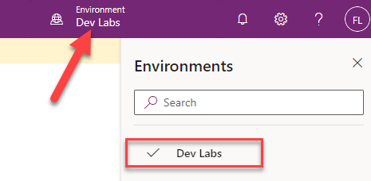
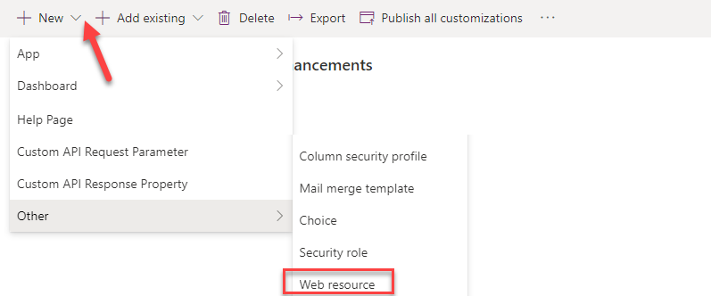

في هذا التمرين، ستستخدم البرنامج النصي للعميل لتنفيذ متطلبات العمل لإخفاء قسم الحالة عندما يكون تاريخ بدء المشروع غير متوفر أو في المستقبل.

> [!IMPORTANT]
> استخدم بيئة اختبار مع توفير Microsoft Dataverse وعينات التطبيقات الممكنة. وإذا لم يتوفر لديك، فيمكنك الاشتراك في [خطة المجتمع](https://powerapps.microsoft.com/communityplan/?azure-portal=true).

## <a name="task-1---prepare-solution-with-the-form"></a>المهمة 1 - إعداد الحل مع النموذج

في هذه المهمة، ستقوم بإنشاء حل وإضافة جدول موجود إلى الحل وإضافة أعمدة جديدة وإعداد النموذج الرئيسي للجدول الذي أضفته إلى الحل.

1.  انتقل إلى [Power Apps مدخل المنشيء](https://make.powerapps.com/?azure-portal=true) وتأكد من أنك في البيئة الصحيحة التي تم فيها تمكين عينة التطبيقات.

    > [!div class="mx-imgBorder"]
    > [](../media/environment-name.png#lightbox)

1.  حدد **الحلول** وانقر فوق **+ حل جديد**.

1.  أدخل **تحسينات تحدي الابتكار"** لـ **اسم العرض** وحدد **ناشر CDS الافتراضي** لـ **الناشر** ثم انقر فوق **إنشاء**.

    > [!div class="mx-imgBorder"]
    > [](../media/new-solution.png#lightbox)

1.  انقر لفتح حل **تحسينات تحدي الابتكار** الذي قمت بإنشائه.

1.  انقر فوق **+ إضافة حالي** وحدد **الجدول‏‎**.

1.  أدخل "فريق" في مربع نص البحث، وحدد **مشروع الفريق** ثم انقر فوق **التالي**.

    > [!NOTE]
    > إذا لم تتمكن من تحديد موقع جدول **مشروع الفريق**، فقد لا يكون لديك عينات تطبيقات في البيئة الخاصة بك. حدد بيئة أخرى أو قم بإنشاء بيئة جديدة باستخدام عينات التطبيقات المثبتة.

1.  ‏‏انقر فوق **تحديد المكونات**.

    > [!div class="mx-imgBorder"]
    > [](../media/select-components.png#lightbox)

1.  حدد علامة تبويب **النماذج**، ثم حدد نموذج **معلومات** من أجل **نوع النموذج** الرئيسي ، ثم انقر فوق **إضافة**.

    > [!div class="mx-imgBorder"]
    > [](../media/add-component.png#lightbox)

1.  انقر فوق **إضافة** مرة أخرى.

1. انقر لفتح جدول **مشروع الفريق** الذي أضفته إلى الحل للتو.

1. حدد علامة تبويب **النماذج** وانقر لفتح نموذج **المعلومات** من **نوع النماذج** الرئيسي.

    > [!div class="mx-imgBorder"]
    > [](../media/information.png#lightbox)

1. حدد قسم **الحالة**.

    > [!div class="mx-imgBorder"]
    > [](../media/status.png#lightbox)

1. في جزء **الخصائص**، قم بتغيير **الاسم** إلى **section\_status**، وقم بالتحقق من خانة الاختيار **إخفاء**. بشكلٍ افتراضي، يتم تعيين GUID كاسم للقسم. وسيتم تغييره إلى اسم ذي معني بالنسبة لك والذي سيشار إليه في البرامج النصية. ستقوم أيضًا بإخفاء القسم بشكلٍ افتراضي لتقليل التأثير المزعج الناتج عن إظهاره ومن ثمَّ إخفائه عند تحميل النموذج.

    > [!div class="mx-imgBorder"]
    > [](../media/hide.png#lightbox)

1. انتقل إلى طريقة عرض الشجرة وحدد علامة تبويب **عام**.

    > [!div class="mx-imgBorder"]
    > [](../media/general.png#lightbox)

1. في جزء "الخصائص"، قم بتغيير **الاسم** إلى **tab\_general**.

1. حدد عمود **بدء المشروع**.

    > [!div class="mx-imgBorder"]
    > [](../media/project-start.png#lightbox)

1. انتقل إلى جزء **الخصائص** وانقر فوق الزر **(i)** الموجود بجانب اسم **عمود الجدول**.

1. انسخ **الاسم المنطقي** (**sample\_projectstart**) والصقه في مفكرة. ستستخدم هذا الاسم في البرنامج النصي للإشارة إلى عمود البيانات.

    > [!div class="mx-imgBorder"]
    > [](../media/information-button.png#lightbox)

1. انقر فوق **حفظ** لحفظ التغييرات.

1. انقر فوق زر **رجوع**.

    > [!div class="mx-imgBorder"]
    > [](../media/back.png#lightbox)

1. حدد الحلول.

1. انقر فوق **نشر جميع التخصيصات** وانتظر حتى يكتمل النشر.

## <a name="task-2---build-the-client-script"></a>المهمة 2 - إنشاء برنامج نصي للعميل

في هذه المهمة، ستقوم بإنشاء برنامج نصي يقوم بإظهار / إخفاء قسم "الحالة" بناءً على تاريخ بدء المشروع.

قم بإخفاء قسم الحالة. إذا كان تاريخ بدء المشروع فارغًا أو في المستقبل، فإنه يعرض قسم "الحالة".

1.  قم ببدء مثيل جديد من Visual Studio Code أو استخدام محرر الكود المفضل لديك. يمكنك تنزيل كود [Visual Studio وتثبيته](https://code.visualstudio.com/?azure-portal=true).

1.  انقر فوق **فتح مجلد**.

    > [!div class="mx-imgBorder"]
    > [](../media/open-folder.png#lightbox)

1.  قم بإنشاء مجلد في مجلد المستندات وقم بتسميته **ClientScriptLab‎**.

1.  حدد مجلد **ClientScriptLab‎** الذي قمت بإنشائه ثم انقر فوق **تحديد مجلد**.

    > [!div class="mx-imgBorder"]
    > [](../media/select-folder.png#lightbox)

1.  مرِّر مؤشر الماوس فوق مجلد **CLIENTSCRIPTLAB‎** وانقر فوق **ملف جديد**.

    > [!div class="mx-imgBorder"]
    > [](../media/new-file.png#lightbox)

1.  قم بتسمية الملف **FormTeamProject.js**.

1.  أضف الدالات الموجودة أدناه إلى **FormTeamProject.js**. يجب أن يكون للدالات أسماء فريدة أو تستخدم مساحة اسم لضمان التفرد.

    ```javascript
    function LearnLab_handleTeamProjectOnLoad(executionContext) {
    
    }
    function LearnLab_handleProjectStatusOnChange(executionContext) {
    
    }
    function LearnLab_hideOrShowStatusSection(formContext) {
    
    }
    ```

1.  أضف البرنامج النصي الوارد أدناه إلى الدالة OnLoad‎. لاحظ اسم عمود بدء المشروع هنا sample\_projectstart. هذا هو الاسم المنطقي الذي قمت بحفظه سابقًا. يسجل هذا الكود معالج الأحداث onchange ويستدعي دالة مشتركة لإظهار / إخفاء القسم. يجب عليك معالجة "on change" في حالة تغيير إدخال تاريخ بدء المشروع لمتطلب الإخفاء/ الإظهار.

    ```javascript
    var formContext = executionContext.getFormContext();
    formContext.getAttribute('sample_projectstart').addOnChange(LearnLab_handleProjectStatusOnChange);
    LearnLab_hideOrShowStatusSection(formContext);
    ```

    > [!div class="mx-imgBorder"]
    > [](../media/onload-function.png#lightbox)

1.  أضف البرنامج النصي الوارد أدناه إلى الدالة OnChange‎. ويحصل هذا الكود ببساطة على formContext ثم يستدعي الدالة المشتركة للإخفاء/الإظهار.

    ```javascript
    var formContext = executionContext.getFormContext();
    LearnLab_hideOrShowStatusSection(formContext);
    ```

1. أضف البرنامج النصي الوارد أدناه إلى الدالة **hideOrShowStatusSection‎**. لاحظ أن اسم علامة التبويب هو **tab\_general** واسم القسم هو **section\_status** واسم العمود هو **sample\_projectstart**.

    ```javascript
    var tabGeneral = formContext.ui.tabs.get('tab_general');
    var sectionStatus = tabGeneral.sections.get('section_status');
    var startDate = formContext.getAttribute('sample_projectstart').getValue();
    var CurrentDate = new Date();
    if (startDate == null || startDate > CurrentDate) {
      sectionStatus.setVisible(false);
    } else {
      sectionStatus.setVisible(true);
    }
    ```

1. يجب أن يبدو البرنامج النصي الخاص بك الآن مثل الصورة الواردة أدناه.

    > [!div class="mx-imgBorder"]
    > [](../media/example-script.png#lightbox)

1. انقر فوق **الملف** و **حفظ**.

## <a name="task-3---upload-the-script"></a>المهمة 3: تحميل النص

في هذه المهمة، ستقوم بتحميل البرنامج النصي الذي قمت بإنشائه إلى البيئة الخاصة بك.

1.  انتقل إلى [Power Apps مدخل المنشيء](https://make.powerapps.com/?azure-portal=true) وتأكد من وجودك في البيئة الصحيحة.

1.  حدد **الحلول** وانقر لفتح حل **تحسينات تحدي الابتكار‬‏‫**.

1.  انقر فوق **+ جديد** وحدد **أخرى \|مَورد ويب**.

    > [!div class="mx-imgBorder"]
    > [](../media/new-web-resource.png#lightbox)

1.  أدخل **FormTeamProject.js** على أنه **اسم** وأدخل **FormTeamProject.js** على أنه **اسم العرض** وحدد **البرنامج النصي (JScript)** من أجل **النوع**، وانقر فوق **اختيار ملف**.

    > [!div class="mx-imgBorder"]
    > [](../media/choose-file.png#lightbox)

1.  حدد الملف **‎FormTeamProject.js** الذي أنشأته سابقًا وانقر فوق **فتح**.

1.  انقر فوق **حفظ**.

1.  أغلق علامة تبويب مستعرض محرر مورد الويب.

1.  انقر فوق **تم**.

1.  يجب أن يحتوي الحل الآن على جدول **مشروع الفريق** ومَورد ويب **‎FormTeamsProject.js**.

1.  لا تنتقل خارج هذه الصفحة.

## <a name="task-4---edit-form"></a>المهمة 4 - تحرير نموذج

في هذه المهمة، ستضيف مكتبة JavaScript إلى نموذج مشروع الفريق الرئيسي وستضيف معالج الأحداث إلى حدث OnLoad.

1.  تأكد من أنك لا تزال في حل **‬‏‫تحسينات تحدي الابتكار**.

1.  انقر لفتح جدول **مشروع الفريق**.

1.  حدد علامة تبويب **نماذج**، وحدد لفتح نموذج **المعلومات**.

1.  انتقل إلى جزء **الخصائص** وحدد علامة تبويب **الأحداث** ثم انقر فوق **+ إضافة مكتبة**.

    > [!div class="mx-imgBorder"]
    > [](../media/add-new-library.png#lightbox)

1.  أدخل "فريق" في مربع نص البحث واضغط على مفتاح الإدخال "Enter". حدد **FormTeamProject.js** وانقر فوق **إضافة**.

    > [!div class="mx-imgBorder"]
    > [](../media/javascript-library.png#lightbox)

1.  قم بتوسيع القسم **OnLoad** ثم انقر فوق **+ معالج الأحداث**.

    > [!div class="mx-imgBorder"]
    > [](../media/add-event-handler.png#lightbox)

1.  أدخل **LearnLab\_handleTeamProjectOnLoad** من أجل **الدالة** وتحقق من خانة الاختيار **‏‫تمرير سياق التنفيذ كمعلمة أولى‬** وانقر فوق **تم**.

    > [!div class="mx-imgBorder"]
    > [](../media/configure-event-details.png#lightbox)

1.  انقر فوق حفظ وانتظر حتى يتم حفظ التغييرات.

1.  انقر فوق زر **رجوع**.

1. حدد **الحلول**.

1. انقر فوق **نشر جميع التخصيصات** وانتظر حتى يكتمل النشر.

## <a name="task-5---test"></a>المهمة 5 - الاختبار

في هذه المهمة، ستختبر البرنامج النصي الخاص بك.

1.  انتقل إلى [Power Apps مدخل المنشيء](https://make.powerapps.com/?azure-portal=true) وتأكد من وجودك في البيئة الصحيحة.

1.  حدد **التطبيقات** وانقر لفتح تطبيق **تحدي الابتكار**.

1.  حدد **مشروعات الفريق** وانقر لفتح مشروع الفريق **الحوسبة السحابية**.

1.  يجب أن يكون قسم **الحالة** مخفيًا لأن عمود **بدء المشروع** فارغًا.

    > [!div class="mx-imgBorder"]
    > [](../media/project-start-value.png#lightbox)

1.  اضغط على أيقونة التقويم بجوار **بدء المشروع** وحدد تاريخ اليوم.

1.  ومن المفترض أن يكون قسم **الحالة** مرئيًا.

    > [!div class="mx-imgBorder"]
    > [](../media/project-start-today.png#lightbox)

1.  قم بتغيير **بدء المشروع** إلى تاريخ مستقبلي.

1.  من المفترض أن يكون قسم **الحالة** مخفيًا الآن.

1.  قم بتغيير **بدء المشروع** إلى تاريخ في الماضي.

1. ومن المفترض أن يصبح قسم **الحالة** مرئيًا مرة أخرى.

لقد استخدمت الآن JavaScript وClient API لتنفيذ متطلبات العمل التي لا يمكن تنفيذها باستخدام الخيارات التعريفية مثل قواعد العمل.
