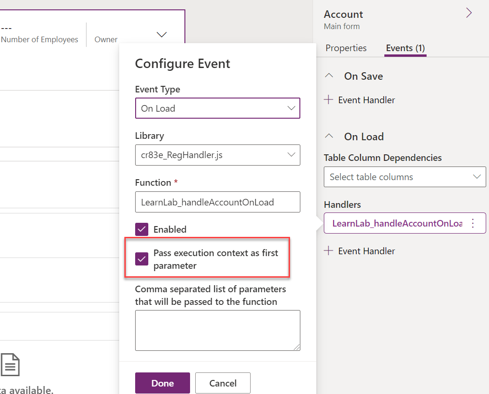
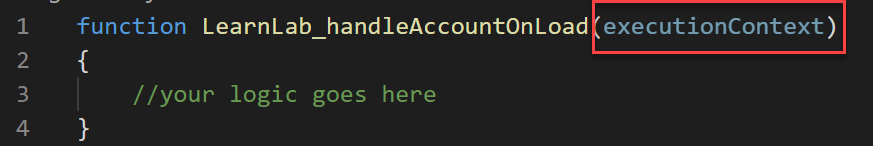
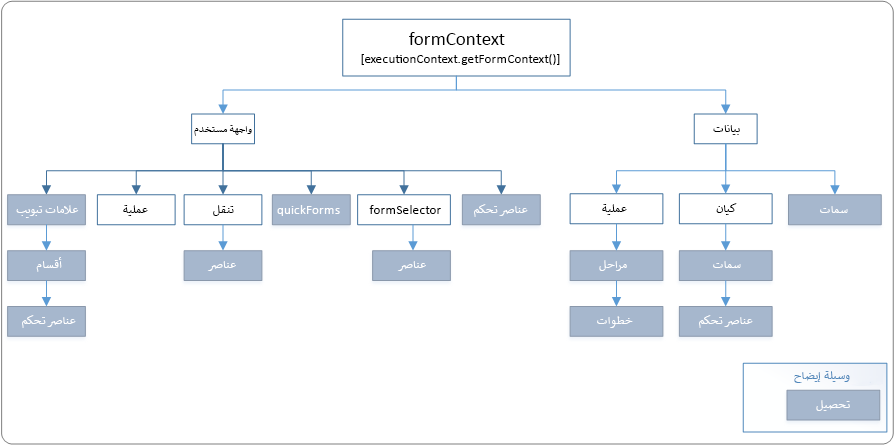

عند إنشاء معالجات أحداث واستخدام واجهة برمجة تطبيقات البرمجة النصية الخاصة بالعميل، يجب عليك فهم كائنات السياق المتوفرة وكيفية استخدامها. الغرض من كائنات السياق هو تزويدك بمعلومات حول السياق الذي يتم خلاله تنفيذ الكود الخاص بك. وهذا بحيث لا تضطر إلى الترميز الثابت للمعلومات الموجودة في المنطق الخاص بك. ويسمح لك هذا بإنشاء وظائف تكون عامة بدرجة أكبر ويجعل وظائفك أقل حساسية إلى بنية تخطيط معينة من مكونات واجهة المستخدم التي تتعامل معها.

## <a name="execution-context"></a>سياق التنفيذ

عند تسجيل معالج الأحداث، يمكنك الحصول على سياق التنفيذ الذي تم تمريره كمعلمة أولى. عند تسجيل معالج الأحداث باستخدام خصائص النموذج، يكون هذا هو الخيار الذي يمكنك تمكينه. تعرض الصورة تسجيل معالج OnLoad وتمكين سياق التنفيذ.

> [!div class="mx-imgBorder"]
> [](../media/pass-execution-context.png#lightbox)

وبشكلٍ عام، من الأفضل تحديد هذا الخيار دائمًا عند تسجيل معالج أحداث باستخدام خصائص النموذج. عند تسجيل معالج أحداث باستخدام كود، يتم تحديد هذا الخيار تلقائيًا.

سيبدو تعريف وظيفتك التي تأخذ سياق التنفيذ باعتبارها المعلمة الأولى كما يأتي:

> [!div class="mx-imgBorder"]
> [](../media/execution-context-function.png#lightbox)

الاستخدام الأكثر شيوعًا لسياق التنفيذ هو استرداد سياقات النموذج والشبكة. توجد طريقة مفيدة أخرى في هذا السياق وهي getEventSource. يقوم مصدر الحدث بإعادة مرجع إلى الكائن الذي وقع فيه الحدث. ويتيح لك ذلك كتابة معالجات عامة تستجوب مصدر الحدث في وقت التشغيل لمعرفة عنصر التحكم الذي وقع فيه الحدث. يمكن أن يكون هذا مفيدًا عندما تكتب طريقة واحدة مسجلة في أحداث لعناصر تحكم متعددة بدلاً من تسجيل معالج حدث منفصل لكل عنصر تحكم.

## <a name="form-context"></a>سياق النموذج

يوفر سياق نموذج واجهة برمجة التطبيقات الخاصة بالعميل (formContext) مرجعًا للنموذج أو إلى صنف في النموذج، مثل عنصر تحكم عرض سريع أو صف في شبكة قابلة للتحرير، مقابل تنفيذ الكود الحالي. يمكنك استرداد كائن formContext من سياق التنفيذ باستخدام الدالة getFormContext.

> [!div class="mx-imgBorder"]
> [](../media/form-context.png#lightbox)

وقبل اعتماد سياق النموذج، يتم استخدام كائن Xrm.Page العمومي لتمثيل نموذج أو صنف في النموذج. باستخدام أحدث إصدار ، يتم إهمال الكائن Xrm.Page ، ويجب استخدام الأسلوب getFormContext لكائن سياق التنفيذ الذي تم تمريره لإرجاع مرجع إلى النموذج المناسب أو إلى عنصر في النموذج. لذلك بدلاً من كتابة كود مثل الوارد أدناه.

```csharp
var firstName = Xrm.Page.getAttribute("firstname").getValue();
```

بدلاً من ذلك، اكتب الكود الوارد أدناه باستخدام formContext.

```csharp
var formContext = executionContext.getFormContext();

var firstName = formContext.getAttribute(\"firstname\").getValue();
````

يمكنك معرفة المزيد [حول إهمال الXrm.Page](/dynamics365/get-started/whats-new/customer-engagement/important-changes-coming?azure-portal=true#some-client-apis-are-deprecated).

الرسم التخطيطي الموجود أدناه هو نظرة عامة عالية المستوى على الخصائص والطرق المتوفرة داخل سياق النموذج:

> [!div class="mx-imgBorder"]
> [](../media/form-context-diagram.png#lightbox)

### <a name="data-object"></a>كائن بيانات

الغرض من كائن البيانات (formContext.data) هو استخدامه لأي جدول ومعالجة البيانات داخل النموذج.

فيما يأتي ملخص لكل كائن بيانات يحتوي على كائنات ومجموعات:

|     الاسم          |     الوصف                                                                                                                                                                                                                                                                                                                                                                                                      |
|-------------------|----------------------------------------------------------------------------------------------------------------------------------------------------------------------------------------------------------------------------------------------------------------------------------------------------------------------------------------------------------------------------------------------------------------------|
|     السمات    |     مجموعة من البيانات غير المتعلقة بالكيان في النموذج. تكون الأصناف الموجودة في هذه المجموعة من نفس نوع البيانات مثل مجموعة السمات الموجودة في الكيان، ولكن من المهم ملاحظة أنها ليست سمات لكيان النموذج.                                                                                                                                                                                            |
|     الكيان        |     يوفر طرقًا لاسترجاع المعلومات الخاصة بالصف المعروض في الصفحة وطريقة الحفظ ومجموعة من كافة السمات التي يتم تضمينها في النموذج. تقتصر بيانات السمة على السمات التي يتم تمثيلها بالحقول في النموذج مقابل جميع الحقول المتاحة في تكوين الكيان. للحصول على مزيد من المعلومات، راجع [formContext.data.entity](/power-apps/developer/model-driven-apps/clientapi/reference/formcontext-data-entity/?azure-portal=true).    |
|     العملية       |     توفر كائنات وطرقًا للتعامل مع بيانات سير إجراءات العمل في نموذج. لمزيد من المعلومات، راجع [formContext.data.process](/power-apps/developer/model-driven-apps/clientapi/reference/formcontext-data-process/?azure-portal=true).                                                                                                                                                                                                                                                                    |

### <a name="ui-object"></a>كائن واجهة المستخدم

يوفر كائن واجهة المستخدم (formContext.ui) طرقًا لاسترداد معلومات حول واجهة المستخدم، وكذلك مجموعات لعدة مكونات فرعية من النموذج أو الشبكة.

يلخص ما يأتي كل كائن في واجهة المستخدم الذي يحتوي على كائنات ومجموعات:

|     الاسم            |     الوصف                                                                                                                                                                                                                                                                                                          |
|---------------------|--------------------------------------------------------------------------------------------------------------------------------------------------------------------------------------------------------------------------------------------------------------------------------------------------------------------------|
|     عناصر التحكم        |     مجموعة تضم جميع عناصر التحكم في الصفحة. راجع [المجموعات](/power-apps/developer/model-driven-apps/clientapi/reference/collections/?azure-portal=true)   للحصول على معلومات عن المجموعات وعناصر التحكم وكائنات التحكم في المجموعة.                                                                                                                                                          |
|     FormSelector    |     استخدم طريقة formSelector.getCurrentItem لاسترداد معلومات عن النموذج المستخدم حاليًا. استخدم مجموعة formSelector.items لإرجاع معلومات حول جميع النماذج المتوفرة للمستخدم.                                                                                   |
|     التنقل      |     مجموعة من جميع عناصر التنقل في الصفحة. راجع [الصنف formContext.ui.navigation](/power-apps/developer/model-driven-apps/clientapi/reference/formcontext-ui-navigation/?azure-portal=true) للحصول على معلومات حول الأصناف الموجودة في المجموعة. لا يتوفر التنقل لـ Microsoft Dynamics 365 لأجهزة الكمبيوتر اللوحية‬. لأتمتة التنقل العام في التطبيق، نستخدم عادةً مساحة الاسم Xrm.Navigation.    |
|     العملية         |     توفر كائنات وطرقًا للتفاعل مع عنصر تحكم سير إجراءات العمل في نموذج، مثل إعداد الرؤية الخاصة به. للحصول على مزيد من المعلومات، راجع [formContext.ui.process](/power-apps/developer/model-driven-apps/clientapi/reference/formcontext-ui-process/?azure-portal=true).                                                                                                                                     |
|     QuickForms      |     مجموعة من جميع عناصر تحكم العرض السريع في نموذج. للحصول على مزيد من المعلومات، راجع [formContext.ui.quickForms](/power-apps/developer/model-driven-apps/clientapi/reference/formcontext-ui-quickforms/?azure-portal=true).                                                                                                                                                                                                        |
|     علامات التبويب            |     مجموعة تضم جميع علامات التبويب الموجودة في الصفحة. راجع [‎formContex.ui.tabs](/power-apps/developer/model-driven-apps/clientapi/reference/formcontext-ui-tabs/?azure-portal=true) للحصول على معلومات عن الأصناف الموجودة في المجموعة.                                                                                                                                                                                                |

من الشائع استخدام كائن البيانات بدلاً من كائن واجهة المستخدم إذا كنت بحاجة إلى الحصول على أو تعيين قيمة عمود الجدول. يحتوي كائن البيانات على كائن سمة وحيد يمثل قيمة عمود الجدول. باستخدام كائن واجهة المستخدم، يمكن أن يكون لديك عناصر تحكم متعددة لنفس عمود الجدول في نموذج، ولكل منها مرجع إلى السمة. لذلك، من الأسهل إذا كنت تريد التعامل مع كائن البيانات لمعالجة السمة والقيمة وكائن واجهة المستخدم إذا كنت تريد التعامل مع عناصر التحكم التي تمثل تلك السمة في النموذج.

ويؤدي استخدام كائنات السياق في البرامج النصية إلى جعلها أكثر مرونة للتغيير في النموذج وفي واجهة برمجة التطبيقات الخاصة بالعميل.
