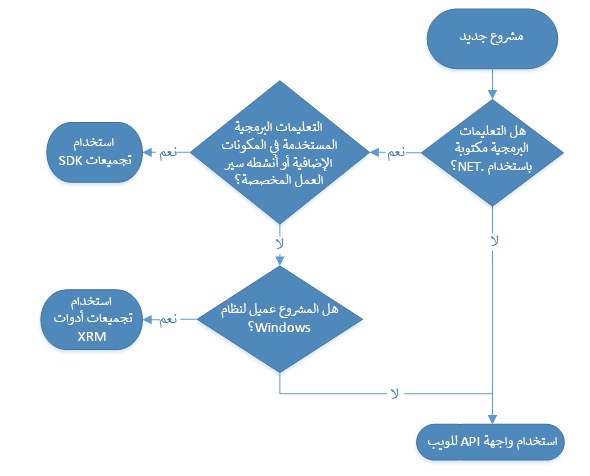

## واجهة API للويب في مقابل خدمة المؤسسة

توجد طريقتان رئيسيتان للتفاعل مع البيانات وبيانات التعريف في Microsoft Dataverse هما واجهة API للويب وخدمة المؤسسة‬. يمكنك استخدام خدمة المؤسسة عند كتابة المكونات الإضافية أو ملحقات سير العمل باستخدام تجميعات NET Framework SDK. التي توفرها Microsoft. 

في وقت كتابة هذه السطور، تمر جميع عمليات البيانات عبر خدمة المؤسسة الأساسية. ونتيجة لذلك، تسمح لك واجهة API الويب بتنفيذ نفس العمليات نفسها لخدمة المؤسسة ولكن بأسلوب RESTful (سيتم توفير مزيد من المعلومات حول REST لاحقاً في هذه الوحدة). 

يمثل الرسم التالي شجرة قرارات يمكن أن تساعدك في تحديد متى يجب استخدام واجهة API للويب في مقابل خدمة المؤسسة (من خلال تجميعات SDK) وأيضاً متى يجب استخدام XRM Tooling Assemblies (متوفرة من Microsoft) لتطبيقات Windows. 

 

تركز هذه الوحدة على استخدام واجهة API للويب؛ لمزيد من المعلومات حول خدمة المؤسسة، راجع وثائق [استخدام خدمة مؤسسة Dataverse](/power-apps/developer/common-data-service/org-service/overview/?azure-portal=true) التي يمكن العثور عليها في دليل مطور Dataverse. 

إذا أردت معرفة المزيد عن XRM Tooling Assemblies المتوفرة لتطبيقات عميل Windows، فراجع وثائق [إنشاء تطبيقات عميل Windows باستخدام أدوات XRM](/power-apps/developer/common-data-service/xrm-tooling/build-windows-client-applications-xrm-tools/?azure-portal=true)، التي يمكن العثور عليها أيضاً في دليل مطور Dataverse. لقد كان XRM موجوداً قبل Dataverse، وبالتالي سترى في الكثير من الأحيان هذا الاسم مضمناً في والوثائق والأدوات التي توفرها Microsoft. 

## OData 4.0

يتم تطبيق واجهة API الويب في Dataverse كخدمة OData ‏(OASIS Open Data Protocol). باستخدام معيار صناعي كهذا، ستوفر لك جميع مزايا التطوير القياسي المفتوح، مثل التوافق عبر الأنظمة الأساسية والتنفيذ البسيط مقابل بروتوكول مشترك محدد مسبقاً.

لا يوفر Dataverse أدوات تجميع NET. محددة لواجهة API للويب؛ بدلاً من ذلك، ننصحك باستخدام مكتبات المجتمع التي تتوافق مع بروتوكول OData. إذا أردت الحصول على المزيد من المعلومات حول المكتبات الموجودة، انتقل إلى [https://www.odata.org/libraries/](https://www.odata.org/libraries/?azure-portal=true). 

يوفر OData القدرة على التفاعل مع بيانات Dataverse بواسطة عمليات CRUD التي تتوفر عبر أساليب GET وPOST وPATCH وDELETE HTTP القياسية (يمكن العثور على المزيد من المعلومات حول هذه الأساليب لاحقاً في هذه الوحدة النمطية). يمكنك أيضاً تنفيذ عدد كبير من العمليات الأخرى التي تُعرض عبر Dataverse [إطار عمل الحدث](/power-apps/developer/common-data-service/event-framework/?azure-portal=true) من خلال استدعاء *وظيفة* أو *إجراء* ‏OData يحمل الاسم نفسه الذي تحمله رسالة خدمة المؤسسة المقابلة. الرسائل ذات الصلة بـ CRUD هي الرسائل الوحيدة غير المتوفرة لأن هذه الرسائل تتحقق باستخدام أساليب HTTP القياسية التي ورد وصفها سابقاً.

## REST

بشكل أساسي، بروتوكول OData عبارة عن مجموعة من واجهات API RESTful (**RE** presentational **S** tate **T** ransfer)، معيار صناعي تم اختباره بمرور الوقت لتوفير إمكانية التشغيل البيني بين الأنظمة. يتكون REST من ستة مبادئ توجيهية تقيد الطريقة التي يمكن بها للخدمة معالجة الطلبات والاستجابة لها لضمان تلبية الخصائص غير الوظيفية لتلك الخدمة (مثل الأداء وقابلية التوسع والبساطة والموثوقية وما إلى ذلك). 

لأغراض تتعلق بهذا الدرس، يجب أن تضع في اعتبارك أن OData يتوافق مع هذه القيود وأن واجهة API للويب في Dataverse بدورها تتوافق أيضاً مع القيود لأنها تقوم بتنفيذ بروتوكول OData 4.0. 

## FetchXML

إن FetchXML عبارة عن لغة استعلام فعالة تسمح بالاستعلام الفعال عن بيانات Dataverse. توفر Microsoft طريقة للمستخدمين لتشغيل استعلامات FetchXML داخل استعلام واجهة API الويب. بإمكان هذا الأسلوب أن يكون قيّماً إذا واجهت سيناريو يكون فيه FetchXML مناسباً بشكل أفضل لاستعلامك المحدد في مقابل استخدام بناء جملة استعلام OData. يمكن العثور على المزيد من المعلومات حول FetchXML في وحدة لاحقة في هذه الوحدة النمطية. 
