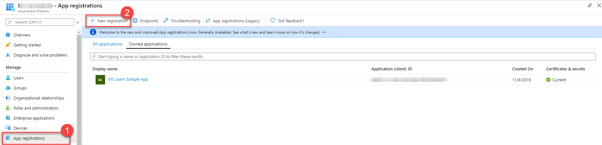
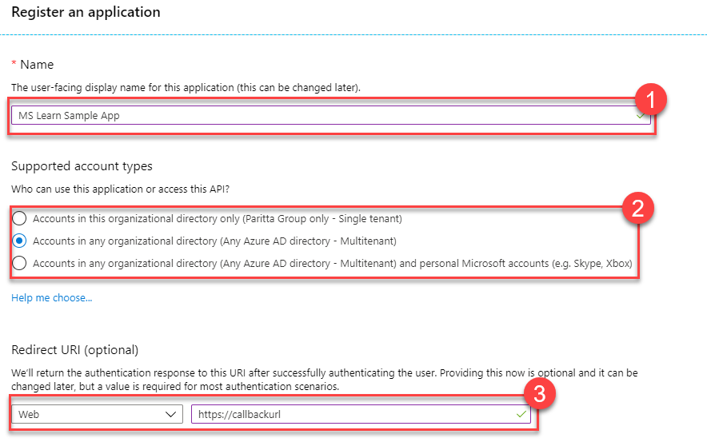
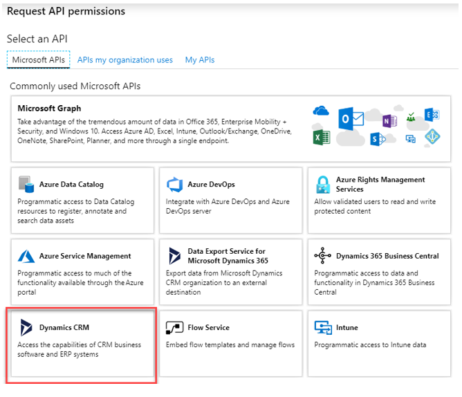
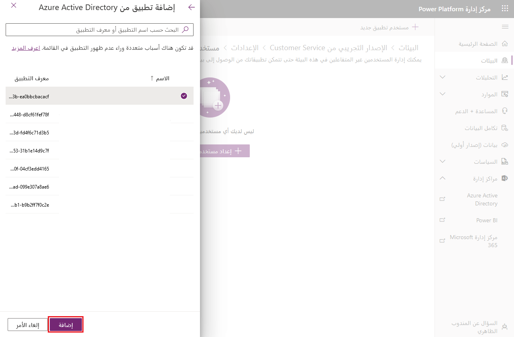

يقوم Microsoft Dataverse من Microsoft باستخدام OAuth 2.0 كمعيار مصادقة خاص به. يوفر OAuth 2.0 معيارًا صناعيًا لمصادقة تطبيقات العميل ومنحهم حق الوصول إلى أحد الموارد.

## <a name="authentication-vs-authorization"></a>المصادقة مقابل التخويل

**المصادقة** هي عملية أو إجراء التحقق من هوية مستخدم أو عملية. حل Microsoft لعملية التحقق هذه هو Azure Active Directory (Azure AD). يدعم Azure AD العديد من الخيارات للتحقق من هوية المستخدم أو العملية. يسمح تجريد موفر الهوية الخاص بك بالفصل الجيد للمخاوف لأن إدارة أسماء المستخدمين وكلمات المرور يمكن أن تكون عملية صعبة (ومحفوفة بالمخاطر).

**التخويل** هو عملية أو إجراء للتحقق مما إذا كان المستخدم المصادق عليه *مخولاً* بالوصول إلى الموارد التي يتم توفيرها. في الوقت الحالي، يكون تخويل Dataverse على مستوى مستأجر Azure AD، بينما يتم تفويض إدارة الأذونات التفصيلية للتطبيق بناءً على المستخدم المسجل الدخول حالياً. لذلك، لن تستخدم OAuth 2.0 للتحكم في الأمان على مستوى التطبيق، والذي يتم التعامل معه بدلاً من ذلك من خلال مركز مسؤولي Power Apps.

إذا كنت تريد معرفة المزيد حول مفاهيم المصادقة والتخويل، فانتقل إلى قسم Azure Active Directory في Microsoft Docs: [أساسيات المصادقة](/azure/active-directory/develop/authentication-scenarios/?azure-portal=true).

## <a name="register-dataverse-apps-with-azure-ad"></a>تسجيل التطبيقات Dataverse باستخدام Azure AD

للاتصال بنجاح بـ Dataverse، يجب أولاً تسجيل أحد التطبيقات باستخدام Azure Active Directory، والذي يمكن إكماله في [مدخل Azure](https://portal.azure.com/?azure-portal=true). اعتماداً على نوع التطبيق الذي تريد إنشاءه، تتوفر بعض الإعدادات المختلفة لتكوينها (تطبيقات الويب مقابل التطبيقات الأصلية المثبتة أصلاً على الجهاز). لمزيد من المعلومات حول الإعدادات المطلوبة لكل نوع من هذه الأنواع، راجع [أنواع تسجيل التطبيق](/power-apps/developer/common-data-service/authenticate-oauth?azure-portal=true).

لتسجيل تطبيق مع Azure AD، يمكنك الانتقال إلى قسم **تسجيلات التطبيق** في قائمة خيارات Azure Active Directory ثم تحديد **تسجيل جديد**.



حدد اسم التطبيق الخاص بك ونوع الوصول إلى الحساب الذي تحتاج إليه. إذا كنت تقوم بتسجيل تطبيق ويب، فحدد عنوان URI لإعادة التوجيه بالانتقال إلى قسم **المصادقة**، وتعيين النوع إلى **ويب**، ثم إدخال عنوان URI لإعادة التوجيه.



تلخص القائمة التالية وقت استخدام أنواع الحسابات المختلفة:

- **الحسابات في هذا الدليل التنظيمي فقط (مستأجر واحد)**

    يمكن لجميع حسابات المستخدمين والضيوف في دليلك استخدام التطبيق أو API الخاص بك.

    *استخدم هذا الخيار إذا كان الجمهور المستهدف من داخل مؤسستك.*

- **الحسابات الموجودة في أي دليل تنظيمي (أي دليل Azure AD - تعدد المؤسسات)**

    يمكن لجميع المستخدمين الذين لديهم حساب عمل أو مدرسة من Microsoft استخدام التطبيق أو API الخاص بك، بما في ذلك المدارس والشركات التي تستخدم Microsoft 365.

    *استخدم هذا الخيار إذا كان جمهورك المستهدف عملاء أعمال تجارية أو تعليمية ولتمكين تشغيل متعدد لمثيل برنامج.*

- **الحسابات الموجودة في أي دليل تنظيمي (أي دليل Azure AD - تعدد المؤسسات) وحسابات Microsoft الشخصية (علي سبيل المثال، Skype وXbox)**

    يمكن لجميع المستخدمين الذين لديهم حساب عمل أو مدرسة أو حساب Microsoft شخصي استخدام التطبيق أو API الخاص بك. إنه يتضمن المدارس والشركات التي تستخدم Microsoft 365 والحسابات الشخصية التي يتم استخدامها لتسجيل الدخول إلى خدمات، مثل يمكن لجميع المستخدمين الذين لديهم حساب عمل أو مدرسة أو حساب Microsoft شخصي استخدام التطبيق أو واجهة برمجة التطبيقات الخاصة بك. يتضمن المدارس والشركات التي تستخدم Microsoft 365 والحسابات الشخصية التي يتم استخدامها لتسجيل الدخول إلى خدمات مثل Xbox وSkype.

اعتماداً على مدى تعقيد إعداد التطبيق الخاص بك، قد ترغب في تكوين إعدادات المصادقة الأخرى. راجع وثائق Azure Active Directory للحصول على خطوات حول كيفية إكمال هذه المهمة.

## <a name="access-dataverse-using-the-web-api"></a>الوصول إلى Dataverse باستخدام API للويب

يتم كل الوصول إلى Dataverse في سياق مستخدم مسجل الدخول. يمكن أن يكون هذا مستخدمًا تفاعليًا عاديًا أو مستخدمًا غير تفاعلي باستخدام مصادقة خادم إلى خادم (S2S).

عندما يصل تطبيق إلى Dataverse نيابة عن مستخدم تفاعلي، يجب تكوين التطبيق المسجل بأذونات API للوصول إلى Dataverse بإذن مفوض. عندما يصل تطبيق ما مباشرةً إلى Dataverse، يجب إنشاء مستخدم التطبيق المرتبط بتسجيل تطبيق Azure AD في Dataverse. عند استخدام مصادقة S2S، فإن الأذونات المفوضة لواجهة API لـ Dataverse غير مطلوبة.

في جميع الحالات، يجب أن يكون لدى المستخدمين المصادق عليهم أدوار أمان مرتبطة بالسماح للمستخدم بالعمليات التي يتم إجراؤها باستخدام API للويب.

### <a name="configure-api-permissions"></a>تكوين أذونات API

إذا كان تطبيقك سيصل إلى Dataverse نيابة عن مستخدم مسجل الدخول، فانتقل إلى علامة التبويب **أذونات API** في التطبيق المسجل وتأكد من منح التطبيق الخاص بك وصول انتحال هوية المستخدم إلى بيئة Dataverse الخاصة بك.



تقول التسمية Dynamics CRM، وهو الاسم التاريخي للمنتج السابق لـ Dataverse.


### <a name="configure-a-dataverse-application-user"></a>تكوين مستخدم تطبيق Dataverse

عند استخدام مصادقة S2S، يجب تكوين مستخدم تطبيق Dataverse في كل بيئة من بيئات Dataverse، ستتمكن من الوصول إليها باستخدام API للويب.

يتم تكوين مستخدمي تطبيق Dataverse من [مركز مسؤولي Power Platform admin center](https://admin.powerplatform.microsoft.com/?azure-portal=true) باعتبارهم مسؤول نظام.



من مركز المسؤولين، يمكنك تنفيذ الخطوات التالية

-   إنشاء مستخدم تطبيق جديد

-   إقران مستخدم التطبيق بتطبيق Azure AD أو الهوية المُدارة

-   تكوين أدوار أمان Dataverse التي سيتم تطبيقها

للاطلاع على التفاصيل خطوة بخطوة، راجع [إدارة مستخدمي التطبيق في مركز مسؤولي Power Platform](/power-platform/admin/manage-application-users/?azure-portal=true).

## <a name="use-authentication-libraries-to-connect"></a>استخدام مكتبات المصادقة للاتصال

بمجرد تسجيل التطبيق الخاص بك، استخدم إحدى [مكتبات مصادقة النظام الأساسي للهوية لـ Microsoft](/azure/active-directory/develop/reference-v2-libraries/?azure-portal=true) لإجراء المصادقة والحصول على رمز وصول للاستخدام مع واجهة API للويب.

التالي مقتطف من نموذج [التشغيل السريع المحسن](https://github.com/Microsoft/PowerApps-Samples/tree/master/cds/webapi/C%23/EnhancedQuickStart/?azure-portal=true) الذي يستخدم مكتبة المصادقة من Microsoft (‏MSAL). تطبق فئة OAuthMessageHandler التالية فئة مشتقة من [DelegatingHandler](/dotnet/api/system.net.http.delegatinghandler/?azure-portal=true) الذي سيتم تمريره إلى منشئ HttpClient. سيسمح لك هذا المعالج بتجاوز طريقة HttpClient.SendAsync، بحيث يتم تحديث الرمز المميز للوصول بواسطة مكالمات أسلوب AcquireToken\* مع كل طلب يرسله عميل Http.

```odata

class OAuthMessageHandler : DelegatingHandler

{

private AuthenticationHeaderValue authHeader;

public OAuthMessageHandler(string serviceUrl, string clientId, string redirectUrl, string username, string password,

HttpMessageHandler innerHandler)

: base(innerHandler)

{

//Build Microsoft.Identity.Client (MSAL) OAuth Token Request

var authBuilder = PublicClientApplicationBuilder.Create(clientId)

.WithAuthority(AadAuthorityAudience.AzureAdMultipleOrgs)

.WithRedirectUri(redirectUrl)

.Build();

var scope = serviceUrl + "//.default";

string[] scopes = { scope };

AuthenticationResult authBuilderResult;

if (username != string.Empty && password != string.Empty)

{

//Make silent Microsoft.Identity.Client (MSAL) OAuth Token Request

var securePassword = new SecureString();

foreach (char ch in password) securePassword.AppendChar(ch);

authBuilderResult = authBuilder.AcquireTokenByUsernamePassword(scopes, username, securePassword)

.ExecuteAsync().Result;

}

else

{

//Popup authentication dialog box to get token

authBuilderResult = authBuilder.AcquireTokenInteractive(scopes)

.ExecuteAsync().Result;

}

//Note that an Azure AD access token has finite lifetime, default expiration is 60 minutes.

authHeader = new AuthenticationHeaderValue("Bearer", authBuilderResult.AccessToken);

}

protected override Task<HttpResponseMessage> SendAsync(

HttpRequestMessage request, System.Threading.CancellationToken cancellationToken)

{

request.Headers.Authorization = authHeader;

return base.SendAsync(request, cancellationToken);

}

}
```

يمكنك بعد ذلك الحصول على طريقة مساعدة للحصول على مثيل HttpClient باستخدام المعالج:

```odata
static HttpClient GetHttpClient(string url, string clientId, string redirectUrl, string version = "v9.2")

{

try

{

HttpMessageHandler messageHandler = new OAuthMessageHandler(url, clientId, redirectUrl, \"\", \"\",

new HttpClientHandler());

HttpClient httpClient = new HttpClient(messageHandler)

{

BaseAddress = new Uri(string.Format("{0}/api/data/{1}/", url, version)),

Timeout = new TimeSpan(0, 2, 0) //2 minutes

};

return httpClient;

}

catch (Exception)

{

throw;

}

}
```

وأخيرًا، استخدام نسخة العميل لإجراء استدعاء لواجهة API للويب:

```odata
using (HttpClient client = GetHttpClient("https://yourenvname.api.crm.dynamics.com",

"51f81489-12ee-4a9e-aaae-a2591f45987d", "http://localhost:8080"))

{

// Use the WhoAmI function

var response = client.GetAsync("WhoAmI").Result;

if (response.IsSuccessStatusCode)

{

//Get the response content and parse it.

JObject body = JObject.Parse(response.Content.ReadAsStringAsync().Result);

Guid userId = (Guid)body["UserId"];

Console.WriteLine("Your UserId is {0}", userId);

}

else

{

Console.WriteLine("The request failed with a status of '{0}'",

response.ReasonPhrase);

}

Console.WriteLine("Press any key to exit.");

Console.ReadLine();

}
```

يجب أن يكون لديك الآن تطبيق مسجل يمكنه الاتصال ببيئة Dataverse الخاصة بك بنجاح. لديك أيضًا مثال بسيط للاتصال واستخدام التطبيق المسجل للوصول إلى عملية واجهة API للويب.
