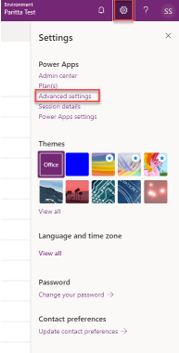
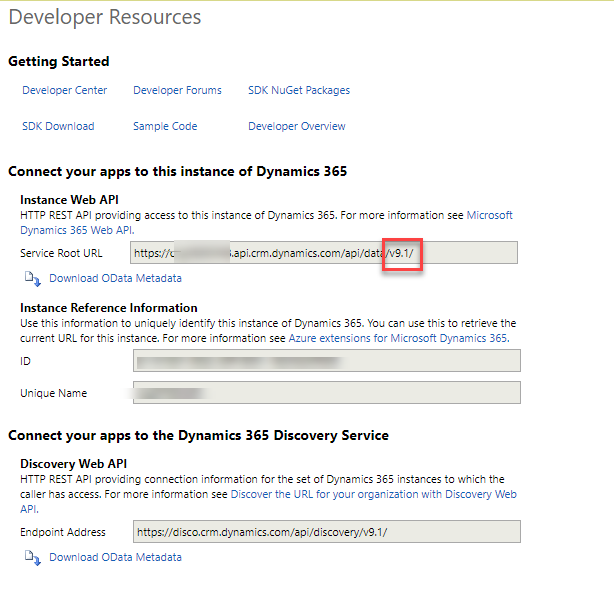
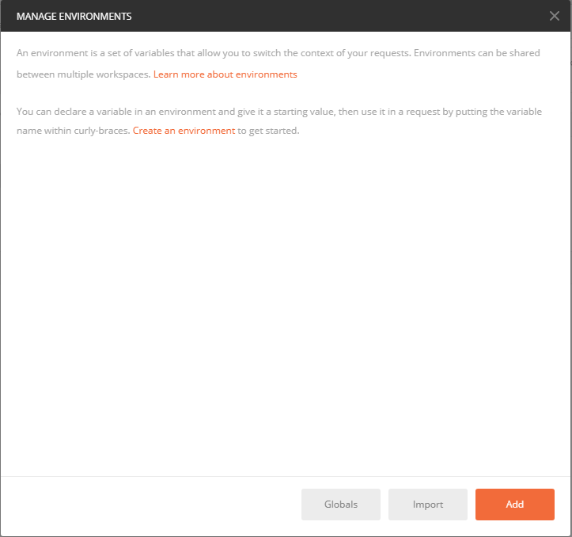
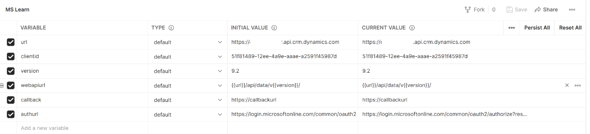
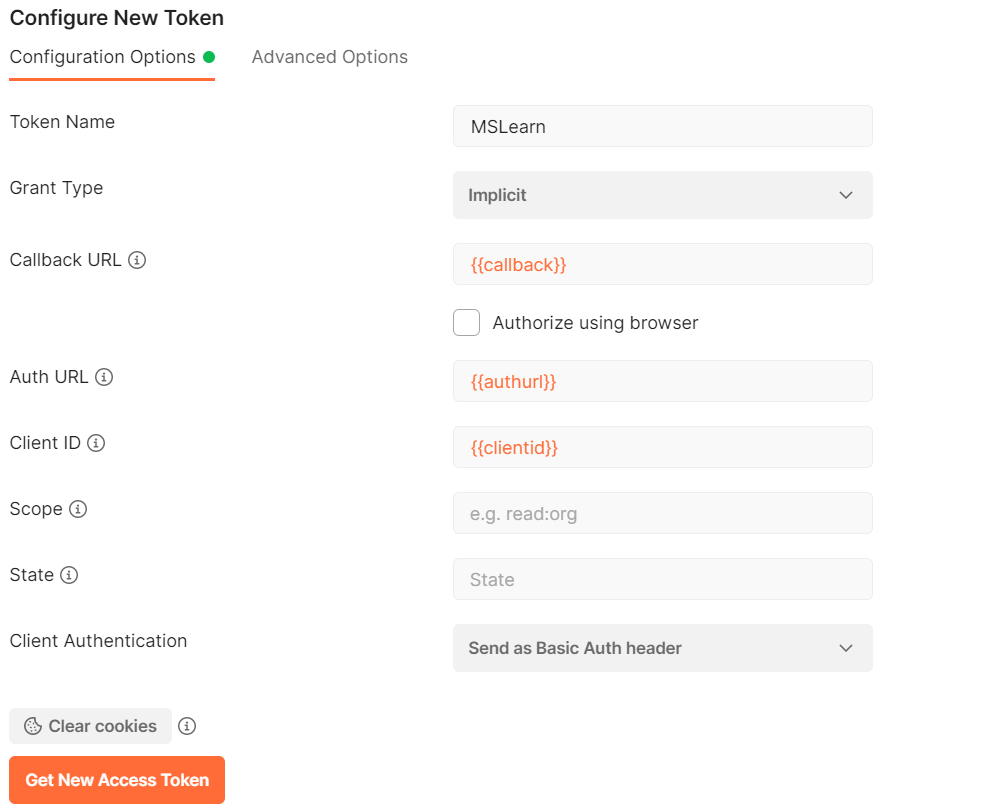
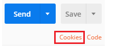
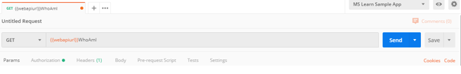
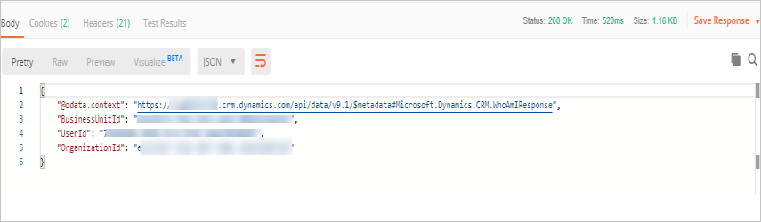

تعد Postman أداة قيّمة تستخدم لإنشاء استعلامات مخصصة لواجهة API للويب والتحقق من سلوك عمليات واجهة API للويب دون الحاجة إلى كتابة برنامج للقيام بذلك. إذا كنت جديدًا في استخدام أداة Postman، فراجع مقال [أول 5 أشياء تجب محاولتها إذا كنت جديدًا في استخدام أداة Postman](https://blog.getpostman.com/2018/04/11/first-5-things-to-try-if-youre-new-to-postman/?azure-portal=true) للحصول على مقدمة إلى الموضوع.

## تسجيل تطبيق في Azure Active Directory

لتوصيل أداة Postman بـ Microsoft Dataverse، من الضروري أولاً التأكد من أنه لديك تطبيق مسجل في بيئة Azure AD.

## الحصول على الإصدار الحالي من نقطة نهاية واجهة API للويب

يمكنك العثور على رقم الإصدار الخاص بنقطة نهاية واجهة API للويب بالانتقال إلى **موارد المطورين** الخاصة بالبيئة في مدخل المنشئ.

من صفحة **موارد المطورين**. ستتم الإشارة إلى رقم الإصدار ضمن نقطة نهاية API للويب، كما هو موضح في الصورة التالية. دوّن نقطة النهاية والإصدار.

## إعداد أداة Postman

لبدء عملية الإعداد، قم بتثبيت أداة [Postman](https://www.getpostman.com/?azure-portal=true).

بعد تثبيت أداة Postman، ستستخدم ميزة يجب على Postman إدارة متغيرات البيئة حتى تتمكن من إدارة الكيانات بشكل نظيف مثل عناوين URL الخاصة بنقطة النهاية ومعرفات العملاء.

لإنشاء بيئة Postman يمكنك استخدامها للاتصال بمثيل Dataverse الخاص بك، اتبع الخطوات الآتية:

1.  تشغيل تطبيق Postman لسطح مكتب.

1.  حدد أيقونة الترس **خيارات البيئة** الموجودة أعلى الزاوية اليمنى.

1.  في مربع حوار **إدارة البيئات** ، حدد زر **إضافة** لإضافة بيئة جديدة.

    

1.  في مربع الحوار الذي يتم فتحه، أدخل اسماً للبيئة ثم أضف أزواج المفتاح/القيمة التالية إلى مساحة التحرير.

    |     المتغير     |     القيمة الأولية                                                                 |
    |------------------|-----------------------------------------------------------------------------------|
    |     عنوان URL          |     https://[ORGANIZATION].api.crm.dynamics.com                                   |
    |     clientid     |     51f81489-12ee-4a9e-aaae-a2591f45987d                                          |
    |     الإصدار      |     9.2                                                                           |
    |     عنوان url لواجهة api للويب    |     {{url}}/api/data/v{{version}}/                                                |
    |     رد الاتصال     |     https://callbackurl                                                           |
    |     عنون url الخاص بالتفويض      |     https://login.microsoftonline.com/common/oauth2/authorize?resource={{url}}    |

    

1.  استبدل قيمة العنصر النائب لعنوان URL الخاص بالمثيل بعنوان URL الخاص ببيئة Dataverse الخاصة بك، ثم حدد **إضافة** لحفظ البيئة.

1.  أغلق مربع حوار **إدارة البيئات** .

## إنشاء رمز مميز للوصول لاستخدامه مع البيئة الخاصة بك.

للاتصال باستخدام OAuth 2.0، يجب أن يكون لديك رمز مميز للوصول. للحصول على رمز مميز للوصول جديد، اتبع الخطوات الآتية:

1.  تأكد من تحديد البيئة الجديدة التي قمت بإنشائها.

1.  حدد علامة تبويب **التفويض** .

1.  قم بتعيين **النوع** إلى **OAuth 2.0**.

1.  تحقق من تحديد البيئة التي قمت بإنشائها.

1.  قم بالتمرير لأسفل إلى جزء "تكوين رمز مميز جديد".

1.  قم بتعيين القيم التالية في مربع الحوار. حدد **ضمني** من القائمة المنسدلة **نوع المنح** . يمكنك تعيين **اسم الرمز المميز** لكل ما تريده ثم اترك المفاتيح الأخرى معينة إلى القيم الافتراضية.

    

    > [!NOTE]
    > إذا كنت تقوم بتكوين البيئات في Postman لمثيلات Dataverse متعددة باستخدام بيانات اعتماد مختلفة للمستخدم، فقد تحتاج إلى حذف ملفات تعريف الارتباط التي يتم تخزينها مؤقتًا بواسطة Postman. حدد رابط **ملفات تعريف الارتباط** الذي يمكن العثور عليه ضمن زر **إرسال** ، وقم بإزالة ملفات تعريف الارتباط المحفوظة من مربع حوار **إدارة ملفات تعريف الارتباط** .

    

    تكون بعض ملفات تعريف الارتباط هذه دائمة. يمكنك حذف بعض ملفات تعريف الارتباط في مجموعات، ولكن قد يلزم حذف أخرى بشكلٍ فردي. قد تحتاج إلى إكمال هذه العملية مرتين للتأكد من عدم استمرار ملفات تعريف الارتباط.

1.  حدد **طلب الرمز المميز**. عند إجراء هذا التحديد، تظهر صفحة تسجيل الدخول إلى Azure Active Directory. أدخل اسم المستخدم وكلمة المرور.

1.  بعد إنشاء الرمز المميز، قم بالتمرير إلى أسفل وحدد **استخدام الرمز المميز**. يؤدي هذا التحديد إلى إغلاق مربع حوار **إدارة الرموز المميزة للوصول** .

1.  بعد إضافة رمز مميز، يمكنك تحديد الرمز المميز الذي تريد تطبيقه على الطلبات. في القائمة المنسدلة **الرموز المميزة المتاحة** ، حدد الرمز المميز الذي قمت بإنشائه. ستتم إضافة رأس التفويض إلى طلب واجهة API للويب.

## اختبر اتصالك

إنشاء طلب واجهة API للويب جديد لاختبار الاتصال مع مثيل Common Data Service الخاص بك. استخدم دالة WhoAmI باتباع الخطوات التالية:

1.  حدد "GET" على أنه أسلوب HTTP وقم بإضافة WhoAmI{{webapiurl}}في مساحة التحرير.

    

1.  حدد **إرسال** لإرسال هذا الطلب.

في حالة نجاح طلبك، ستشاهد بيانات من WhoAmIResponse ComplexType التي يتم إرجاعها بواسطة دالة WhoAmI.

   
