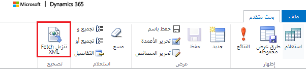

FetchXML هي لغة استعلام قوية تم تطويرها بواسطة Microsoft لتمكين إجراء عمليات معقدة على بيانات Microsoft Dataverse. يوفر خيارات تصفية أكثر بكثير من موصلات OData، كما يسمح لك بمشاهدة تسميات البيانات المرجعية مثل تسميات "مجموعة الخيارات" أو حقول البحث.

يمكنك تشغيل استعلامات FetchXML باستخدام الأساليب التالية:

-   واجهة API للويب في Dataverse

-   خدمة المؤسسة

يمكنك أيضاً تطبيق مرشح FetchXML مخصص على حقل بحث داخل تطبيق مستند إلى نموذج. يسمح هذا الأسلوب بسيناريوهات بحث أكثر تعقيداً لا يمكن إنجازها بسهولة بصورة مبتكرة. لمزيد من المعلومات حول كيفية إكمال هذه العملية، راجع [مرجع API لعميل addCustomFilter](/power-apps/developer/model-driven-apps/clientapi/reference/controls/addcustomfilter/?azure-portal=true).

### <a name="example-fetchxml-query"></a>مثال استعلام FetchXML

يسترد نموذج الاستعلام التالي حقلي accountid والاسم من كيان الحساب:

```xml
<fetch mapping='logical'>   
   <entity name='account'>  
      <attribute name='accountid'/>   
      <attribute name='name'/>   
   </entity>  
</fetch>  
```

يمكنك القيام بشيء مثل نموذج الاستعلام التالي، إذا كنت بحاجة إلى تصفية هذه البيانات، على سبيل المثال بحسب الولاية:

```xml
<fetch mapping='logical'>  
   <entity name='account'>   
      <attribute name='accountid'/>   
      <attribute name='name'/>   
      <filter type='and'>   
        <condition attribute='address1_stateorprovince' operator='eq' value='WA' />   
      </filter>   
   </entity>   
</fetch>  
```

### <a name="tools-to-help-build-your-queries"></a>أدوات للمساعدة في بناء استعلاماتك

إذا كنت تستعلم عن بيانات مقابل تطبيق يستند إلى نموذج مبني على Dataverse، فإن أبسط طريقة لإنشاء استعلامات FetchXML هي استخدام "البحث المتقدم"، والذي يحتوي على الدالة **Download FetchXML**. غالباً ما تكون بداية أولى ممتازة حتى لا تضطر إلى إنشاء XML من جديد، وذلك رغم أنك مقيّد بواجهة المستخدم فيما يتعلق بعوامل التصفية والبيانات ذات الصلة التي يمكنك سحبها.



يمكن العثور على أداة بارزة أخرى، تسمى **FetchXML Builder** في XrmToolBox. باستخدام هذه الأداة، يمكنك إنشاء FetchXML بطرق لا يمكن للبحث المتقدم عنها (التجميعات والصلات الخارجية واستعلامات "لا تحتوي على" والسمات من الكيانات المرتبطة متعددة المستويات). كما يوفر الكثير من الميزات الأخرى، والتي يمكنك العثور عليها على موقع الويب الخاص بهم: [FetchXML Builder](https://fetchxmlbuilder.com/?azure-portal=true).

### <a name="additional-resources"></a>الموارد الإضافية

انتقل إلى Microsoft Learn لاكتشاف تفاصيل متعمقة حول لغة استعلام FetchXML. يغطي القسم [استخدام FetchXML إلى بيانات الاستعلام](/power-apps/developer/common-data-service/use-fetchxml-construct-query/?azure-portal=true) عن البيانات العديد من الموضوعات المتقدمة مثل كيفية التعامل مع الترحيل والاستعلام عن البيانات الهرمية وغير ذلك الكثير.

