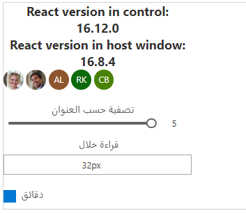

إن React عبارة عن إطار عمل عميل قياسي تم إنشاؤه بواسطة Facebook لإنشاء واجهات المستخدم.
وهو يوفر طريقة تعريفية لإنشاء واجهات مستخدم تفاعلية ويوفر آلية لتغليف المكونات لإنشاء واجهات مستخدم معقدة تدير حالات المكونات وشديدة التفاعل. نظراً لكتابة React في JavaScript، يمكنك استخدام إطار العمل هذا ضمن مكون Power Apps.

إذا لم تكن ملماً باستخدام React، فانتقل إلى [https://reactjs.org/](https://reactjs.org/?azure-portal=true)، الذي يوفر مجموعة كبيرة من الموارد التعليمية والموارد حول كيفية بناء مكونات React.

### <a name="ui-fabric"></a>UI fabric

لقد كان تطبيق UI Fabric، وهو عبارة عن مجموعة من أطر عمل UX التي يمكنك استخدامها لبناء تجارب سهلة تتناسب بسلاسة مع مجموعة واسعة من منتجات Microsoft، أحد التطورات المهمة التي حققتها Microsoft. يمكن استخدام UI Fabric في مكون Power Apps بطريقة بسيطة كالإشارة إلى مكتباته، وهذا يوفر إصداراً خاصاً بـ React يمكنك استخدامه. لمزيد من التفاصيل حول UI Fabric، انتقل إلى [https://developer.microsoft.com/fabric](https://developer.microsoft.com/fabric#/?azure-portal=true).

### <a name="implement-a-sample-facepile-component"></a>تطبيق عينة مكون Facepile

> [!NOTE]
> [نزّل الملفات](https://github.com/MicrosoftDocs/mslearn-developer-tools-power-platform/tree/master/power-apps-component-framework) لاستخدامها مع هذا التمرين.

في هذا المثال، ستنشئ مكوناً يستخدم[Facepile](https://developer.microsoft.com/fabric-js/components/facepile/facepile/?azure-portal=true)، وهو مكون UI Fabric. يُظهر Facepile قائمة بالوجوه أو الأحرف الأولى من الأسماء في بحث أفقي، حيث كل دائرة تمثل شخصاً.

هناك مثال عملي عن استخدام هذا البحث وهو سرد المساهمين في مقال أو سجل، مثل ما قد تراه في Microsoft Docs، كما يظهر في الصورة التالية.


### <a name="initialize-your-components-project"></a>تهيئة مشروع المكون الخاص بك
لتهيئة مشروع المكون الخاص بك، اتبع الخطوات التالية:

1.  قم بتهيئة المشروع عن طريق تشغيل الأمر التالي:

    ```azurepowershell
    pac pcf init --namespace SampleControls --name ReactStandardControl --template field
    ```

2.  أضف التبعيات التالية إلى package.json للإشارة إلى أنك ستستخدم مكتبات React وOffice UI Fabric.

    ```json
    "office-ui-fabric-react": "^6.189.0",
    "react": "^16.8.6",
    "react-dom": "^16.8.6"
    ```

3.  أضف تبعيات التطوير التالية لضمان تثبيت أنواع React.

    ```json
    "@types/react": "^16.8",
    "@types/react-dom": "^16.8"
    ```

4.  أضف خيارات المحول البرمجي التالية إلى tsconfig.json للإشارة إلى أننا نريد استخدام React:

    ```json
     "jsx": "react",
    "jsxFactory": "React.createElement"
    ```

5.  قم بتشغيل npm install لتحميل مكتبات مستقلة في المشروع.

### <a name="implement-your-code-components-logic"></a>قم بتنفيذ منطق مكون الأكواد الخاص بك
لتنفيذ منطق مكون الأكواد، اتبع الخطوات التالية:

1.  افتح ملف البيان الخاص بمكون الأكواد (ControlManifest.Input.xml) واستبدله بالمنطق التالي:

    ```xml
    <?xml version="1.0" encoding="utf-8" ?>
    <manifest>
      <control namespace="SampleControls" constructor="ReactStandardControl" version="0.0.1" display-name-key="ReactStandardControl_Display_Key" description-key="ReactStandardControl_Desc_Key" control-type="standard">
        <!-- property node identifies a specific, configurable piece of data that the control expects from CDS -->
        <property name="numberOfFaces" display-name-key="numberOfFaces" description-key="numberOfFaces" of-type="Whole.None" usage="bound" required="false" />
        <resources>
          <css path="css/ReactStandardControl.css" order="1" />
          <code path="index.ts" order="2"/>
        </resources>
      </control>
    </manifest>
    ```

    ستقوم بإضافة ملفات الدعم الموجودة في هذا البيان لاحقًا.

2.  افتح الملف index.ts وأضف عبارات الاستيراد التالية:

    ```ts
    import { IInputs, IOutputs } from "./generated/ManifestTypes";
    import * as React from "react";
    import * as ReactDOM from "react-dom";
    import { FacepileBasicExample, IFacepileBasicExampleProps } from "./Facepile";
    ```

3.  فوق الأسلوب constructor، أدخل المتغيرات الخاصة التالية:

    ```ts
      // reference to the notifyOutputChanged method
      private notifyOutputChanged: () => void;
      // reference to the container div
      private theContainer: HTMLDivElement;
      // reference to the React props, prepopulated with a bound event handler
      private props: IFacepileBasicExampleProps = {
        numberFacesChanged: this.numberFacesChanged.bind(this)
      };
    ```

4.  ضع المنطق التالي داخل أسلوب *init*:

    ```json
        this.notifyOutputChanged = notifyOutputChanged;
        this.props.numberOfFaces = context.parameters.numberOfFaces.raw || 3;
        this.theContainer = container;
    ```

5.  أضف المنطق التالي إلى الأسلوب *updateView*:

    ```json
    if (context.updatedProperties.includes("numberOfFaces"))
          this.props.numberOfFaces = context.parameters.numberOfFaces.raw || 3;
    
        // Render the React component into the div container
        ReactDOM.render(
          // Create the React component
          React.createElement(
            FacepileBasicExample, // the class type of the React component found in Facepile.tsx
            this.props
          ),
          this.theContainer
        );
    ```

6.  أضف المنطق التالي إلى الأسلوب *getOutputs*:

    ```numberOfFaces: this.props.numberOfFaces```

7.  أضف المنطق التالي إلى الأسلوب *destroy*:

    ```ReactDOM.unmountComponentAtNode(this.theContainer);```

8.  بعد إجراء التحديثات، يجب أن تبدو الفئة المكتملة مماثلة للمثال التالي:

    ```JavaScript
    import { IInputs, IOutputs } from "./generated/ManifestTypes";
    import * as React from "react";
    import * as ReactDOM from "react-dom";
    import { FacepileBasicExample, IFacepileBasicExampleProps } from "./Facepile";
    
    export class ReactStandardControl
      implements ComponentFramework.StandardControl<IInputs, IOutputs> {
      // reference to the notifyOutputChanged method
      private notifyOutputChanged: () => void;
      // reference to the container div
      private theContainer: HTMLDivElement;
      // reference to the React props, prepopulated with a bound event handler
      private props: IFacepileBasicExampleProps = {
        numberFacesChanged: this.numberFacesChanged.bind(this)
      };
    
      /**
       * Empty constructor.
       */
      constructor() {}
    
      /**
       * Used to initialize the control instance. Controls can kick off remote server calls and other initialization actions here.
       * Dataset values are not initialized here, use updateView.
       * @param context The entire property bag that is available to control though the Context Object; It contains values as set up by the customizer that are mapped to property names that are defined in the manifest and to utility functions.
       * @param notifyOutputChanged A callback method to alert the framework that the control has new outputs that are ready to be retrieved asynchronously.
       * @param state A piece of data that persists in one session for a single user. Can be set at any point in a control's life cycle by calling 'setControlState' in the Mode interface.
       * @param container If a control is marked control-type='starndard', it will receive an empty div element within which it can render its content.
       */
      public init(
        context: ComponentFramework.Context<IInputs>,
        notifyOutputChanged: () => void,
        state: ComponentFramework.Dictionary,
        container: HTMLDivElement
      ) {
        this.notifyOutputChanged = notifyOutputChanged;
        this.props.numberOfFaces = context.parameters.numberOfFaces.raw || 3;
        this.theContainer = container;
      }
    
      /**
       * Called when any value in the property bag has changed. This includes field values, datasets, global values such as container height and width, offline status, control metadata values such as label, visible, and so on.
       * @param context The entire property bag that is available to control through the Context Object; It contains values as set up by the customizer that is mapped to names that are defined in the manifest and to utility functions
       */
      public updateView(context: ComponentFramework.Context<IInputs>): void {
        if (context.updatedProperties.includes("numberOfFaces"))
          this.props.numberOfFaces = context.parameters.numberOfFaces.raw || 3;
    
        // Render the React component into the div container
        ReactDOM.render(
          // Create the React component
          React.createElement(
            FacepileBasicExample, // the class type of the React component found in Facepile.tsx
            this.props
          ),
          this.theContainer
        );
      }
    
      /**
       * Called by the React component when it detects a change in the number of faces shown
       * @param newValue The newly detected number of faces
       */
      private numberFacesChanged(newValue: number) {
        // only update if the number of faces has truly changed
        if (this.props.numberOfFaces !== newValue) {
          this.props.numberOfFaces = newValue;
          this.notifyOutputChanged();
        }
      }
    
      /**
       * It is called by the framework prior to a control receiving new data.
       * @returns an object based on nomenclature that is defined in the manifest, expecting object[s] for property marked as "bound" or "output"
       */
      public getOutputs(): IOutputs {
        return {
          numberOfFaces: this.props.numberOfFaces
        };
      }
    
      /**
       * Called when the control is to be removed from the DOM tree. Controls should use this call for cleanup,
       * for example, canceling any pending remote calls, removing listeners, and so on.
       */
      public destroy(): void {
        ReactDOM.unmountComponentAtNode(this.theContainer);
      }
    }
    ```

### <a name="add-styling-to-your-code-component"></a>إضافة تصميم إلى مكون الأكواد
لإضافة تصميم إلى مكون الأكواد، اتبع الخطوات الآتية:

1.  أنشئ مجلداً فرعياً CSS جديداً تحت المجلد ReactStandardControl folder.

2.  أنشئ ملف ReactStandardControl.css جديداً داخل المجلد الفرعي CSS.

3.  أضف محتوى النمط التالي إلى ملف ReactStandardControl.css:

    ```css
    .msFacepileExample {
      max-width: 300px;
    }
    
    .msFacepileExample .control {
      padding-top: 20px;
    }
    
    .msFacepileExample .ms-Dropdown-container,
    .msFacepileExample .ms-Slider {
      margin: 10px 0 10px 0;
    }
    
    .msFacepileExample .ms-Dropdown-container .ms-Label {
      padding-top: 0;
    }
    
    .msFacepileExample .ms-Checkbox {
      padding-top: 15px;
    }
    
    .exampleCheckbox {
      margin: 10px 0;
    }
    
    .exampleLabel {
      margin: 10px 0;
    }
    ```

4.  احفظ الملف ReactStandardControl.css.

### <a name="add-react-component-logic"></a>إضافة منطق مكون React
لإضافة منطق مكون React، اتبع الخطوات التالية:

1.  أضف الملفات التالية الموجودة في المكتبات الداعمة لهذا التمرين إلى المجلد ReactStandardControl folder:

    - Facepile.tsx
    - FacepileExampledata.ts
    - ReactVersion.Tsx
    - TestImages.ts

2.  قم بإنشاء الحل عن طريق تشغيل npm run build.

3.  عند تنفيذ عملية إنشاء ناجحة، يمكنك اختبار مكون Facepile الجديد عن طريق تشغيل npm start، الذي يجب أن يبدو كالمثال التالي:

    

