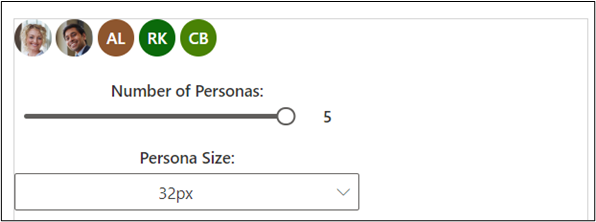
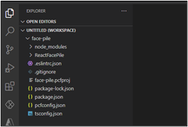
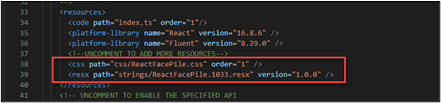
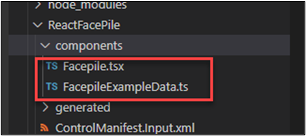
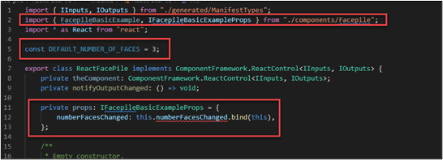
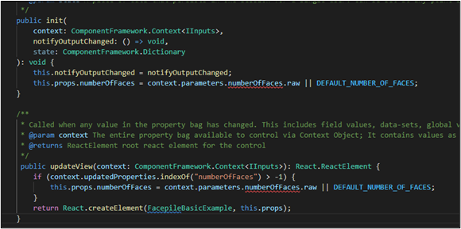
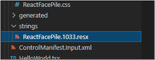
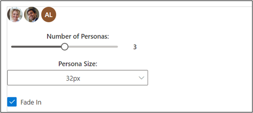
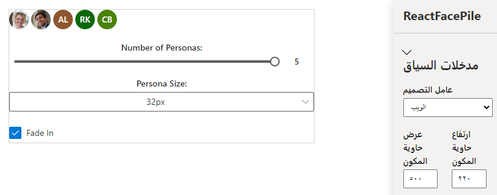

إن React عبارة عن إطار عمل عميل قياسي تم بناؤه لبناء واجهات المستخدم. وهو يوفر طريقة تعريفية لإنشاء واجهات مستخدم تفاعلية ويوفر آلية لتغليف المكونات لإنشاء واجهات مستخدم معقدة تدير حالات المكونات وشديدة التفاعل. نظراً لكتابة React في JavaScript، يمكنك استخدام إطار العمل هذا ضمن مكون Power Apps.

إذا لم تكن ملماً باستخدام React، فانتقل إلى [React](https://reactjs.org/?azure-portal=true)، الذي يوفر مجموعة كبيرة من الموارد التعليمية والموارد حول كيفية بناء مكونات React.

### <a name="fluent-ui"></a>Fluent UI

لقد كان تنفيذ Fluent UI، وهو عبارة عن مجموعة من أطر عمل UX التي يمكنك استخدامها لبناء تجارب سهلة تتناسب بسلاسة مع مجموعة واسعة من منتجات Microsoft، أحد التطورات المهمة التي حققتها Microsoft. يمكن استخدام Fluent UI في مكون التعليمات البرمجية لـ Power Apps بطريقة بسيطة كالإشارة إلى مكتباته، وهذا يوفر إصداراً خاصاً بـ React يمكنك استخدامه. لمزيد من المعلومات، راجع [Fluent UI](https://www.microsoft.com/design/fluent/#/).

### <a name="implement-a-sample-facepile-component"></a>تطبيق عينة مكون Facepile

> [!NOTE]
> [نزّل الملفات](https://github.com/MicrosoftDocs/mslearn-developer-tools-power-platform/raw/master/power-apps-component-framework/FacePileComponent.zip) لاستخدامها مع هذا التمرين.

في هذا المثال، ستقوم ببناء مكون يستخدم مكون Facepile Fluent UI. يُظهر Facepile قائمة بالوجوه أو الأحرف الأولى من الأسماء في بحث أفقي، حيث كل دائرة تمثل شخصاً.
هناك مثال عملي عن استخدام هذا البحث وهو سرد المساهمين في مقال أو سجل، مثل ما قد تراه في Microsoft Learn، كما يظهر في الصورة التالية.




### <a name="initialize-your-components-project"></a>تهيئة مشروع المكون الخاص بك
لتهيئة مشروع المكون الخاص بك، اتبع الخطوات التالية:

1.  ابدأ تشغيل Visual Studio Code.

2.  حدد **وحدة طرفية** ثم حدد **وحدة طرفية جديدة**.

3.  أنشئ دليلاً جديداً لـ Facepile UI باستخدام الأمر أدناه.‬

    ```console
    md face-pile
    ```
4.  بدّل إلى الدليل الذي أنشأته.

    ```console
     cd face-pile
    ```
5.  من المفترض أن تكون الآن في الدليل الجديد الذي أنشأته.

1. تهيئة المشروع عن طريق تشغيل الأمر التالي
    ```console
    pac pcf init --namespace Learn --name ReactFacePile --template field --framework React
    ```
7.  ثبّت أدوات بناء المشروع باستخدام الأمر npm install. قد تظهر بعض التحذيرات المعروضة؛ ولكن، يمكنك تجاهلها.

    ```console
    npm install
    ```
8. شغّل الأمر أدناه لفتح المشروع في Visual Studio Code.
    ```console
    code -a
    ```
9.  يجب أن يبدو المشروع مثل الصورة أدناه.

    >[](../media/facepile-structure.png#lightbox)

### <a name="implement-your-code-components-logic"></a>تنفيذ منطق مكون التعليمات البرمجية
لتنفيذ منطق مكون التعليمات البرمجية، اتبع الخطوات التالية:

1. وسّع المجلد **ReactFacePile** وافتح الملف **ControlManifest.Input.xml**.

1. حدد موقع عقدة **الخصائص** واستبدلها بـ XML التالي:

    ```xml
    <property name="numberOfFaces" display-name-key="numberOfFaces_Display_Key" description-key="numberOfFaces_Desc_Key" of-type="Whole.None" usage="bound" required="false" />
    ```

3. حدد موقع **الموارد** وقم بإلغاء تعليقات css وresx.

   >[](../media/remove-comment.png#lightbox)

4. حدد **مجلد جديد**.
1. قم بتسمية المجلد الجديد **components**.
6.  انتقل إلى مجلد موارد التمرين العملي، ثم افتح المجلد FacePileComponents.
7.  اسحب الملفات إلى داخل المجلد FacePileComponents، ثم قم بإفلاتها في مجلد components الذي أنشأته.
8.  يجب أن يحتوي مجلد components الآن على ملفين.

    

9.  افتح الملف **Index.ts**.
10. استبدل import { HelloWorld, IHelloWorldProps } from "./HelloWorld"; بـ XML هذا
    ```xml
    import { FacepileBasicExample, IFacepileBasicExampleProps } from "./components/Facepile" ;
    ```

12. بعد الاستيراد، أضف الثابت أدناه.

    ```ts
    const DEFAULT_NUMBER_OF_FACES = 3;
    ```

13. أضف القصاصة البرمجية قبل الدالة الإنشائية.
    ```ts
    private props: IFacepileBasicExampleProps = {
        numberFacesChanged: this.numberFacesChanged.bind(this),
    };
    ```

14. يجب أن تبدو التغييرات التي أجريتها مثل الصورة أدناه.


    

15. حدد موقع الأسلوب **init** وأضف القصاصة البرمجية أدناه بعد السطر this.notifyOutputChanged = notifyOutputChanged

    ```csharp
    this.props.numberOfFaces = context.parameters.numberOfFaces.raw || DEFAULT_NUMBER_OF_FACES;
    ```

16. استبدل الأسلوب **updateView** بالأسلوب أدناه.

    ```csharp
    public updateView(context: ComponentFramework.Context<IInputs>): React.ReactElement {
        if (context.updatedProperties.indexOf("numberOfFaces") > -1) {
            this.props.numberOfFaces = context.parameters.numberOfFaces.raw || DEFAULT_NUMBER_OF_FACES;
        }
        return React.createElement(FacepileBasicExample, this.props);
    }
    ```

17. يجب أن يبدو الأسلوبين **init** و **updateView** الآن مثل الصورة أدناه.

    

18. استبدل الأسلوب **getOutputs‎** بالأسلوب أدناه.

    ```csharp
    public getOutputs(): IOutputs {
        return {
            numberOfFaces: this.props.numberOfFaces,
        };
    }
    ```

19. أضف الأسلوب أدناه بعد أسلوب destroy.

    ```csharp
    private numberFacesChanged(newValue: number) {
        if (this.props.numberOfFaces !== newValue) {
            this.props.numberOfFaces = newValue;
            this.notifyOutputChanged();
        }
    }
    ```

20. حدد **ملف** و **احفظ** تغييراتك.

### <a name="add-styling-to-your-code-component"></a>إضافة تصميم إلى مكون التعليمات البرمجية‬
لإضافة تصميم إلى مكون التعليمات البرمجية‬، اتبع الخطوات الآتية:

1.  حدد **ملف** و **احفظ** تغييراتك.

2.  حدد الملف **ControlManifest.Input.xml** ثم حدد **مجلد جديد**.

3.  قم بتسمية المجلد الجديد **css**.
4.  حدد المجلد **css** الذي أنشأته وحدد **ملف جديد**.
5.  قم بتسمية الملف الجديد **ReactFacePile.css**.
6.  افتح الملف **ReactFacePile.css** الذي أنشأته للتوّ، والصق القصاصة البرمجية CSS أدناه.

    ```css
    msFacepileExample {
    max-width: 300px;
    }
    .msFacepileExample .control {
     padding-top: 20px;
    }
    .msFacepileExample .ms-Dropdown-container, .msFacepileExample.ms-Slider {
    margin: 10px 0 10px 0;
    }
    .msFacepileExample .ms-Dropdown-container .ms-Label {
    padding-top: 0;
    }
    .msFacepileExample .ms-Checkbox {
    padding-top: 15px;
    }
    .exampleCheckbox {
    margin: 10px 0;
    }
    .exampleLabel {
    margin: 10px 0;
    }
    ```
7. حدد **ملف** و **احفظ** جميع تغييراتك.
8. حدد الملف **ControlManifest.Input.xml** وحدد **مجلد جديد**.
9. قم بتسمية المجلد الجديد **strings**.
10. انتقل إلى مجلد موارد التمرين العملي، ثم افتح المجلد **FacePileStrings**.
11. اسحب الملف **ReactFacePile.1033.resx** ثم قم بإفلاته في مجلد strings الذي أنشأته.
12. يجب أن يحتوي مجلد strings الآن على الملف resx

    
13. احفظ تغييراتك.
14. انتقل إلى الوحدة الطرفية وقم بتشغيل أمر البناء هذا:

    ```console
    npm run build
    ```

15. يجب أن تكتمل عملية البناء بنجاح.
16. اختبر المكونات عن طريق تشغيل الأمر أدناه.

    ```console
    npm start
    ```
17. من المفترض أن يفتح مفعّل الاختبار في نافذة متصفح جديدة.
18. يجب أن يبدو المكون مثل الصورة أدناه.
   

19. غيّر حجم الحاوية إلى **500 x 220** وانقل شريط التمرير إلى **5**.
20. يجب أن يبدو المكون الآن مثل الصورة أدناه. أغلق نافذة متصفح مفعّل الاختبار.

    

21. انتقل إلى الوحدة الطرفية واضغط على **CONTROL + C**.
22. اكتب **Y** ثم اضغط على **ENTER**.
23. يجب أن تنتهي الوظيفة الدُفعية.
