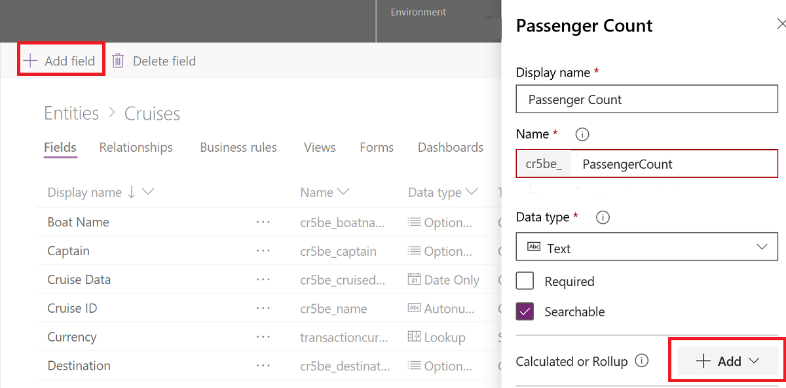
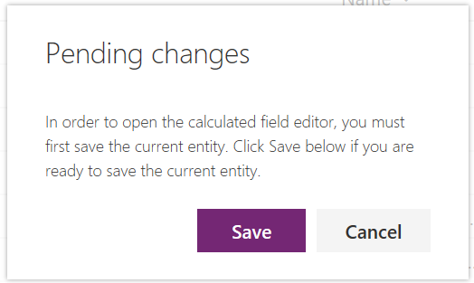
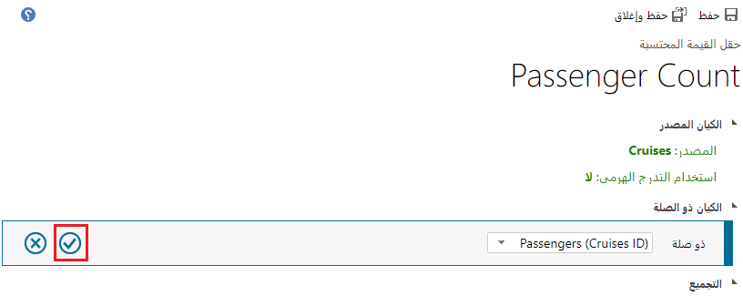
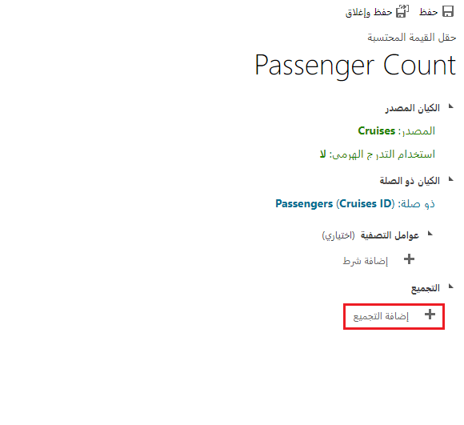
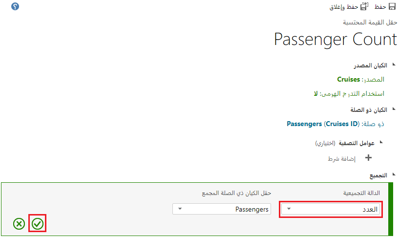
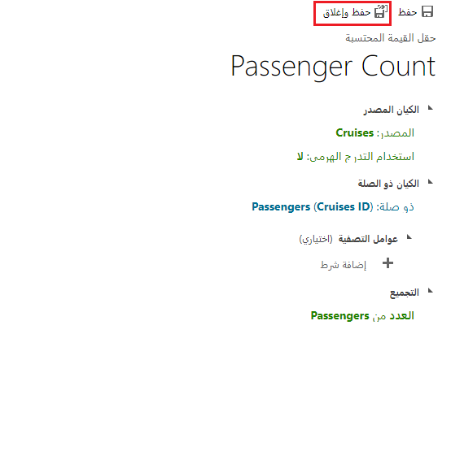
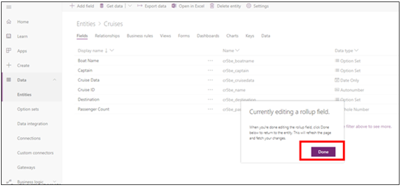

ستنشئ في هذا التمرين عدداً لإجمالي عدد الركاب الذين حجزوا مقعداً في رحلة بحرية باستخدام عمود القيمة المحتسبة. لتسهيل إكمال هذه التمارين، إذا لم تقم بإنشاء الجدول المخصص كجزء من مسار التعلم هذا، يمكنك إكمال الخطوات[هنا](/training/modules/create-relationship-between-cds-entities/6-exercise) لإنشاء الجداول ذات الصلة، و[هنا](/training/modules/define-create-business-rules/4-exercise) لإنشاء قواعد العمل.

1.  قم بتسجيل الدخول إلى Power Apps.

2.  حدد **الجداول > الرحلات**.

3.  حدد **إضافة عمود** في القائمة، وأدخل ما يلي في لوحة العمود الجديد:

    | إدخال عمود جديد | القيمة           |
    |-----------------|-----------------|
    | اسم العرض    | عدد الركاب |
    | نوع البيانات       | عدد صحيح    |

    

4.  حدد الزر **+ إضافة** وحدد **القيمة المحتسبة** في القائمة المنسدلة المرتبطة بالزر **+ إضافة** في لوحة العمود الجديدة.

5.  حدد الزر **حفظ** في النافذة **التغييرات المعلقة** عند طلبها.

    

6.  سيتم فتح علامة تبويب جديدة في المستعرض بعد حفظ التغييرات. هذه شاشة تعريف مجموعة التحديثات.

    > [!TIP]
    > قم بسحب شاشة تعريف الالتفاف وتوسيعها للتأكد أنه يمكنك رؤية زر علامة الاختيار، كما هو موضح في لقطة الشاشة التالية. حدد جدول "الركاب"، ثم حدد زر علامة الاختيار.

    

7.  بعد تحديد زر علامة الاختيار بجوار **الركاب (معرف الرحلة)**، حدد الزر **إضافة التجميع** (لا تحتاج إلى تعيين عامل تصفية).

    

8.  حدد التجميع عن طريق تحديد **العدد** في القائمة المنسدلة **الوظيفة التجميعية** وتحديد **الركاب** في القائمة المنسدلة لعمود **الجدول ذي الصلة المجمع**. حدد زر علامة الاختيار في أسفل يمين الشاشة.

    

9.  حدد الزر **حفظ وإغلاق** لحفظ هذا التجميع الجديد. سيؤدي هذا إلى إغلاق شاشة تصميم مجموعة التحديثات وإرجاعك إلى شاشة تفاصيل الجدول.

    

10. حدد الزر **تم** في شاشة **تحرير عمود القيمة المحتسبة حالياً** في شاشة جدول الرحلات البحرية. 
    
    

تهانينا! باستخدام جدول الرحلات البحرية، لقد قمت بإنشاء عمود قيمة محتسبة يسمى **عدد المسافرين** والذي يمكن استخدامه في الحلول التي تقوم بإنشائها.

> [!NOTE]
> يتم حساب القيم المحتسبة باستخدام وظيفة مجدولة على الخادم وليست في الوقت الفعلي. الإعداد الافتراضي هو عملية حسابية كل اثنتي عشرة ساعة بعد تعريف المجموعة وحفظها أو تحريرها. يمكن ضبط معدل تكرار تشغيل وظيفة التجميع بحسب الحاجة. راجع الارتباط الموجود في الوحدة "الملخص" في هذه الوحدة للحصول على مزيد من المعلومات حول كيفية الضبط عند تشغيل وظيفة حساب التجميع.
