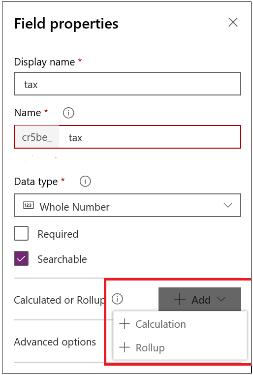
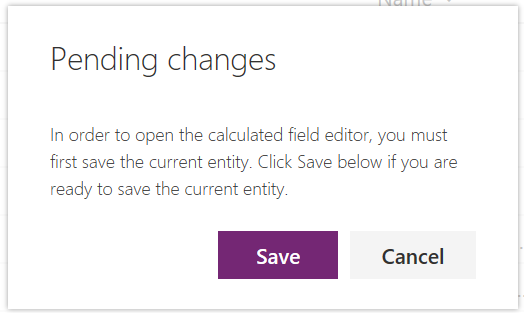
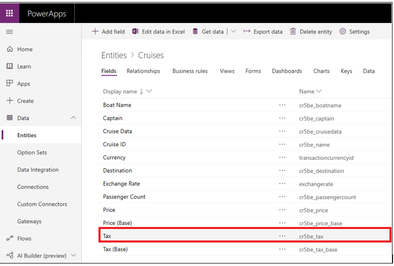
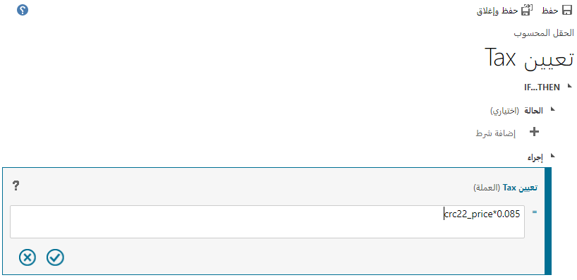
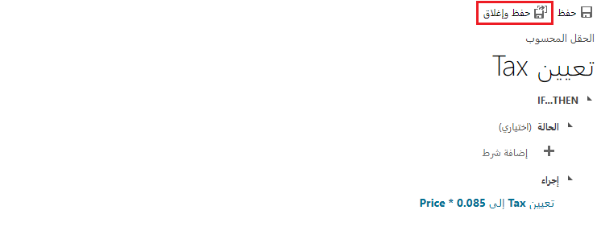
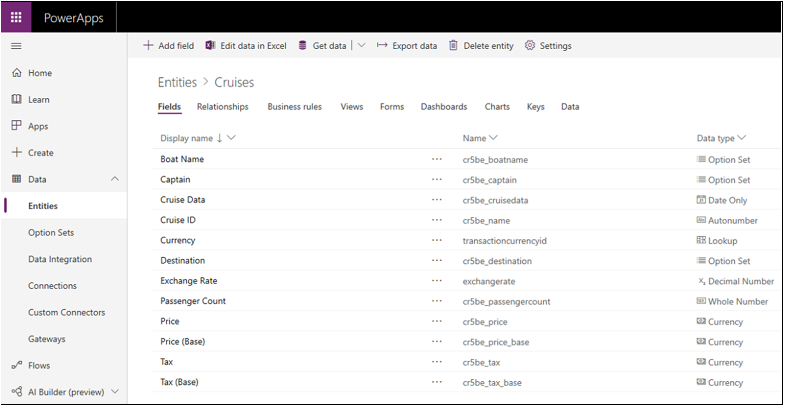

ستضيف في هذا التمرين عموداً يسمى **السعر** للاحتفاظ بالسعر لأحد الركاب في الرحلة البحرية. ستضيف بعد ذلك عموداً ثانياً يسمى **الضريبة** وتضيف عملية حسابية لتحديد الضريبة المراد فرضها على كل تذكرة.

1.  قم بتسجيل الدخول إلى Power Apps.

2.  حدد **الجداول > الرحلات**.

3.  حدد **إضافة عمود** في القائمة، وأدخل ما يلي في حقول "لوحة العمود الجديدة"، ثم انقر فوق "حفظ".

    | إدخال عمود جديد | القيمة    |
    |-----------------|----------|
    | اسم العرض    | السعر    |
    | نوع البيانات       | العملة |

4.  حدد **إضافة عمود** في القائمة، وأضف عموداً ثانياً، وأدخل ما يلي في أعمدة "لوحة الأعمدة الجديدة"، وحدد الزر **+ إضافة** بجوار **محسوب** أو **القيمة المحتسبة**، ثم حدد **+ الحساب**.

    | إدخال عمود جديد | القيمة    |
    |-----------------|----------|
    | اسم العرض    | الضريبة      |
    | نوع البيانات       | العملة |

    

5.  حدد الزر **حفظ** في شاشة **التغييرات المعلقة** حتى تتمكن من تحديد الحساب.

    

6.  سيتم حفظ جدول الرحلات البحرية، وستفتح شاشة جديدة في المستعرض للسماح بتحديد حساب الضريبة. قد تستغرق العملية 30 ثانية لفتح شاشة الحساب، لذا كن صبوراً.

7.  حدد خيار الإجراء ثم حدد عمود **الضريبة** في جدول الرحلات البحرية الذي أضفته للتو.

    > [!TIP]
    > وسّع الشاشة حتى تتمكن من التمرير عبر جميع خياراتك.

    

8.  أكمل حساب الضريبة بإضافة **.085**، كما هو موضح في لقطة الشاشة التالية، ثم حدد الزر "علامة الاختيار" لإنهاء إنشاء الحساب.

    

9.  حدد الزر **حفظ وإغلاق** لحفظ حساب الضريبة.

    

10. حدد الزر **تم**، وسيتم عرض العمودين الجديدين **السعر** و **الضريبة** في جدول الرحلات البحرية.

    

قد تلاحظ في القائمة المنسدلة **نوع البيانات** أن **العملة** بها إدخالان، أحدهما يسمى **السعر** والآخر باسم **السعر (الأساسي)**، كما هو موضح في الصورة التالية. ويحتوي أيضًا على إدخالين آخرين باسم **الضريبة** و **الضريبة (الأساسية)**. 

يرجع سبب الإدخالين لـ **السعر** و **الضريبة** إلى دعم Microsoft Dataverse للعديد من العملات المختلفة. يمكنك نشر حل تم إنشاؤه عالمياً باستخدام Dataverse وتحويل العملة المحلية إلى عملة أساسية مشتركة. بينما قد تكون القيم المحلية بالدولار أو اليورو في عمودي **السعر** و **الضريبة**، يتم استخدام العملة المشتركة في عمودي **العملة الأساسية** و **الضريبة الأساسية**. يحسب Dataverse معدل التحويل بحيث يمكنك جمع المعلومات بعملة قياسية (الأعمدة الأساسية) بغض النظر عن العملة المحلية المستخدمة في حلك.
يمكنك قراءة المزيد حول تحويل العملات باتباع الارتباط الموجود في وحدة الملخص في هذه الوحدة.

حاول إضافة بعض البيانات إلى جدول الرحلات البحرية لاختبار حقل **الضريبة** عن طريق تحديد **البيانات** في القائمة أعلى الجدول، ثم تحديد الخيار **Excel**. يتم تضمين ارتباط في وحدة الملخص في هذه الوحدة النمطية إذا كنت بحاجة إلى معلومات إضافية حول كيفية إدخال البيانات وتحريرها في Dataverse باستخدام Excel. 
