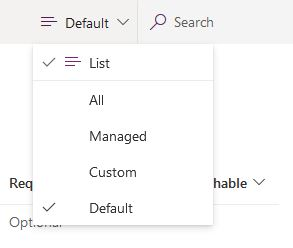

تعد إضافة جدول جديد إلى قاعدة بيانات Dataverse عملية بسيطة.

> [!TIP]
> تأكد من أنك تتحقق دائماً من أن وظيفة الجدول الذي تريد إنشاءه موجودة بالفعل في الجداول القياسية المدرجة في وحدة الملخص في هذه الوحدة النمطية.

بعد التحقق من الجداول الموجودة وتحديد أنك بحاجة إلى جدول مخصص جديد، اتبع الخطوات التالية:

1. قم بتسجيل الدخول إلى Power Apps.

1. في جزء التنقل، حدد أو انقر فوق **البيانات** لتوسيعها ثم حدد أو انقر فوق **الكيانات**.

1. حدد **جدول جديد** من شريط الأوامر.

1. في لوحة الجدول الجديد، في المربع **اسم العرض** ، أدخل اسم الجدول المخصص الجديد.

    **اسم العرض الجماعي** - يتم ملء هذا العمود تلقائياً عند إدخال اسم عرض، ولكن يمكنك تغييره إذا لزم الأمر. اسم العرض الجمع هو اسم الجدول في Dataverse WebAPIويُستخدم عند التفاعل مع هذا الجدول من Power Apps أو Power Automate.

    **الاسم** - يتم أيضاً ملء هذا العمود تلقائياً عند إدخال اسم عرض. تم اعداد البادئة وقت إنشاء البيئة. ويضمن ذلك إمكانيه تصدير الجداول التي تقوم بإنشائها في بيئات أخرى واستيرادها دون تعارضها مع أسماء الجداول الأخرى.
    يمكنك تغيير هذه البادئة عن طريق تحديث البادئة على الناشر الخاص بك لحل Dataverse الافتراضي. لمنع تعطل التطبيقات الحالية، فإنه لا يمكنك تغيير الاسم بعد حفظ الجدول.

    ضمن قسم العمود **الاسم الأساسي** وفي المربع **اسم العرض**، أدخل اسماً **لاسم العرض**. في المربع **الاسم**، قم باستبدال **الاسم** باسم من اختيارك للعمود الأساسي الجديد.

    بشكل افتراضي، يحتوي كل جدول على عمود **اسم أساسي** يتم استخدامه بواسطة أعمدة البحث عند إنشاء علاقات مع جداول أخرى. عادةً ما يخزن العمود **الاسم الأساسي** وصف اسم البيانات المخزنة في صف الجدول. يمكنك تحديث الاسم واسم العرض **للاسم الأساسي** حتى تقوم بإنشاء الجدول. بمجرد إنشاء الجدول، فإنه لا يمكنك تحديث الاسم.

     عندما تنتهي من ذلك، حدد **إنشاء**.

1. لإضافة **عمود إلى الجدول**، استخدم الإجراء التالي:

    1. في شريط الأوامر، حدد أو انقر فوق **إضافة عمود** لفتح لوحة خصائص العمود.

    1. في المربع **اسم العرض** ، أدخل اسم العمود الذي تريد إضافته.

    1. من القائمة المنسدلة **نوع البيانات** ، حدد نوع البيانات التي تريد إضافتها.

    1. حدد وقم بتغيير القائمة المنسدلة **مطلوب** إذا رغبت في ذلك.

    1. حدد أو انقر فوق **تم**.

    سوف تتعلم المزيد عن الأعمدة في وحدة نمطية لاحقة.

    > [!NOTE]
    > تحتوي جميع الجداول على أعمدة نظام للقراءة فقط. بشكل افتراضي، لا تظهر أعمدة النظام في قائمة الأعمدة، على الرغم من وجودها داخل الجدول. لعرض جميع الأعمدة، قم بتغيير عامل التصفية في شريط الأوامر من **Default** إلى **All**. لمزيد من المعلومات حول البيانات الأولية المرتبطة بالجدول، راجع بيانات تعريف الجدول.

    

1. حدد **حفظ الجدول** لحفظ جدولك وجعله متاحاً للاستخدام في التطبيقات.

    > [!TIP]
    > ستحتاج إلى تعيين أذونات للجدول المخصص الجديد في دور أمان مستخدم حالي أو جديد. بهذه الطريقة، يمكن للمستخدمين إضافة البيانات في الجدول أو عرضها أو تحريرها أو حذفها. راجع الوحدة الرابعة في الوحدة النمطية الثانية إذا كنت بحاجة إلى معلومات إضافية حول أدوار أمان المستخدم.
