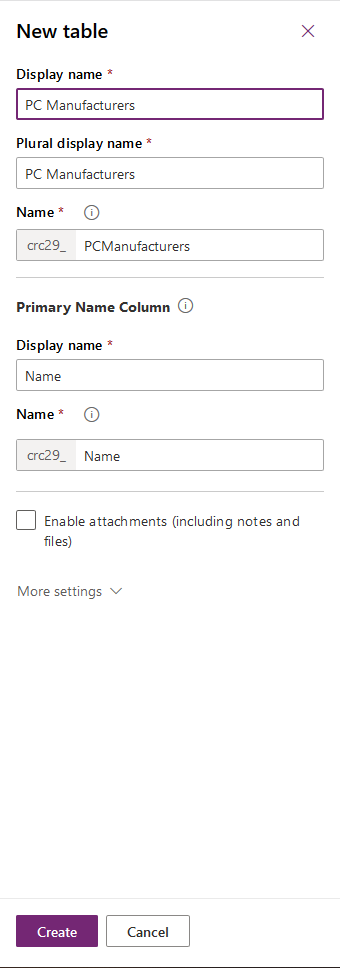
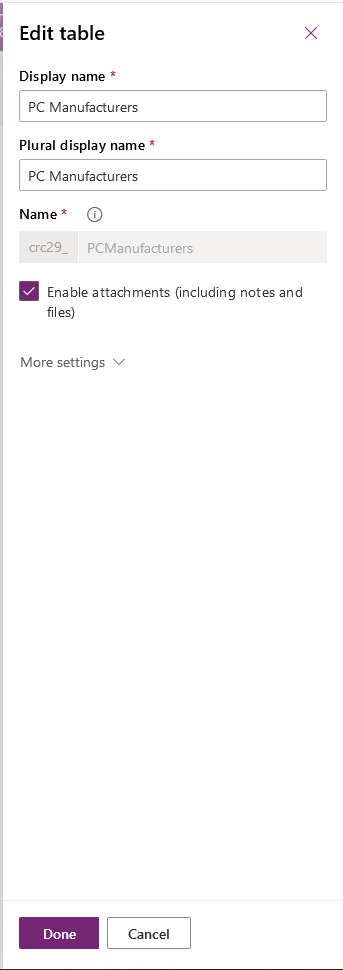

### إنشاء جدول مخصص جديد

يوضح لك هذا التمرين كيفية إنشاء جدول مخصص جديد في Dataverse.

1.  حدد **Dataverse**/**البيانات** في اللوحة بالجانب الأيسر من مدخل Power Apps لتمديد الاختيارات المتوفرة.

1.  حدد **الجداول** ضمن الخيار "البيانات" في الجانب الأيسر من المدخل.

1.  حدد **جدول جديد** في القائمة أعلى قائمة الجداول.

1.  أدخل ما يلي لـ *اسم العرض*: **الشركات المصنّعة لأجهزة الكمبيوتر**

1.  حدد **حفظ**.

    

### تمكين المرفقات

يجب أن تشاهد الآن قائمة الأعمدة للجدول الجديد **الشركات المصنعة لأجهزة الكمبيوتر‬‏‫‬‏‫**.

1.  حدد **خصائص** في القائمة أعلى أعمدة الجدول.

1.  حدد خانة الاختيار **تمكين المرفقات**.

1.  حدد **حفظ**.

    

1.  حدد الزر **موافق** إذا ظهر مربع الحوار لإعلامك بأنه لا يمكن تعطيل تمكين المرفقات.
