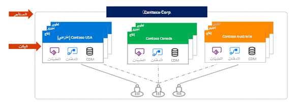

تُعد البيئة طريقه لإنشاء مثيل من قاعدة بيانات Dataverse وإدارته. وهي تسمح لك أيضاً بإدارة وصول المستخدم وإعدادات الأمان والتخزين المرتبط بقاعدة بيانات Dataverse داخل تلك البيئة. بالإضافة إلى ذلك، تسمح لك البيئة بتثبيت التطبيقات التي تقوم بإنشائها باستخدام Power Apps أو مهام سير العمل التي تقوم بإنشائها باستخدام Power Automate في تلك البيئة. يمكنك إنشاء بيئة واحدة أو عدة بيئات، بحسب احتياجاتك.

يتم إنشاء كل بيئة ضمن مستأجر Microsoft Azure Active Directory (Azure AD)، وبإمكان المستخدمين في ذلك المستأجر فقط الوصول إلى مواردها. وترتبط البيئة أيضاً بموقع جغرافي، مثل الولايات المتحدة. عندما تنشئ قاعدة بيانات في Dataverse، يتم إنشاء قاعدة البيانات هذه في مراكز البيانات في ذلك الموقع الجغرافي. وترتبط أيضاً أي عناصر تقوم بإنشائها في تلك البيئة (بما في ذلك الاتصالات والبوابات ومهام سير العمل التي تستخدم Microsoft Flow والكثير غير ذلك) بموقع بيئتها.

يمكنك إنشاء أكثر من بيئة واحدة لإدارة تطوير الحلول وتخزين البيانات من خلال إعداد بيئة واحدة للتطوير وأخرى للاختبار وأخرى لاستخدام الإنتاج. علاوةً على ذلك، يمكنك إعداد بيئة بالاستناد إلى موقع جغرافي. على سبيل المثال، قد تقوم بإعداد بيئة لأوروبا وبيئة أخرى لآسيا. سيكون لكل بيئة من هذه البيئات مثيل واحد فقط من Microsoft Dataverse أو لن يكون لديها أي مثيل.

>
