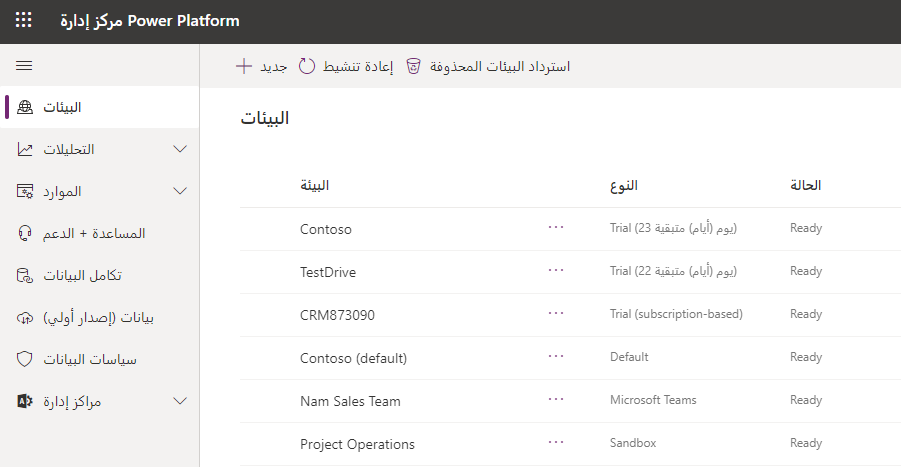
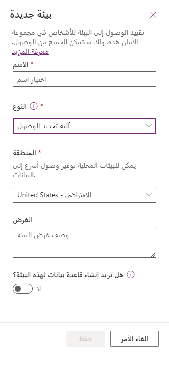

يتم إنشاء بيئة افتراضية لك تلقائياً عند التسجيل في Power Apps وDynamics 365، أو إذا كان لديك حساب Microsoft 365 مع Microsoft. سيتم دائماً تعيين بيئة واحدة على الأقل كبيئة افتراضية عند بدء العمل باستخدام Microsoft Dataverse.

إذا كنت بحاجة لإنشاء بيئة جديدة، استخدم الإجراء التالي:

1.  تسجيل الدخول إلى https://admin.powerplatform.microsoft.com

2.  حدد خيار **البيئات** على الجانب الأيسر من البوابة.

3.  حدد زر **بيئة جديدة** في الجزء العلوي الأيمن من شاشة **البيئات** كما هو موضح في الشكل التالي.

    

    > [!TIP]
    > إذا قمت بإنشاء بيئة، فستتم إضافتك تلقائياً إلى دور مسؤول البيئة الخاص بتلك البيئة. لا يوجد حد لعدد البيئات التي يمكنك المشاركة فيها كعضو في دور مسؤول البيئة أو منشئ البيئة.

4.  بعد تحديد زر **بيئة جديدة**، يمكنك تسمية البيئة الجديدة، وتحديد المنطقة، ثم تحديد نوع البيئة، مثل بيئة تجريبية أو بيئة تشغيل، كما هو موضح في الشكل التالي.

    

    > [!TIP]
    > سيكون المثيل التجريبي للبيئة صالحاً فقط لمدة 30 يوماً. إذا كنت ترغب في استخدام البيئة لأكثر من 30 يوماً، فيجب تحويل الإصدار التجريبي إلى بيئة تشغيل. يجب أن يكون لديك ترخيص لكل تطبيق أو ترخيص لكل مستخدم لإنشاء بيئة تشغيل جديدة أو تحويل بيئة تجريبية إلى بيئة تشغيل. راجع صفحة [**التراخيص والأسعار**](https://powerapps.microsoft.com/pricing/?azure-portal=true) لمزيد من المعلومات.

5.  حدد زر **إنشاء البيئة**.

تهانينا، لقد قمت للتو بإنشاء بيئة جديدة! 
