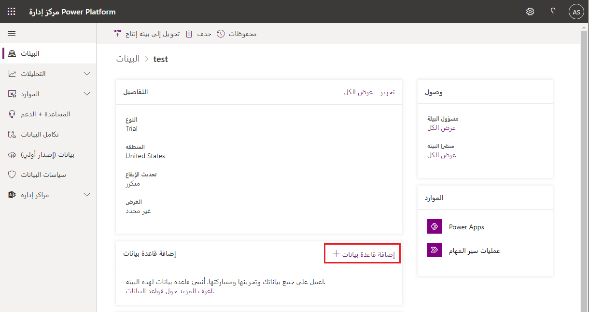

بعد إنشاء بيئة، يمكنك إنشاء مثيل جديد لقاعدة بيانات Microsoft Dataverse باستخدام الخطوات الآتية:

1.  سجّل الدخول إلى مركز إدارة [Microsoft Power Platform](https://admin.powerplatform.microsoft.com).

2.  حدد خيار **البيئات** على الجانب الأيسر من البوابة.

3.  حدد **إضافة قاعدة بيانات**.

    

4. أدخل ما يأتي، ثم حدد **إضافة**.

   |الإعداد  |الوصف  |
   |---------|---------|
   |اللغة     | اللغة الافتراضية لهذه البيئة.    |
   |العملة     | العملة الأساسية المستخدمة لإعداد التقارير.‬         |
   |تمكين تطبيقات Dynamics 365 | حدد **نعم** وقم بإجراء تحديد لنشر التطبيقات تلقائيًا، مثل Dynamics 365 Sales وDynamics 365 Customer Service. |
   |نشر عينات التطبيقات والبيانات     | حدد **نعم** لتضمين عينات التطبيقات والبيانات. تمنحك عينة البيانات شيئًا للتجربة وأنت تتعلم. يجب تحديد **لا** لإظهار **تمكين تطبيقات Dynamics 365** لهذا الإعداد.        |
   |مجموعة الأمان | حدد مجموعة أمان لتقييد الوصول إلى هذه البيئة. |
   
   لمزيد من المعلومات، راجع [إضافة قاعدة بيانات Dataverse](/power-platform/admin/create-database)
