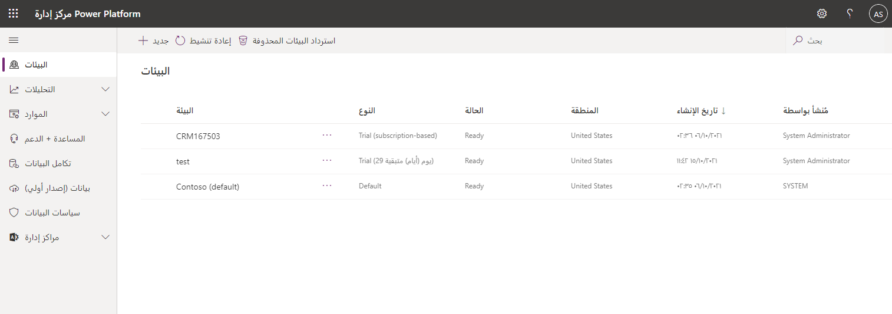

بعد قيامك بإنشاء بيئة، تتم إضافة المستخدمين من Azure Active Directory والمرتبطين بالمستأجر الخاص بك إلى البيئة تلقائيًا. 

> [!TIP]
> إذا كان لديك عدد كبير من المستخدمين، فقد يستغرق الأمر عدة ساعات لإضافتهم جميعًا.

تتحكم أدوار أمان المستخدم في وصول المستخدم إلى البيانات من خلال مجموعة من مستويات الوصول والأذونات. تضع مجموعة مستويات الوصول والأذونات المضمنة في دور الأمان قيودًا على طريقة عرض المستخدم لتلك البيانات وتفاعلاته معها.

> [!TIP]
> يمتلك المستخدمون الذين تمت إضافتهم تلقائيًا إلى البيئة الافتراضية دور المستخدم الأساسي ممكّنًا، لكن لن يمتلك المستخدمين الذين تمت إضافتهم تلقائيًا إلى بيئة أخرى أي أدوار ممكّنة للمستخدم.  

يمكن أيضًا ربط أدوار الأمان بمجموعة Azure AD. نوصي بإنشاء مجموعات Azure AD وإقران الأدوار بمجموعات الأمان هذه لتبسيط الأذونات والوصول إلى البيانات.

> [!TIP]
> تتحكم أدوار أمان المستخدم في الوصول في وقت التشغيل إلى البيانات وهي منفصلة عن أدوار البيئة التي تحكم مسؤولي البيئة وصانعي البيئة. أدوار البيئة المضمّنة في كلّ بيئة هما "مسؤول النظام" و"منشئ البيئة". جميع الأدوار الأخرى هي أدوار أمان المستخدم. 

يستخدم المستخدم الإداري الذي تمت إضافته إلى دور مسؤول البيئة الخطوات التالية لتعيين مجموعات جديدة أو مستخدمين إلى البيئة والأمان داخل تلك البيئة:

1. سجّل الدخول إلى مركز إدارة [Microsoft Power Platform](https://admin.powerplatform.microsoft.com/?azure-portal=true).

1. حدد البيئة في قائمة البيئات التي تريد إدارتها.

   

1. في القسم **الوصول**، تحقق من صحة توافر المستخدم في البيئة بتحديد **مشاهدة الكل** ضمن *المستخدمون*.

   

1. يمكنك إضافة المستخدم هنا في مركز مسؤولي Microsoft Power Platform، إذا كان المستخدم غير موجود في البيئة. أضف المستخدم عن طريق تحديد الزر **إضافة مستخدم** ثم إدخال عنوان البريد الإلكتروني للمستخدم في مؤسستك.

   

1. انتظر بضع دقائق للتحقق من إضافة المستخدم إلى قائمة المستخدمين في البيئة.

1.  حدد اسم المستخدم من قائمة المستخدمين في البيئة. سيتم فتح علامة تبويب جديدة تحتوي على تفاصيل حساب المستخدم هذا.

1. حدد علامة التبويب **إدارة الأدوار**.

1. قم بتعيين الدور **مسؤول النظام** للمستخدم عن طريق تحديد خانة الاختيار بجوار اسم الدور.

   

1. حدد **موافق** لتحديث التعيينات للمستخدم داخل تلك البيئة.

يتناول الجدول التالي كلاً من أدوار الأمان المحددة مسبقًا التي تعكس مهام المستخدم الشائعة بمستويات وصول محددة لمطابقة هدف أفضل ممارسات الأمان، وهو توفير الوصول إلى الحد الأدنى من بيانات العمل المطلوبة لاستخدام التطبيق.

| **دور الأمان**            | **امتيازات قاعدة البيانات**                                                    | **الوصف**                                                                                                                                                                                                             |
|--------------------------|-------------------------------------------------------------------------|-------------------------------------------------------------------------------------------------------------------------------------------------------------------------------------------------------------------------|
| مسؤول النظام     | إنشاء، قراءة، كتابة، حذف، تخصيصات، أدوار أمان             | لديه الإذن الكامل لتخصيص البيئة أو إدارتها، بما في ذلك إنشاء أدوار الأمان وتعديلها وتعيينها. يمكن عرض جميع البيانات الموجودة في البيئة.                                                      |
| مخصص النظام        | الإنشاء (ذاتي)، القراءة (ذاتي)، الكتابة (ذاتي)، الحذف (ذاتي)، التخصيصات | لديه الإذن الكامل لتخصيص البيئة. ومع ذلك، يمكنهم فقط عرض السجلات لكيانات البيئة التي قاموا بإنشائها.                                                                                             |
| منشئ البيئة        | تخصيصات                                                          | يمكن إنشاء موارد جديدة مرتبطة بالبيئة، بما في ذلك التطبيقات والاتصالات وواجهات API المخصصة والمداخل والتدفقات باستخدام Power Automate. ومع ذلك، لا يمتلك هذا أي امتيازات للوصول إلى البيانات داخل البيئة. |
| المستخدم الأساسي | قراءة (ذاتي)، إنشاء (ذاتي)، كتابة (ذاتي)، حذف (ذاتي)                 | يمكنهم تشغيل تطبيق داخل البيئة وتنفيذ المهام الشائعة للسجلات التي يمتلكونها. ملاحظة: ينطبق هذا فقط على الكيانات غير المخصصة.                                                                           |
| التفويض                 | التصرف بالنيابة عن مستخدم آخر                                           | يسمح بتشغيل التعليمات البرمجية كمستخدم آخر أو ينتحل صفة. يُستخدم عادةً مع دور أمان آخر للسماح بالوصول إلى السجلات.                                                                                                |

### إنشاء دور أمان مخصص 

فيمكنك إنشاء دور أمان جديد من خلال الخطوات التالية، إذا كنت بحاجة إلى دور أمان مخصص. دور الأمان المخصص الذي تقوم بإنشائه متاح فقط في بيئة واحدة حيث تم إنشاؤه. الدور المخصص غير متوفر في أي بيئة أخرى.

1. قم بتسجيل الدخول إلى [Microsoft Power Platform](https://admin.powerplatform.microsoft.com).

1.  حدد البيئة في قائمة البيئات التي تريد إدارتها.

1.  في القسم **الوصول**، حدد **مشاهدة الكل** ضمن *أدوار الأمان*.

    

1.  في الأعلى، حدد **دور جديد**.

1.  باستخدام علامات التبويب، أضف اسمًا واملأ إعدادات الدور الجديد.

    

1.  انقر فوق علامة التبويب **الكيانات المخصصة** وقم بضبط إعدادات أمان المستخدم لكل جدول (الكيان).

    

1.  في الأعلى، انقر فوق **حفظ وإغلاق**.

لقد أضفت الآن أذونات المستخدم وأنشأت دور أمان مخصصًا!

