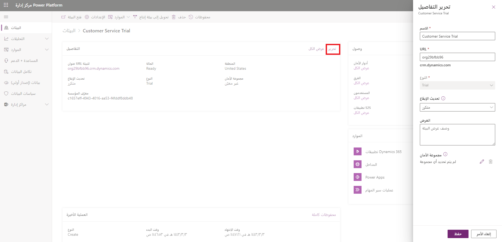

يمكنك مراقبة الاستخدام وسلامة الخدمة لجميع مثيلات Microsoft Dataverse بالانتقال إلى مركز إدارة Microsoft Power Platform. استخدم الخطوات التالية لمراقبة أي بيئة مرتبطة بمثيل Dataverse.

1.  سجّل الدخول إلى مركز إدارة Microsoft Power Platform.

2.  حدد **البيئات** في الجزء الأيسر.

3.  حدد البيئة المراد مراقبتها أو تعديل إعداداتها.

4.  حدد ‏‫ارتباط **تحرير الإعدادات**. يمكنك في هذه الشاشة تحرير تفاصيل حول البيئة، بما في ذلك الاسم ومجموعات الأمان التي يمكنها الوصول إلى البيئة. يمكنك أيضًا الاطلاع على الإصدار الحالي من Dataverse وتطبيق أي تحديثات يدويًا حسب الرغبة.

    
