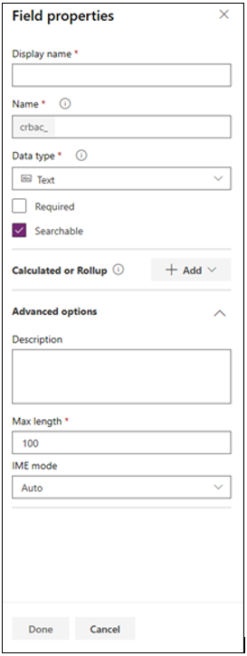

يمكنك إضافة أعمدة عند إنشاء جدول مخصص جديد أو يمكنك إضافة أعمدة إلى جدول حالي في أي وقت. تكون إضافة عمود جديد هي نفسها سواء إذا كنت تقوم بإنشاء جدول جديد أو إضافة جدول حالي.

> [!TIP]
> قبل إنشاء عمود مخصص، قيِّم ما إذا كان هناك عمود حالي يلبي متطلباتك.

1.  قم بتسجيل الدخول إلى Power Apps.

2.  حدد خيار **Dataverse** في القائمة اليسرى.

3.  افتح جدولاً حالياً أو أنشئ جدولاً جديداً.

4.  حدد القائمة المنسدلة بواسطة **+ جديد** ثم **العمود** في القائمة أعلى الصفحة.

5.  أدخل المعلومات في الأعمدة الآتية:

    أ.  **اسم العرض** - الاسم الذي يتم عرضه للمستخدمين.

    ب. **وصف** - يعد هذا وصفاً للعمود.

    ج.  **نوع البيانات** - هذا هو نوع البيانات التي تريد تخزينه في العمود.

    د. **التنسيق** - تنسيق العرض للبيانات المُراد تخزينها في العمود.

    هـ. **السلوك** - تحديد ما إذا كان الحقل سيكون حقلاً بسيطاً أو محسوباً أو حقل القيمة المحتسبة

    د.  **مطلوب** - حدد خانة الاختيار هذه إذا كنت ترغب في التأكد من أن هذا العمود يتضمن قيمة عندما يحاول المستخدم إضافة سجل إلى هذا الجدول.

    هـ.  **قابل للبحث** - امسح خانة الاختيار هذه للأعمدة الخاصة بالجدول الذي لا تستخدمه. عندما يكون العمود قابلاً للبحث، فإنه يظهر في **البحث المتقدم** ويكون متوفراً عند تخصيص طرق العرض.
        يؤدي مسح خانة الاختيار هذه إلى تقليل عدد الخيارات التي يتم عرضها للأشخاص الذين يستخدمون **البحث المتقدم**، كما يسهل على المستخدمين إنشاء طرق عرض مخصصة دون رؤية الأعمدة غير المستخدمة. امسح خانة اختيار **قابل للبحث** عند التعامل مع أعمدة في جدول قياسي أو معقد لا تستخدمه.

    و.  **اسم المخطط** - هذا هو الاسم الداخلي المستخدم بواسطة التطبيق.

    ز.  **الحد الأقصى لعدد الأحرف** - يُستخدم لتحديد الحد الأقصى لطول البيانات التي يستطيع مستخدم إدخالها في هذا العمود. لاحظ أن ذلك يتم استخدامه مع أعمدة النصوص.

    ح.  **الحد الأدنى والحد الأقصى للقيم** - يتوفر هذا العمود ويُستخدم مع أعمدة الأرقام.

    ط. **حجم الرقم** - يتوفر هذا العمود ويُستخدم مع أعمدة الأرقام. يحدد ما إذا كان التنسيق سيكون int أو bigint، مما له آثار على القيمة المحتسبة

    
