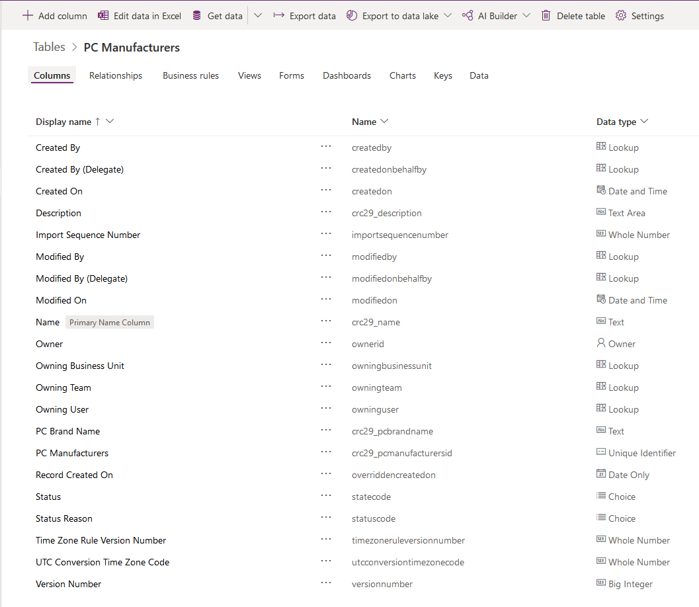
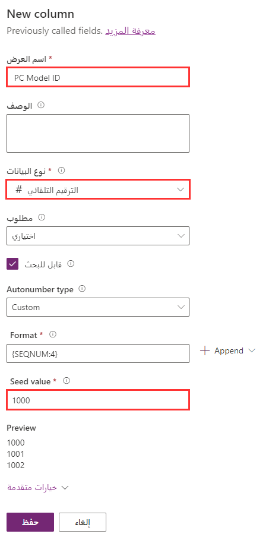

### إضافة أعمدة إلى جدول مخصص

في علامة التبويب هذه، ستضيف عدداً قليلاً من الأعمدة إلى الشركات المصنعة لأجهزة الكمبيوتر في الجدول المخصص. إذا لم أنشئ الجدول المخصص كجزء من هذا المسار التعليمي، فأكمل الخطوات [هنا](/training/modules/create-manage-entities/5-exercise) لإكمال هذه التمارين.

1.  قم بتسجيل الدخول إلى Power Apps.

2.  حدد البيئة التي أضفت الشركات المصنعة لأجهزة الكمبيوتر الجديدة إليها.

3.  حدد **البيانات** في اللوحة الموجودة في الجانب الأيسر من مدخل Power Apps لتمديد الاختيارات المتوفرة.

4.  حدد **الجداول** ضمن **البيانات** على الجانب الأيسر من المدخل.

5.  حدد الجدول المخصص الجديد **الشركات المصنعة لأجهزة الكمبيوتر** في قائمة الجداول.
    سيؤدي ذلك إلى فتح قائمة الأعمدة في الجدول.

6.  حدد **+ إضافة عمود** في القائمة أعلى قائمة الأعمدة في الجدول.

7.  اكتب **اسم العلامة التجارية لجهاز الكمبيوتر** في عمود **اسم العرض**.

8.  حافظ على تحديد خانة الاختيار **قابل للبحث**.

9.  حدد **تم**.

    > 

10. حدد **+ إضافة عمود** في القائمة أعلى قائمة الأعمدة في الجدول.

11. اكتب **الوصف** في عمود **اسم العرض**.

12. حدد **مساحة النص** في نوع البيانات.

13. حدد الزر **تم**.

14. حدد زر **حفظ الجدول** لحفظ التغييرات.

    

بعد تحديد زر **حفظ الجدول**، يجب أن يحتوي جدول الشركات المصنعة لأجهزة الكمبيوتر المخصص حديثاً على الأعمدة المضافة حديثاً، كما هو موضح في الشكل السابق.

### إعادة تسمية عمود أساسي

في علامة التبويب هذه، ستقوم بإعادة تسمية العمود الأساسي الذي تم إنشاؤه افتراضياً عند إنشائك الشركات المصنعة للكمبيوتر بالجدول المخصص.

1.  قم بتسجيل الدخول إلى Power Apps.

2.  حدد البيئة التي أضفت الشركات المصنعة لأجهزة الكمبيوتر الجديدة إليها.

3.  حدد **البيانات** في اللوحة بالجانب الأيسر من مدخل Power Apps لتمديد الاختيارات المتوفرة.

4.  حدد **الجداول** ضمن الخيار **البيانات** في الجانب الأيسر من المدخل.

5.  حدد الجدول المخصص الجديد **الشركات المصنعة لأجهزة الكمبيوتر** في قائمة الجداول. سيؤدي ذلك إلى فتح قائمة الأعمدة في الجدول.

6.  قم باستدعاء أن عمود **الاسم** تم إنشاؤه تلقائياً عندما قمت بإنشاء الجدول المخصص. لاحظ أنه تم تحديده على أنه **قابل للبحث** و **مطلوب**، كما هو موضح في الشكل التالي.

    > 

7.  حدد عمود **الاسم** وقم بتحديث حقل *اسم العرض* إلى **اسم النموذج الخاص بجهاز الكمبيوتر**، كما هو موضح في الشكل التالي. لا يمكنك تغيير الاسم الداخلي (الاسم*) للعمود.

    

8.  حدد **تم**.

9.  حدد **حفظ الجدول**. 

### إضافة عمود الترقيم التلقائي

في علامة التبويب هذه، تتم إضافة عمود "رقم تلقائي" للمساعدة في تحديد سجل الشركة المصنعة في الجدول المخصص. 

1.  قم بتسجيل الدخول إلى مدخل Power Apps.

2.  في الجزء الأيسر، قم بتمديد **البيانات** وحدد **الجداول**.

3.  حدد الشركات **الشركات المصنعة لأجهزة الكمبيوتر** بالجدول المخصص.

4.  في شريط الأدوات، حدد **إضافة عمود**.

5.  في الجزء الأيمن، ادخل **معرف نموذج الكمبيوتر الشخصي** لـ **اسم العرض** وحدد **رقم تلقائي** لـ **نوع البيانات**.

6.  ضمن **نوع الرقم التلقائي**، حدد **مخصص**.

7.  اترك **التنسيق** كافتراضي لـ **{SEQNUM:4}**.

8.  قم بتخصيص **قيمة أولية** أو احتفظ بالقيمة الافتراضية **1,000**، كما هو موضح في الشكل التالي.

> 

9.  حدد **تم**.

10. حدد الزر **حفظ الجدول**. 

### إنشاء مفتاح
إنشاء مفتاح للتأكد من أن القيمة فريدة ومفهرسة.

1.  قم بتسجيل الدخول إلى Power Apps.

2.  حدد البيئة التي أضفت الشركات المصنعة لأجهزة الكمبيوتر الجديدة إليها.

3.  حدد **البيانات** في اللوحة بالجانب الأيسر من مدخل Power Apps لتمديد الاختيارات المتوفرة.

4.  حدد **الجداول** ضمن الخيار **البيانات** في الجانب الأيسر من المدخل.

5.  حدد الجدول المخصص الجديد **الشركات المصنعة لأجهزة الكمبيوتر** في قائمة الجداول. سيؤدي ذلك إلى فتح قائمة الأعمدة في الجدول.

6.  حدد **المفاتيح** الموجودة في القائمة أعلى قائمة الأعمدة في جدول الشركات المصنعة للكمبيوتر المخصص.

7.  حدد **إضافة مفتاح** في القائمة الموجودة أعلى قائمة المفاتيح.

8.  أدخل **PC Key** في عمود **اسم العرض**.

9.  حدد خانة الاختيار الموجودة بجوار عمود **اسم نموذج الكمبيوتر الشخصي**.

    > [!NOTE]
    > يمكن أن يتكون المفتاح من عمود واحد أو أكثر من عمود. إذا قمت بتحديد أعمدة متعددة، سيُسمى المفتاح مفتاحاً مركباً.

    

10. حدد الزر **تم**.

11. حدد الزر **حفظ الجدول**.

بعد تحديد **تم**، ستشاهد المفتاح الجديد الذي تمت إضافته إلى قائمة كافة المفاتيح التي تم إنشاؤها لهذا الجدول. يمكن إنشاء ما يصل إلى خمسة مفاتيح بديلة لكل جدول. ستكون كافة القيم في المفتاح فريدة. 
