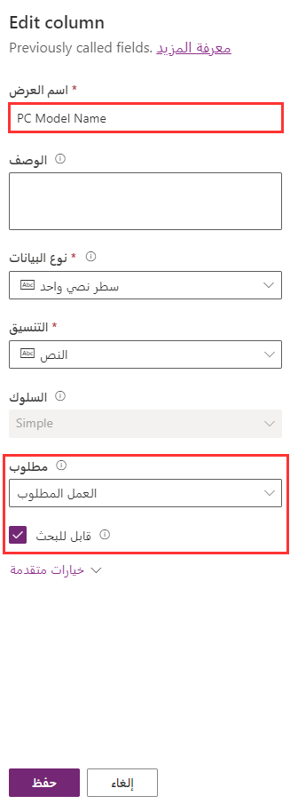
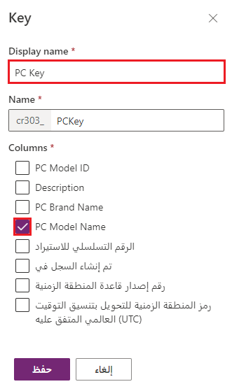

في هذا التمرين، ستضيف بضعة أعمدة إلى الجدول المخصص لشركات تصنيع أجهزة الكمبيوتر.
إذا لم تقم بإنشاء الجدول المخصص كجزء من مسار التعلم هذا ، يمكنك إكمال الخطوات [هنا](/learn/modules/create-manage-entities/5-exercise) لإنشاء هذا الجدول.

### إضافة أعمدة إلى جدول مخصص

1. قم بتسجيل الدخول إلى Power Apps.

1. حدد البيئة التي أضفت فيها الجدول المخصص الجديد للشركات المصنّعة لأجهزة الكمبيوتر.

1. حدد **Dataverse** على اللوحة الموجودة على الجانب الأيسر من ملف Power Apps  المدخل لتوسيع الخيارات المتاحة.

1. حدد **الجداول** ضمن **Dataverse** على الجانب الأيسر من المدخل.

1. حدد الجدول المخصص **PC Manufacturers** من قائمة الجداول. 

   > [!TIP]
   > يمكنك إدخال عنوان الجدول في اطار البحث في أعلى يسار شريط أوامر maker portal. 
   
   يؤدي تحديد الجدول إلى فتح شاشة عرض الجدول التي تظهر أجزاء مثل الصورة أدناه.

   > [!div class="mx-imgBorder"]
   > 

1. حدد زر **+** في جزء الأعمدة والبيانات لإضافة عمود آخر بجوار عمود *اسمك*.

1. اكتب **اسم العلامة التجارية لجهاز الكمبيوتر** في عمود **اسم العرض**.

1. حافظ على تحديد خانة الاختيار **قابل للبحث**.

1. حدد **حفظ**.

    > [!div class="mx-imgBorder"]
    > 

1. حدد **+** في جزء الأعمدة والبيانات لإضافة عمود آخر.

1. اكتب **الوصف** في عمود **اسم العرض**.

1. حدد **مساحة النص** في نوع البيانات. لاحظ كيف يعرض **نوع البيانات** الآن *سطر النص المفرد* ويقوم **التنسيق** بعرض *منطقة النص*. اترك الحقول الأخرى كما هي.

1. حدد الزر **حفظ**.

يجب أن يتضمن جدول الشركات المصنّعة لأجهزة الكمبيوتر الآن الأعمدة المضافة حديثًا، *واسم العلامة التجارية للكمبيوتر* و *وصفه*.

### إعادة تسمية عمود أساسي

بعد ذلك سنقوم بإعادة تسمية العمود الأساسي المسمى *الاسم* تم إنشاؤه افتراضيًا عند إنشاء الجدول المخصص **PC مصنِّعو الكمبيوتر الشخصي**.

1. قم بتسجيل الدخول إلى Power Apps (إذا لم تكن موجودا مسبقا في هذا الموقع) ثم حدد البيئة التي أضفت فيها جدول الشركات المصنّعة لأجهزة الكمبيوتر.

1. حدد **Dataverse** > **الجداول** ثم ابحث عن جدولك.

1. في نافذة محرر *الجداول > الشركات المصنعة للكمبيوتر الشخصي* لا بد أنك سوف ترى الآن **الشركات المصنعة للكمبيوتر الشخصي** معروضة. تعرض الأعمدة وجزء البيانات في النصف الأسفل من الشاشة عمود الاسم **الخاص بك**. انطلق وحدد العمود ، ثم حدد **تحرير عمود**.

   > [!div class="mx-imgBorder"]
   > 

1. في جزء *عمود التحرير* المنبثق، لاحظ أن هذا العمود **يمكن البحث فيه** وأنه **العمل المطلوب**. قم بتحديث حقل *اسم العرض* إلى **اسم نموذج الكمبيوتر الشخصي**، كما هو موضح في الشكل التالي.

    > [!div class="mx-imgBorder"]
    > 

1. حدد **حفظ**.

### إضافة عمود الترقيم التلقائي

بعد ذلك، دعنا نضيف عمود ترقيم تلقائيا للمساعدة في تحديد سجل الشركة المصنعة في الجدول المخصص.

1. وفي حاله الحاجة، قم بإعادة الوصول إلى جدولك لمُصنعي **الكمبيوتر**.

1. أضف عمودًا في جزء الأعمدة والبيانات عن طريق تحديد الزر **+**.

1. في الجزء المنبثق من *العمود الجديد* على اليمين، أدخل **معرف نموذج الكمبيوتر الشخصي** لأجل *اسم العرض* ثم حدد **رقم تلقائي** لأجل *نوع البيانات*.

1. ضمن *نوع الرقم التلقائي*، حدد **مخصص**.

1. اترك **التنسيق** كافتراضي لـ **{SEQNUM:4}**.

1. تخصيص **قيمة أولية** أو الاحتفاظ بالقيمة الافتراضية **1000**.

    > [!div class="mx-imgBorder"]
    > 

1. حدد **حفظ**.

### إنشاء مفتاح

إنشاء مفتاح للتأكد من أن القيمة فريدة ومفهرسة.

1. إذا لم تكن بالفعل في شاشة محرر الجداول، فاتبع الخطوات السابقة للوصول إلى جدولك الخاص بـ **الشركات المصنعة للكمبيوتر الشخصي**.

1. في جزء *المخطط* بالقرب من أعلى الوسط لشاشة محرر الجداول، حدد **المفاتيح**.

1. سينتقل المستعرض إلى شاشة *المفاتيح*. حدد **+ مفتاح جديد** من شريط الأوامر في الأعلى.

1. أدخل **PC Key** في عمود **اسم العرض**.

1. حدد خانة الاختيار الموجودة بجوار عمود **اسم نموذج الكمبيوتر الشخصي**.

    > [!NOTE]
    > يمكن أن يتكون المفتاح من عمود واحد أو أكثر من عمود. إذا قمت بتحديد أعمدة متعددة، سيُسمى المفتاح مفتاحاً مركباً.

    > [!div class="mx-imgBorder"]
    > 

1. حدد **حفظ**.

بعد لحظات قليلة، سترى المفتاح الجديد مضافًا إلى قائمة المفاتيح لهذا الجدول. يمكن إنشاء ما يصل إلى خمسة مفاتيح بديلة لكل جدول. ستكون كافة القيم في المفتاح فريدة.

عمل جيد! بعد ذلك، دعنا نراجع ما تعلمناه.
