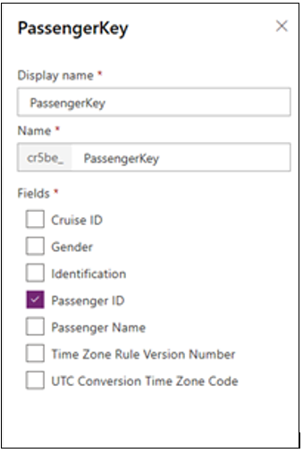

ستنشئ في هذا التمرين الجداول اللازمة لخط الرحلات البحرية Anchors Away لحجز الرحلات البحرية المستأجرة. ستقوم بإنشاء جدولين وربطهما ببعضهما البعض باستخدام علاقة واحد إلى متعدد. 

1.  قم بتسجيل الدخول إلى مدخل Power Apps.

1.  حدد البيئة التي تريد العمل فيها باستخدام القائمة المنسدلة في شريط القائمة العلوي.

1.  حدد **البيانات** على الجانب الأيسر من الصفحة.

1.  حدد **الجداول**،وستظهر قائمة بالجداول.

1.  حدد الزر **+ جدول جديد** على القائمة.

1.  أدخل المعلومات التالية في نافذة **جدول جديد**.

    

1.  حدد الزر **إنشاء**.

1.  حدد الزر **إنشاء**.

1.  أدخل المعلومات التالية في الأعمدة (كما هو موضح في الشكل التالي).

    

1. حدد **تم**.

1. أضف الأعمدة التالية عن طريق تحديد **إضافة عمود** في القائمة العلوية.

    | اسم العمود  | نوع العمود                                                                                     |
    |-------------|------------------------------------------------------------------------------------------------|
    | تاريخ الرحلة البحرية | التاريخ فقط                                                                                      |
    | اسم القارب   | الخيارات - أضف العناصر التالية إلى الخيارات: **ميدسكيبر**، **سانشاين**، **هولداي**    |
    | الوجهة | الخيارات - أضف العناصر التالية إلى الاختيارات: **كاتالينا**، **سانتا كروز**، **سانتا روزا** |
    | القبطان     | الخيارات - أضف العناصر التالية إلى الاختيارات: **راني**، **بلو**، **جونز**               |

1. حدد الزر **تم**.

1. حدد علامة التبويب **المفاتيح** الموجودة في القائمة.

1. حدد **إضافة مفتاح** في الشريط.

1. أدخل **CruiseIDKey** في العمود **اسم المفتاح**.

1. حدد **معرف الرحلة البحرية** ضمن الأعمدة.

1. حدد **تم**.

1. حدد **حفظ الجدول**.

    

تهانينا، لقد أعددت للتو الجدول الأساسي لتطبيق حجز الرحلات البحرية. والآن ستقوم بإنشاء الجدول الفرعي والذي يسمي الركاب. ستضم كل رحلة بحرية العديد من الركاب، لذا فإن جدول الرحلات البحرية هو الجدول الأساسي وجدول الركاب هو الجدول الفرعي.

1. حدد كلمة **جداول** في الجزء العلوي من الشاشة حيث تظهر عبارة **جداول > رحلات بحرية**، كما هو موضح في لقطة الشاشة السابقة. سيعيدك ذلك إلى قائمة الجداول.

1. حدد الزر **+ جدول جديد** في القائمة أعلى قائمة الجداول.

1. أدخل الاسم **الركاب** في العمود **اسم العرض**.

1. أدخل **معرّف المراكب** باعتباره **عمود الاسم الأساسي لاسم العرض**.

1. حدد الزر **إنشاء**.

1. حدد العمود **معرّف الراكب** وقم بتغيير النوع إلى **رقم تلقائي**.
   اضبط التنسيق ورقم البداية كما هو موضح في لقطة الشاشة التالية.

   

1. حدد الزر **تم**.

1. أضف الأعمدة التالية إلى جدول الركاب.

   | **اسم الحقل**     | **النوع**                                                                                  |
   |----------------|---------------------------------------------------------------------------------------|
   | معرف الرحلة البحرية      | بحث - حدد "رحلات بحرية" في العمود **جدول مرتبط**، كما هو موضح في الشكل التالي                 |
   | اسم الراكب | النص                                                                                  |
   | النوع         | الاختيارات – **ذكر**، أو **أنثى**                                                         |
   | نوع الهوية     | الاختيارات - أدخل ما يلي: **رخصة القيادة**، **جواز السفر**، **معرف هوية الطالب**، أو **أخرى** |

   يظهر جزء البحث لعمود **معرّف الرحلة البحرية** في الشكل التالي.

   

   بعد إدخال كافة أعمدة الركاب، يجب أن تبدو قائمة الأعمدة في جدول الركاب مثل لقطة الشاشة التالية.

   

1. حدد **مفاتيح** في القائمة ثم حدد **+ إضافة مفتاح**.

1. أدخل **مفتاح الراكب** للاسم، حدد **معرف هوية الراكب**، ثم حدد الزر **تم**.

   

1. حدد الزر **حفظ الجدول** لحفظ جدول الركاب الجديد.

1. حدد **العلاقات** في القائمة في جدول الركاب وسترى العلاقة متعدد إلى واحد التي أنشأتها في جدول الركاب باستخدام بحث **CruiseID**.

   

والآن بعد أن أصبحت لديك علاقة متعدد إلى واحد بين الركاب إلى الرحلة البحرية، يمكنك إلقاء نظرة على جدول الرحلات البحرية.

1. حدد الكلمة **جداول** في عنوان جدول الركاب لعرض قائمة بكافة الجداول.

1. حدد جدول **الرحلات البحرية**.

1. حدد قائمة **العلاقة** داخل جدول الرحلات البحرية.

1. لاحظ أن العلاقة موجودة أيضاً في جدول الرحلات البحرية، لكنها علاقة واحد إلى متعدد.

   

يمكنك الآن استخدام الجداول والإشارة إلى العلاقة لإنشاء تطبيق حجز بسيط. 
