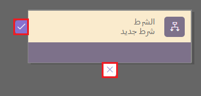
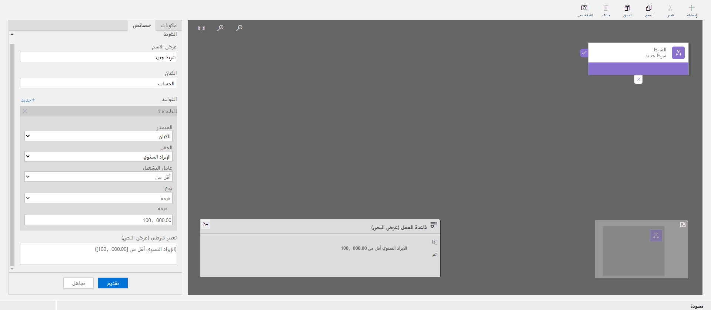
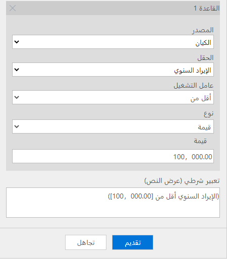
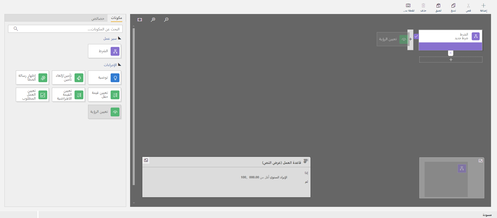
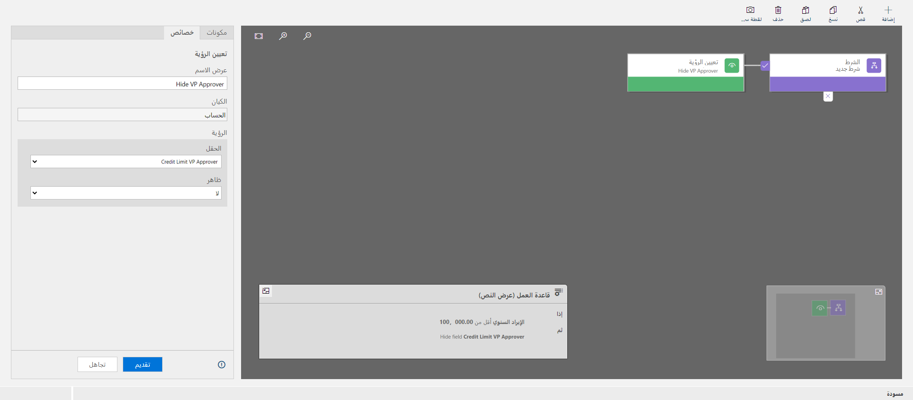

تتميز قواعد العمل بالمرونة ويمكن استخدامها لأغراض عديدة، لذا فهي تتنوع بشكل ملحوظ من حيث التعقيد والنطاق. اتبع الخطوات الآتية لإنشاء أي قواعد عمل وضبطها وفق احتياجاتك الخاصة:

1. قم بتسجيل الدخول إلى Power Apps.

1. حدد **البيانات > الجداول** وحدد أحد الجداول في العلاقات التي ترغب في إنشائها.

1. حدد علامة التبويب **قواعد العمل** في القائمة، ثم حدد **إضافة قاعدة العمل**.

1. في الجزء العلوي الأيسر، ستشاهد **النطاق**. ويجب أن تكون القيمة الافتراضية هي **عنصر**، ما يعني أنه سيتم تطبيق قاعدة العمل على الجدول المحدد.

    

1. يجب أن يتم بالفعل إضافة **شرط** إلى القاعدة. وستكون **علامة الاختيار** الموجودة على يمين الشرط هي المسار إذا كان إرجاع الشرط **صحيح**، وستكون **X** هي المسار إذا كان إرجاع الشرط **خطأ**.

    

   > [!TIP]
   > لإضافة المزيد من الشروط إلى قاعدة العمل، اسحب المكون **الشرط** من علامة التبويب **المكونات** إلى علامة الجمع (+) في المصمم.

1. لتعيين الخصائص للشرط، حدد المكون **الشرط** في نافذة المصمم، ثم قم بتعيين الخصائص في علامة التبويب **الخصائص** على الجانب الأيسر من الشاشة. في أثناء تعيين الخصائص، ينشئ Microsoft Dataverse تعبيرًا في أسفل علامة التبويب **الخصائص**. على سبيل المثال، سنقوم بتعيين الشرط الخاص بنا على (حد الائتمان أقل من [100000]).

    

    

    > [!TIP]
    > لإضافة عبارة أخرى (**و** أو **أو**) إلى الشرط، حدد **جديد** في علامة التبويب **الخصائص** لإنشاء قاعدة جديدة، ثم قم بتعيين الخصائص لتلك القاعدة. في العمود **منطق القاعدة**، يمكنك تحديد إضافة القاعدة الجديدة على أنها عبارة **و** أو عبارة **أو** أم لا.

1. أضف الإجراء (الإجراءات) من المكون **الإجراءات** باستخدام الإجراء الآتي:

    اسحب أحد مكونات الإجراء من علامة التبويب **المكونات** إلى علامة الجمع (+) بجانب المكون **الشرط**. اسحب الإجراء إلى علامة الجمع (+) بجوار علامة اختيار إذا كنت ترغب في أن تنفذ قاعدة العمل هذا الإجراء عند استيفاء الشرط، أو اسحب الإجراء إلى علامة الجمع (+) بجوار **X** إذا كنت ترغب في أن تنفذ قاعدة العمل هذا الإجراء إذا لم يتحقق الشرط. سنقوم بإضافة الإجراء **تعيين الرؤية** في حالة استيفاء الشرط.

    

1. تعيين الخاصية لكل خطوة.

    لتعيين الخصائص للإجراء، حدد المكون **الإجراء** في نافذة المصمم، ثم قم بتعيين الخصائص في علامة التبويب **الخصائص**. وسنقوم بإخفاء الحقل **VP Approver لحد الائتمان** الموجود في هذا القسم.

    عند الانتهاء من إعداد الخصائص، حدد **تطبيق**.

    

1. حدد **تحقق** للتحقق من قاعدة العمل في شريط الإجراءات.

1. حدد **حفظ** لحفظ قاعدة العمل.

1. حدد **تنشيط** في نافذة **مستكشف الحلول** لتنشيط قاعدة العمل وابدأ عملية تشغيله.

> [!TIP]
> ضع في حسبانك النصائح الآتية وأنت تعمل في قواعد العمل في نافذة المصمم:
>
> **لقطة الشاشة** - لأخذ لقطة شاشة لكل شيء موجود في نافذة **قاعدة العمل**، حدد **لقطة شاشة** في شريط الإجراءات. ويكون هذا مفيدًا، على سبيل المثال، إذا كنت ترغب في المشاركة والحصول على تعليقات في قاعدة العمل من أحد أعضاء الفريق.
>
> استخدم الخريطة المصغرة للتنقل سريعًا بين أجزاء مختلفة من العملية. تكون الخريطة المصغرة مفيدة عند وجود عملية معقدة يتم تمريرها خارج الشاشة.
>
> عند إضافة الشروط والإجراءات وتوصيات العمل إلى قاعدة العمل، يتم إنشاء كود خاص بقاعدة العمل ويظهر أسفل نافذة المصمم. ويكون هذا الكود للقراءة فقط.
