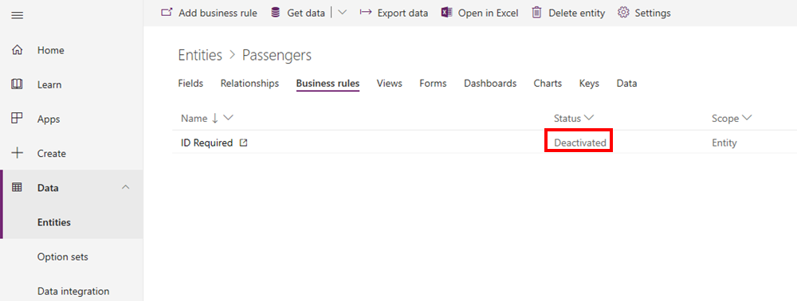

في هذا التمرين، ستستخدم الكيان Passenger الذي تم إعداده في مسار التعليم هذا. إذا لم تقم بإنشاء الكيان Cruises and Passenger كجزء من هذا المسار التعليمي، فأكمل الخطوات التالية في [التمرين - إنشاء جدولين وربطهما باستخدام علاقة واحد إلى متعدد](/training/modules/create-relationship-between-cds-entities/6-exercise/?azure-portal=true) لاستكمال هذه التمرينات.

1. قم بتسجيل الدخول إلى Power Apps.

1. افتح **البيانات > الجداول**.

1. حدد الكيان **الركاب**.

1. في النافذة **خصائص الحقل**، أدخل **العُمر** في الحقل **اسم العرض**. في القائمة المنسدلة **نوع البيانات**، حدد **الرقم الكامل** ثم حدد **إضافة** لإضافة الحقل الجديد.

    

1. أضف حقلاً آخر في النافذة **خصائص الحقل**. أدخل **المعرف المطلوب** في الحقل **اسم العرض**، وحدد **خياران** في القائمة المنسدلة **نوع البيانات**، ثم حدد **إضافة** لإضافة الحقل الجديد.

    

1. حدد **حفظ** لحفظ الكيان.

1. حدد علامة التبويب **قواعد العمل** ثم حدد **إضافة قاعدة العمل** في القائمة. كن صبوراً؛ سيستغرق تحميل مصمم قواعد العمل بعض الوقت.

    

1. حدد **الشرط**، في منطقة التصميم الأساسية. للسماح لك بتعيين الشرط لقاعدة العمل، يفتح هذا التحديد إحدى اللوحات.

    

1. أضف المعلومات التالية إلى الحقول الموجودة في اللوحة "الشرط".

    | حقل لوحة الشرط | القيمة‬           |
    |-----------------------|-----------------|
    | الكيان                | الركاب      |
    | المصدر                | الكيان          |
    | الحقل                 | العمر             |
    | العامل              | أكبر من |
    | النوع                  | القيمة‬           |
    | القيمة‬                 | 18              |

    

    

1. حدد الزر **تطبيق** في أسفل اللوحة.

    الآن، ستحدد الإجراء للفرع **نعم** أو **لا**، مما يعني أنك ستشير إلى ما تريد حدوثه إذا كان عُمر الشخص الذي تم إدخاله *18 عاماً أو أقل* أو *أكثر من 18 عاماً*.

1. حدد علامة التبويب **المكوّنات** ثم حدد القسم الجديد **تعيين قيمة الحقل** واسحبه إلى الجانب الأيمن من اللوحة **الشروط**.

    
1. في المكوّن **تعيين قيمة الحقل**، أدخل **الراكب أكبر من 18 عاماً** في الحقل **اسم العرض** للإشارة إلى أن عمر الراكب أكبر من 1. في حقل **الكيان**، أدخل **الركّاب**. حدد **المعرّف المطلوب** في القائمة المنسدلة **الحقل**، ثم حدد **نعم** في القائمة المنسدلة **القيمة**، وحدد **تطبيق**.

    

    

1. كما هو موضح في لقطة الشاشة التالية، حدد المكوّن **تعيين قيمة الحقل** واسحبه تحت **الشرط**. بعد ذلك، في لوحة **المكونات** على اليمين، في المكون **تعيين قيمة الحقل** الجديد، أدخل **الراكب في عمر 18 أو أقل** في الحقل **اسم العرض**، ثم قم بتعيين الخيار **قيمة** إلى **لا**.

    

    

1. الآن بعد أن تم تعيين القاعدة، لاحظ أن صيغة قاعدة العمل تظهر في النافذة.

    

1. حدد **التحقق من الصحة** ثم حدد **حفظ**، إذا لم تتلق أي أخطاء.

    

1. حدد السهم الموجود بجوار **الركاب: قاعدة عمل جديدة** في الجزء العلوي الأيسر من الشاشة. أدخل اسماً في الحقل **اسم قاعدة العمل** ووصفاً لقاعدة العمل في الحقل **الوصف**. حدد **حفظ**.

    

1. أغلق نافذة المستعرض. ارجع إلى المستعرض، وحدد **الكيانات > الركاب**، ثم حدد علامة التبويب **قواعد العمل**. في النافذة **إنشاء قاعدة عمل جديدة حالياً**، حدد الزر **تم**.

    

1. ستظهر قاعدة العمل التي قمت بإنشائها في القائمة على أنها **غير نشطة**. لتنشيطها، ستحتاج إلى إعادة تعيين قيمة حقل **المعرّف المطلوب**. لبدء العملية، حدد قاعدة العمل الجديدة التي قمت بإنشائها.

    

1. حدد الزر **تنشيط** في شريط القوائم في الجزء العلوي الأيسر. سيؤدي هذا إلى ظهور مربع الحوار **تأكيد تنشيط العملية**. قم بتأكيد التنشيط عن طريق تحديد الزر **تنشيط** في أسفل مربع الحوار.

    

1. أغلق علامة التبويب **استعراض** وحدد **الكيانات > الركاب > قواعد العمل**، والتي توضح أن قاعدة العمل التي قمت بإنشائها الآن لها الحالة **تم التنشيط**.

    

تهانينا، لقد قمت للتو بإنشاء "قاعدة عمل". يمكنك اختبارها عن طريق تحديد علامة التبويب **البيانات** وإدخال البيانات باستخدام Excel. إذا لم تكن معتاداً على استخدام Excel لإدخال البيانات في Microsoft Dataverse، ولمزيد من المعلومات حول هذه العملية، راجع الارتباط الموجود في القسم "الملخص" في هذه الوحدة.
