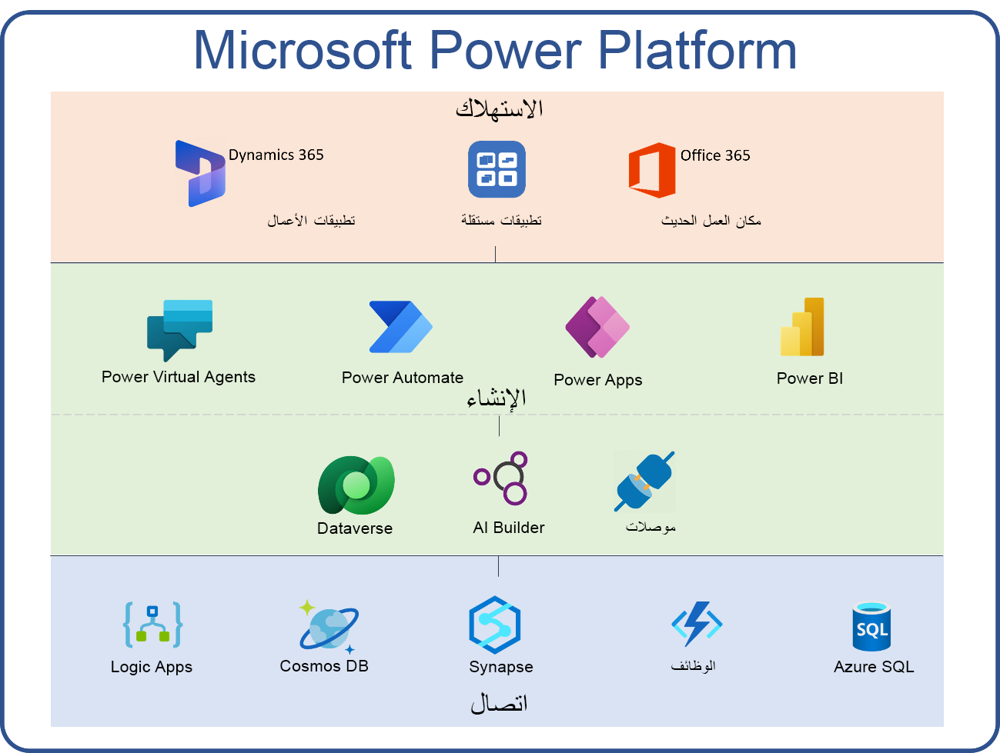

إن Microsoft Power Platform عبارة عن نظام أساسي لتطوير التطبيقات عالي الإنتاجية من Microsoft. لا تستخدم Microsoft وحدها النظام الأساسي لإنشاء تطبيقات تفاعل العميل الخاصة بها للطرف الأول مثل Dynamics 365 Sales وService وField Service وMarketing. فالمؤسسات في جميع أنحاء العالم تستخدم Power Platform لبناء حلول كاملة تساعدها على مواجهة التحديات المتغيرة باستمرار في عالم اليوم. علاوةً على ذلك، يعمل المزيد من المؤسسات على تمكين المستخدمين الفرديين والفرق من إنشاء تطبيقات إنتاجية شخصية أو جماعية تساعد في توفير قيمة لوظائفهم أو تبسيط طريقة عملهم.

يتضمن Microsoft Power Platform مجموعة أساسية من الأدوات التي يمكن أن تستخدمها المؤسسات لبناء هذه الحلول. وتتضمن هذه الحلول Power Apps وPower BI وPower Automate وPower Virtual Agents. باستخدام البنية الأساسية المشتركة لـ Microsoft Dataverse وأكثر من 700 من الموصلات التي تم بناؤها بشكل مسبق، بإمكان الحلول المبنية على Power Platform الاتصال بمصادر بيانات متعددة، وعند الحاجة يمكنها أن تتضمن أيضاً خدمات Azure السحابية للتوسع من الإنتاجية الفردية إلى تطبيقات خط العمل الحيوية لمهام المؤسسة.

> [!div class="mx-imgBorder"]
> 

يبدأ تطور المؤسسة التي تستخدم Power Apps وPower Automate وDataverse مع المسؤول. هناك عدة عناصر يجب مراعاتها كمسؤول Microsoft Power Platform. كمسؤول Microsoft Power Platform، تبدأ رحلتك من خلال السؤال عن الطريقة التي يمكنك من خلالها حماية بيانات مؤسستك.

-   ما البيانات التي يمكن الوصول إليها من خلال هذه الخدمات؟

-   هل هناك أفضل ممارسات يجب اتباعها؟

-   ما نموذج أمان Power Apps وكيف يمكنني التحكم في الوصول إلى البيانات؟

بعد أن تحدد كيفية متابعة الوصول إلى البيانات، ستحتاج بعد ذلك إلى معرفة كيف يمكنك مراقبة وإدارة ما يفعله المستخدمون باستخدام هذه الخدمات. وعندما تكتشف التحكم والرؤية، يأخذك الجزء التالي من رحلتك إلى مرحلة النشر. بإمكان مستخدمين الفرديين والفرق نشر التطبيقات بأنفسهم، ولكن كيف يمكنك نشر الحلول مركزياً لمؤسستك بأكملها؟ وكيف يمكنك تنسيق التحديثات وتحديد المشكلات وإصلاحها؟

خلال الجزء المتبقي من هذه الوحدة النمطية، سنقوم بفحص عدة عناصر تتعلق بنشر Power Platform وإدارته.