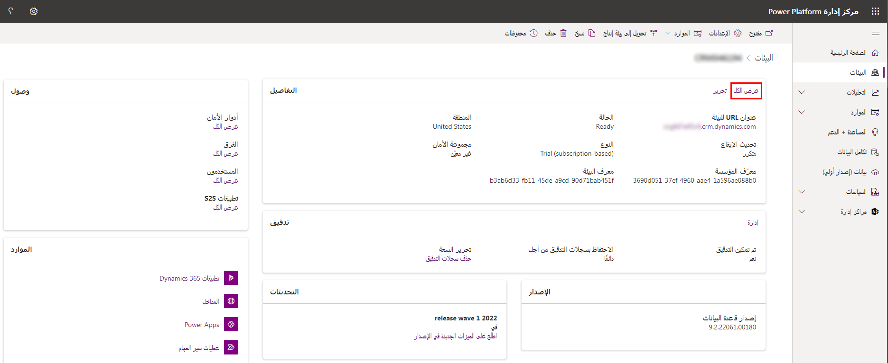
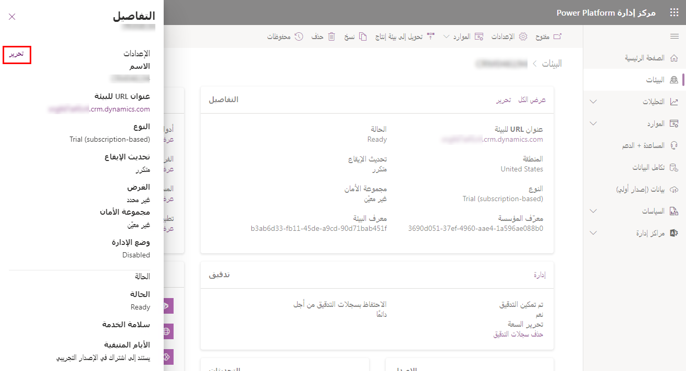

توزيع Power Platform الخاصة بك مع Microsoft Dataverse سيتم بشكل أكثر سلاسة مع بعض التخطيط الأولي. توفر أفضل ممارسات اعتماد Microsoft Power Platform إرشادات تم تصميمها لمساعدتك في إنشاء استراتيجيات الأعمال والتقنيات الضرورية لمؤسسك وتطبيقها بشكل ناجح باستخدام Microsoft Power Platform.

## الأدوار الإدارية

يتوفر عدد من الأدوار الإدارية لتعيينها للمستخدمين عند إدارة اشتراكك في بيئة Microsoft Online Services. تحدد الأدوار الإدارية المسؤوليات الإدارية المتعلقة بأنشطة إدارة الاشتراك، مثل إدارة الفوترة وإدارة كلمة المرور وإدارة إدارة المستخدم.

من وجهة نظر Power Platform، هناك دوران مسؤولان للخدمة مرتبطان بـ Microsoft Power Platform، يمكنك تعيينها لتوفير مستوى عالٍ من إدارة المسؤول.

-   مسؤول Dynamics 365

-   مسؤول Microsoft Power Platform

لمساعدتك في إدارة البيئات والإعدادات، يمكنك تعيين دور مسؤول Microsoft Power Platform للمستخدمين لإدارة Microsoft Power Platform على مستوى المستأجر. يمكن تعيين أدوار الإدارة هذه من [Microsoft 365 مركز الإدارة](https://admin.microsoft.com/#/homepage/?azure-portal=true).

## إضافة بيئة لاشتراكك

البيئات هي حاويات يمكن للمسؤولين استخدامها لإدارة التطبيقات والتدفقات والاتصالات وغيرها من الأصول، بالإضافة إلى الأذونات للسماح لأعضاء المؤسسة باستخدام الموارد. يمكنك إضافة بيئات مختلفة للمستأجر.

يتم إنشاء كل بيئة ضمن مستأجر Azure Active Directory (Azure AD)، وبإمكان المستخدمين في ذلك المستأجر فقط الوصول إلى مواردها. وترتبط البيئة أيضاً بموقع جغرافي، مثل الولايات المتحدة. عندما تنشئ قاعدة بيانات في تطبيق، يتم توجيه هذا التطبيق فقط إلى مراكز البيانات في ذلك الموقع الجغرافي. وترتبط أيضاً أي عناصر تقوم بإنشائها في تلك البيئة (بما في ذلك روبوتات الدردشة والاتصالات والبوابات ومهام سير العمل التي تستخدم Microsoft Power Automate والكثير غير ذلك) بموقع بيئتها.

يمكن أن يكون لدى كل بيئة قاعدة بيانات صفرية أو قاعدة بيانات Microsoft Dataverse، والتي توفر تخزين لتطبيقاتك وروبوتات الدردشة. ويعتمد ما إذا كان بإمكانك إنشاء قاعدة بيانات للبيئة الخاصة بك على الترخيص الذي تشتريه لـ Power Apps وكذلك للأذونات الخاصة بك داخل تلك البيئة.

عند إنشاء تطبيق في بيئة، يُسمح لهذا التطبيق فقط بالاتصال بمصادر البيانات التي يتم نشرها أيضا في نفس البيئة، بما في ذلك الاتصالات والبوابات والتدفقات وقواعد بيانات Dataverse. على سبيل المثال، ضع في اعتبارك سيناريو حيث قمت بإنشاء بيئتين باسم "اختبار" و"وتطوير"، وإنشاء قاعدة بيانات Dataverse في كل من البيئات. إذا قمت بإنشاء تطبيق في بيئة "اختبار"، سيسمح فقط بالاتصال بقاعدة بيانات "اختبار"؛ لن يتمكن من الاتصال بقاعدة بيانات "تطوير".

لدي البيئات اثنين من الأدوار المضمنة التي توفر الوصول إلى الأذونات داخل البيئة:

-   يستطيع *مسؤول البيئة -* تنفيذ جميع الإجراءات الإدارية في بيئة ما، بما في ذلك ما يلي:

    -   إضافة أو إزالة مستخدم أو مجموعة من دور مسؤول البيئة أو منشئ البيئة.

    -   توفير قاعدة بيانات Dataverse للبيئة.

    -   عرض جميع الموارد التي تم إنشاؤها داخل البيئة وإدارتها.

    -   تعيين سياسات تفادي فقدان البيانات.

-   يستطيع *منشئ البيئة -* إنشاء موارد داخل بيئة، بما في ذلك التطبيقات والاتصالات والموصلات المخصصة والبوابات والتدفقات باستخدام Power Automate.

## البيئات غير الإنتاجية / بيئة الاختبار المعزولة Sandbox

بيئة الاختبار المعزولة هي أي بيئة غير إنتاجية. نظرًا لأنها معزولة عن بيئات التشغيل، تعد بيئة الاختبار المعزولة مكاناً مناسباً لتطوير واختبار تغييرات التطبيق بأمان مع مخاطر منخفضة.

بعض المزايا الرئيسية التي تقدمها البيئة غير الإنتاجية / بيئة الاختبار المعزولة هي:

-   تقييم الوظائف الجديدة قبل تقديمها إلى بيئة التشغيل الخاصة بك: يمكن تحديث بيئة الاختبار المعزولة قبل الإنتاج حتى تتمكن من اختبار جميع وظائفك قبل تطبيق التحديث على الإنتاج.

-   التحكم في الوصول: يمكن وضع بيئة sandbox في الوضع الإداري للسماح فقط للمستخدمين الذين لديهم أدوار أمان مسؤولي النظام أو مخصص النظام بالوصول إلى البيئة.

-   النسخ والاستعادة: يمكنك نسخ التخصيصات والبيانات من بيئة الإنتاج إلى بيئة Sandbox

-   التدريب: بعد نسخة كاملة من الإنتاج إلى بيئة sandbox، تحصل على بيئة تدريب مذهلة. سيتمكن المستخدمون من تجربة الإمكانات الكاملة لحل الإنتاج الخاص بهم دون الخوف من إضافة أو حذف بيانات الاختبار أثناء التدريب مما قد يؤدي إلى تعطيل جودة البيانات المحفوظة في الإنتاج.

-   اختبار تطبيقات جديدة: تعد بيئة آلية تحديد الوصول مكاناً رائعاً لتثبيت الحلول والتطبيقات لاختبارها والنظر فيها للإنتاج. بعد اختبار التطبيق، يمكن تدريب المستخدمين في بيئة الاختبار المعزولة قبل يوم نشر التطبيق في مرحلة الإنتاج.

يمكنك معرفة المزيد حول العمل مع بيئات الاختبار المعزولة هنا: [بيئة الاختبار المعزولة](/power-platform/admin/sandbox-environments/?azure-portal=true).

## بيئات التشغيل

تهدف هذه البيئات إلى استخدامها للعمل الدائم في المؤسسة. يمكن إنشاؤها وامتلاكها بواسطة مسؤول أو أي شخص لديه ترخيص Power Apps بشرط أن تكون سعة قاعدة البيانات المتوفرة 1 جيجابايت. يتم أيضاً إنشاء هذه البيئات لكل قاعدة بيانات Dataverse موجودة عند ترقيتها إلى الإصدار 9.0 أو الأحدث. بيئات التشغيل هي ما يجب أن تستخدمه في أي بيئات تعتمد عليها.

## تبديل البيئة

من المهم قضاء بعض الوقت في التخطيط والتصميم للتنفيذ الخاص بك، ولكن ستتاح لك دائماً الفرصة لتبديل نوع البيئة من بيئة التشغيل إلى بيئة الاختبار المعزولة، والعكس إذا لزم الأمر.

على سبيل المثال، إذا قمت بأخذ نسخة احتياطية من بيئة تشغيل قبل تثبيت أحد الحلول ولاحظت أن هذا الحل يتسبب في بعض المشكلات بعد التثبيت، أو ربما لا تتمكن حتى من إزالة الحل، يمكنك الاستعادة من النسخة الاحتياطية؛ ومع ذلك، لا يمكنك استعادة النسخ الاحتياطية في بيئة التشغيل، يجب تحويل البيئة إلى بيئة الاختبار المعزولة أولاً، ثم يمكنك متابعة الاستعادة من النسخة الاحتياطية، ثم التبديل إلى الإنتاج مرة أخرى. تم وضع هذا القيد من أجل تجنب الاستبدال العرضي لبيئة التشغيل الخاصة بك.

## Dataverse for Teams

Microsoft Dataverse for Teams هو نظام أساسي للبيانات منخفض التعليمات البرمجية مضمن لـ Microsoft Teams. يوفر تخزين البَيانات العلائقية وأنواع البَيانات الثرية وإدارة المؤسسة ونشر الحلول بنقرة واحدة. يتم إنشاء بيئة Dataverse for Teams تلقائياً للفريق المحدد عند إنشاء [تطبيق](/powerapps/teams/create-first-app/?azure-portal=true) أو [روبوت](/power-virtual-agents/teams/authoring-first-bot-teams?azure-portal=true#create-a-bot) في Microsoft Teams لأول مرة أو تثبيت تطبيق Power Apps من كتالوج التطبيقات لأول مرة. يتم استخدام بيئة Dataverse for Teams لتخزين البيانات والتطبيقات والتدفقات الخاصة بالفريق وإدارتها ومشاركتها.

ويمكن أن يكون لكل فريق بيئة واحدة، وتتوفر كافة البيانات والتطبيقات والروبوتات والتدفقات التي يتم إنشاؤها باستخدام التطبيق من Power Apps داخل فريق من قاعدة بيانات Dataverse for Teams لذلك الفريق.

يتماشى الأمان في Dataverse for Teams مع كيفية معالجة الأمان في الفرق، مع التركيز على المالكين والأعضاء والضيوف.

يمكنك معرفة المزيد عن بيئات Dataverse for Teams هنا: [Dataverse for Teams](/power-apps/teams/overview-data-platform/?azure-portal=true).

## تفاصيل البيئة

يمكنك الإطلاع على تفاصيل محددة متعلقة بالبيئات الخاصة بك عن طريق تحديد بيئة فردية في مركز مسؤولي [Power Platform](https://admin.powerplatform.microsoft.com/?azure-portal=true). يمكنك رؤية بعض تفاصيل بيئاتك عن طريق اختيار البيئة. حدد **عرض الكل** لمشاهدة المزيد من تفاصيل البيئة.

> [!div class="mx-imgBorder"] 
> 

حدد **تحرير** لمراجعة تفاصيل البيئة وتعديلها.

> [!div class="mx-imgBorder"] 
> 

## استراتيجيات البيئة

تطوير استراتيجية بيئة يعني تكوينَ البيئات والطبقات الأخرى من أمان البيانات بطريقة تدعم التطوير الإنتاجي في مؤسستك أثناء تأمين الموارد وتنظيمها في الوقت نفسه. وتُعد الإستراتيجية لإدارة تزويد البيئة والوصول إليها والتحكم في الموارد الموجودة داخلها، مهمة من أجل ما يلي:

-   تأمين البيانات والوصول.

-   فهم كيفية استخدام البيئة الافتراضية بشكل صحيح.

-   إدارة عدد البيئات الصحيح لتجنب إمكانية تمددها والمحافظة عليها.

-   تيسير دورة حياة التطبيق (ALM).

-   تنظيم الموارد في تقسيمات منطقية.

-   دعم العمليات (ومكتب المساعدة) في تحديد التطبيقات المندرجة ضمن التشغيل وذلك بجعلها في البيئات المخصصة لها.

-   ضمان تخزين البيانات ونقلها في مناطق جغرافية مقبولة (لأسباب تتعلق بالأداء والتوافق).

-   ضمان عزل التطبيقات التي يتم تطويرها.

يمكنك معرفة المزيد حول إنشاء استراتيجية بيئة هنا: [إنشاء استراتيجية بيئة.](/power-platform/guidance/adoption/environment-strategy/?azure-portal=true)