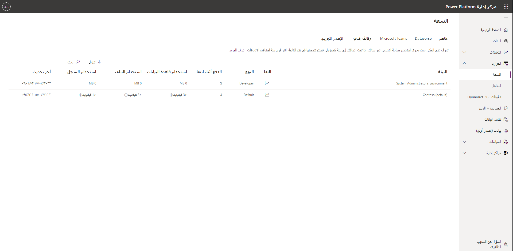

يتم ترخيص القدرات الكاملة لـ Power Apps وPower Automate على أساس مستقل. بالإضافة إلى ذلك، يتم تضمين إمكانات Power Apps وPower Automate المحدودة ضمن تراخيص Office 365 وDynamics 365 المختلفة، وهذا يعني أن المستخدمين الذين لديهم هذه التراخيص لديهم بالفعل حق الوصول إلى Power Apps وPower Automate. يوفر لك دليل الترخيص [Microsoft Power Apps وPower Automate المزيد من التفاصيل](https://go.microsoft.com/fwlink/?LinkId=2085130/?azure-portal=true).

كمسؤول، لا يلزم أن يكون لديك ترخيص Power Apps أو Power Automate مستقل لإدارة البيئات.

بعض الأسئلة التي يجب مراعاتها أثناء التخطيط لكل تطبيق أو لكل مستخدم:

-   هل الترخيص لكل مستخدم أو لكل تطبيق أكثر فعالية من حيث التكلفة؟

-   ما هي السعة الإضافية التي أحتاجها؟ على سبيل المثال، ‏‫طرق عرض صفحة المدخل‬، أرصدة AI Builder.

-   ما مقدار سعة التخزين التي أحتاجها؟ مثل قاعدة البيانات والملفات والسجلات.

مراجعة استحقاقات السعة واستخدامها من مركز مسؤولي [Power Platform](https://aka.ms/ppac/?azure-portal=true).

## سعة التخزين

يتم تجميع سعة Microsoft Dataverse (قاعدة البيانات والملف والسجل والوظائف الإضافية) عبر المستأجر ومشاركتها بين جميع البيئات وأحمال العمل. يوفر الاشتراك الأول في Power Apps أو Power Automate استحقاقاً افتراضياً للسعة لمرة واحدة للمستأجر.

على سبيل المثال، ستقوم خطة Power Apps لكل مستخدم بتعيين سعة المستأجر في البداية على أنها 10 غيغابايت من قاعدة بيانات Dataverse و20 غيغابايت من ملف Dataverse، و2 غيغابايت من سعة سجل Dataverse.

يوفر كل مستخدم مرخص آخر منحة سعة أخرى لكل مستخدم تزيد من إجمالي سعة المستأجر المتاحة. هناك أيضاً وظائف إضافية للسعة متاحة لشراء سعة قاعدة بيانات وملفات وسجلات أخرى.

يمكن أن يكون لدى كل بيئة قاعدة بيانات صفرية أو قاعدة بيانات Dataverse، والتي توفر تخزين لتطبيقاتك. لإنشاء قاعدة بيانات، يجب أن يكون هناك 1 غيغابايت على الأقل من سعة قاعدة بيانات Dataverse المتبقية. يتم استهلاك السعة أيضاً بواسطة استهلاك تخزين Dataverse من خلال تخزين البيانات والملفات والسجلات.

وكمسؤول، يمكنك مراقبة استخدام القدرة الخاصة بك في البوابة الإلكترونية للمسؤول.

تتضمن اشتراكات المستأجر بشكل افتراضي مساحة تخزين قاعدة البيانات تبلغ 10 غيغابايت طالما كان هناك مثيل واحد على الأقل للمستأجر في الإصدار 8.2.

يتم منح سعة تخزين أكبر مجاناً بمعدل 5 غيغابايت لكل 20 مستخدماً كاملاً. على سبيل المثال، تزداد سعة التخزين المضمنة بمقدار 5 غيغابايت نظير كل زيادة بمقدار 20 ترخيص اشتراك لتطبيق Dynamics 365 for Sales. يحصل العميل الذي لديه 20 ترخيص اشتراك لتطبيق Dynamics 365 for Sales على سعة تخزين بيانات تبلغ 15 غيغابايت في Dynamics 365 (مساحة تخزين افتراضية لقاعدة البيانات تبلغ 10 غيغابايت + مساحة تخزين إضافية لقاعدة البيانات تبلغ 5 غيغابايت). يخضع الحد الأقصى لمقدار التخزين المجاني الذي يمكن ربحه لكل مستأجر للحد الفني البالغ 30 تيرابايت.

## الوظيفة الإضافية تخزين قاعدة البيانات

توفر الوظيفة الإضافية "التخزين الإضافي لقاعدة البيانات" المرونة لزيادة سعة التخزين المرتبطة باشتراكك في تطبيق Dynamics Online بزيادات تبلغ 1 غيغابايت لكل ترخيص للوظيفة الإضافية "التخزين الإضافي"، حتى 30 تيرابايت من التخزين.

يتم تعقب تخزين الاشتراك المطابق لاشتراك العميل مقابل جميع المثيلات المرتبطة بالمستأجر.

## تحديد كيفية استخدام التخزين في جميع المثيلات داخل مستأجر

يتم عرض استخدام التخزين على مركز مسؤولي Power Platform ضمن علامة التبويب "القدرة الإنتاجية".

