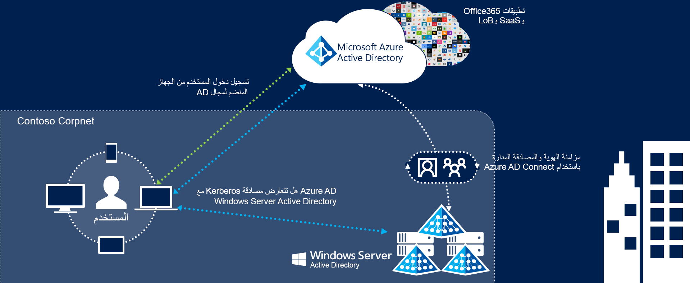
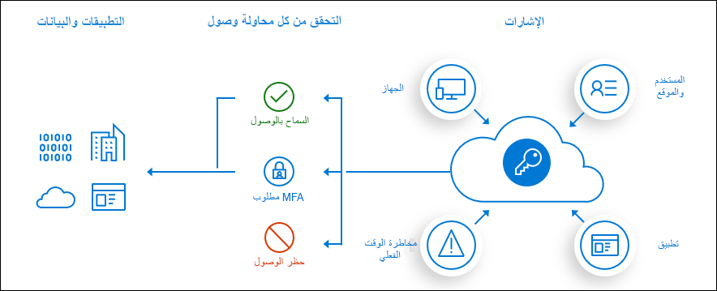

تتضمن مصادقة Power Platform تسلسلاً من الطلبات، والاستجابات، وعمليات إعادة التوجيه بين متصفح المستخدم وPower Platform أو خدمات Azure. يتبع التسلسل سير عمل منح كود مصادقة [Azure Active Directory (Azure AD)](/azure/active-directory/develop/v2-oauth2-auth-code-flow/?azure-portal=true).

يمكنك الاختيار من بين ثلاثة نماذج رئيسية للهوية في Microsoft 365 عند إعداد حسابات المستخدمين وإدارتها:

-   **الهوية السحابية:** إدارة حسابات المستخدمين لديك في Microsoft 365 فقط. لا يُشترَط وجود خوادم محلية لإدارة المستخدمين؛ فكل شيء يتم في السحابة.

-   **الهوية المتزامنة:** مزامنة كائنات الدليل المحلي مع Microsoft 365 وإدارة المستخدمين لديك محليًا. ويمكنك أيضًا مزامنة كلمات المرور بحيث يكون لدى المستخدمين كلمة المرور نفسها محليًا وفي السحابة، ولكن سيتعين عليهم تسجيل الدخول مرة أخرى لاستخدام Microsoft 365.

-   **الهوية الخارجية:** مزامنة كائنات الدليل المحلي مع Microsoft 365 وإدارة المستخدمين لديك محليًا. ويكون لدى المستخدمين كلمة المرور نفسها محليًا وفي السحابة، ولا يتعين عليهم تسجيل الدخول مرة أخرى لاستخدام Microsoft 365. وغالبًا ما يشار إلى هذا باسم تسجيل دخول أحادي.

من المهم أن تفكّر مليًّا في نموذج الهوية الذي سيتم استخدامه لإنجاز مهامك بسرعة. فكِّر في الوقت والتعقيد الحالي والتكلفة. وتختلف هذه العوامل باختلاف المؤسسة. ويعتمد اختيارك إلى حد كبير على حجم شركتك وعمق موارد تكنولوجيا المعلومات الخاصة بك واتساع نطاقها.

## فهم هوية Microsoft 365 وAzure Active Directory

يستخدم Microsoft 365 هوية المستخدم المستندة إلى السحابة وخدمة المصادقة Azure Active Directory (Azure AD) لإدارة المستخدمين. يُعد الاختيار ما إذا كان تكوين إدارة الهوية يتم بين مؤسستك المحلية وMicrosoft 365 قرارًا مبكرًا وهو أحد أسس بنيتك الأساسية السحابية. وعليك التفكير مليًّا في الخيارات لتحديد أفضلها من حيث تلبية احتياجات مؤسستك؛ نظرًا لأن تغيير هذا التكوين لاحقًا قد يكون صعبًا.

يمكنك الاختيار من بين نموذجين رئيسيين للمصادقة في Microsoft 365 لإعداد حسابات المستخدمين وإدارتها هما؛ **المصادقة عبر السحابة** و **مصادقة جهات الاتصال الخارجية**.

## المصادقة عبر السحابة

أمامك خيارات عدة لإدارة خدمات المصادقة والهوية للمستخدمين لديك من خلال Microsoft 365، ويتوقف ذلك على ما إذا كان لديك بيئة Active Directory موجودة محليًّا أم لا.

## السحابة فقط

يمكنك من خلال نموذج السحابة فقط إدارة حسابات المستخدمين لديك في Microsoft 365 فقط. ولا يُشترط وجود خوادم محلية؛ فكل شيء يتم التعامل معه في السحابة بواسطة Azure AD. يمكنك إنشاء المستخدمين وإدارتهم في مركز إدارة Microsoft 365 أو باستخدام Windows PowerShell [أوامر PowerShell cmdlets](/office365/enterprise/powershell/manage-office-365-with-office-365-powershell/?azure-portal=true) ويتم التعامل مع الهوية والمصادقة بالكامل في السحابة بواسطة Azure AD.

عادة ما يكون نموذج السحابة فقط خيارًا جيدًا في الحالات التالية:

-   ليس لديك دليل مستخدم محلي آخر.

-   لديك دليل محلي معقد وتريد ببساطة ألا تعمل من أجل التكامل معه.

-   لديك دليل محلي موجود، ولكنك تريد تشغيل تجربة أو إصدار تجريبي من Microsoft 365. يمكنك لاحقًا مطابقة مستخدمي السحابة مع المستخدمين المحليين عندما تكون مستعدًا للاتصال بدليلك المحلي.

## مزامنة تجزئة كلمة المرور مع تسجيل الدخول الأحادي السهل

أبسط طريقة لتمكين المصادقة لكائنات الدليل المحلي في Azure AD. يمكنك باستخدام مزامنة تجزئة كلمة المرور (PHS) مزامنة كائنات حساب مستخدم Active Directory المحلي مع Microsoft 365 وإدارة المستخدمين لديك محليًا. تجري مزامنة تجزئات كلمات مرور المستخدم من Active Directory المحلي مع Azure AD وبهذا يكون للمستخدمين كلمة المرور نفسها محلياً وفي السحابة. عند تغيير كلمات المرور أو إعادة تعيينها محلياً، تتم مزامنة تجزئات كلمات المرور الجديدة مع Azure AD، وبهذا يمكن للمستخدمين لديك أن يستخدموا دائماً كلمة المرور نفسها لموارد السحابة والموارد المحلية. ولا تُرسَل كلمات المرور أبداً إلى Azure AD أو تُخزَّن في Azure AD على هيئة نص واضح. وتتطلب بعض الميزات فائقة الجودة في Azure AD، مثل حماية الهوية، تجزئة كلمة المرور (PHS) بصرف النظر عن أسلوب المصادقة المحدَّد. بفضل تسجيل الدخول الأحادي السهل، يُسجَّل دخول المستخدمين تلقائيًا إلى Azure AD عندما يستخدمون أجهزة شركتهم ويتصلون بشبكة شركتك.

## مصادقة المرور مع تسجيل الدخول الأحادي السهل

توفر عملية تحقق بسيطة من صحة كلمة المرور لخدمات المصادقة من Azure AD باستخدام مندوب برامج يعمل على خادم أو أكثر من الخوادم المحلية للتحقق من صحة المستخدمين مباشرة مع Active Directory المحلي لديك. يمكنك باستخدام مصادقة المرور (PTA) مزامنة كائنات حساب مستخدم Active Directory المحلي مع Microsoft 365 وإدارة المستخدمين لديك محليًا. تتيح للمستخدمين لديك تسجيل الدخول إلى كل من الموارد والتطبيقات المحلية وموارد وتطبيقات Microsoft 365 باستخدام حسابهم وكلمة مرورهم المحليين. ويعمل هذا التكوين على التحقق من صحة كلمات مرور المستخدمين مباشرة مقابل Active Directory المحلي الخاص بك دون إرسال تجزئات كلمات المرور إلى Microsoft 365. إن الشركات التي لديها متطلب أمان لفرض حالات حساب المستخدم وسياسات كلمة المرور وساعات تسجيل الدخول المحلية على الفور ستستخدم أسلوب المصادقة هذا. بفضل تسجيل الدخول الأحادي السهل، يُسجَّل دخول المستخدمين تلقائيًا إلى Azure AD عندما يستخدمون أجهزة شركتهم ويتصلون بشبكة شركتك.

## تسجيل الدخول الأحادي

يستخدم Dynamics 365 عبر الإنترنت افتراضيًا Azure Active Directory في المصادقة، ومع ذلك تستخدم العديد من المؤسسات في جميع أنحاء العالم Active Directory المحلي لديها لإجراء المصادقة داخليًا.

يعمل تسجيل الدخول الأحادي السهل من Azure Active Directory (Seamless SSO Azure AD) على تسجيل دخول المستخدمين تلقائياً عندما يستخدمون أجهزة شركتهم المتصلة بشبكة شركتك. عند تمكين هذه الميزة، لا يحتاج المستخدمون إلى كتابة كلمات مرورهم لتسجيل الدخول إلى Azure AD، وعادة، كتابة أسماء المستخدمين الخاصة بهم أيضاً. وتوفر هذه الميزة للمستخدمين لديك سهولة الوصول إلى التطبيقات المستندة إلى السحابة دون الحاجة إلى أي مكونات محلية إضافية.

يمكن دمج تسجيل الدخول الأحادي السهل (Seamless SSO) إما مع طريقة تسجيل الدخول [مزامنة تجزئة كلمة المرور](/azure/active-directory/hybrid/how-to-connect-password-hash-synchronization/?azure-portal=true) أو طريقة [ مصادقة المرور](/azure/active-directory/hybrid/how-to-connect-pta/?azure-portal=true). إن ميزة تسجيل الدخول الأحادي (SSO) السهل لا تنطبق على خدمات الأمان المشترك لـ Active Directory (ADFS).

> [!NOTE]
> يحتاج SSO السهل إلى أن يكون جهاز المستخدم منضماً إلى المجال، ولكن لا يحتاج أن يكون الجهاز منضماً إلى Azure AD.

## المزايا الرئيسية

-   تجربة مستخدم رائعة

    -   تسجيل دخول المستخدمين تلقائياً إلى كل من التطبيقات المحلية والتطبيقات المستندة إلى السحابة.

    -   استغناء المستخدمين عن الحاجة إلى إدخال كلمات مرورهم مرات عديدة.

-   سهولة التوزيع والإدارة وعدم الحاجة إلى أي مكونات إضافية محليًا لإنجاز هذا العمل.

    -   العمل باستخدام أي أسلوب لمصادقة السحابة - [مزامنة تجزئة كلمة المرور](/azure/active-directory/hybrid/how-to-connect-password-hash-synchronization/?azure-portal=true) أو [مصادقة المرور](/azure/active-directory/hybrid/how-to-connect-pta/?azure-portal=true).

    -   إمكانية الطرح لبعض المستخدمين أو كلهم باستخدام نهج المجموعة.

    -   تسجيل الأجهزة غير المزودة بنظام Windows 10 باستخدام Azure AD دون الحاجة إلى أي بنية أساسية لخدمات الأمان المشترك لـ Active Directory (ADFS). تحتاج هذه القدرة إلى استخدام الإصدار 2.1 أو إصدار أحدث من [عميل الانضمام إلى مكان العمل](https://www.microsoft.com/download/details.aspx?id=53554/?azure-portal=true).

## أمور يجب مراعاتها

-   يمكن أن يكون اسم المستخدم لعملية تسجيل الدخول إما اسم المستخدم الافتراضي المحلي (userPrincipalName) أو سمة أخرى مكوَّنة في Connect Azure AD (المعرّف البديل). تعمل كلتا حالتي الاستخدام لأن تسجيل الدخول الأحادي (SSO) السهل يستخدم المطالبة securityIdentifier في تذكرة Kerberos للبحث عن كائن المستخدم المطابق في Azure AD.

-   تسجيل الدخول الأحادي (SSO) السهل عبارة عن ميزة نفعية. إذا فشلت هذه الميزة لأي سبب من الأسباب، تعود تجربة تسجيل دخول المستخدم إلى سلوكها العادي - أي أن المستخدم يحتاج إلى إدخال كلمة مروره على صفحة تسجيل الدخول.

-   إذا قام تطبيق ما (مثل، `https://myapps.microsoft.com/contoso.com`) بإعادة توجيه معلمة domain_hint‏ (OpenID Connect) أو whr‏ (SAML) - التي تحدِّد المستأجر الخاص بك، أو معلمة login_hint - التي تحدِّد المستخدم، في طلب تسجيل الدخول إلى Azure AD الخاص به، فسيتم تسجيل دخول المستخدمين تلقائيًا دون أن يُدخلوا أسماء المستخدمين أو كلمات المرور.

-   يحصل المستخدمون أيضًا على تجربة تسجيل دخول دون مطالبة إذا كان تطبيق ما (على سبيل المثال، `https://contoso.crm.dynamics.com` يرسل طلبات تسجيل دخول إلى نقاط النهاية المستأجرة في Azure AD - أي `https://login.microsoftonline.com/contoso.com` أو `https://login.microsoftonline.com <tenant_ID>` بدلاً من نقطة النهاية الشائعة في Azure AD - أي `https://login.microsoftonline.com/common`).

-   يتم دعم تسجيل الخروج. ويسمح هذا للمستخدمين باختيار حساب آخر على Azure AD لتسجيل الدخول باستخدامه، بدلاً من تسجيل الدخول تلقائيًا باستخدام تسجيل الدخول الأحادي (SSO) السهل تلقائيًا.

-   يتم دعم عملاء Microsoft 365 Win32 (Outlook، وWord، وExcel، وآخرون) مع الإصدارات 16.0.8730.xxxx والإصدارات الأحدث باستخدام سير عمل غير تفاعلي. بالنسبة إلى OneDrive، عليك تنشيط [ميزة التكوين دون مطالبة لـ OneDrive](https://techcommunity.microsoft.com/t5/Microsoft-OneDrive-Blog/Previews-for-Silent-Sync-Account-Configuration-and-Bandwidth/ba-p/120894/?azure-portal=true) للاستمتاع بتجربة تسجيل دخول دون مطالبة.

-   ويمكن تمكينها عن طريق Connect Azure AD.

-   إنها ميزة مجانية، ولا تحتاج إلى أي إصدارات مدفوعة من Azure AD لاستخدامها.

## توحيد بيئة غابة AD واحدة مع السحابة

سيرشدك البرنامج التعليمي التالي عبر إنشاء بيئة للهوية المختلطة باستخدام التوحيد. يمكن استخدام هذه البيئة بعد ذلك للاختبار أو للحصول على مزيد من المعرفة عن الكيفية التي تعمل بها الهوية المختلطة.

[البرنامج التعليمي: توحيد بيئة غابة AD واحدة مع السحابة](/azure/active-directory/hybrid/tutorial-federation/?azure-portal=true)

## الوصول المشروط باستخدام Azure AD

[تعتبر سياسات الوصول المشروط](/azure/active-directory/conditional-access/?azure-portal=true) في Azure Active Directory (Azure AD) في أبسط صورها عبارات if-then: *if* إذا أراد أحد المستخدمين الوصول إلى أحد الموارد، *then* فيجب عليه إكمال إجراء.

**مثال:** يرغب مدير رواتب في الوصول إلى تطبيق الرواتب الذي تم إنشاؤه باستخدام Power Apps ومطلوب منه إجراء مصادقة متعددة العوامل للوصول إليه.

يواجه المسؤولين هدفان أساسيان:

-   تمكين المستخدمين من أن يكونوا منتجين في أي وقت ومن أي مكان.

-   حماية أصول المؤسسة.

باستخدام سياسات الوصول المشروط، يمكنك تطبيق عناصر التحكم بالوصول الصحيحة عند الحاجة للحفاظ على أمان المؤسسة، والبقاء بعيدًا عن طريق المستخدم عند عدم الحاجة إلى ذلك. يتم فرض سياسات الوصول المشروط بعد إكمال المصادقة أحادية العامل.

*المسؤولون العموميون* فقط هم من يمكنهم تكوين سياسات الوصول المشروط. وهذا لا يتوفر لمسؤولي Microsoft Power Platform أو مسؤولي Dynamics 365.

> [!div class="mx-imgBorder"]
> 

لمعرفة كيفية إعداد سياسات الوصول المشروط، راجع [تخطيط توزيع وصول مشروط](/azure/active-directory/conditional-access/plan-conditional-access/?azure-portal=true).
