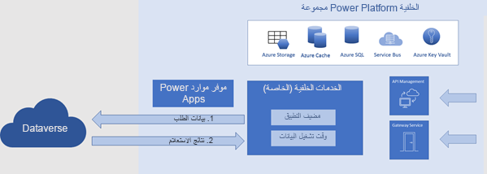
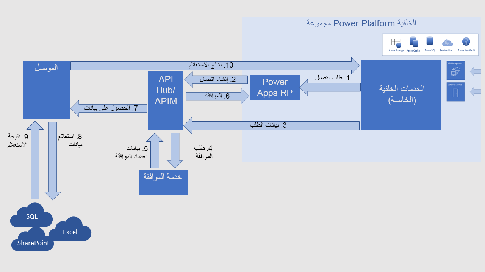

ستتطلب العديد من التطبيقات والحلول التي تقوم بإنشائها على Power Platform بيانات من مصادر بيانات أخرى. على سبيل المثال، قد يحتاج تطبيق لوحة تم إنشاؤه بواسطة مستخدم عادي إلى تضمين البيانات الواردة من Microsoft Dataverse والبيانات الواردة من مصدر آخر مثل قاعده بيانات SQL أو بعض المواقع الأخرى.

يتم إجراء الاتصال والمصادقة لمصدر بيانات بشكل منفصل عن مصادقة لخدمة Power Platform. عند النظر إلى كيفية إجراء مصادقة الاتصال، تحتاج أولاً إلى فهم كيفية اتصال خدمات Power Platform بمصادر البيانات المختلفة. ووفقًا لمصدر البيانات، تتصل خدمات Power Platform بطرق متعددة، ومع ذلك يكون النمط العام هو نفس النمط. استنادًا إلى التطبيق ومصدر البيانات الذي يتم استخدامه، قد تكون بيانات اعتماد المصادقة المستخدمة هي نفسها المستخدمة في خدمة Power Platform أو قد تكون مختلفة عنها.

## الاتصال بـ Microsoft Dataverse

تتصل تطبيقات لوحة Power Apps والتطبيقات المستندة إلى نموذج بشكل مباشر بـ Dataverse دون الحاجة إلى موصل منفصل. تقوم تطبيقات اللوحة بتخزين الموافقة على العمل مع بيئات Dataverse الأخرى في موفر موارد (RP) Power Apps. يقوم Power Automate بالمصادقة باستخدام مركز API، ولكن يتم توجيه جميع تفاعلات البيانات بعد ذلك إلى Dataverse مباشرة. يدعم كل من Power Apps وPower Automate الموصلات القديمة التي تصل إلى Dataverse باستخدام موصلات مثل Dynamics 365 Connector المهمل الآن وموصل [Microsoft Dataverse (قديم)](/connectors/commondataservice/?azure-portal=true).

يوضح الرسم التخطيطي أدناه كيفية عمل تطبيقات اللوحة مع Dataverse.

> [!div class="mx-imgBorder"]
> 

1.  تتطلب خدمات Power Apps الخلفية البيانات بشكل مباشر من Dataverse.

1.  يقوم Dataverse بإرجاع نتائج الاستعلام مرة أخرى إلى خدمات Power Apps الخلفية.

## الاتصال بغير مصادر بيانات Dataverse

بشكل عام، ستستخدم خدمات Power Platform موصلات للعمل مع مصادر البيانات الخارجية التي ليست مصادر بيانات Dataverse. تعمل هذه الموصلات بمثابة برامج تضمين API التي تساعد في توفير الوصول إلى البيانات والأوامر التي ستتوفر عبر الموصل.

يوضح الرسم التخطيطي التالي مسارًا نموذجيًا يستخدم [موصل خدمة Azure API Management (APIM)](/azure/api-management/api-management-key-concepts/?azure-portal=true).

> [!div class="mx-imgBorder"]
> 

1.  ترسل خدمة Power Platform طلب اتصال إلى موفر موارد (RP) Power Apps.

1.  يطلب Power Apps RP مركز API لإنشاء اتصال وتخزين بيانات اعتماد المصادقة.

1.  ترسل خدمة Power Platform طلب استعلام بيانات إلى موصل API Management.

1.  يرسل موصل API Management طلبًا إلى خدمة الموافقة للحصول على إذن للوصول إلى مصدر البيانات.

1.  تقوم خدمة الموافقة بإرجاع بيانات الاعتماد إلى موصل API Management.

1.  يرسل موصل API Management بيانات الاعتماد الموافقة إلى Power Apps RP. يتم تخزين بيانات الاعتماد في RP بحيث لا تطالب Power Apps بالموافقة مرة أخرى في المرة التالية التي تكون فيها البيانات مطلوبة.

1.  يقوم موصل API Management بتمرير استعلام البيانات إلى الموصل الخارجي.

1.  يرسل الموصل الاستعلام إلى مصدر البيانات.

1.  يقوم مصدر البيانات بإرجاع البيانات المطلوبة إلى الموصل.

1. يمرر الموصل البيانات مرة أخرى إلى مجموعة Power Platform الخلفية.

## المصادقة إلى مصادر البيانات

يقوم المستخدمون بالمصادقة إلى خدمة Power Platform أولاً. بعد ذلك، يقوم المستخدمون بشكل منفصل بالمصادقة إلى مصدر بيانات باستخدام بيانات الاعتماد التي يتطلبها الموصل. تقوم خدمة بيانات اعتماد مركز API دائمًا بتخزين بيانات الاعتماد وإدارتها.

تدعم بعض الموصلات أكثر من طريقة مصادقة واحدة. المصادقة إلى مصدر بيانات خاصة بمثيل مصدر البيانات هذا. وهي تستند إلى طريقة المصادقة التي اختارها المنشئ عند إنشاء الاتصال.

هناك نوعان من طرق مصادقة مصدر البيانات في Power Apps:

-   **المصادقة الصريحة** تعني استخدام بيانات اعتماد مستخدم التطبيق للوصول إلى مصدر البيانات.

-   **المصادقة الضمنية** تعني بيانات الاعتماد التي قدمها منشئ التطبيق عند إنشاء الاتصال.

نوصي باستخدام المصادقة الصريحة كلما أمكن ذلك. فهي أكثر أمانًا.

يمكنك معرفة المزيد حول الفرق بين الاتصالات الصريحة والاتصالات الضمنية هنا: [الاتصالات الصريحة مقابل الاتصالات الضمنية](/power-apps/maker/canvas-apps/connections/sql-server-security#difference-between-explicit-and-implicit-connections/?azure-portal=true). على الرغم من أن المقالة تشير إلى SQL Server، فإنها تنطبق على جميع قواعد البيانات العلائقية.
